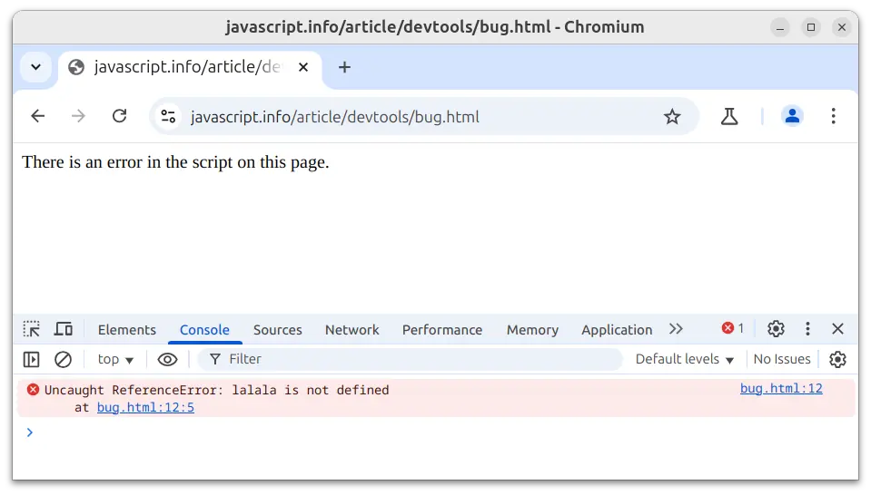

# Vývojářská konzole

Kód je náchylný k chybám. Je pravděpodobné, že budete dělat chyby... Co to povídám? *Zaručeně* budete dělat chyby, jestliže jste člověk a ne [robot](https://cs.wikipedia.org/wiki/Bender_(Futurama)).

V prohlížeči však uživatelé chyby standardně nevidí. Jestliže je tedy ve skriptu něco špatně, nevidíme co a nemůžeme to opravit.

Abychom viděli chyby a získali spoustu dalších užitečných informací o skriptech, byly do prohlížečů zahrnuty „vývojářské nástroje“.

Většina vývojářů tíhne k vývoji v Chrome nebo Firefoxu, protože mají vyhlášené vývojářské nástroje. Jiné prohlížeče rovněž poskytují vývojářské nástroje, někdy se speciálními vlastnostmi, ale obvykle jen „dohánějí“ Chrome nebo Firefox. Většina vývojářů tedy má svůj „oblíbený“ prohlížeč a k jinému se uchýlí jen tehdy, řeší-li problém specifický pro určitý prohlížeč.

Vývojářské nástroje jsou silné a mají mnoho funkcí. Pro začátek se naučíme, jak je otevřít, podívat se na chyby a spustit v nich příkazy JavaScriptu.

## Google Chrome

Otevřete si stránku [bug.html](bug.html).

V JavaScriptovém kódu na této stránce je chyba. Před očima běžného uživatele je skrytá, a tak otevřeme vývojářské nástroje, abychom ji viděli.

Stiskněte `key:F12` nebo, máte-li Mac, stiskněte `key:Cmd+Opt+J`.

Otevřou se vývojářské nástroje na záložce „Console“. 

Budou vypadat zhruba takto:



Vzhled vývojářských nástrojů závisí na vaší verzi Chrome. Čas od času se mění, ale měl by se podobat obrázku.

- Zde vidíte červenou chybovou zprávu. V tomto případě skript obsahuje neznámý příkaz „lalala“.
- Napravo vidíte kliknutelný odkaz na zdrojový kód `bug.html:12` s číslem řádku, na němž se chyba vyskytla.

Pod chybovou zprávou se nachází modrý symbol `>`, který označuje „příkazový řádek“, na němž můžeme psát příkazy JavaScriptu. Stisknutím `key:Enter` je spustíte.

Nyní vidíme chyby a to pro začátek stačí. K vývojářským nástrojům se později vrátíme a ladění se budeme hlouběji věnovat v kapitole <info:debugging-chrome>.

```smart header="Víceřádkový vstup"
Obvykle když napíšeme do konzole řádek kódu a stiskneme `key:Enter`, řádek se vykoná.

Chcete-li vložit více řádků, stiskněte `key:Shift+Enter`. Tímto způsobem můžeme vkládat delší fragmenty JavaScriptového kódu.
```

## Firefox, Edge a ostatní

Většina ostatních prohlížečů rovněž využívá k otevření vývojářských nástrojů klávesu  `key:F12`.

Jejich vzhled je vcelku podobný. Až budete vědět, jak používat nástroje v jednom prohlížeči (můžete začít s Chromem), budete moci snadno přejít na jiný.

## Safari

Safari (prohlížeč pro Mac, není podporován ve Windows nebo Linuxu) je v tomto ohledu trochu zvláštní. Nejprve musíme povolit „menu Vývoj“.

Otevřete „Settings“ a jděte na záložku „Advanced“. Dole uvidíte checkbox, který zaškrtněte:
  


Nyní můžete zapínat konzoli pomocí `key:Cmd+Opt+C`. Všimněte si také, že v horním menu se objevila nová položka s názvem „Develop“ („Vývoj“), která obsahuje mnoho příkazů a nastavení.

## Shrnutí

- Vývojářské nástroje nám umožňují vidět chyby, prozkoumávat proměnné a mnoho dalšího.
- Ve většině prohlížečů ve Windows se otevírají klávesou `key:F12`. Chrome pro Mac vyžaduje `key:Cmd+Opt+J`, Safari `key:Cmd+Opt+C` (zde je třeba je napřed povolit).

Nyní máme prostředí připraveno a v příští kapitole již přejdeme k samotnému JavaScriptu.
