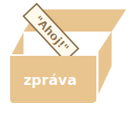
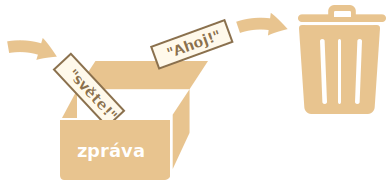

# Proměnné

JavaScriptová aplikace musí většinu času pracovat s informacemi. Uvedeme dva příklady:
1. Online obchod -- informace se mohou týkat prodávaného zboží a nákupního vozíku.
2. Chatovací aplikace -- informace mohou zahrnovat uživatele, zprávy a mnoho dalšího.

K ukládání těchto informací se používají proměnné.

## Proměnná

[Proměnná](https://cs.wikipedia.org/wiki/Proměnná_(programování)) je „pojmenovaný sklad“ dat. Proměnné můžeme používat k ukládání zboží, návštěvníků i jiných dat.

K vytvoření proměnné v JavaScriptu se používá klíčové slovo `let`.

Níže uvedený příkaz vytvoří (jiným slovem *deklaruje*) proměnnou s názvem „zpráva“:

```js
let zpráva;
```

Nyní do ní můžeme uložit nějaká data pomocí operátoru `=`:

```js
let zpráva;

*!*
zpráva = 'Ahoj'; // uložíme řetězec 'Ahoj' do proměnné jménem zpráva
*/!*
```

Řetězec se nyní uloží do paměťové oblasti, která je vyhrazena pro tuto proměnnou. Můžeme k ní přistoupit pomocí názvu proměnné:

```js run
let zpráva;
zpráva = 'Ahoj!';

*!*
alert(zpráva); // zobrazí obsah proměnné
*/!*
```

Abychom byli stručnější, můžeme zkombinovat deklaraci proměnné a přiřazení dat do jednoho řádku:

```js run
let zpráva = 'Ahoj!'; // definujeme proměnnou a přiřadíme jí hodnotu

alert(zpráva); // Ahoj!
```

Na jednom řádku můžeme deklarovat i více proměnných:

```js no-beautify
let uživatel = 'Jan', věk = 25, zpráva = 'Ahoj';
```

Může se to zdát kratší, ale nedoporučujeme to. Pro účely lepší čitelnosti raději uvádějte každou proměnnou na novém řádku.

Víceřádková varianta je trochu delší, ale snadněji se čte:

```js
let uživatel = 'Jan';
let věk = 25;
let zpráva = 'Ahoj';
```

Někteří lidé definují více proměnných i tímto víceřádkovým stylem:
```js no-beautify
let uživatel = 'Jan',
  věk = 25,
  zpráva = 'Ahoj';
```

...Nebo dokonce tímto stylem „čárka napřed“:

```js no-beautify
let uživatel = 'Jan'
  , věk = 25
  , zpráva = 'Ahoj';
```

Technicky všechny tyto varianty dělají totéž, takže je to jen otázkou osobního vkusu a estetiky.

````smart header="`var` namísto `let`"
Ve starších skriptech můžete najít i jiné klíčové slovo: `var` namísto `let`:

```js
*!*var*/!* zpráva = 'Ahoj';
```

Klíčové slovo `var` znamená *skoro* totéž jako `let`. Rovněž deklaruje proměnnou, ale trochu jiným, „staroškolským“ způsobem.

Mezi `let` a `var` existují drobné rozdíly, ale ty nás zatím nezajímají. Podrobně je probereme v kapitole <info:var>.
````

## Analogie s reálným životem

Koncept „proměnné“ můžeme snadno pochopit, když si ji představíme jako „krabičku“ na data, na níž je nalepen štítek s unikátním názvem.

Například proměnnou `zpráva` si můžeme představit jako krabičku se štítkem `"zpráva"`, v níž je hodnota `"Ahoj!"`:



Do krabičky můžeme uložit libovolnou hodnotu.

Můžeme ji také změnit tolikrát, kolikrát chceme:
```js run
let zpráva;

zpráva = 'Ahoj!';

zpráva = 'Světe!'; // hodnota se změní

alert(zpráva);
```

Když se hodnota změní, stará data jsou z proměnné odstraněna:



Můžeme také deklarovat dvě proměnné a zkopírovat data z jedné do druhé.

```js run
let ahoj = 'Ahoj světe!';

let zpráva;

*!*
// zkopírujeme 'Ahoj světe!' z proměnné ahoj do proměnné zpráva
zpráva = ahoj;
*/!*

// nyní obě proměnné obsahují stejná data
alert(ahoj); // Ahoj světe!
alert(zpráva); // Ahoj světe!
```

````warn header="Dvojí deklarace způsobí chybu"
Stejná proměnná může být deklarována pouze jednou.

Opakovaná deklarace stejné proměnné ohlásí chybu:

```js run
let zpráva = "Toto";

// opakované 'let' vede k chybě
let zpráva = "Tamto"; // Syntaktická chyba: 'zpráva' již byla deklarována
```
Proměnnou bychom tedy měli deklarovat jen jednou a pak se na ni odkazovat bez použití `let`.
````

```smart header="Funkcionální jazyky"
Stojí za zmínku, že existují [funkcionální](https://cs.wikipedia.org/wiki/Funkcionální_programování) programovací jazyky, například [Scala](http://www.scala-lang.org/) nebo [Erlang](http://www.erlang.org/), které nedovolují měnit hodnotu proměnných.

Když je v takových jazycích hodnota jednou uložena „do krabičky“, zůstane tam navždy. Pokud chceme uložit něco jiného, jazyk nás přinutí vytvořit novou krabičku (deklarovat novou proměnnou). Nemůžeme znovu použít starou.

Ačkoli to na první pohled může vypadat trochu zvláštně, i v takových jazycích je seriózní programování docela dobře možné. Kromě toho existují oblasti, např. paralelní výpočty, v nichž právě toto omezení přináší určité výhody. Prostudovat si takový jazyk (i když jej neplánujete v dohledné době používat) se doporučuje k rozšíření obzorů.
```

## Názvy proměnných [#variable-naming]

V JavaScriptu platí pro názvy proměnných dvě omezení:

1. Název musí obsahovat pouze písmena, číslice nebo symboly `$` a `_`.
2. První znak nesmí být číslice.

Příklady platných názvů:

```js
let uživatelskéJméno;
let test123;
```

Když název obsahuje více slov, obvykle se používá tzv. [velbloudí notace](https://cs.wikipedia.org/wiki/CamelCase). To znamená, že slova následují hned za sebou a každé kromě prvního začíná velkým písmenem: `můjVelmiDlouhýNázev`.

Zajímavé je, že v názvech je možné používat i znak dolaru `'$'` a podtržítko `'_'`. Jsou to obyčejné symboly bez zvláštního významu, podobně jako písmena.

Tyto názvy jsou platné:

```js run untrusted
let $ = 1; // deklarujeme proměnnou s názvem "$"
let _ = 2; // a nyní proměnnou s názvem "_"

alert($ + _); // 3
```

Příklady nesprávných názvů proměnných:

```js no-beautify
let 1a; // nesmí začínat číslicí

let my-name; // pomlčky '-' nejsou v názvu povoleny
```

```smart header="Na velikosti záleží"
Proměnné s názvy `jablko` a `JabLKO` jsou dvě různé proměnné.
```

````smart header="Nelatinská písmena jsou povolena, ale nedoporučují se"
Je dovoleno použít písmena z jakéhokoli jazyka, včetně písmen z kyrilice nebo dokonce čínských znaků, třeba takto:

```js
let имя = '...';
let 我 = '...';
```

Technicky zde není žádná chyba. Takové názvy jsou povoleny, ale podle mezinárodní konvence se v názvech proměnných používá angličtina. I když píšeme malý skript, může mít před sebou dlouhý život a lidé z jiných zemí si ho možná někdy budou potřebovat přečíst.
````

````warn header="Rezervované názvy"
Existuje [seznam rezervovaných slov](https://developer.mozilla.org/en-US/docs/Web/JavaScript/Reference/Lexical_grammar#Keywords), které nemůžeme používat jako názvy proměnných, protože je již používá samotný jazyk.

Například: `let`, `class`, `return`, `function` jsou rezervované.

Níže uvedený kód ohlásí syntaktickou chybu:

```js run no-beautify
let let = 5; // proměnnou nelze pojmenovat "let", chyba!
let return = 5; // nelze ji ani pojmenovat "return", chyba!
```
````

````warn header="Přiřazení bez `use strict`"

Obvykle musíme proměnnou před použitím definovat. Ve starých časech však bylo technicky možné vytvořit proměnnou pouze přiřazením hodnoty bez použití `let`. Aby byla zaručena kompatibilita se starými skripty, funguje to dodnes, pokud v našich skriptech neuvedeme `use strict`.

```js run no-strict
// poznámka: v tomto příkladu není "use strict"

num = 5; // pokud proměnná "num" ještě neexistuje, je vytvořena

alert(num); // 5
```

Je to špatný zvyk a ve striktním režimu vyvolá chybu:

```js
"use strict";

*!*
num = 5; // chyba: num není definováno
*/!*
```
````

## Konstanty

Chceme-li deklarovat konstantní (neměnící se) proměnnou, použijeme `const` místo `let`:

```js
const mojeDatumNarození = '18.04.1982';
```

Proměnné deklarované pomocí `const` se nazývají „konstanty“ a není možné jim přiřadit jinou hodnotu. Pokus o to by ohlásil chybu:

```js run
const mojeDatumNarození = '18.04.1982';

mojeDatumNarození = '01.01.2001'; // chyba, nelze změnit konstantu!
```

Když má programátor jistotu, že hodnota proměnné se nikdy nezmění, může ji deklarovat pomocí `const`, aby tuto skutečnost pojistil a všem jasně sdělil.


### Konstanty velkými písmeny

Je široce rozšířenou praktikou používat konstanty jako názvy obtížně zapamatovatelných hodnot, které jsou známy ještě před spuštěním programu. Názvy takových konstant se uvádějí velkými písmeny a s podtržítky.

Například vytvoříme konstanty pro barvy v tzv. „webovém“ (hexadecimálním) formátu:

```js run
const BARVA_ČERVENÁ = "#F00";
const BARVA_ZELENÁ = "#0F0";
const BARVA_MODRÁ = "#00F";
const BARVA_ORANŽOVÁ = "#FF7F00";

// ...když si máme zvolit barvu
let barva = BARVA_ORANŽOVÁ;
alert(barva); // #FF7F00
```

Výhody:

- `BARVA_ORANŽOVÁ` se pamatuje mnohem lépe než `"#FF7F00"`.
- Je mnohem snadnější špatně napsat `"#FF7F00"` než `BARVA_ORANŽOVÁ`.
- Při čtení kódu dává `BARVA_ORANŽOVÁ` mnohem větší smysl než `#FF7F00`.

Kdy bychom měli používat pro konstantu velká písmena a kdy bychom ji měli pojmenovat obvyklým způsobem? Ujasníme si to.

Být „konstanta“ znamená prostě to, že hodnota proměnné se nikdy nezmění. Existují však konstanty, které jsou známy již před spuštěním programu (například hexadecimální hodnota červené barvy), a pak jsou konstanty, které se *vypočítají* až za běhu programu, ale jejich vypočtená hodnota se nikdy nezmění.

Příklad:
```js
const dobaNačítáníStránky = /* doba, kterou trvá načíst webovou stránku */;
```

Hodnota proměnné `dobaNačítáníStránky` není známa dříve, než se stránka načte, proto je pojmenována obvyklým způsobem. Je to však konstanta, protože se po přiřazení již nezmění.

Jinými slovy, názvy konstant zapsané velkými písmeny se používají jen pro pojmenování „natvrdo uvedených“ hodnot.

## Pojmenovávejte věci správně

Když už mluvíme o proměnných, je tady jedna velice důležitá věc.

Název proměnné by měl mít jasný a jednoznačný význam a měl by popisovat data, která jsou v proměnné uložena.

Pojmenovávání proměnných je jednou z nejdůležitějších a nejsložitějších dovedností v programování. Rychlý pohled na názvy proměnných nám může prozradit, zda kód psal začátečník nebo zkušený vývojář.

V reálných projektech většinu času nezabere psaní něčeho úplně nového od základů, ale úprava a rozšiřování již existujícího kódu. Když se vrátíme k nějakému kódu poté, co jsme nějakou dobu dělali něco jiného, je mnohem jednodušší najít potřebné informace, když jsou vhodně pojmenovány. Nebo, jinými slovy, když proměnné mají vhodné názvy.

Než deklarujete proměnnou, dobře si promyslete její správný název. Bohatě se vám to vyplatí.

Některá pravidla, která je vhodné dodržovat, jsou:

- Používejte názvy čitelné člověkem, například `uživatelskéJméno` nebo `nákupníVozík`.
- Zdržte se zkratek nebo krátkých názvů typu `a`, `b`, `c`, leda že byste opravdu dobře věděli, co děláte.
- Volte názvy co nejpopisnější a nejstručnější. Příklady špatných názvů jsou `data` nebo `hodnota`. Takové názvy nic neříkají. Je vhodné je používat jen tehdy, když je z kontextu kódu naprosto zřejmé, jaká data nebo hodnota se v proměnné nachází.
- Dohodněte se na pojmech se svým týmem a promyslete si je. Jestliže se návštěvník stránky nazývá „uživatel“, pak byste příslušné proměnné měli pojmenovat `aktuálníUživatel` nebo `novýUživatel`, a ne `aktuálníNávštěvník` nebo `novýPánVeMěstě`.

Zní to jednoduše? Bezpochyby ano, ale vytvářet popisné a stručné názvy proměnných v praxi jednoduché není. Jděte do toho.

```smart header="Vytvořit novou nebo použít starou?"
A jedna poznámka na závěr. Existují líní programátoři, kteří místo deklarace nové proměnné mají sklon znovu použít starou.

Výsledkem je, že jejich proměnné připomínají krabičky, do nichž lidé dávají různé věci, aniž by se obtěžovali změnit štítek. Co je právě teď v krabičce? Kdo ví? Musíme přijít blíž a podívat se.

Takoví programátoři ušetří trochu času deklarací proměnné, ale desetkrát víc času ztratí při ladění.

Proměnná navíc je dobro, ne zlo.

Moderní JavaScriptové minifikátory a prohlížeče dokáží kód dostatečně dobře optimalizovat, takže nenastane problém s výkonem. Používání různých proměnných pro různé hodnoty dokonce enginu pomůže optimalizovat váš kód.
```

## Shrnutí

Deklarovat proměnné pro ukládání dat můžeme pomocí klíčových slov `var`, `let` nebo `const`.

- `let` -- je moderní deklarace proměnné.
- `var` -- je deklarace proměnné ze staré školy. Obvykle ji vůbec nepoužíváme, ale v kapitole <info:var> probereme drobné rozdíly oproti `let` pro případ, že byste je potřebovali.
- `const` -- je jako `let`, ale hodnota proměnné se nesmí měnit.

Proměnné by měly být pojmenovány tak, abychom snadno pochopili, co obsahují.
