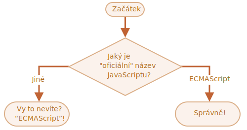

importance: 2

---

# Název JavaScriptu

Pomocí konstruktu `if..else` napište kód, který se zeptá: „Jaký je „oficiální“ název JavaScriptu?“

Pokud návštěvník zadá „ECMAScript“, vypište „Správně!“, jinak vypište „Vy to nevíte? ECMAScript!“

[demo src="ifelse_task2"]
