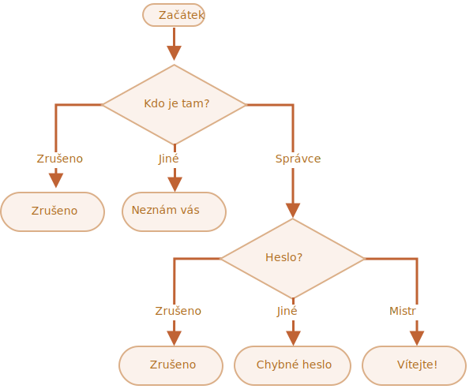

importance: 3

---

# Ověřte přihlášení

Napište kód, který se pomocí `prompt` zeptá na přihlášení.

Jestliže návštěvník zadá `"Správce"`, zeptejte se ho pomocí `prompt` na heslo. Bude-li vstupem prázdný řádek nebo uživatel stiskne `key:Esc`, zobrazte „Zrušeno“. Bude-li zadán jiný řetězec, zobrazte „Neznám vás“.

Heslo se ověří následovně:

- Pokud se rovná „Vládce“, tak zobrazte „Vítáme vás!“.
- Při jiném řetězci zobrazte „Špatné heslo“.
- Bude-li zadán prázdný řetězec nebo bude vstup zrušen, zobrazte „Zrušeno“.

Schéma:

Použijte vnořené bloky `if`. Dbejte na celkovou čitelnost kódu.

Nápověda: po zadání prázdného vstupu `prompt` vrátí prázdný řetězec `''`. Po stisknutí klávesy `key:ESC` vrátí `null`.

[demo]
