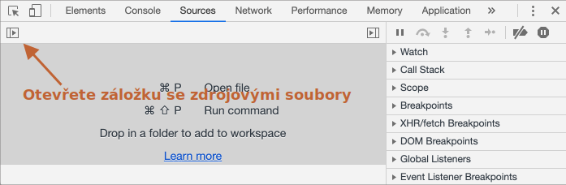
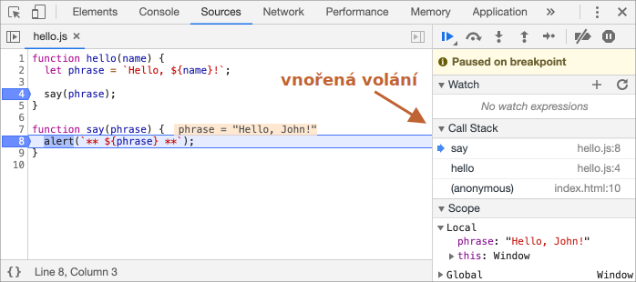

# Ladění v Chrome

Než začneme psát složitější kód, pohovořme si o ladění.

[Ladění](https://cs.wikipedia.org/wiki/Ladění_(programování)) je proces hledání a opravování chyb ve skriptu. Ve všech moderních prohlížečích i ve většině ostatních prostředí jsou podporovány ladicí nástroje -- speciální uživatelské rozhraní ve vývojářských nástrojích, které ladění znatelně ulehčuje. Umožňuje také procházet kód krok za krokem, abychom viděli, co přesně se v něm děje.

Zde budeme používat Chrome, protože má dostatek vlastností. Většina ostatních prohlížečů má podobný proces.

## Panel „Zdroje“

Vaše verze Chrome může vypadat trochu odlišně, ale i tak by mělo být zřejmé, o co jde.

- Otevřete v Chrome [stránku s příkladem](debugging/index.html).
- Zapněte vývojářské nástroje klávesou `key:F12` (Mac: `key:Cmd+Opt+I`).
- Zvolte panel `Sources` (`Zdroje`).

Když to uděláte napoprvé, měli byste vidět toto:



Přepínač <span class="devtools" style="background-position:-172px -98px"></span> otevírá záložku se soubory.

Klikněme na něj a a zvolme `hello.js` v zobrazení stromu. Mělo by se zobrazit toto:


Panel Sources má 3 části:

1. Záložka **File Navigator** zobrazuje soubory HTML, JavaScript, CSS a jiné, včetně obrázků, které jsou připojeny ke stránce. Zde se mohou objevit i rozšíření Chrome.
2. Záložka **Code Editor** zobrazuje zdrojový kód.
3. Záložka **JavaScript Debugging** slouží k ladění. Brzy ji prozkoumáme.

Nyní můžete kliknout na stejný přepínač <span class="devtools" style="background-position:-172px -122px"></span> znovu, abyste skryli seznam zdrojů a poskytli prostor kódu.

## Konzole

Pokud stiskneme `key:Esc`, otevře se dole konzole. Můžeme tam psát příkazy, které se po stisknutí `key:Enter` vykonají.

Poté, co se příkaz vykoná, se dole zobrazí jeho výsledek.

Například `1+2` zde vydá výsledek `3` a `ahoj("debugger")` nevrátí nic, takže výsledek bude `undefined`:


## Breakpointy

Nyní prozkoumáme, co se přesně děje v kódu na [stránce s příkladem](debugging/index.html). V `hello.js` klikněte na číslo řádku `4`. Ano, přímo na číslici `4`, ne na kód.

Gratulujeme! Právě jste nastavili breakpoint. Klikněte prosím také na číslo řádku `8`.

Mělo by to vypadat takto (modrá barva označuje, kam byste měli kliknout):


*Breakpoint* (z anglického *break* - rozbití a *point* - bod -- pozn. překl.) je místo, na němž debugger automaticky pozastaví výkon JavaScriptu.

Když je kód pozastaven, můžeme prozkoumávat aktuální proměnné, spouštět příkazy v konzoli apod. Jinými slovy, můžeme kód ladit.

V pravém panelu vždy najdeme seznam breakpointů. Ten je užitečný, když máme mnoho breakpointů v různých souborech. Umožňuje nám:
- Rychle přeskočit na breakpoint v kódu (kliknutím na něj v pravém panelu).
- Dočasně breakpoint zrušit tím, že jej odškrtneme.
- Odstranit breakpoint tím, že na něj klikneme pravým tlačítkem myši a zvolíme Remove.
- ...A tak dále.

```smart header="Podmíněné breakpointy"
*Kliknutím pravým tlačítkem* na číslo řádku můžeme vytvořit *podmíněný* breakpoint. Ten se aktivuje, jen když je splněna zadaná podmínka.

To se hodí, když potřebujeme zastavit skript jen při určité hodnotě proměnné nebo pro určité parametry funkce.
```

## Příkaz debugger

Pozastavit kód můžeme také tím, že v něm použijeme příkaz `debugger`, například:

```js
function ahoj(jméno) {
  let věta = `Ahoj, ${jméno}!`;

*!*
  debugger;  // <-- debugger se tady zastaví
*/!*

  řekni(věta);
}
```

To je velmi užitečné, když se nacházíme v editoru kódu a nechceme se přepínat do prohlížeče a hledat skript ve vývojářských nástrojích, abychom nastavili breakpoint.


## Pozastavení a rozhlédnutí

V našem příkladu bylo během nahrání stránky zavoláno `ahoj()`, takže nejjednodušším způsobem, jak aktivovat debugger (po nastavení breakpointů), je znovu načíst stránku. Stiskneme tedy `key:F5` (Windows, Linux) nebo `key:Cmd+R` (Mac).

Když je breakpoint nastaven, výkon se pozastaví na 4. řádku:


Prosíme otevřete si informační dropdowny vpravo (označené šipkami), které vám umožní prozkoumávat aktuální stav kódu:

1. **`Watch` -- zobrazí aktuální hodnotu jakéhokoli výrazu.**

    Můžete kliknout na plus `+` a zadat výraz. Debugger bude vždy zobrazovat jeho hodnotu, kterou při výkonu skriptu automaticky přepočítá.

2. **`Call Stack` -- zobrazí řetězec vnořených volání funkcí.**

    V aktuálním okamžiku je debugger uvnitř volání `ahoj()`, kterou zavolal skript v `index.html` (není zde žádná funkce, takže se nazývá „anonymní“).

    Když kliknete na prvek zásobníku (např. „anonymní“), debugger přeskočí na odpovídající kód a vy můžete prozkoumávat jeho proměnné.
    
3. **`Scope` -- aktuální proměnné.**

    `Local` zobrazuje lokální funkční proměnné. Vidíte také jejich hodnoty zvýrazněné přímo nad zdrojovým kódem.

    `Global` obsahuje globální proměnné (mimo všechny funkce).

    Je zde také klíčové slovo `this`, které jsme zatím nestudovali, ale brzy tak učiníme.

## Sledování výkonu skriptu

Nyní nastal čas *trasovat* skript.

K tomu slouží tlačítka na vrchu pravého panelu. Podívejme se na ně.
<!-- https://github.com/ChromeDevTools/devtools-frontend/blob/master/front_end/Images/src/largeIcons.svg -->
<span class="devtools" style="background-position:-146px -168px"></span> -- "Resume": pokračuje v provádění, klávesa `key:F8`.

: Pokračuje v provádění programu. Nejsou-li další breakpointy, skript se bude provádět dál a debugger nad ním ztratí kontrolu.

    Toto uvidíme poté, co na něj klikneme:

    

    Výkon skriptu se obnovil, dosáhl dalšího breakpointu uvnitř `řekni()` a zastavil se tam. Podívejte se na volací zásobník („Call Stack“) vpravo. Zvětšil se o jedno volání. Nyní jsme uvnitř `řekni()`.

<span class="devtools" style="background-position:-200px -190px"></span> -- "Step": vykoná další příkaz, klávesa `key:F9`.
: Spustí další příkaz. Když na něj nyní klikneme, zobrazí se `alert`.

    Dalším a dalším klikáním můžeme procházet všechny příkazy skriptu jeden po druhém.

<span class="devtools" style="background-position:-62px -192px"></span> -- "Step over": vykoná další příkaz, ale *nevstoupí do funkce*, klávesa `key:F10`.
: Podobá se předchozímu příkazu „Step“, ale chová se jinak, jestliže dalším příkazem je volání funkce. Ne však vestavěné funkce jako `alert`, ale námi nadefinované funkce.

    Příkaz „Step“ do ní vstoupí a pozastaví provádění na jejím prvním řádku, zatímco „Step over“ neviditelně zavolá funkci a přeskočí její vnitřek.

    Provádění se pak ihned po této funkci pozastaví.

    To se hodí, když nás nezajímá, co se děje uvnitř volané funkce.

<span class="devtools" style="background-position:-4px -194px"></span> -- "Step into", klávesa `key:F11`.
: Podobá se „Step“, ale chová se jinak v případě asynchronního volání funkce. Jestliže se teprve začínáte učit JavaScript, můžete tento rozdíl ignorovat, jelikož jsme asynchronní volání funkcí ještě neprobírali.

    Do budoucna si jen pamatujte, že příkaz „Step“ ignoruje asynchronní akce, například `setTimeout` (volání funkce za určitou dobu), které spustí později. Příkaz „Step into“ vstoupí do jejich kódu a počká na ně, pokud je to nutné. Podrobnosti viz [manuál k vývojářským nástrojům](https://developers.google.com/web/updates/2018/01/devtools#async).

<span class="devtools" style="background-position:-32px -194px"></span> -- "Step out": pokračuje v provádění až do konce právě prováděné funkce, klávesa `key:Shift+F11`.
: Pokračuje v provádění a zastaví se až na posledním řádku právě prováděné funkce. To se hodí, když jsme omylem vstoupili do funkce pomocí <span class="devtools" style="background-position:-200px -190px"></span>, ale ta nás nezajímá, a tak chceme co nejrychleji dospět k jejímu konci.

<span class="devtools" style="background-position:-61px -74px"></span> -- povolí/zakáže všechny breakpointy.
: Toto tlačítko nemá vliv na provádění, jen hromadně zapne/vypne všechny breakpointy.

<span class="devtools" style="background-position:-90px -146px"></span> -- povolí/zakáže automatické pozastavení v případě chyby.
: Když je povoleno a vývojářské nástroje jsou otevřeny, chyba ve skriptu způsobí automatické pozastavení jeho výkonu. Pak můžeme analyzovat jeho proměnné, abychom viděli, co je špatně. Když tedy náš skript skončí s chybou, můžeme otevřít debugger, povolit tuto možnost a znovu načíst stránku, abychom viděli, kde spadl a jaký je v tom okamžiku jeho kontext.

```smart header="Pokračovat až sem"
Po kliknutí pravým tlačítkem myši na řádek kódu se otevře kontextové menu s výtečnou možností „Pokračovat až sem“ („Continue to here“).

To se hodí, když chceme překonat více kroků až k tomuto řádku, ale nechce se nám nastavovat breakpoint.
```

## Logování

Chceme-li vypsat něco z našeho kódu na konzoli, máme k tomu funkci `console.log`.

Například tento kód vypíše na konzoli hodnoty od `0` do `4`:

```js run
// otevřete si konzoli a uvidíte
for (let i = 0; i < 5; i++) {
  console.log("hodnota,", i);
}
```

Běžní uživatelé tento výstup neuvidí, vypíše se na konzoli. Abyste jej viděli, otevřete panel Console vývojářských nástrojů nebo stiskněte `key:Esc`, když jste v jiném panelu: tím se dole otevře konzole.

Máme-li v kódu dostatek logování, uvidíme z těchto záznamů, co se děje, i bez debuggeru.

## Shrnutí

Jak vidíme, existují tři hlavní způsoby, jak pozastavit skript:
1. Breakpoint.
2. Příkazy `debugger`.
3. Chyba (jsou-li vývojářské nástroje otevřené a tlačítko <span class="devtools" style="background-position:-90px -146px"></span> je „zapnuté“).

Když je kód pozastaven, můžeme jej ladit - prozkoumávat proměnné a trasovat kód, abychom viděli, kde se při jeho vykonávání něco pokazilo.

Vývojářské nástroje obsahují mnohem více možností, než jsme zde uvedli. Kompletní manuál najdete na <https://developers.google.com/web/tools/chrome-devtools>.

Informace v této kapitole postačí k začátku ladění, ale později, zvláště budete-li vytvářet hodně materiálu v prohlížeči, se tam prosím podívejte a prostudujte si pokročilejší možnosti vývojářských nástrojů.

A také můžete klikat na různá místa vývojářských nástrojů a jen se dívat, co se ukáže. To je asi nejrychlejší způsob, jak se je naučit. Nezapomínejte na pravé tlačítko myši a kontextová menu!