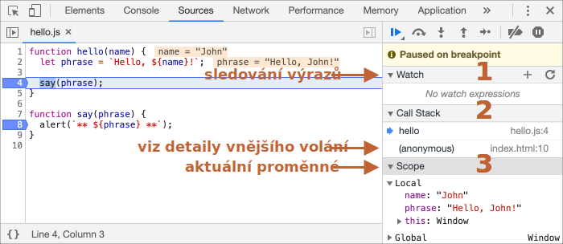

# Ladění v prohlížeči

Než začneme psát složitější kód, pohovořme si o ladění.

[Ladění](https://cs.wikipedia.org/wiki/Ladění_(programování)) je proces hledání a opravování chyb ve skriptu. Ve všech moderních prohlížečích i ve většině ostatních prostředí jsou podporovány ladicí nástroje -- speciální uživatelské rozhraní ve vývojářských nástrojích, které ladění znatelně ulehčuje. Umožňuje také procházet kód krok za krokem, abychom viděli, co přesně se v něm děje.

Zde budeme používat Chrome, protože má dostatek potřebných prvků. Většina ostatních prohlížečů má podobný proces.

## Panel „Zdroje“

Vaše verze Chrome může vypadat trochu odlišně, ale i tak by mělo být zřejmé, o co jde.

- Otevřete v Chrome [stránku s příkladem](debugging/index.html).
- Zapněte vývojářské nástroje klávesou `key:F12` (Mac: `key:Cmd+Opt+I`).
- Zvolte panel `Sources` (v české verzi `Zdroje`).

Když to uděláte napoprvé, měli byste vidět toto:


Přepínač <span class="devtools" style="background-position:-172px -98px"></span> otevírá záložku se soubory.

Klikněme na něj a a zvolme `hello.js` ve stromovém zobrazení. Mělo by se zobrazit toto:


Panel zdrojů má 3 části:

1. Záložka **File Navigator** (**Navigační panel**)  zobrazuje soubory HTML, JavaScript, CSS a jiné, včetně obrázků, které jsou připojeny ke stránce. Zde se mohou objevit i rozšíření Chrome.
2. Záložka **Code Editor** (**Editor kódu**) zobrazuje zdrojový kód.
3. Záložka **JavaScript Debugging** (**Ladicí nástroj**) slouží k ladění. Brzy ji prozkoumáme.

Nyní můžete kliknout na stejný přepínač <span class="devtools" style="background-position:-172px -122px"></span> znovu, abyste skryli seznam zdrojů a poskytli prostor kódu.

## Konzole

Pokud stiskneme `key:Esc`, otevře se dole konzole. Můžeme tam psát příkazy a pak stisknout `key:Enter`, aby se vykonaly.

Poté, co se příkaz vykoná, se dole zobrazí jeho výsledek.

Například `1+2` zde vydá výsledek `3`, zatímco volání funkce `ahoj("debugger")` nevrátí nic, takže výsledek bude `undefined`:


## Zarážky

Nyní prozkoumáme, co se přesně děje v kódu na [stránce s příkladem](debugging/index.html). V `hello.js` klikněte na číslo řádku `4`. Ano, přímo na číslici `4`, ne na kód.

Gratulujeme! Právě jste nastavili zarážku. Klikněte prosím také na číslo řádku `8`.

Mělo by to vypadat takto (modrá barva označuje, kam byste měli kliknout):


*Zarážka* je místo, na němž ladicí nástroj automaticky pozastaví běh JavaScriptu.

Když je kód pozastaven, můžeme prozkoumávat aktuální proměnné, spouštět příkazy v konzoli a podobně. Jinými slovy, můžeme kód ladit.

V pravém panelu vždy najdeme seznam zarážek. To je užitečné, když máme mnoho zarážek v různých souborech. Seznam nám umožňuje:
- Rychle přeskočit na zarážku v kódu (když na ni klikneme v pravém panelu).
- Dočasně zarážku zakázat tím, že zrušíme její zaškrtnutí.
- Odstranit zarážku tím, že na ni klikneme pravým tlačítkem myši a zvolíme Remove (Odstranit zarážku).
- ...A tak dále.

```smart header="Podmíněné zarážky"
*Kliknutím pravým tlačítkem* na číslo řádku můžeme vytvořit *podmíněnou* zarážku. Ta se aktivuje, jen když je zadaný výraz, který byste měli uvést při jejím vytvoření, pravdivý.

To se hodí, když potřebujeme pozastavit skript jen při určité hodnotě proměnné nebo při určitých argumentech pro funkci.
```

## Příkaz „debugger“

Pozastavit kód můžeme také tím, že v něm použijeme příkaz `debugger`, například:

```js
function ahoj(jméno) {
  let věta = `Ahoj, ${jméno}!`;

*!*
  debugger;  // <-- ladicí nástroj se tady zastaví
*/!*

  řekni(věta);
}
```

Tento příkaz funguje jen tehdy, když jsou otevřené vývojářské nástroje, jinak jej prohlížeč ignoruje.

## Pozastavení a rozhlédnutí

V našem příkladu je během nahrání stránky zavoláno `ahoj()`, takže nejjednodušším způsobem, jak aktivovat ladicí nástroj (po nastavení zarážek), je znovu načíst stránku. Stiskneme tedy `key:F5` (Windows, Linux) nebo `key:Cmd+R` (Mac).

Když je zarážka nastavena, běh se zastaví na 4. řádku:



Rozevřete si rozbalovací menu, které se nachází vpravo (označené šipkami). Umožní vám prozkoumávat aktuální stav kódu:

1. **`Watch` (`Sledované výrazy`) -- zobrazuje aktuální hodnoty libovolných výrazů.**

    Můžete kliknout na plus `+` a zadat výraz. Ladicí nástroj bude zobrazovat jeho hodnotu, kterou při běhu skriptu automaticky přepočítá.

2. **`Call Stack` (`Zásobník volání`) -- zobrazuje řetězec vnořených volání funkcí.**

    V aktuálním okamžiku je ladicí nástroj uvnitř volání `ahoj()`, kterou zavolal skript v `index.html` (není zde žádná funkce, takže se nazývá „anonymní“).

    Když kliknete na prvek zásobníku (např. „anonymní“), ladicí nástroj přeskočí na odpovídající kód a vy můžete prozkoumávat všechny jeho proměnné.
3. **`Scope` (`Rozsah`) -- aktuální proměnné.**

    `Local` (`Místní`) zobrazuje lokální funkční proměnné. Vidíte také jejich hodnoty zvýrazněné přímo nad zdrojovým kódem.

    `Global` (`Globální`) obsahuje globální proměnné (mimo všechny funkce).

    Je zde také klíčové slovo `this`, které jsme zatím neprobírali, ale brzy tak učiníme.

## Sledování běhu skriptu

Nyní nastal čas *krokovat* skript.

K tomu slouží tlačítka na vrchu pravého panelu. Podívejme se na ně.
<!-- https://github.com/ChromeDevTools/devtools-frontend/blob/master/front_end/Images/src/largeIcons.svg -->
<span class="devtools" style="background-position:-146px -168px"></span> -- „Resume“ („Obnovit běh skriptu“): pokračuje v běhu, klávesa `key:F8`.
: Pokračuje v běhu skriptu. Nejsou-li už žádné další zarážky, skript se bude prostě vykonávat dál a ladicí nástroj nad ním ztratí kontrolu.

    Toto uvidíme poté, co na něj klikneme:

    

    Běh skriptu se obnovil, dosáhl další zarážky uvnitř `řekni()` a zastavil se tam. Podívejte se na zásobník volání („Call Stack“) vpravo. Zvětšil se o jedno volání. Nyní jsme uvnitř `řekni()`.

<span class="devtools" style="background-position:-200px -190px"></span> -- „Step“ („Krokovat“): spustí další příkaz, klávesa `key:F9`.
: Spustí další příkaz. Když na něj nyní klikneme, zobrazí se `alert`.

    Dalším a dalším klikáním můžeme krokovat všechny příkazy skriptu jeden po druhém.

<span class="devtools" style="background-position:-62px -192px"></span> -- „Step over“ („Překročit“): spustí další příkaz, ale *nevstoupí do funkce*, klávesa `key:F10`.
: Podobá se předchozímu příkazu „Krokovat“, ale chová se jinak, jestliže dalším příkazem je volání funkce (ne vestavěné funkce jako `alert`, ale naší vlastní funkce).

    Když si je srovnáme, příkaz „Krokovat“ vstoupí do vnořeného volání funkce a pozastaví běh na jejím prvním řádku, zatímco „Překročit“ spustí vnořené volání funkce a překročí její vnitřek.

    Běh se pak ihned po volání této funkce pozastaví.

    To se hodí, když nás nezajímá, co se děje uvnitř volané funkce.

<span class="devtools" style="background-position:-4px -194px"></span> -- „Step into“ („Vnořit“), klávesa `key:F11`.
: Podobá se variantě „Krokovat“, ale chová se jinak v případě asynchronního volání funkce. Jestliže se teprve začínáte učit JavaScript, můžete tento rozdíl ignorovat, jelikož asynchronní volání funkcí ještě neznáme.

    Do budoucna si jen poznamenejme, že příkaz „Krokovat“ ignoruje asynchronní akce, například `setTimeout` (vyvolání funkce za určitou dobu), které se vykonávají později. Příkaz „Vnořit“ vstoupí do jejich kódu a počká na ně, pokud je to nutné. Podrobnosti viz [manuál k vývojářským nástrojům](https://developers.google.com/web/updates/2018/01/devtools#async).

<span class="devtools" style="background-position:-32px -194px"></span> -- „Step out“ („Vyskočit“) pokračuje v běhu až do konce vykonávané funkce, klávesa `key:Shift+F11`.
: Pokračuje v běhu a zastaví se až na posledním řádku právě vykonávané funkce. To se hodí, když jsme omylem vstoupili do volání funkce pomocí <span class="devtools" style="background-position:-200px -190px"></span>, ale ta nás nezajímá, a tak chceme co nejrychleji dospět k jejímu konci.

<span class="devtools" style="background-position:-61px -74px"></span> -- povolí/zakáže všechny zarážky.
: Toto tlačítko nemá vliv na běh skriptu, jen hromadně zapne/vypne všechny zarážky.

<span class="devtools" style="background-position:-90px -146px"></span> -- povolí/zakáže automatické pozastavení v případě chyby.
: Když je povoleno a vývojářské nástroje jsou otevřeny, chyba během výkonu skriptu jej automaticky pozastaví. Pak můžeme v ladicím nástroji analyzovat proměnné, abychom viděli, co se pokazilo. Když tedy náš skript skončí s chybou, můžeme otevřít ladicí nástroj, povolit tuto možnost a znovu načíst stránku, abychom viděli, kde spadl a jaký je v tom okamžiku jeho kontext.

```smart header="Pokračovat až sem"
Po kliknutí pravým tlačítkem myši na řádek kódu se otevře kontextové menu s výtečnou možností „Continue to here“ („Pokračovat sem“).

To se hodí, když chceme provést větší množství kroků až k tomuto řádku, ale nechce se nám nastavovat zarážku.
```

## Logování

Chceme-li vypsat něco z našeho kódu na konzoli, máme k tomu funkci `console.log`.

Například tento kód vypíše na konzoli hodnoty od `0` do `4`:

```js run
// otevřete si konzoli a uvidíte
for (let i = 0; i < 5; i++) {
  console.log("hodnota,", i);
}
```

Běžní uživatelé tento výstup neuvidí, vypíše se na konzoli. Abyste jej viděli, otevřete panel Console (Konzole) vývojářských nástrojů nebo stiskněte `key:Esc`, když jste v jiném panelu: tím se dole otevře konzole.

Máme-li v kódu dostatek logování, uvidíme z těchto záznamů, co se děje, i bez ladicího nástroje.

## Shrnutí

Zjistili jsme, že existují tři hlavní způsoby, jak pozastavit skript:
1. Zarážka.
2. Příkaz `debugger`.
3. Chyba (jsou-li vývojářské nástroje otevřené a tlačítko <span class="devtools" style="background-position:-90px -146px"></span> je „zapnuté“).

Když je skript pozastaven, můžeme jej ladit: prozkoumávat proměnné a krokovat kód, abychom viděli, kde se při jeho vykonávání něco pokazilo.

Vývojářské nástroje obsahují mnohem více možností, než jsme zde uvedli. Kompletní manuál najdete na <https://developers.google.com/web/tools/chrome-devtools>.

Informace z této kapitoly postačí k začátku ladění, ale později, zvláště budete-li vytvářet hodně materiálu v prohlížeči, se tam prosím podívejte a prostudujte si pokročilejší možnosti vývojářských nástrojů.

A také můžete klikat na různá místa vývojářských nástrojů a jen se dívat, co se ukáže. To je asi nejrychlejší způsob, jak se je naučit. Nezapomínejte na pravé tlačítko myši a kontextová menu!
