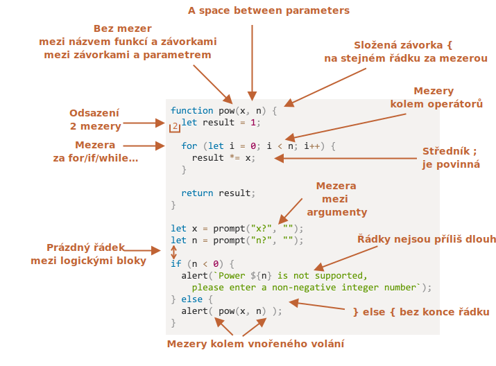

# Styl zápisu programu

Náš kód musí být co nejčistší a co nejsnadněji čitelný.

To je v podstatě umění programování -- vzít složitou úlohu a naprogramovat ji tak, aby kód byl současně správný a čitelný člověkem. Dobrý styl zápisu tomu značně napomáhá.

## Syntaxe

Uvádíme příklad s některými navrhovanými pravidly (podrobnosti viz níže):


<!--
```js
function pow(x, n) {
  let result = 1;

  for (let i = 0; i < n; i++) {
    result *= x;
  }

  return result;
}

let x = prompt("x?", "");
let n = prompt("n?", "");

if (n < 0) {
  alert(`Power ${n} is not supported,
    please enter a non-negative integer number`);
} else {
  alert( pow(x, n) );
}
```

-->

Nyní si tato pravidla a jejich důvody probereme podrobně.

```warn header="Toto nejsou žádná povinná pravidla"
Nic tady není zasazeno do kamene. Toto jsou stylové preference, ne náboženská dogmata.
```

### Složené závorky

Ve většině JavaScriptových projektů se složené závorky píší „egyptským“ stylem, kdy je levá závorka na stejném řádku jako odpovídající klíčové slovo -- ne na novém řádku. Před levou závorkou by také měla být mezera, jako zde:

```js
if (podmínka) {
  // dělej tohle
  // ...a tohle
  // ...a tohle
}
```

Důležitým krajním případem je jednořádková konstrukce, například `if (podmínka) dělejNěco()`. Měli bychom vůbec použít závorky?

Uvádíme jednotlivé varianty s komentářem, takže můžete sami posoudit jejich čitelnost:

1. 😠 Začátečníci někdy píší takto. Špatně! Složené závorky nejsou zapotřebí:
    ```js
    if (n < 0) *!*{*/!*alert(`${n}-tá mocnina není podporována`);*!*}*/!*
    ```
2. 😠 Umístění na samostatný řádek bez složených závorek. Tohle nikdy nedělejte, jelikož snadno uděláte chybu, když budete přidávat další řádky:
    ```js
    if (n < 0)
      alert(`${n}-tá mocnina není podporována`);
    ```
3. 😏 Jeden řádek bez složených závorek - to je přijatelné, pokud je krátký:
    ```js
    if (n < 0) alert(`${n}-tá mocnina není podporována`);
    ```
4. 😃 Nejlepší varianta:
    ```js
    if (n < 0) {
      alert(`${n}-tá mocnina není podporována`);
    }
    ```

Pro velmi krátký kód je dovolen jeden řádek, např. `if (podmínka) return null`. Ale kódový blok (poslední uvedená varianta) bývá obvykle čitelnější.

### Délka řádku

Nikdo není rád, když musí číst dlouhý vodorovný řádek kódu. Lepší přístup je rozdělit jej.

Například:
```js
// zpětné uvozovky ` umožňují rozdělit řádek na více řádků
let řetězec = `  
  TC39 v ECMA International je skupina JavaScriptových vývojářů,
  implementátorů, akademiků a dalších, kteří spolupracují s komunitou,
  aby udržovali a rozvíjeli definici JavaScriptu.
`;
```

A pro příkazy `if`:

```js
if (
  id === 123 &&
  měsíčníFáze === 'Ubývání' &&
  znameníZvěrokruhu === 'Váhy'
) {
  začniKouzlo();
}
```

Na maximální délce řádku by se měl dohodnout celý tým. Obvykle bývá 80 nebo 120 znaků.

### Odsazení

Existují dva druhy odsazení:

- **Vodorovné odsazení: 2 nebo 4 mezery.**

    Vodorovné odsazení se dělá pomocí 2 nebo 4 mezer nebo pomocí vodorovného symbolu tabulátoru (klávesa `key:Tab`). O tom, které zvolit, se už dlouho vedou svaté války. V dnešní době se více používají mezery.

    Výhodou mezer oproti tabulátorům je, že mezery umožňují konfigurovat odsazení flexibilněji než symbol tabulátoru.

    Můžeme například zarovnat parametry k levé závorce takto:

    ```js no-beautify
    zobraz(parametry,
           zarovnané, // vlevo je odsazení 7 mezer
           jeden,
           za,
           druhým
      ) {
      // ...
    }
    ```

- **Svislé odsazení: prázdné řádky pro rozdělení kódu do logických bloků.**

    I jediná funkce může být často rozdělena do logických bloků. V níže uvedeném příkladu jsou svisle odděleny inicializace proměnných, hlavní smyčka a vrácení výsledku:

    ```js
    function mocnina(x, n) {
      let výsledek = 1;
      //              <--
      for (let i = 0; i < n; i++) {
        výsledek *= x;
      }
      //              <--
      return výsledek;
    }
    ```

    Vkládejte prázdný nový řádek všude, kde pomáhá učinit kód čitelnějším. V kódu by nemělo být více než devět řádků za sebou bez svislého odsazení.

### Středníky

Středník by měl být uveden za každým příkazem, i kdyby mohl být vynechán.

Existují jazyky, v nichž je středník zcela dobrovolný a používá se jen zřídka. V JavaScriptu však existují případy, kdy se zlom řádku neinterpretuje jako středník, čímž se kód stává náchylnějším k chybám. Více o tom se píše v kapitole <info:structure#semicolon>.

Jste-li zkušený programátor v JavaScriptu, můžete se rozhodnout pro bezstředníkový kódovací styl, např. [StandardJS](https://standardjs.com/). Jinak je však lepší středníky používat, abyste se vyhnuli možným úskalím. Většina vývojářů středníky uvádí.

### Úrovně vnoření

Snažte se vyhnout příliš mnoha úrovním vnoření.

Například v cyklu je někdy dobrý nápad použít direktivu [`continue`](info:while-for#continue), abychom se vyhnuli dalšímu vnoření.

Například místo použití vnořené podmínky `if` tímto způsobem:

```js
for (let i = 0; i < 10; i++) {
  if (podmínka) {
    ... // <- o jednu úroveň vnoření víc
  }
}
```

můžeme napsat:

```js
for (let i = 0; i < 10; i++) {
  if (!podmínka) *!*continue*/!*;
  ...  // <- žádná další úroveň vnoření
}
```

Podobně můžeme postupovat s `if/else` a `return`.

Například dvě níže uvedené konstrukce jsou identické.

Možnost 1:

```js
function mocnina(x, n) {
  if (n < 0) {
    alert("Záporné 'n' není podporováno");
  } else {
    let výsledek = 1;

    for (let i = 0; i < n; i++) {
      výsledek *= x;
    }

    return výsledek;
  }  
}
```

Možnost 2:

```js
function mocnina(x, n) {
  if (n < 0) {
    alert("Záporné 'n' není podporováno");
    return;
  }

  let výsledek = 1;

  for (let i = 0; i < n; i++) {
    výsledek *= x;
  }

  return výsledek;
}
```

Druhá konstrukce je čitelnější, protože „zvláštní případ“ `n < 0` je ošetřen hned na začátku. Když je kontrola provedena, můžeme se přesunout k „hlavnímu“ toku kódu, aniž bychom potřebovali další vnoření.

## Umístění funkcí

Jestliže píšeme několik „pomocných“ funkcí a kód, který je používá, tak máme tři možnosti, jak funkce organizovat.

1. Deklarovat funkce *před* kódem, který je používá:

    ```js
    // *!*deklarace funkcí*/!*
    function vytvořPrvek() {
      ...
    }

    function nastavHandler(prvek) {
      ...
    }

    function choďKolem() {
      ...
    }

    // *!*kód, který je používá*/!*
    let prvek = vytvořPrvek();
    nastavHandler(prvek);
    choďKolem();
    ```
2. Nejprve kód, pak funkce:

    ```js
    // *!*kód, který používá funkce*/!*
    let prvek = vytvořPrvek();
    nastavHandler(prvek);
    choďKolem();

    // --- *!*pomocné funkce*/!* ---
    function vytvořPrvek() {
      ...
    }

    function nastavHandler(prvek) {
      ...
    }

    function choďKolem() {
      ...
    }
    ```
3. Směs: funkce je deklarována tam, kde je poprvé použita.

Ve většině případů se dává přednost druhé variantě.

Je to proto, že při čtení kódu chceme nejdříve vědět, *co kód dělá*. Pokud je kód uveden jako první, bude to zřejmé od začátku. Pak možná nebudeme muset funkce vůbec číst, zvláště pokud je z jejich názvů dostatečně jasné, co dělají.

## Styloví průvodci

Stylový průvodce obsahuje obecná pravidla o tom, „jak psát“ kód, tj. které uvozovky používat, o kolik mezer odsazovat, maximální délku řádku atd. Mnoho vedlejších věcí.

Když všichni členové týmu používají stejného stylového průvodce, bude kód vypadat jednotně bez ohledu na to, který člen týmu ho napsal.

Samozřejmě si tým vždy může napsat svého vlastního stylového průvodce, ale obvykle to není zapotřebí. Existuje mnoho průvodců, z nichž si lze vybrat.

Některé oblíbené možnosti:

- [JavaScriptový stylový průvodce Google](https://google.github.io/styleguide/jsguide.html)
- [JavaScriptový stylový průvodce Airbnb](https://github.com/airbnb/javascript)
- [Idiomatic.JS](https://github.com/rwaldron/idiomatic.js)
- [StandardJS](https://standardjs.com/)
- (a mnoho dalších)

Pokud jste začínající vývojář, začněte podle příkladu na začátku této kapitoly. Pak si můžete projít jiné stylové průvodce, abyste získali další nápady a rozhodli se, který se vám líbí nejvíc.

## Automatické lintery

Lintery jsou nástroje, které umějí automaticky zkontrolovat styl vašeho kódu a navrhnout zlepšení.

Výborné na nich je, že tato kontrola stylu umí najít i některé chyby, například překlepy v názvech proměnných nebo funkcí. Pro tuto jejich vlastnost se používání linteru doporučuje, i když se nechcete vázat k jednomu konkrétnímu „stylu zápisu“.

Zde jsou některé dobře známé lintery:

- [JSLint](https://www.jslint.com/) -- jeden z prvních linterů.
- [JSHint](https://www.jshint.com/) -- více nastavení než JSLint.
- [ESLint](https://eslint.org/) -- pravděpodobně nejnovější.

Všechny tuto práci odvedou. Autor používá [ESLint](http://eslint.org/).

Většina linterů je integrována s mnoha oblíbenými editory: jednoduše povolte plugin v editoru a nakonfigurujte styl.

Například pro ESLint byste měli udělat následující:

1. Nainstalujte [Node.js](https://nodejs.org/).
2. Nainstalujte ESLint příkazem `npm install -g eslint` (npm je instalátor JavaScriptových balíků).
3. Vytvořte konfigurační soubor s názvem `.eslintrc` v kořenové složce vašeho JavaScriptového projektu (ve složce, která obsahuje všechny vaše soubory).
4. Nainstalujte/povolte ve svém editoru plugin, který jej spojí s ESLintem. Většina editorů jej má.

Uvádíme příklad souboru `.eslintrc`:

```js
{
  "extends": "eslint:recommended",
  "env": {
    "browser": true,
    "node": true,
    "es6": true
  },
  "rules": {
    "no-console": 0,
    "indent": 2
  }
}
```

Zde direktiva `"extends"` oznamuje, že konfigurace je založena na sadě nastavení „eslint:recommended“. Poté si specifikujeme vlastní.

Je také možné si místo toho stáhnout sady stylových pravidel z webu a pak je rozšířit. Pro podrobnosti ohledně instalace viz <https://eslint.org/docs/user-guide/getting-started>.

Také některá IDE obsahují zabudovaný linting, který je vyhovující, ale ne tak nastavitelný jako ESLint.

## Shrnutí

Všechna syntaktická pravidla uvedená v této kapitole (a v odkazovaných stylových průvodcích) směřují ke zvýšení čitelnosti vašeho kódu. Všechna jsou diskutovatelná.

Když uvažujeme o psaní „lepšího“ kódu, měli bychom si klást otázky „Co učiní kód čitelnějším a snadnějším k porozumění?“ a „Co nám pomůže vyvarovat se chyb?“. To je to hlavní, co bychom měli mít na paměti, když si vybíráme styly kódování a diskutujeme o nich.

Čtení oblíbených stylových průvodců nám umožní držet krok s nejnovějšími myšlenkami o trendech stylů zápisu programu a nejlepších praktikách.
