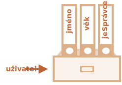
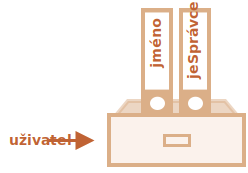
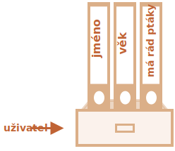

# Objekty

Jak víme z kapitoly <info:types>, JavaScript obsahuje osm datových typů. Sedm z nich se nazývá „primitivní typy“ nebo „primitivy“, protože jejich hodnoty obsahují pouze jednu věc (ať už je to řetězec, číslo nebo něco jiného).

Naproti tomu objekty se používají k uložení kolekcí různých dat pod klíči a složitějších entit. V JavaScriptu objekty pronikají do téměř všech aspektů jazyka. Musíme jim tedy porozumět předtím, než půjdeme do hloubky v něčem jiném.

Objekt můžeme vytvořit pomocí složených závorek `{…}` obsahujících nepovinný seznam *vlastností*. Vlastnost je dvojice „klíč: hodnota“, v níž `klíč` je řetězec (nazývá se také „název vlastnosti“) a `hodnota` může být cokoli.

Objekt si můžeme představit jako skříň s označenými spisy. Každý kousek dat je uložen podle klíče ve svém spisu. Je pak lehké najít spis podle jeho názvu nebo spis přidat či odstranit.


Prázdný objekt („prázdná skříň“) může být vytvořen pomocí jedné ze dvou syntaxí:

```js
let uživatel = new Object(); // syntaxe „konstruktor objektu“
let uživatel = {};  // syntaxe „objektový literál“
```


Obvykle se používají složené závorky `{...}`. Tato deklarace se nazývá *objektový literál*.

## Literály a vlastnosti

Do `{...}` můžeme rovnou umístit vlastnosti jako dvojice „klíč: hodnota“:

```js
let uživatel = {     // objekt
  jméno: "Jan",  // pod klíčem „jméno“ uložíme hodnotu „Jan“
  věk: 30        // pod klíčem „věk“ uložíme hodnotu 30
};
```

Vlastnost má klíč (nazývaný také „jméno“, „název“ nebo „identifikátor“) před dvojtečkou `":"` a hodnotu napravo od ní.

V objektu `uživatel` se nacházejí dvě vlastnosti:

1. První vlastnost má název `"jméno"` a hodnotu `"Jan"`.
2. Druhá vlastnost má název `"věk"` a hodnotu `30`.

Výsledný objekt `uživatel` si můžeme představit jako skříň se dvěma spisy označenými „jméno“ a „věk“.


Kdykoli do ní můžeme přidávat, odebírat a číst z ní spisy.

Hodnoty vlastností jsou dostupné pomocí tečkové notace:

```js
// vrátí hodnoty vlastností objektu:
alert( uživatel.jméno ); // Jan
alert( uživatel.věk );   // 30
```

Hodnota může být libovolného typu. Přidejme hodnotu typu boolean:

```js
uživatel.jeSprávce = true;
```



K odstranění vlastnosti můžeme použít operátor `delete`:

```js
delete uživatel.věk;
```



Můžeme použít i víceslovné názvy vlastností, ale pak je musíme dát do uvozovek:

```js
let uživatel = {
  jméno: "Jan",
  věk: 30,
  "má rád ptáky": true  // víceslovný název vlastnosti musí být v uvozovkách
};
```




Poslední vlastnost v seznamu může končit čárkou:
```js
let uživatel = {
  jméno: "Jan",
  věk: 30*!*,*/!*
}
```
Tato čárka se nazývá „vlečná“. Díky ní je jednodušší přidávat, odebírat nebo přesunovat vlastnosti, protože všechny řádky budou vypadat podobně.

## Hranaté závorky

U víceslovných vlastností tečkový přístup nefunguje:

```js run
// toto způsobí syntaktickou chybu
uživatel.má rád ptáky = true
```

JavaScript tomu nerozumí. Myslí si, že adresujeme `uživatel.má`, a pak oznámí syntaktickou chybu, když narazí na nečekané `rád`.

Tečka vyžaduje, aby klíč byl platný identifikátor proměnné. To znamená, že neobsahuje žádné mezery, nezačíná číslicí a neobsahuje speciální znaky (`$` a `_` jsou povoleny).

Existuje alternativní „notace hranatých závorek“, která funguje s libovolným řetězcem:

```js run
let uživatel = {};

// nastavit
uživatel["má rád ptáky"] = true;

// načíst
alert(uživatel["má rád ptáky"]); // true

// smazat
delete uživatel["má rád ptáky"];
```

Nyní je všechno v pořádku. Všimněte si, že řetězec uvnitř hranatých závorek je správně ohraničen uvozovkami (lze použít jakýkoli druh uvozovek).

Hranaté závorky také poskytují způsob, jak získat název vlastnosti jako výsledek jakéhokoli výrazu -- na rozdíl od literálního řetězce -- například z proměnné následovně:

```js
let klíč = "má rád ptáky";

// totéž jako uživatel["má rád ptáky"] = true;
uživatel[klíč] = true;
```

Zde může být proměnná `klíč` vypočtena za běhu skriptu nebo záviset na uživatelském vstupu. A pak ji použijeme k přístupu k vlastnosti. To nám dává velké množství flexibility.

Například:

```js run
let uživatel = {
  jméno: "Jan",
  věk: 30
};

let klíč = prompt("Co chcete vědět o uživateli?", "jméno");

// přístup pomocí proměnné
alert( uživatel[klíč] ); // Jan (pokud bylo zadáno "jméno")
```

Tečkovou notaci nelze podobným způsobem použít:

```js run
let uživatel = {
  jméno: "Jan",
  věk: 30
};

let klíč = "jméno";
alert( uživatel.klíč ) // undefined
```

### Vypočítávané vlastnosti

Když vytváříme objekt, můžeme použít hranaté závorky v objektovém literálu. Takové vlastnosti se nazývají *vypočítávané*.

Například:

```js run
let ovoce = prompt("Jaké ovoce koupit?", "jablko");

let taška = {
*!*
  [ovoce]: 5, // název vlastnosti se získá z proměnné ovoce
*/!*
};

alert( taška.jablko ); // 5, je-li ovoce=="jablko"
```

Význam vypočítávané vlastnosti je jednoduchý: `[ovoce]` znamená, že název vlastnosti by měl být převzat z proměnné `ovoce`.

Jestliže tedy návštěvník zadá `"jablko"`, `taška` bude `{jablko: 5}`.

V zásadě to funguje stejně jako:
```js run
let ovoce = prompt("Jaké ovoce koupit?", "jablko");
let taška = {};

// vezmeme název vlastnosti z proměnné ovoce
taška[ovoce] = 5;
```

...Ale vypadá to lépe.

Uvnitř hranatých závorek můžeme používat i složitější výrazy:

```js
let ovoce = 'apple'; // anglicky „jablko“ (pozn. překl.)
let taška = {
  [ovoce + 'Computers']: 5 // taška.appleComputers = 5
};
```

Hranaté závorky jsou mnohem silnější než tečková notace. Umožňují libovolné názvy vlastností a proměnné. Je však také pracnější je napsat.

Většinou se tedy používá tečka, jsou-li názvy vlastností známé a jednoduché. Teprve když potřebujeme něco složitějšího, přejdeme k hranatým závorkám.

## Zkratka hodnoty vlastnosti

Ve skutečném kódu často používáme jako hodnoty vlastností již existující proměnné.

Například:

```js run
function vytvořUživatele(jméno, věk) {
  return {
    jméno: jméno,
    věk: věk,
    // ...další vlastnosti
  };
}

let uživatel = vytvořUživatele("Jan", 30);
alert(uživatel.jméno); // Jan
```

Ve výše uvedeném příkladu mají vlastnosti stejné názvy jako proměnné. Vytvoření vlastnosti z proměnné se provádí natolik často, že pro něj existuje speciální *zkratka hodnoty vlastnosti*, která jej zkracuje.

Místo `jméno:jméno` můžeme napsat jen `jméno`, například takto:

```js
function vytvořUživatele(jméno, věk) {
*!*
  return {
    jméno, // totéž jako jméno: jméno
    věk,   // totéž jako věk: věk
    // ...
  };
*/!*
}
```

Ve stejném objektu můžeme použít běžné vlastnosti i zkratky:

```js
let uživatel = {
  jméno,  // totéž jako jméno: jméno
  věk: 30
};
```


## Omezení názvů vlastností

Jak už víme, proměnná nemůže mít stejný název jako některé z rezervovaných slov, např. „for“, „let“, „return“ atd.

Pro vlastnost objektu však toto omezení neplatí:

```js run
// všechny tyto vlastnosti jsou správně
let obj = {
  for: 1,
  let: 2,
  return: 3
};

alert( obj.for + obj.let + obj.return );  // 6
```

Krátce řečeno, názvy vlastností nejsou nijak omezeny. Mohou to být libovolné řetězce nebo symboly (speciální typ identifikátorů, který bude objasněn později).

Ostatní typy se automaticky konvertují na řetězce.

Například když je jako klíč vlastnosti použito číslo `0`, stane se řetězcem `0`:

```js run
let obj = {
  0: "test" // totéž jako "0": "test"
};

// oba alerty přistupují ke stejné vlastnosti (číslo 0 se převede na řetězec "0")
alert( obj["0"] ); // test
alert( obj[0] ); // test (stejná vlastnost)
```

Je tady drobné úskalí se speciální vlastností jménem `__proto__`. Tu nemůžeme nastavit na neobjektovou hodnotu:

```js run
let obj = {};
obj.__proto__ = 5; // přiřadíme číslo
alert(obj.__proto__); // [object Object] - hodnota je objekt, nefungovalo to tak, jak jsme zamýšleli
```

Jak vidíme z kódu, přiřazení primitivu `5` se ignoruje.

V [dalších kapitolách](info:prototype-inheritance) vysvětlíme zvláštní povahu `__proto__` a naznačíme [způsoby](info:prototype-methods), jak takové chování opravit.

## Test existence vlastnosti, operátor „in“

Pozoruhodnou vlastností objektů v JavaScriptu, na rozdíl od mnoha jiných jazyků, je možnost přistupovat k libovolné vlastnosti. Pokud vlastnost nebude existovat, nenastane chyba!

Načtení neexistující vlastnosti jednoduše vrátí `undefined`. Můžeme tedy snadno otestovat, zda vlastnost existuje:

```js run
let uživatel = {};

alert( uživatel.takováVlastnostNení === undefined ); // true znamená „taková vlastnost neexistuje“
```

K tomuto účelu existuje i speciální operátor `"in"`.

Jeho syntaxe je:
```js
"klíč" in objekt
```

Například:

```js run
let uživatel = { jméno: "Jan", věk: 30 };

alert( "věk" in uživatel );    // true, uživatel.věk existuje
alert( "blabla" in uživatel ); // false, uživatel.blabla neexistuje
```

Prosíme všimněte si, že na levé straně `in` musí být *název vlastnosti*, což je obvykle řetězec v uvozovkách.

Vypustíme-li uvozovky, znamená to proměnnou, která by měla obsahovat skutečný název, který bude prověřen. Například:

```js run
let uživatel = { věk: 30 };

let klíč = "věk";
alert( *!*klíč*/!* in uživatel ); // true, vlastnost „věk“ existuje
```

Proč vůbec existuje operátor `in`? Nestačilo by porovnávat s `undefined`?

Ve většině případů porovnání s `undefined` funguje správně. Existuje však speciální případ, kdy selže, ale operátor `"in"` funguje korektně.

Je to tehdy, když vlastnost objektu existuje, ale je v ní uloženo `undefined`:

```js run
let obj = {
  test: undefined
};

alert( obj.test ); // je undefined, takže - taková vlastnost neexistuje?

alert( "test" in obj ); // true, vlastnost existuje!
```

Ve výše uvedeném kódu vlastnost `obj.test` technicky existuje, takže operátor `in` funguje správně.

Takové situace nastávají velmi zřídka, jelikož `undefined` by nemělo být výslovně přiřazováno. Pro „neznámé“ nebo „prázdné“ hodnoty většinou používáme `null`. Proto je operátor `in` v kódu exotickým hostem.


## Cyklus „for..in“ [#forin]

Pro procházení všemi klíči objektu existuje speciální forma cyklu: `for..in`. Je to úplně něco jiného než konstrukce `for(;;)`, kterou jsme již prostudovali.

Syntaxe:

```js
for (klíč in objekt) {
  // tělo se spustí pro každý klíč mezi vlastnostmi objektu
}
```

Vypišme například všechny vlastnosti objektu `uživatel`:

```js run
let uživatel = {
  jméno: "Jan",
  věk: 30,
  jeSprávce: true
};

for (let klíč in uživatel) {
  // klíče
  alert( klíč );  // jméno, věk, jeSprávce
  // hodnoty klíčů
  alert( uživatel[klíč] ); // Jan, 30, true
}
```

Všimněte si, že všechny konstrukce „for“ nám umožňují deklarovat uvnitř cyklu smyčkovou proměnnou, jako zde `let klíč`.

Můžeme zde použít i jiný název proměnné namísto `klíč`. Například hojně se používá `"for (let vlastnost in obj)"`.

### Seřazené jako objekt

Jsou objekty seřazené? Jinými slovy: když cyklus prochází nad objektem, obdržíme všechny vlastnosti ve stejném pořadí, v jakém byly přidány? Můžeme se na to spolehnout?

Krátká odpověď je: „seřazeny speciálním způsobem“: celočíselné vlastnosti jsou seřazeny, ostatní se objeví v pořadí vytvoření. Následují podrobnosti.

Uvažujme například objekt s telefonními předvolbami států:

```js run
let předvolby = {
  "49": "Německo",
  "41": "Švýcarsko",
  "44": "Velká Británie",
  // ..,
  "1": "USA"
};

*!*
for (let předvolba in předvolby) {
  alert(předvolba); // 1, 41, 44, 49
}
*/!*
```

Objekt můžeme použít, abychom uživateli navrhli seznam možností. Například vytváříme-li stránku zejména pro návštěvníky z Německa, budeme pravděpodobně chtít, aby jako první bylo `49`.

Jenže když kód spustíme, uvidíme úplně jiný obrázek:

- jako první bude USA (1)
- pak Švýcarsko (41) a tak dále.

Telefonní předvolby jsou seřazeny vzestupně, protože jsou to celá čísla. Uvidíme tedy `1, 41, 44, 49`.

````smart header="Celočíselné vlastnosti? K čemu to je?"
Pojem „celočíselná vlastnost“ zde znamená řetězec, který může být konvertován na celé číslo a zpět beze změny.

Takže `"49"` je název celočíselné vlastnosti, protože když se převede na celé číslo a zpět, zůstane stejný. Ale `"+49"` a `"1.2"` nejsou:

```js run
// Number(...) explicitně konvertuje na číslo
// Math.trunc je vestavěná funkce, která odstraní desetinnou část
alert( String(Math.trunc(Number("49"))) ); // "49", totéž, celočíselná vlastnost
alert( String(Math.trunc(Number("+49"))) ); // "49", není totéž jako "+49" ⇒ není to celočíselná vlastnost
alert( String(Math.trunc(Number("1.2"))) ); // "1", není totéž jako "1.2" ⇒ není to celočíselná vlastnost
```
````

...Na druhou stranu nejsou-li klíče celá čísla, budou seřazeny v tomtéž pořadí, v jakém byly vytvořeny, například:

```js run
let uživatel = {
  jméno: "Jan",
  příjmení: "Novák"
};
uživatel.věk = 25; // přidáme další

*!*
// jiné než celočíselné vlastnosti jsou seřazeny v pořadí, v němž byly vytvořeny
*/!*
for (let vlastnost in uživatel) {
  alert( vlastnost ); // jméno, příjmení, věk
}
```

Abychom tedy vyřešili problém s telefonními předvolbami, můžeme „podvádět“ tak, že předvolby učiníme neceločíselnými. Postačí přidat znaménko plus `"+"` před každou předvolbu.

Například:

```js run
let předvolby = {
  "+49": "Německo",
  "+41": "Švýcarsko",
  "+44": "Velká Británie",
  // ..,
  "+1": "USA"
};

for (let předvolba in předvolby) {
  alert( +předvolba ); // 49, 41, 44, 1
}
```

Nyní to funguje tak, jak jsme zamýšleli.

## Shrnutí

Objekty jsou asociativní pole s několika speciálními vlastnostmi.

Ukládají se do nich vlastnosti (dvojice klíč-hodnota), v nichž:
- Klíče vlastností musejí být řetězce nebo symboly (obvykle to jsou řetězce).
- Hodnoty mohou být jakéhokoli typu.

Pro přístup k vlastnosti můžeme použít:
- Tečkovou notaci: `obj.vlastnost`.
- Notaci hranatých závorek `obj["vlastnost"]`. Hranaté závorky nám umožňují převzít klíč z proměnné, např. `obj[proměnnáSKlíčem]`.

Další operátory:
- K vymazání vlastnosti: `delete obj.vlastnost`.
- K ověření, zda vlastnost se zadaným klíčem existuje: `"klíč" in obj`.
- K iteraci nad objektem: cyklus `for (let klíč in obj)`.

To, co jsme prostudovali v této kapitole, se nazývá „planý objekt“ nebo jen `Object`.

V JavaScriptu však existuje i mnoho dalších druhů objektů:

- `Array` (pole) k ukládání seřazených kolekcí dat,
- `Date` (datum) k ukládání informací o datu a času,
- `Error` (chyba) k ukládání informací o chybě,
- ...a tak dále.

Mají své speciální vlastnosti, které prostudujeme později. Někdy lidé říkají „typ Array“ nebo „typ Date“, ale formálně to nejsou samostatné typy, nýbrž patří k jednoduchému datovému typu „objekt“ a různými způsoby jej rozšiřují.

Objekty v JavaScriptu jsou velmi silné. Tady jsme jen lehce nakousli téma, které je opravdu obrovské. V dalších částech tohoto tutoriálu budeme s objekty pracovat blíže a dozvíme se o nich víc.
