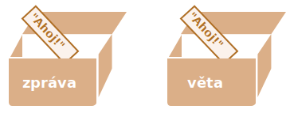
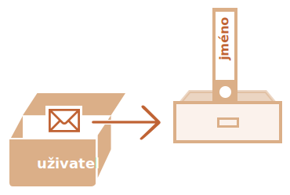
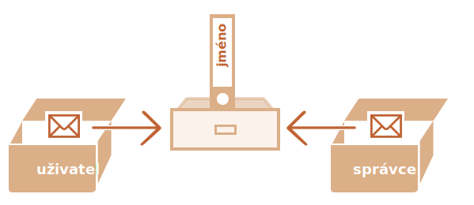

# Odkazy na objekty a kopírování objektů

Jeden ze základních rozdílů mezi objekty a primitivními typy je, že objekty se ukládají a kopírují jako „odkazy“, zatímco primitivní hodnoty: řetězce, čísla, booleany atd. -- se kopírují vždy „jako celá hodnota“.

Snadno tomu porozumíme, jestliže se podíváme trochu více pod kapuci toho, co se děje, když kopírujeme hodnotu.

Začněme primitivním typem, třeba řetězcem.

Do proměnné `věta` zkopírujeme proměnnou `zpráva`:

```js
let zpráva = "Ahoj!";
let věta = zpráva;
```

Výsledkem budou dvě nezávislé proměnné, v každé bude uložen řetězec `"Ahoj!"`.



Vcelku zjevný výsledek, že?

Objekty se takhle nechovají.

**V proměnné, do níž je přiřazen objekt, není uložen samotný objekt, ale jeho „adresa v paměti“ -- jinými slovy „odkaz“ na objekt.**

Podívejme se na příklad takové proměnné:

```js
let uživatel = {
  jméno: "Jan"
};
```

A takto je ve skutečnosti uložen v paměti:



Objekt je uložen někde v paměti (na obrázku vpravo), zatímco proměnná `uživatel` (vlevo) obsahuje „odkaz“ na něj.

Můžeme považovat objektovou proměnnou, např. `uživatel`, za kus papíru, na němž je napsána adresa objektu.

Když provádíme akci nad objektem, např. zjišťujeme vlastnost `uživatel.jméno`, engine JavaScriptu se podívá, co je na této adrese, a provede operaci nad skutečným objektem.

Teď vysvětlíme, proč je to důležité.

**Když je kopírována objektová proměnná, zkopíruje se odkaz, ale samotný objekt se nezdvojí.**

Například:

```js no-beautify
let uživatel = { jméno: "Jan" };

let admin = uživatel; // kopírování odkazu
```

Nyní máme dvě proměnné, v obou jsou uloženy odkazy na tentýž objekt:



Jak vidíte, objekt je stále jen jeden, ale nyní se na něj odkazují dvě proměnné.

Obě proměnné můžeme používat k přístupu k objektu a modifikaci jeho obsahu:

```js run
let uživatel = { jméno: 'Jan' };

let admin = uživatel;

*!*
admin.jméno = 'Petr'; // změna pomocí odkazu „admin“
*/!*

alert(*!*uživatel.jméno*/!*); // 'Petr', změny jsou vidět i z odkazu „uživatel“
```

Je to, jako kdybychom měli skříň se dvěma klíči a použili jeden z nich (`admin`) k tomu, abychom se do ní dostali a provedli změny. Když poté použijeme druhý klíč (`uživatel`), budeme stále otevírat stejnou skříň a můžeme přistupovat ke změněnému obsahu.

## Porovnání pomocí odkazů

Dva objekty jsou si rovny, jen když představují tentýž objekt.

Například zde `a` a `b` jsou odkazy na tentýž objekt, takže jsou si rovny:

```js run
let a = {};
let b = a; // kopírování odkazu

alert( a == b ); // true, obě proměnné se odkazují na tentýž objekt
alert( a === b ); // true
```

A zde si dva nezávislé objekty nejsou rovny, přestože vypadají podobně (oba jsou prázdné):

```js run
let a = {};
let b = {}; // dva nezávislé objekty

alert( a == b ); // false
```

Při porovnání typu `obj1 > obj2` nebo při porovnání s primitivním typem `obj == 5` se objekty převádějí na primitivy. Jak funguje porovnávání objektů, prostudujeme velmi brzy, ale upřímně řečeno, taková porovnání jsou zapotřebí jen velmi zřídka -- obvykle se objevují v důsledku programátorské chyby.

## Klonování a slučování, Object.assign [#cloning-and-merging-object-assign]

Kopírování objektové proměnné tedy vytvoří další odkaz na tentýž objekt.

Co když však potřebujeme duplikovat objekt? Vytvořit jeho nezávislou kopii, jeho klon?

I to je proveditelné, ale trochu obtížnější, neboť v JavaScriptu pro to neexistuje žádná vestavěná metoda. Je to však zapotřebí jen zřídka -- většinou stačí kopírování odkazu.

Jestliže to však doopravdy chceme, musíme vytvořit nový objekt a replikovat strukturu existujícího objektu tím, že budeme iterovat nad jeho vlastnostmi a kopírovat je na úrovni primitivů.

Například:

```js run
let uživatel = {
  jméno: "Jan",
  věk: 30
};

*!*
let klon = {}; // nový prázdný objekt

// zkopírujme do něj všechny uživatelské vlastnosti
for (let klíč in uživatel) {
  klon[klíč] = uživatel[klíč];
}
*/!*

// nyní je klon plně nezávislý objekt se stejným obsahem
klon.jméno = "Petr"; // změníme data uvnitř

alert( uživatel.jméno ); // v původním objektu je stále Jan
```

Můžeme k tomu také použít metodu [Object.assign](mdn:js/Object/assign).

Její syntaxe je:

```js
Object.assign(cíl, [zdroj1, zdroj2, zdroj3...])
```

- První argument `cíl` je cílový objekt.
- Další argumenty `zdroj1, ..., zdrojN` (může jich být tolik, kolik potřebujeme) jsou zdrojové objekty.
- Metoda zkopíruje vlastnosti všech zdrojových objektů `zdroj1, ..., zdrojN` do cíle `cíl`. Jinými slovy, do cílového objektu se zkopírují vlastnosti všech argumentů počínaje druhým.
- Volání vrátí `cíl`.

Například ji můžeme použít ke sloučení několika objektů do jednoho:
```js
let uživatel = { jméno: "Jan" };

let práva1 = { můžeProhlížet: true };
let práva2 = { můžeEditovat: true };

*!*
// zkopíruje všechny vlastnosti z objektů práva1 a práva2 do objektu uživatel
Object.assign(uživatel, práva1, práva2);
*/!*

// nyní uživatel = { jméno: "Jan", můžeProhlížet: true, můžeEditovat: true }
```

Jestliže vlastnost s kopírovaným názvem již existuje, bude přepsána:

```js run
let uživatel = { jméno: "Jan" };

Object.assign(uživatel, { jméno: "Petr" });

alert(uživatel.jméno); // nyní uživatel = { jméno: "Petr" }
```

Můžeme také využít `Object.assign` k nahrazení cyklu `for..in` jednoduchým klonováním:

```js
let uživatel = {
  jméno: "Jan",
  věk: 30
};

*!*
let klon = Object.assign({}, uživatel);
*/!*
```

Zkopíruje všechny vlastnosti objektu `uživatel` do prázdného objektu a ten pak vrátí.

Existují i jiné metody klonování objektu, např. použitím [rozšířené syntaxe](info:rest-parameters-spread) `klon = {...uživatel}`, kterou vysvětlíme později v tomto tutoriálu.

## Vnořené klonování

Až dosud jsme předpokládali, že všechny vlastnosti objektu `uživatel` jsou primitivní. Ale vlastnosti mohou být i odkazy na jiné objekty. Co s nimi?

Například:
```js run
let uživatel = {
  jméno: "Jan",
  míry: {
    výška: 182,
    šířka: 50
  }
};

alert( uživatel.míry.výška ); // 182
```

Teď nestačí kopírovat `klon.míry = uživatel.míry`, protože `uživatel.míry` je objekt, který bude zkopírován odkazem. Pak budou `klon` a `uživatel` sdílet stejné míry.

Například:

```js run
let uživatel = {
  jméno: "Jan",
  míry: {
    výška: 182,
    šířka: 50
  }
};

let klon = Object.assign({}, uživatel);

alert( uživatel.míry === klon.míry ); // true, stejný objekt

// uživatel a klon sdílejí tytéž míry
uživatel.míry.šířka++;  // změníme vlastnost na jednom místě
alert(klon.míry.šířka); // 51, vidíme výsledek z prvního objektu
```

Abychom to opravili, měli bychom použít klonovací cyklus, který prozkoumá každou hodnotu `uživatel[klíč]`, a pokud je to objekt, replikuje i jeho strukturu. Toto klonování se nazývá „hloubkové“ nebo „hluboké“.

Můžeme to implementovat pomocí rekurze. Nebo, abychom znovu nevynalézali kolo, použít existující implementaci, např. [_.cloneDeep(obj)](https://lodash.com/docs#cloneDeep) z JavaScriptové knihovny [lodash](https://lodash.com).

````smart header="Konstantní objekty můžeme modifikovat"
Důležitým vedlejším efektem ukládání objektů jako odkazů je, že objekt deklarovaný jako `const` *může* být modifikován.

Například:

```js run
const uživatel = {
  jméno: "Jan"
};

*!*
uživatel.jméno = "Petr"; // (*)
*/!*

alert(uživatel.jméno); // Petr
```

Může se zdát, že řádek `(*)` ohlásí chybu, ale nestane se tak. Hodnota objektu `uživatel` je konstantní a musí pořád odkazovat na stejný objekt, ale vlastnosti tohoto objektu lze libovolně měnit.

Jinými slovy, `const uživatel` způsobí chybu, jen pokud se pokusíme nastavit `uživatel=...` jako celek.

Jestliže ovšem opravdu potřebujeme učinit vlastnosti objektů konstantní, je to rovněž možné, ale úplně jiným způsobem. Zmíníme se o tom v kapitole <info:property-descriptors>.
````

## Shrnutí

Objekty se přiřazují a kopírují odkazem. Jinými slovy, v proměnné není uložena „hodnota objektu“, ale „odkaz“ (adresa v paměti) této hodnoty. Zkopírování této hodnoty nebo její předání jako argument funkce tedy zkopíruje tento odkaz, ne objekt samotný.

Všechny operace na zkopírovaných odkazech (např. přidávání nebo odebírání vlastností) jsou prováděny na jednom a tomtéž objektu.

Abychom vytvořili „skutečnou kopii“ (klon), můžeme použít `Object.assign` pro tzv. „mělkou kopii“ (vnořené objekty se kopírují odkazem) nebo funkci pro „hloubkové klonování“, např. [_.cloneDeep(obj)](https://lodash.com/docs#cloneDeep).
