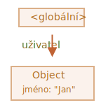
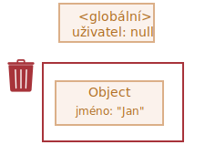
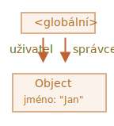
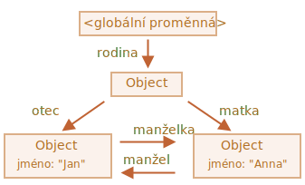
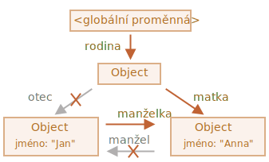
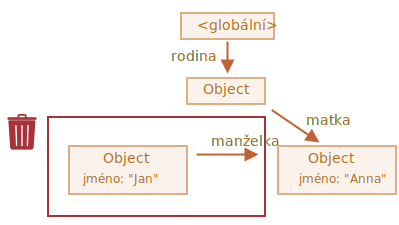
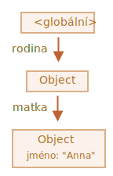
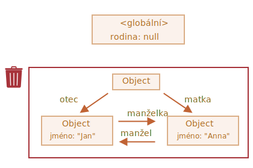
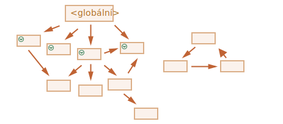
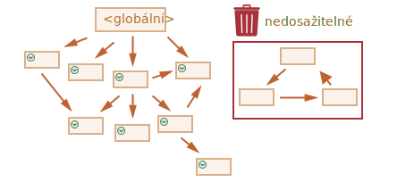

# Garbage collection

*(Pozn. překladatele: výraz „garbage collection“ znamená česky „sbírání odpadu“, ale v programování se většinou ponechává anglický název.)*

Správa paměti v JavaScriptu se provádí automaticky a pro nás neviditelně. Vytváříme primitivy, objekty, funkce... To všechno zabírá paměť.

Co se stane, když něco už není potřeba? Jak to JavaScriptový engine odhalí a vyčistí?

## Dosažitelnost

Hlavním konceptem správy paměti v JavaScriptu je *dosažitelnost*.

Jednoduše řečeno, „dosažitelné“ hodnoty jsou ty, které jsou odněkud přístupné nebo použitelné. U nich je zaručeno, že budou uloženy v paměti.

1. Existuje základní sada zaručeně dosažitelných hodnot, které nelze smazat z pochopitelných důvodů.

    Například:

    - Právě prováděná funkce, její lokální proměnné a parametry.
    - Další funkce v právě prováděném řetězci vnořených volání, jejich lokální proměnné a parametry.
    - Globální proměnné.
    - (existují i některé další, stejně jako interní)

    Tyto hodnoty se nazývají *kořenové hodnoty* nebo *kořeny*.

2. Jakákoli jiná hodnota se považuje za dosažitelnou, je-li dosažitelná z kořene nějakým odkazem nebo řetězcem odkazů.

    Například obsahuje-li globální proměnná nějaký objekt a tento objekt má vlastnost, která se odkazuje na další objekt, pak *onen další* objekt se považuje za dosažitelný. I ty, na které se odkazuje on, jsou dosažitelné. Podrobné příklady budou následovat.

V JavaScriptovém enginu v pozadí probíhá proces, který se nazývá [garbage collector](https://cs.wikipedia.org/wiki/Garbage_collection) *(česky se mu někdy říká „sběrač odpadků“ -- pozn. překl.)*. Monitoruje všechny objekty a odstraňuje ty, které se staly nedosažitelnými.

## Jednoduchý příklad

Uveďme nejjednodušší příklad:

```js
// uživatel obsahuje odkaz na objekt
let uživatel = {
  jméno: "Jan"
};
```



Zde šipka představuje odkaz na objekt. Globální proměnná `"uživatel"` odkazuje na objekt `{jméno: "Jan"}` (pro zjednodušení mu budeme říkat Jan). Vlastnost `"jméno"` objektu Jan obsahuje primitiv, proto je zobrazena uvnitř objektu.

Je-li hodnota proměnné `uživatel` přepsána, odkaz je ztracen:

```js
uživatel = null;
```



Nyní se Jan stal nedosažitelným. Není žádný způsob, jak k němu přistoupit, neexistují na něj žádné odkazy. Garbage collector odstraní jeho data a uvolní paměť.

## Dva odkazy

Nyní si představme, že zkopírujeme odkaz na objekt `uživatel` do objektu `admin`:

```js
// uživatel obsahuje odkaz na objekt
let uživatel = {
  jméno: "Jan"
};

*!*
let admin = uživatel;
*/!*
```



Když nyní uděláme totéž:
```js
uživatel = null;
```

...Pak bude objekt stále dosažitelný z globální proměnné `admin`, a tedy musí zůstat v paměti. Jestliže přepíšeme i `admin`, bude možné jej odstranit.

## Propojené objekty

Nyní složitější příklad. Rodina:

```js
function svatba(muž, žena) {
  žena.manžel = muž;
  muž.manželka = žena;

  return {
    otec: muž,
    matka: žena
  }
}

let rodina = svatba({
  jméno: "Jan"
}, {
  jméno: "Anna"
});
```

Funkce `svatba` „oddá“ dva objekty tak, že jim předá odkazy na sebe navzájem a vytvoří nový objekt, který je oba bude obsahovat.

Výsledná struktura paměti:



V této chvíli jsou všechny objekty dosažitelné.

Nyní odstraňme dva odkazy:

```js
delete rodina.otec;
delete rodina.matka.manžel;
```



Nestačí smazat jen jeden z těchto dvou odkazů, jelikož všechny objekty by stále byly dosažitelné.

Jestliže však smažeme oba, vidíme, že Jan již nemá žádné „příchozí“ odkazy, které by směřovaly k němu:



„Odchozí“ odkazy (směřující od Jana) nejsou podstatné. Objekt mohou učinit dosažitelným jedině příchozí odkazy. Jan je tedy nyní nedosažitelný a bude odstraněn z paměti i se všemi svými daty, která se také stala nedosažitelnými.

Po provedení garbage collection:



## Nedosažitelný ostrov

Může se stát, že se celý ostrov navzájem propojených objektů stane nedosažitelným a bude odstraněn z paměti.

Zdrojový objekt je stejný jako ten uvedený výše. Pak:

```js
rodina = null;
```

Obrázek paměti bude vypadat takto:



Tento příklad demonstruje, jak důležitý je koncept dosažitelnosti.

Je vidět, že Jan a Anna jsou stále spojeni a k oběma směřují nějaké odkazy. To ale nestačí.

Bývalý objekt `"rodina"` byl odpojen od kořene, neexistuje na něj už žádný odkaz, takže se celý ostrov objektů stal nedosažitelným a bude odstraněn.

## Interní algoritmy

Základní algoritmus garbage collection se nazývá „mark-and-sweep“ *(česky „označ a zameť“ -- pozn. překl.)*.

Pravidelně se provádějí následující kroky „garbage collection“:

- Garbage collector vezme kořeny a „označí“ (zapamatuje) si je.
- Pak navštíví a „označí“ všechny odkazy z nich.
- Pak navštíví označené objekty a označí „jejich“ odkazy. Všechny navštívené objekty si pamatuje, aby v budoucnu nenavštívil stejný objekt dvakrát.
- ...A tak dále, dokud nebudou navštíveny všechny (z kořenů) dosažitelné odkazy.
- Všechny objekty, které nejsou označeny, se odstraní.

Například nechť naše objektová struktura vypadá takto:


Jasně vidíme „nedosažitelný ostrov“ na pravé straně. Nyní se podívejme, jak si s ním poradí garbage collector typu „mark-and-sweep“.

První krok označí kořeny:



Pak budeme následovat jejich odkazy a označíme odkazované objekty:


...A budeme dále následovat další odkazy, dokud to bude možné:


Nyní se objekty, které nemohly být v tomto procesu navštíveny, budou považovat za nedosažitelné a budou odstraněny:



Můžeme si tento proces představit i jako rozlévání velkého kbelíku s barvou, která teče od kořenů všemi odkazy a dostane se ke všem dosažitelným objektům. Neoznačené objekty jsou poté odstraněny.

Toto je koncept fungování sbírání odpadků. JavaScriptové motory aplikují mnoho optimalizací, které způsobí, že se jeho běh urychlí a nebude při běhu kódu způsobovat prodlevy.

Některé z nich:

- **Generační sběr** -- objekty se rozdělí na dvě skupiny: „nové“ a „staré“. V typickém kódu má mnoho objektů jen krátký život: objeví se, odvedou svou práci a rychle zemřou, takže má smysl stopovat nové objekty a pokud nastane tento případ, vyčistit je z paměti. Ty, které přežijí dostatečně dlouho, se stanou „starými“ a budou prozkoumávány méně často.
- **Inkrementální sběr** -- jestliže máme mnoho objektů a snažíme se projít a označit celou jejich sadu najednou, může to zabrat nějakou dobu a způsobit znatelné prodlevy při běhu skriptu. Motor se tedy snaží rozdělit celou sadu existujících objektů do více částí. A pak čistí tyto části jednu po druhé. Nastane tedy více malých sběrů odpadků místo jednoho celkového. To vyžaduje určitou další administraci mezi nimi, aby se zaznamenaly změny, ale pak získáme mnoho menších prodlev místo jedné velké.
- **Sběr v čase nečinnosti** -- sběrač odpadků se snaží běžet jen tehdy, když je CPU nečinná, aby zmenšil svůj vliv na běh.

Existují i jiné optimalizace a doplňky algoritmů garbage collection. Rád bych je zde popsal, ale musím se toho vzdát, jelikož různé enginy implementují různá vylepšení a techniky. Co je ještě důležitější, během vývoje enginů se vše neustále mění, takže studovat je hlouběji „napřed“, aniž bychom je opravdu potřebovali, pravděpodobně nemá smysl. Pokud to ovšem není věc čistého zájmu, v kterémžto případě najdete některé odkazy níže.

## Shrnutí

Hlavní věci, které máme vědět:

- Sběr odpadků se provádí automaticky. Nemůžeme si jej vynutit nebo mu zabránit.
- Objekty zůstávají v paměti, dokud jsou dosažitelné.
- Být odkazován není totéž jako být dosažitelný (z kořene): sada vzájemně propojených objektů se může jako celek stát nedosažitelnou, jak jsme viděli ve výše uvedeném příkladu.

Moderní enginy implementují pokročilé algoritmy garbage collection.

Některé z nich jsou pokryty v obecné knize „The Garbage Collection Handbook: The Art of Automatic Memory Management“ (R. Jones a kolektiv).

Pokud jste obeznámeni s programováním na nízké úrovni, podrobnější informace o sběrači odpadků V8 najdete v článku [A tour of V8: Garbage Collection](http://jayconrod.com/posts/55/a-tour-of-v8-garbage-collection).

Rovněž [blog V8](https://v8.dev/) občas publikuje články o změnách ve správě paměti. Přirozeně, abyste se naučili o sbírání odpadků víc, měli byste se připravit tak, že se naučíte něco o interních záležitostech V8 obecně a přečtete si blog [Vjačeslava Jegorova](http://mrale.ph), který pracoval jako jeden z tvůrců V8. Říkám „V8“, protože ten je nejlépe pokryt články na internetu. V jiných motorech jsou mnohé přístupy podobné, ale sběrače odpadků se v mnoha aspektech liší.

Hloubková znalost motorů se hodí, když potřebujete optimalizaci na nízké úrovni. Bylo by moudré naplánovat si to jako další krok poté, co se seznámíte s jazykem.
