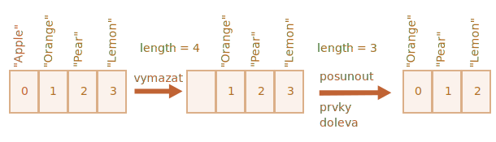
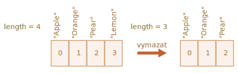

# Pole

Objekty nám umožňují ukládat kolekci hodnot roztříděnou podle klíčů. To je pěkné.

Poměrně často však zjišťujeme, že potřebujeme *seřazenou kolekci*, v níž máme první, druhý, třetí prvek a tak dále. Například do ní potřebujeme uložit seznam nějakých věcí: uživatelů, zboží, HTML prvků a podobně.

Použít k tomu objekt se nehodí, protože ten neposkytuje žádné metody, jak ovládat pořadí prvků. Nemůžeme vložit novou vlastnost „mezi“ existující. Objekty k takovému použití prostě nejsou stavěny.

K uložení seřazených kolekcí však existuje speciální datová struktura nazvaná `Array`, česky „pole“.

## Deklarace

K vytvoření prázdného pole existují dvě syntaxe:

```js
let pole = new Array();
let pole = [];
```

Téměř vždy se používá ta druhá. Do hranatých závorek můžeme uvést počáteční prvky pole:

```js
let ovoce = ["Jablko", "Pomeranč", "Švestka"];
```

Prvky pole jsou očíslovány a začínají nulou.

Získat prvek pole můžeme tak, že uvedeme jeho číslo v hranatých závorkách:

```js run
let ovoce = ["Jablko", "Pomeranč", "Švestka"];

alert( ovoce[0] ); // Jablko
alert( ovoce[1] ); // Pomeranč
alert( ovoce[2] ); // Švestka
```

Můžeme nahradit prvek jiným:

```js
ovoce[2] = 'Hruška'; // nyní ["Jablko", "Pomeranč", "Hruška"]
```

...Nebo přidat do pole nový prvek:

```js
ovoce[3] = 'Citrón'; // nyní ["Jablko", "Pomeranč", "Hruška", "Citrón"]
```

Celkový počet prvků pole představuje jeho délku, která je uložena ve vlastnosti `length`:

```js run
let ovoce = ["Jablko", "Pomeranč", "Švestka"];

alert( ovoce.length ); // 3
```

Můžeme také použít `alert` k zobrazení celého pole.

```js run
let ovoce = ["Jablko", "Pomeranč", "Švestka"];

alert( ovoce ); // Jablko,Pomeranč,Švestka
```

Do pole lze uložit prvky jakéhokoli typu.

Například:

```js run no-beautify
// směs hodnot
let pole = [ 'Jablko', { jméno: 'Jan' }, true, function() { alert('ahoj'); } ];

// získáme objekt na indexu 1 a zobrazíme jeho jméno
alert( pole[1].jméno ); // Jan

// získáme funkci na indexu 3 a zavoláme ji
pole[3](); // ahoj
```


````smart header="Vlečná čárka"
Pole, stejně jako objekt, může končit čárkou:
```js
let ovoce = [
  "Jablko",
  "Pomeranč",
  "Švestka"*!*,*/!*
];
```

Styl „vlečné (trailing) čárky“ zjednodušuje přidávání a odstraňování prvků, protože všechny řádky vypadají podobně.
````

## Získání posledního prvku pomocí „at“

[recent browser="new"]

Dejme tomu, že chceme získat poslední prvek pole.

Některé programovací jazyky umožňují ke stejnému účelu použít záporné indexy, například `ovoce[-1]`.

V JavaScriptu to však nefunguje. Výsledek bude `undefined`, protože index v hranatých závorkách se zpracovává tak, jak je uveden.

Můžeme výslovně vypočítat index posledního prvku a pak jej použít: `ovoce[ovoce.length - 1]`.

```js run
let ovoce = ["Jablko", "Pomeranč", "Švestka"];

alert( ovoce[ovoce.length-1] ); // Švestka
```

Trochu těžkopádné, že? Musíme napsat název proměnné dvakrát.

Naštěstí existuje kratší syntaxe: `ovoce.at(-1)`:

```js run
let ovoce = ["Jablko", "Pomeranč", "Švestka"];

// totéž jako ovoce[ovoce.length-1]
alert( ovoce.at(-1) ); // Švestka
```

Jinými slovy, `pole.at(i)`:
- je přesně totéž jako `pole[i]`, je-li `i >= 0`.
- pro záporné hodnoty `i` postupuje od konce pole nazpátek.

## Metody pop/push, shift/unshift

Jedním z nejběžnějších využití pole je [fronta](https://cs.wikipedia.org/wiki/Fronta_(datová_struktura)). V informatice znamená seřazenou kolekci prvků, která podporuje dvě operace:

- `push` připojí prvek na konec.
- `shift` vezme prvek ze začátku a posune frontu, takže druhý prvek se stane prvním.


Pole podporují obě operace.

V praxi ji potřebujeme velmi často. Máme například frontu zpráv, které musíme zobrazit na obrazovce.

Dalším využitím polí je datová struktura nazvaná [zásobník](https://cs.wikipedia.org/wiki/Zásobník_(datová_struktura)).

Podporuje dvě operace:

- `push` přidá prvek na konec.
- `pop` vezme prvek z konce.

Nové prvky se tedy vždy přidávají a odebírají z „konce“.

Zásobník se obvykle ilustruje jako balíček karet: nové karty se přidávají na vrch a berou se z vrchu:


U zásobníků se naposledy vložený prvek odebírá jako první. Tento princip se také nazývá LIFO (Last-In-First-Out, česky „poslední dovnitř, první ven“). U fronty máme princip FIFO (First-In-First-Out, česky „první dovnitř, první ven“).

Pole v JavaScriptu mohou fungovat jako fronta i jako zásobník. Umožňují nám přidávat/odebírat prvky do/ze začátku i konce.

Datová struktura, která to umožňuje, se v informatice nazývá [deque](https://en.wikipedia.org/wiki/Double-ended_queue) („double-ended queue“ -- „fronta s dvojitým koncem“).

**Metody, které pracují s koncem pole:**

`pop`
: Vyjme z pole poslední prvek a vrátí jej:

    ```js run
    let ovoce = ["Jablko", "Pomeranč", "Hruška"];

    alert( ovoce.pop() ); // odstraní prvek "Hruška" a zobrazí jej

    alert( ovoce ); // Jablko, Pomeranč
    ```

    Obě metody `ovoce.pop()` i `ovoce.at(-1)` vracejí poslední prvek pole, ale `ovoce.pop()` navíc změní pole tím, že tento prvek odstraní.

`push`
: Připojí prvek na konec pole:

    ```js run
    let ovoce = ["Jablko", "Pomeranč"];

    ovoce.push("Hruška");

    alert( ovoce ); // Jablko, Pomeranč, Hruška
    ```

    Volání `ovoce.push(...)` se rovná volání `ovoce[ovoce.length] = ...`.

**Metody, které pracují se začátkem pole:**

`shift`
: Vyjme první prvek z pole a vrátí jej:

    ```js run
    let ovoce = ["Jablko", "Pomeranč", "Hruška"];

    alert( ovoce.shift() ); // odstraní prvek Jablko a zobrazí jej

    alert( ovoce ); // Pomeranč, Hruška
    ```

`unshift`
: Přidá prvek na začátek pole:

    ```js run
    let ovoce = ["Pomeranč", "Hruška"];

    ovoce.unshift('Jablko');

    alert( ovoce ); // Jablko, Pomeranč, Hruška
    ```

Metody `push` a `unshift` mohou přidávat více prvků najednou:

```js run
let ovoce = ["Jablko"];

ovoce.push("Pomeranč", "Broskev");
ovoce.unshift("Ananas", "Citrón");

// ["Ananas", "Citrón", "Jablko", "Pomeranč", "Broskev"]
alert( ovoce );
```

## Vnitřní reprezentace

Pole je speciální druh objektu. Hranaté závorky, kterými se přistupuje k vlastnosti `pole[0]`, ve skutečnosti pocházejí ze syntaxe objektu. Je to v zásadě totéž jako `objekt[klíč]`, kde objektem je `pole`, zatímco jako klíče se používají čísla.

Pole rozšiřují objekty pomocí speciálních metod, které pracují se seřazenými kolekcemi dat, a vlastnosti `length`. V jádru jsou to však stále objekty.

Pamatujte, že v JavaScriptu je pouze osm základních datových typů (pro více informací viz kapitolu [Datové typy](info:types)). Pole je objekt, a proto se chová jako objekt.

Například je kopírováno odkazem:

```js run
let ovoce = ["Banán"]

let pole = ovoce; // kopírování odkazem (dvě proměnné se odkazují na stejné pole)

alert( pole === ovoce ); // true

pole.push("Hruška"); // modifikace pole odkazem

alert( ovoce ); // Banán, Hruška - nyní 2 prvky
```

...Avšak to, co činí pole opravdu speciálními, je jejich vnitřní reprezentace. Motor se snaží ukládat prvky pole do souvislé oblasti v paměti, jeden za druhým, jak je zobrazeno na obrázcích v této kapitole. Existují i jiné optimalizace, které způsobují, že pole fungují opravdu rychle.

Ty se však všechny rozbijí, jestliže přestaneme pracovat s polem jako se „seřazenou kolekcí“ a začneme s ním pracovat tak, jako by to byl běžný objekt.

Například technicky můžeme udělat tohle:

```js
let ovoce = []; // vytvoříme pole

ovoce[99999] = 5; // přidáme vlastnost s indexem daleko větším, než jeho délka

ovoce.věk = 25; // vytvoříme vlastnost s libovolným názvem
```

To je možné, protože pole jsou od základu objekty. Můžeme do nich přidávat jakékoli vlastnosti.

Avšak motor uvidí, že s polem pracujeme jako s běžným objektem. Optimalizace specifické pro pole nejsou pro takové případy uzpůsobeny, a tak budou vypnuty a jejich výhody zmizí.

Způsoby nesprávného používání pole:

- Přidání nečíselné vlastnosti, např. `pole.test = 5`.
- Vytváření děr, např. přidáme `pole[0]` a pak `pole[1000]` (a nic mezi nimi).
- Zaplňování pole v obráceném pořadí, např. `pole[1000]`, `pole[999]` a tak dále.

Prosíme, považujte pole za speciální struktury, které pracují se *seřazenými daty*. Poskytují pro ně speciální metody. V JavaScriptových motorech jsou pole pečlivě vyladěna, aby pracovala se spojitými seřazenými daty, a tak je prosíme používejte tímto způsobem. Budete-li potřebovat libovolné klíče, je velmi pravděpodobné, že ve skutečnosti potřebujete běžný objekt `{}`.

## Výkon

Metody `push/pop` běží rychle, zatímco `shift/unshift` jsou pomalé.


Proč je rychlejší pracovat s koncem pole než s jeho začátkem? Podívejme se, co se děje při provádění metod:

```js
ovoce.shift(); // odebere 1 prvek ze začátku
```

Nestačí vzít a odstranit prvek s indexem `0`. Je třeba také přečíslovat ostatní prvky.

Operace `shift` musí provést 3 věci:

1. Odstranit prvek s indexem `0`.
2. Posunout všechny prvky doleva a přečíslovat je z indexu `1` na `0`, z `2` na `1` a tak dále.
3. Upravit vlastnost `length`.



**Čím více prvků pole obsahuje, tím více času a paměťových operací zabere jejich přesun.**

Podobná věc se děje při `unshift`: abychom přidali prvek na začátek pole, musíme napřed posunout existující prvky doprava a zvýšit jejich indexy.

A jak je to s `push/pop`? Ty nemusejí nic posunovat. Metoda `pop` vyjme prvek z konce tak, že smaže jeho index a zkrátí `length`.

Akce pro operaci `pop`:

```js
ovoce.pop(); // odebere 1 prvek z konce
```



**Metoda `pop` nemusí nic posunovat, jelikož indexy ostatních prvků zůstanou zachovány. Proto je bleskově rychlá.**

Podobně je tomu u metody `push`.

## Cykly

Jeden z nejstarších způsobů, jak procházet prvky pole, je cyklus `for` nad jeho indexy:

```js run
let pole = ["Jablko", "Pomeranč", "Hruška"];

*!*
for (let i = 0; i < pole.length; i++) {
*/!*
  alert( pole[i] );
}
```

Pro pole však existuje i jiná forma cyklu, `for..of`:

```js run
let ovoce = ["Jablko", "Pomeranč", "Švestka"];

// prochází prvky pole
for (let jednoOvoce of ovoce) {
  alert( jednoOvoce );
}
```

Cyklus `for..of` neposkytuje přístup k indexu aktuálního prvku, jen jeho hodnotu, ale ve většině případů to stačí. A je to kratší.

Protože pole jsou objekty, je technicky možné použít i `for..in`:

```js run
let pole = ["Jablko", "Pomeranč", "Hruška"];

*!*
for (let klíč in pole) {
*/!*
  alert( pole[klíč] ); // Jablko, Pomeranč, Hruška
}
```

Ve skutečnosti je to však špatný nápad. Mohou s ním nastat problémy:

1. Cyklus `for..in` prochází *všechny vlastnosti*, nejenom číselné.

    V prohlížeči a v jiných prostředích existují tzv. „polím podobné“ objekty, které *vypadají jako pole*. To znamená, že mají vlastnost `length` a indexové vlastnosti, ale mohou mít také jiné nečíselné vlastnosti a metody, které obvykle nepotřebujeme. Avšak cyklus `for..in` je prochází. Když tedy potřebujeme pracovat s objekty podobnými polím, tyto vlastnosti „navíc“ mohou představovat problém.

2. Cyklus `for..in` je optimalizován pro generické objekty, ne pro pole, a tak je 10-100krát pomalejší. Samozřejmě je stále velmi rychlý, zpomalení se může projevit jen na kritických místech. Měli bychom si však být tohoto rozdílu vědomi.

Obecně bychom neměli `for..in` používat pro pole.


## Něco o „length“

Když modifikujeme pole, vlastnost `length` se automaticky aktualizuje. Abychom byli přesní, ve skutečnosti to není počet hodnot v poli, ale nejvyšší číselný index plus jedna.

Například jediný prvek s velkým indexem způsobí, že `length` bude vysoká:

```js run
let ovoce = [];
ovoce[123] = "Jablko";

alert( ovoce.length ); // 124
```

Všimněte si, že pole obvykle takto nepoužíváme.

Další zajímavostí na vlastnosti `length` je, že do ní lze zapisovat.

Když ji ručně zvýšíme, nestane se nic zajímavého. Ale když ji snížíme, pole bude zkráceno. Tento proces je nezvratný, viz příklad:

```js run
let pole = [1, 2, 3, 4, 5];

pole.length = 2; // zkrácení na 2 prvky
alert( pole ); // [1, 2]

pole.length = 5; // vrátíme délku zpět
alert( pole[3] ); // undefined: hodnoty se nevrátily
```

Nejjednodušší způsob, jak pole vyčistit, je tedy `pole.length = 0;`.


## new Array() [#new-array]

Existuje ještě jedna syntaxe, jak vytvořit pole:

```js
let pole = *!*new Array*/!*("Jablko", "Hruška", "atd.");
```

Používá se jen zřídka, protože hranaté závorky `[]` jsou kratší. Navíc má jednu ošidnou vlastnost.

Pokud `new Array` voláme s jediným argumentem, kterým je číslo, pak vytvoří pole *bez prvků, ale se zadanou délkou*.

Podívejme se, jak se můžeme snadno postřelit:

```js run
let pole = new Array(2); // vznikne pole [2] ?

alert( pole[0] ); // undefined! bez prvků.

alert( pole.length ); // délka 2
```

Abychom předešli takovým překvapením, používáme zpravidla hranaté závorky, kromě případů, kdy opravdu dobře víme, co děláme.

## Vícerozměrná pole

Prvky obsažené v poli mohou být také pole. To můžeme využít pro vytváření vícerozměrných polí, například pro ukládání matic:

```js run
let matice = [
  [1, 2, 3],
  [4, 5, 6],
  [7, 8, 9]
];

alert( matice[0][1] ); // 2, druhá hodnota prvního vnitřního pole
```

## toString

Pole mají svou vlastní implementaci metody `toString`, která vrátí seznam prvků oddělených čárkou.

Příklad:


```js run
let pole = [1, 2, 3];

alert( pole ); // 1,2,3
alert( String(pole) === '1,2,3' ); // true
```

Zkuste také tohle:

```js run
alert( [] + 1 ); // "1"
alert( [1] + 1 ); // "11"
alert( [1,2] + 1 ); // "1,21"
```

Pole nemají `Symbol.toPrimitive` ani životaschopné `valueOf`, implementují jedině konverzi `toString`, takže `[]` se převede na prázdný řetězec, `[1]` se převede na `"1"` a `[1,2]` se převede na `"1,2"`.

Když operátor binárního plus `"+"` přičítá k řetězci něco jiného, převede to také na řetězec, takže další krok vypadá následovně:

```js run
alert( "" + 1 ); // "1"
alert( "1" + 1 ); // "11"
alert( "1,2" + 1 ); // "1,21"
```

## Neporovnávejte pole pomocí ==

Pole v JavaScriptu, na rozdíl od jiných programovacích jazyků, by neměla být porovnávána operátorem `==`.

Tento operátor neobsahuje žádné zvláštní zacházení s poli a pracuje s nimi jako s kterýmikoli jinými objekty.

Připomeňme si pravidla:

- Dva objekty jsou si rovny `==`, jedině když to jsou odkazy na tentýž objekt.
- Je-li jeden z argumentů `==` objekt a druhý je primitiv, objekt bude konvertován na primitiv, jak bylo vysvětleno v kapitole <info:object-toprimitive>.
- ...Výjimkou jsou `null` a `undefined`, které se rovnají `==` sobě navzájem a ničemu jinému.

Striktní porovnání `===` je ještě jednodušší, jelikož neprovádí typovou konverzi.

Když tedy porovnáváme pole pomocí `==`, nejsou si nikdy rovna, pokud neporovnáváme dvě proměnné, které odkazují na jedno a totéž pole.

Příklad:
```js run
alert( [] == [] ); // false
alert( [0] == [0] ); // false
```

Tato pole jsou technicky různé objekty. Proto si nejsou rovna. Operátor `==` neprovádí porovnání prvek po prvku.

Také porovnání s primitivy mohou vydat zdánlivě podivné výsledky:

```js run
alert( 0 == [] ); // true

alert('0' == [] ); // false
```

V obou případech zde porovnáváme primitiv s objektem pole. Pro účely porovnávání je tedy pole `[]` konvertováno na primitiv a stane se z něj prázdný řetězec `''`. 

Pak proces porovnávání pokračuje na primitivech, jak je popsáno v kapitole <info:type-conversions>:

```js run
// poté, co [] bylo konvertováno na ''
alert( 0 == '' ); // true, jelikož '' bude konvertováno na číslo 0

alert('0' == '' ); // false, žádná typová konverze, různé řetězce
```

Jak tedy porovnávat pole?

Je to jednoduché: nepoužívejte operátor `==`. Místo toho je porovnávejte prvek po prvku v cyklu nebo pomocí iteračních metod, které budou vysvětleny v další kapitole.

## Shrnutí

Pole je speciální druh objektu, uzpůsobený k ukládání a spravování seřazených datových prvků.

Deklarace:

```js
// hranaté závorky (obvyklé)
let pole = [prvek1, prvek2...];

// new Array (výjimečně vzácné)
let pole = new Array(prvek1, prvek2...);
```

Volání `new Array(číslo)` vytvoří pole o zadané délce, ale bez prvků.

- Vlastnost `length` je délka pole neboli, abychom byli přesní, jeho poslední číselný index plus jedna. Metody pole ji automaticky aktualizují.
- Snížíme-li `length` ručně, pole bude zkráceno.

Získávání prvků:

- můžeme získat prvek podle jeho indexu, například `pole[0]`
- můžeme také použít metodu `at(i)`, která umožňuje záporné indexy. Pro záporné hodnoty `i` postupuje zpětně od konce pole. Je-li `i >= 0`, funguje stejně jako `pole[i]`.

Pole můžeme používat jako deque (frontu s dvojitým koncem) s následujícími operacemi:

- `push(...prvky)` přidá `prvky` na konec.
- `pop()` odstraní prvek z konce a vrátí jej.
- `shift()` odstraní prvek ze začátku a vrátí jej.
- `unshift(...prvky)` přidá `prvky` na začátek.

Cyklus procházející prvky pole:
  - `for (let i=0; i<pole.length; i++)` -- funguje nejrychleji, kompatibilní i se starými prohlížeči.
  - `for (let prvek of pole)` -- moderní syntaxe výhradně pro prvky.
  - `for (let i in pole)` -- nepoužívat.

Pro porovnávání polí nepoužívejte operátor `==` (stejně jako `>`, `<` a jiné), jelikož tyto operátory neobsahují žádné zvláštní zacházení s poli. Zacházejí s nimi jako s objekty, což není obvykle to, co chceme.

Místo toho můžete použít cyklus `for..of` a porovnávat pole prvek po prvku.

V další kapitole <info:array-methods> budeme s poli pokračovat a prostudujeme další metody, jak přidávat, odstraňovat a vybírat prvky a jak pole řadit.
