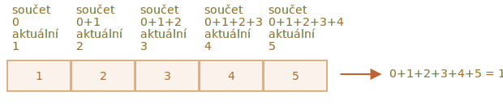

# Metody polí

Pole poskytují mnoho metod. Pro zjednodušení jsme je v této kapitole rozdělili do skupin.

## Přidávání a odebírání prvků

Známe už metody, které přidávají a odebírají prvky na začátku nebo na konci pole:

- `arr.push(...prvky)` -- přidává prvky na konec,
- `arr.pop()` -- vybírá prvek z konce,
- `arr.shift()` -- vybírá prvek ze začátku,
- `arr.unshift(...items)` -- přidává prvky na začátek.

Zde uvedeme několik dalších.

### splice

Jak smazat prvek z pole?

Pole jsou objekty, takže se můžeme pokusit použít `delete`:

```js run
let pole = ["Já", "jdu", "domů"];

delete pole[1]; // odstraníme "jdu"

alert( pole[1] ); // undefined

// nyní pole = ["Já",  , "domů"];
alert( pole.length ); // 3
```

Prvek byl odstraněn, ale pole má stále 3 prvky. Vidíme, že `pole.length == 3`.

To je přirozené, poněvadž `delete obj.klíč` odstraňuje hodnotu podle `klíč`. To je vše, co udělá. Pro objekty je to dobře. Ale u polí zpravidla chceme, aby se ostatní prvky posunuly a obsadily prázdné místo. Očekáváme, že nyní budeme mít kratší pole.

Měli bychom tedy použít speciální metody.

Metoda [pole.splice](mdn:js/Array/splice) je jako švýcarský nůž pro pole. Umí všechno: vkládat, odstraňovat i nahrazovat prvky.

Syntaxe je:

```js
pole.splice(začátek[, početSmazaných, prvek1, ..., prvekN])
```

Modifikuje `pole` od indexu `začátek`: napřed odstraní `početSmazaných` prvků a pak vloží na jejich místo `prvek1, ..., prvekN`. Vrátí pole odstraněných prvků.

Tato metoda je snadno pochopitelná na příkladech.

Začněme s mazáním:

```js run
let pole = ["Já", "studuji", "JavaScript"];

*!*
pole.splice(1, 1); // od indexu 1 odstraníme 1 prvek
*/!*

alert( pole ); // ["Já", "JavaScript"]
```

Snadné, že? Počínajíc indexem `1` metoda odstranila `1` prvek.

V dalším příkladu odstraníme 3 prvky a nahradíme je dvěma jinými:

```js run
let pole = [*!*"Já", "studuji", "JavaScript",*/!* "právě", "teď"];

// odstraníme první 3 prvky a nahradíme je dvěma jinými
pole.splice(0, 3, "Zatancujme", "si");

alert( pole ) // nyní [*!*"Zatancujme", "si"*/!*, "právě", "teď"]
```

Zde vidíme, že `splice` vrací pole odstraněných prvků:

```js run
let pole = [*!*"Já", "studuji",*/!* "JavaScript", "právě", "teď"];

// odstraníme první 2 prvky
let odstraněno = pole.splice(0, 2);

alert( odstraněno ); // "Já", "studuji" <-- pole odstraněných prvků
```

Metoda `splice` dokáže také vkládat prvky bez odstraňování. K tomu musíme nastavit `početSmazaných` na `0`:

```js run
let pole = ["Já", "studuji", "JavaScript"];

// od indexu 2
// smažeme 0
// pak vložíme "složitý" a "jazyk"
pole.splice(2, 0, "složitý", "jazyk");

alert( pole ); // "Já", "studuji", "složitý", "jazyk", "JavaScript"
```

````smart header="Záporné indexy jsou povoleny"
Zde i v jiných metodách polí jsou povoleny záporné indexy. Ty specifikují pozici od konce pole, například:

```js run
let pole = [1, 2, 5];

// od indexu -1 (jeden krok před koncem)
// smažeme 0 prvků,
// pak vložíme 3 a 4
pole.splice(-1, 0, 3, 4);

alert( pole ); // 1,2,3,4,5
```
````

### slice

Metoda [pole.slice](mdn:js/Array/slice) je mnohem jednodušší než podobně vypadající `pole.splice`.

Syntaxe je:

```js
pole.slice([začátek], [konec])
```

Vrátí nové pole, do něhož zkopíruje všechny prvky od indexu `začátek` do indexu `konec` (`konec` není zahrnut). Jak `začátek`, tak `konec` mohou být záporné. V tom případě se předpokládá pozice od konce pole.

Podobá se řetězcové metodě `str.slice`, ale místo podřetězců vytváří podpole.

Například:

```js run
let pole = ["t", "e", "s", "t"];

alert( pole.slice(1, 3) ); // e,s (kopíruje od 1 do 3)

alert( pole.slice(-2) ); // s,t (kopíruje od -2 do konce)
```

Můžeme ji volat i bez argumentů: `pole.slice()` vytvoří kopii `pole`. To se často používá k vytvoření kopie pro další transformace, které by neměly ovlivnit původní pole.

### concat

Metoda [pole.concat](mdn:js/Array/concat) vytvoří nové pole, které obsahuje hodnoty z jiných polí a další prvky.

Syntaxe je:

```js
pole.concat(arg1, arg2...)
```

Přijímá libovolný počet argumentů -- mohou jimi být pole nebo hodnoty.

Výsledkem je nové pole, které obsahuje prvky z `pole`, pak `arg1`, `arg2` atd.

Je-li argument `argN` pole, pak se zkopírují všechny jeho prvky. V opačném případě se zkopíruje sám argument.

Příklad:

```js run
let pole = [1, 2];

// vytvoříme pole z: pole a [3,4]
alert( pole.concat([3, 4]) ); // 1,2,3,4

// vytvoříme pole z: pole a [3,4] a [5,6]
alert( pole.concat([3, 4], [5, 6]) ); // 1,2,3,4,5,6

// vytvoříme pole z: pole a [3,4], pak přidáme hodnoty 5 a 6
alert( pole.concat([3, 4], 5, 6) ); // 1,2,3,4,5,6
```

Běžně kopíruje prvky jen z polí. Ostatní objekty, i ty, které vypadají jako pole, se přidají jako celek:

```js run
let pole = [1, 2];

let jakoPole = {
  0: "něco",
  length: 1
};

alert( pole.concat(jakoPole) ); // 1,2,[object Object]
```

...Jestliže však objekt podobný poli má speciální vlastnost `Symbol.isConcatSpreadable`, pak s ním metoda `concat` zachází jako s polem -- místo objektu se přidají jeho prvky:

```js run
let pole = [1, 2];

let jakoPole = {
  0: "něco",
  1: "jiného",
*!*
  [Symbol.isConcatSpreadable]: true,
*/!*
  length: 2
};

alert( pole.concat(jakoPole) ); // 1,2,něco,jiného
```

## Iterace: forEach

Metoda [pole.forEach](mdn:js/Array/forEach) umožňuje pro každý prvek pole volat zadanou funkci.

Syntaxe:
```js
pole.forEach(function(prvek, index, pole) {
  // ... provádí něco s prvkem
});
```

Například tohle zobrazí každý prvek pole:

```js run
// pro každý prvek volá alert
["Bilbo", "Gandalf", "Nazgúl"].forEach(alert);
```

A tento kód vypíše podrobnosti o pozicích prvků v cílovém poli:

```js run
["Bilbo", "Gandalf", "Nazgúl"].forEach((prvek, index, pole) => {
  alert(`${prvek} je na indexu ${index} v poli ${pole}`);
});
```

Výsledek funkce (pokud funkce nějaký vrátí) je zahozen a ignorován.


## Hledání v poli

Uveďme nyní metody, které prohledávají pole.

### indexOf/lastIndexOf a includes

Metody [pole.indexOf](mdn:js/Array/indexOf) a [pole.includes](mdn:js/Array/includes) mají podobnou syntaxi a dělají v zásadě totéž, jako jejich řetězcové protějšky, ale místo znaků pracují nad prvky pole:

- `pole.indexOf(prvek, odkud)` -- hledá `prvek` počínajíc indexem `odkud` a vrátí index, na němž byl prvek nalezen, anebo `-1`, když nalezen nebyl.
- `pole.includes(prvek, odkud)` -- hledá `prvek` počínajíc indexem `odkud` a vrátí `true`, pokud byl nalezen.

Tyto metody se obvykle používají jen s jedním argumentem: `prvek`, který se má hledat. Standardně se hledá od začátku pole.

Příklad:

```js run
let pole = [1, 0, false];

alert( pole.indexOf(0) ); // 1
alert( pole.indexOf(false) ); // 2
alert( pole.indexOf(null) ); // -1

alert( pole.includes(1) ); // true
```

Prosíme všimněte si, že metoda `indexOf` používá striktní porovnávání `===`. Hledáme-li tedy `false`, najde přesně `false` a ne nulu.

Chceme-li si jen ověřit, zda `prvek` je obsažen v poli, a nepotřebujeme jeho přesný index, dává se přednost metodě `pole.includes`.

Metoda [arr.lastIndexOf](mdn:js/Array/lastIndexOf) je totéž jako `indexOf`, ale hledá zprava doleva.

```js run
let ovoce = ['Jablko', 'Pomeranč', 'Jablko']

alert( ovoce.indexOf('Jablko') ); // 0 (první Jablko)
alert( ovoce.lastIndexOf('Jablko') ); // 2 (poslední Jablko)
```

````smart header="Metoda `includes` zpracovává správně `NaN`"
Drobný, ale zaznamenatelný rozdíl metody `includes` je také v tom, že na rozdíl od `indexOf` správně zpracovává `NaN`:

```js run
const pole = [NaN];
alert( pole.indexOf(NaN) ); // -1 (mělo by být 0, ale rovnost === pro NaN nefunguje)
alert( pole.includes(NaN) );// true (správně)
```
Je to proto, že `includes` byla do JavaScriptu přidána mnohem později a interně používá novější algoritmus porovnávání.
````

### find a findIndex/findLastIndex

Představme si, že máme pole objektů. Jak najdeme objekt, pro který platí specifická podmínka?

Tady se nám hodí metoda [pole.find(fn)](mdn:js/Array/find).

Syntaxe je:
```js
let výsledek = pole.find(function(prvek, index, pole) {
  // jestliže funkce vrátí true, bude vrácen prvek a iterace se zastaví
  // pokud funkce vrátí samá false, bude vráceno undefined
});
```

Funkce je volána na prvcích pole, na jednom po druhém:

- `prvek` je prvek.
- `index` je jeho index.
- `pole` je samotné pole.

Jestliže vrátí `true`, hledání se zastaví a vrátí se `prvek`. Není-li nic nalezeno, vrátí se `undefined`.

Například máme pole uživatelů, každý má vlastnosti `id` a `jméno`. Najděme toho, který má `id == 1`:

```js run
let uživatelé = [
  {id: 1, jméno: "Jan"},
  {id: 2, jméno: "Petr"},
  {id: 3, jméno: "Marie"}
];

let uživatel = uživatelé.find(prvek => prvek.id == 1);

alert(uživatel.jméno); // Jan
```

V reálném životě jsou pole objektů běžnou věcí, takže metoda `find` je velmi užitečná.

Všimněte si, že v tomto příkladu poskytujeme metodě `find` funkci `prvek => prvek.id == 1` s jedním argumentem. To je typické, ostatní argumenty této funkce se používají málokdy.

Metoda [pole.findIndex](mdn:js/Array/findIndex) má stejnou syntaxi, ale namísto samotného prvku vrací index, na němž byl prvek nalezen. Jestliže nebylo nalezeno nic, vrátí se hodnota `-1`.

Metoda [pole.findLastIndex](mdn:js/Array/findLastIndex) je podobná metodě `findIndex`, ale hledá zprava doleva, podobně jako `lastIndexOf`.

Příklad:

```js run
let uživatelé = [
  {id: 1, jméno: "Jan"},
  {id: 2, jméno: "Petr"},
  {id: 3, jméno: "Marie"},
  {id: 4, jméno: "Jan"}
];

// Najde index prvního Jana
alert(uživatelé.findIndex(uživatel => uživatel.jméno == 'Jan')); // 0

// Najde index posledního Jana
alert(uživatelé.findLastIndex(uživatel => uživatel.jméno == 'Jan')); // 3
```

### filter

Metoda `find` najde jediný (první) prvek, který způsobí, že funkce vrátí `true`.

Jestliže jich může být více, můžeme použít metodu [pole.filter(fn)](mdn:js/Array/filter).

Její syntaxe je podobná `find`, ale `filter` vrací pole všech odpovídajících prvků:

```js
let výsledky = pole.filter(function(prvek, index, pole) {
  // vrátí-li true, prvek se vloží metodou push do výsledků a iterace pokračuje
  // není-li nic nalezeno, je vráceno prázdné pole
});
```

Příklad:

```js run
let uživatelé = [
  {id: 1, jméno: "Jan"},
  {id: 2, jméno: "Petr"},
  {id: 3, jméno: "Marie"}
];

// vrátí pole prvních dvou uživatelů
let nějacíUživatelé = uživatelé.filter(prvek => prvek.id < 3);

alert(nějacíUživatelé.length); // 2
```

## Transformace polí

Přejděme nyní k metodám, které pole transformují a přeskupují.

### map

Metoda [pole.map](mdn:js/Array/map) je jedna z nejužitečnějších a používá se často.

Volá zadanou funkci pro každý prvek pole a vrací pole výsledků.

Syntaxe je:

```js
let výsledek = pole.map(function(prvek, index, pole) {
  // vrátí novou hodnotu místo prvku
});
```

Například zde přetransformujeme každý prvek na jeho délku:

```js run
let délky = ["Bilbo", "Gandalf", "Nazgúl"].map(prvek => prvek.length);
alert(délky); // 5,7,6
```

### sort(fn)

Volání metody [pole.sort()](mdn:js/Array/sort) seřadí pole *uvnitř* a změní pořadí jeho prvků.

Vrací také seřazené pole, ale návratová hodnota se obvykle ignoruje, jelikož je modifikováno samotné `pole`.

Příklad:

```js run
let pole = [ 1, 2, 15 ];

// metoda přehází obsah pole
pole.sort();

alert( pole );  // *!*1, 15, 2*/!*
```

Všimli jste si na výstupu něčeho divného?

Seřazené pole je `1, 15, 2`. To není správně. Ale proč?

**Prvky jsou standardně řazeny jako řetězce.**

Doslova všechny prvky se při porovnávání převádějí na řetězce. Pro řetězce se použije lexikografické řazení a skutečně `"2" > "15"`.

Abychom použili naše vlastní řazení, musíme jako argument `pole.sort()` poskytnout funkci.

Tato funkce by měla porovnávat dvě libovolné hodnoty a vracet:

```js
function porovnej(a, b) {
  if (a > b) return 1; // je-li první hodnota větší než druhá
  if (a == b) return 0; // jsou-li si hodnoty rovny
  if (a < b) return -1; // je-li první hodnota menší než druhá
}
```

Například když řadíme čísla:

```js run
function porovnejČísla(a, b) {
  if (a > b) return 1;
  if (a == b) return 0;
  if (a < b) return -1;
}

let pole = [ 1, 2, 15 ];

*!*
pole.sort(porovnejČísla);
*/!*

alert(pole);  // *!*1, 2, 15*/!*
```

Nyní to funguje tak, jak jsme zamýšleli.

Pojďme teď stranou a zamysleme se nad tím, co se děje. `pole` může být pole čehokoli, že? Může obsahovat čísla, řetězce, objekty, zkrátka cokoli. Máme sadu *nějakých prvků*. Abychom ji seřadili, potřebujeme *řadicí funkci*, která umí porovnat své prvky. Standardní řazení je řetězcové.

Metoda `pole.sort(fn)` implementuje generický algoritmus řazení. Nemusíme se zajímat o to, jak vnitřně funguje (většinou je to optimalizovaný [quicksort](https://cs.wikipedia.org/wiki/Rychlé_řazení) nebo [Timsort](https://en.wikipedia.org/wiki/Timsort)). Projde pole, porovná jeho prvky poskytnutou funkcí a seřadí je. Vše, co potřebujeme, je poskytnout funkci `fn`, která provede porovnání.

Mimochodem, jestliže chceme vědět, které prvky se porovnávají -- nic nám nebrání je zobrazit:

```js run
[1, -2, 15, 2, 0, 8].sort(function(a, b) {
  alert( a + " <> " + b );
  return a - b;
});
```

Algoritmus může v tomto procesu porovnat jeden prvek s několika jinými, ale snaží se učinit co nejméně porovnání.

````smart header="Porovnávací funkce může vracet číslo"
Ve skutečnosti se od porovnávací funkce vyžaduje jen to, aby vrátila kladné číslo, když říká „větší“, a záporné, když říká „menší“.

To nám umožňuje psát kratší funkce:

```js run
let pole = [ 1, 2, 15 ];

pole.sort(function(a, b) { return a - b; });

alert(pole);  // *!*1, 2, 15*/!*
```
````

````smart header="Nejlepší jsou šipkové funkce"
Vzpomínáte si na [šipkové funkce](info:arrow-functions-basics)? Můžeme je zde použít pro úhlednější řazení:

```js
pole.sort( (a, b) => a - b );
```

Funguje to přesně stejně jako výše uvedená delší verze.
````

````smart header="Pro řetězce používejte `localeCompare`"
Vzpomínáte si na porovnávací algoritmus [pro řetězce](info:string#correct-comparisons)? Standardně porovnává písmena podle jejich kódů.

Pro mnoho abeced je lepší používat metodu `str.localeCompare`, která seřadí správně písmena, např. `Č`.

Například seřaďme několik států v češtině:

```js run
let státy = ['Česko', 'Andorra', 'Vietnam'];

alert( státy.sort( (a, b) => a > b ? 1 : -1) ); // Andorra, Vietnam, Česko (špatně)

alert( státy.sort( (a, b) => a.localeCompare(b) ) ); // Andorra, Česko, Vietnam (správně!)
```
````

### reverse

Metoda [pole.reverse](mdn:js/Array/reverse) převrátí pořadí prvků `pole`.

Příklad:

```js run
let pole = [1, 2, 3, 4, 5];
pole.reverse();

alert( pole ); // 5,4,3,2,1
```

I ona vrací `pole` po převrácení.

### split a join

Máme zde situaci z běžného života. Píšeme aplikaci pro posílání zpráv a uživatel zadá seznam příjemců oddělených čárkou: `Jan, Petr, Marie`. Pro nás by však bylo daleko pohodlnější mít pole jmen než jediný řetězec. Jak je získat?

Přesně tohle dělá metoda [str.split(oddělovač)](mdn:js/String/split), která rozdělí řetězec na pole podle zadaného oddělovače `oddělovač`.

V níže uvedeném příkladu jsme oddělovali čárkou, po níž následuje mezera:

```js run
let jména = 'Bilbo, Gandalf, Nazgúl';

let pole = jména.split(', ');

for (let jméno of pole) {
  alert( `Zpráva pro ${jméno}.` ); // Zpráva pro Bilbo (a další jména)
}
```

Metoda `split` má nepovinný druhý číselný argument -- limit délky pole. Pokud je uveden, pak se po dosažení tohoto limitu další prvky ignorují. V praxi se však používá jen zřídka:

```js run
let pole = 'Bilbo, Gandalf, Nazgúl, Saruman'.split(', ', 2);

alert(pole); // Bilbo, Gandalf
```

````smart header="Rozdělení na písmena"
Volání `split(s)` s prázdným `s` rozdělí řetězec na pole písmen:

```js run
let str = "test";

alert( str.split('') ); // t,e,s,t
```
````

Volání [pole.join(spojka)](mdn:js/Array/join) provádí opak metody `split`. Vytvoří řetězec z prvků `pole`, které budou spojeny řetězcem `spojka` mezi nimi.

Příklad:

```js run
let pole = ['Bilbo', 'Gandalf', 'Nazgúl'];

let str = pole.join(';'); // spojíme pole do řetězce pomocí ;

alert( str ); // Bilbo;Gandalf;Nazgúl
```

### reduce/reduceRight

Když potřebujeme procházet prvky pole -- můžeme použít `forEach`, `for` nebo `for..of`.

Když potřebujeme procházet prvky a pro každý prvek vrátit nějaká data -- můžeme použít `map`.

Do této skupiny patří i metody [pole.reduce](mdn:js/Array/reduce) a [pole.reduceRight](mdn:js/Array/reduceRight), ale ty jsou trochu záludnější. Používají se k výpočtu jediné hodnoty v závislosti na poli.

Syntaxe je:

```js
let hodnota = pole.reduce(function(akumulátor, prvek, index, pole) {
  // ...
}, [počátečníHodnota]);
```

Funkce se volá na všech prvcích pole za sebou a „přenáší“ svůj výsledek do dalšího volání.

Argumenty:

- `akumulátor` -- výsledek předchozího volání funkce, napoprvé se rovná `počátečníHodnota` (je-li `počátečníHodnota` uvedena).
- `prvek` -- je aktuální prvek pole.
- `index` -- je jeho pozice.
- `pole` -- je pole.

Poté, co je funkce provedena, se výsledek předchozího volání funkce předá jako první argument v dalším volání.

První argument je tedy v podstatě akumulátor, do něhož se ukládá kombinovaný výsledek ze všech předchozích volání. Nakonec se stane výsledkem funkce `reduce`.

Zní to složitě?

Nejjednodušší způsob, jak to pochopit, je příklad.

Zde získáme součet celého pole na jediném řádku:

```js run
let pole = [1, 2, 3, 4, 5];

let výsledek = pole.reduce((součet, aktuální) => součet + aktuální, 0);

alert(výsledek); // 15
```

Funkce předaná do `reduce` používá jen 2 argumenty, to zpravidla stačí.

Podívejme se na podrobnosti toho, co se děje.

1. Při prvním průběhu je `součet` roven hodnotě `počátečníHodnota` (poslední argument `reduce`), tedy `0`, a `aktuální` je první prvek pole, tedy `1`. Výsledek funkce je tedy `1`.
2. Při druhém průběhu `součet = 1`, přičteme k tomu druhý prvek pole (`2`) a vrátíme výsledek.
3. Při třetím průběhu `součet = 3`, přičteme k tomu další prvek, a tak dále...

Tok výpočtu:



Nebo ve formě tabulky, v níž každý řádek představuje volání funkce na dalším prvku pole:

|   |`součet`|`aktuální`|výsledek|
|---|-----|---------|---------|
|první volání|`0`|`1`|`1`|
|druhé volání|`1`|`2`|`3`|
|třetí volání|`3`|`3`|`6`|
|čtvrté volání|`6`|`4`|`10`|
|páté volání|`10`|`5`|`15`|

Tady jasně vidíme, jak se výsledek předchozího volání stává prvním argumentem následujícího.

Můžeme také vypustit počáteční hodnotu:

```js run
let pole = [1, 2, 3, 4, 5];

// z reduce je odstraněna počáteční hodnota (žádná 0)
let výsledek = pole.reduce((součet, aktuální) => součet + aktuální);

alert( výsledek  ); // 15
```

Výsledek je stejný. Je to proto, že není-li uvedena počáteční hodnota, `reduce` vezme jako počáteční hodnotu první prvek pole a zahájí iteraci až od druhého.

Výpočetní tabulka je stejná jako výše uvedená, jen bez prvního řádku.

Takové použití však vyžaduje extrémní pozornost. Je-li pole prázdné, pak volání `reduce` bez počáteční hodnoty ohlásí chybu.

Příklad:

```js run
let pole = [];

// Chyba: Reduce of empty array with no initial value
// kdyby počáteční hodnota existovala, reduce by pro prázdné pole vrátila ji.
pole.reduce((součet, aktuální) => součet + aktuální);
```

Doporučuje se tedy počáteční hodnotu vždy uvádět.

Metoda [pole.reduceRight](mdn:js/Array/reduceRight) dělá totéž, ale postupuje zprava doleva.

## Array.isArray

Pole netvoří samostatný jazykový typ, ale jsou založena na objektech.

Proto `typeof` nedokáže rozlišit planý objekt od pole:

```js run
alert(typeof {}); // object
alert(typeof []); // totéž
```

...Pole se však používají natolik často, že pro ně existuje speciální metoda: [Array.isArray(hodnota)](mdn:js/Array/isArray). Vrátí `true`, jestliže `hodnota` je pole, a `false` jinak.

```js run
alert(Array.isArray({})); // false

alert(Array.isArray([])); // true
```

## Většina metod podporuje „thisArg“

Téměř všechny metody polí, které volají funkce -- např. `find`, `filter`, `map`, s významnou výjimkou metody `sort`, přijímají nepovinný další parametr `thisArg`.

Tento parametr nebyl vysvětlen ve výše uvedených podkapitolách, protože se používá jen zřídka. Ale pro úplnost jej musíme uvést.

Zde je plná syntaxe těchto metod:

```js
pole.find(funkce, thisArg);
pole.filter(funkce, thisArg);
pole.map(funkce, thisArg);
// ...
// thisArg je nepovinný poslední argument
```

Hodnota parametru `thisArg` se ve funkci `funkce` stane `this`.

Například zde použijeme metodu objektu `armáda` jako filtr a `thisArg` předá kontext:

```js run
let armáda = {
  minVěk: 18,
  maxVěk: 27,
  můžeVstoupit(uživatel) {
    return uživatel.věk >= this.minVěk && uživatel.věk < this.maxVěk;
  }
};

let uživatelé = [
  {věk: 16},
  {věk: 20},
  {věk: 23},
  {věk: 30}
];

*!*
// najdeme uživatele, pro které armáda.můžeVstoupit vrátí true
let vojáci = uživatelé.filter(armáda.můžeVstoupit, armáda);
*/!*

alert(vojáci.length); // 2
alert(vojáci[0].věk); // 20
alert(vojáci[1].věk); // 23
```

Kdybychom v uvedeném příkladu použili `uživatelé.filter(armáda.můžeVstoupit)`, pak by `armáda.můžeVstoupit` byla volána jako samostatná funkce, v níž by bylo `this=undefined`, což by okamžitě vedlo k chybě.

Volání `uživatelé.filter(armáda.můžeVstoupit, armáda)` můžeme nahradit za `uživatelé.filter(uživatel => armáda.můžeVstoupit(uživatel))`, které by udělalo totéž. Tato druhá varianta se používá častěji, jelikož pro většinu lidí je trochu srozumitelnější.

## Shrnutí

Přehled metod polí:

- Pro přidávání a odebírání prvků:
  - `push(...prvky)` -- přidá prvky na konec.
  - `pop()` -- vyjme prvek z konce.
  - `shift()` -- vyjme prvek ze začátku.
  - `unshift(...prvky)` -- přidá prvky na začátek.
  - `splice(pozice, početSmazaných, ...prvky)` -- na indexu `pozice` smaže `početSmazaných` prvků a vloží `prvky`.
  - `slice(začátek, konec)` -- vytvoří nové pole, zkopíruje do něj prvky od indexu `začátek` do indexu `konec` (kromě něj).
  - `concat(...prvky)` -- vrátí nové pole: zkopíruje všechny prvky z aktuálního pole a přidá do něj `prvky`. Je-li kterýkoli prvek z `prvky` pole, pak se vezmou jeho prvky.

- Pro hledání mezi prvky:
  - `indexOf/lastIndexOf(prvek, pozice)` -- hledá `prvek` počínajíc pozicí `pozice`, vrátí jeho index nebo `-1`, pokud není nalezen.
  - `includes(hodnota)` -- jestliže pole obsahuje hodnotu `hodnota`, vrátí `true`, jinak vrátí `false`.
  - `find/filter(funkce)` -- filtruje prvky podle zadané funkce, vrátí první hodnotu/všechny hodnoty, na níž/nichž funkce vrátila `true`.
  - `findIndex` je jako `find`, ale namísto hodnoty vrátí index.

- Pro procházení prvků:
  - `forEach(funkce)` -- volá `funkce` pro každý prvek, nic nevrací.

- Pro transformaci pole:
  - `map(funkce)` -- vytvoří nové pole z výsledků volání `funkce` pro každý prvek.
  - `sort(funkce)` -- seřadí prvky uvnitř pole, pak toto pole vrátí.
  - `reverse()` -- převrátí pořadí prvků uvnitř pole, pak toto pole vrátí.
  - `split/join` -- převádí řetězec na pole a zpět.
  - `reduce/reduceRight(funkce, počátečníHodnota)` -- vypočítá z pole jedinou hodnotu tak, že volá `funkce` pro každý prvek a předává mezivýsledek mezi voláními.

- Ostatní:
  - `Array.isArray(pole)` ověří, zda `pole` je pole.

Prosíme všimněte si, že metody `sort`, `reverse` a `splice` modifikují samotné pole.

Tyto metody jsou nejpoužívanější a v 99% případů dostačují. Existuje však i několik dalších:

- [pole.some(fn)](mdn:js/Array/some)/[pole.every(fn)](mdn:js/Array/every) prověří pole.

  Na každém prvku pole je volána funkce `fn`, podobně jako u funkce `map`. Jestliže některý výsledek je/všechny výsledky jsou `true`, vrátí `true`, jinak vrátí `false`.

  Tyto metody se chovají trochu jako operátory `||` a `&&`: jestliže `fn` vrátí pravdivou hodnotu, `pole.some()` okamžitě vrátí `true` a zastaví procházení zbývajících prvků; jestliže `fn` vrátí nepravdivou hodnotu, `pole.every()` okamžitě vrátí `false` a rovněž zastaví procházení zbývajících prvků.

  Pomocí `every` můžeme porovnávat pole:
  
  ```js run
  function poleSeRovnají(pole1, pole2) {
    return pole1.length === pole2.length && pole1.every((hodnota, index) => hodnota === pole2[index]);
  }

  alert( poleSeRovnají([1, 2], [1, 2])); // true
  ```

- [pole.fill(hodnota, začátek, konec)](mdn:js/Array/fill) -- vyplní pole opakující se hodnotou `hodnota` od indexu `začátek` do indexu `konec`.

- [pole.copyWithin(cíl, začátek, konec)](mdn:js/Array/copyWithin) -- zkopíruje prvky pole od pozice `začátek` do pozice `konec` *do téhož pole* na pozici `cíl` (existující prvky přepíše).

- [pole.flat(hloubka)](mdn:js/Array/flat)/[pole.flatMap(fn)](mdn:js/Array/flatMap) vytvoří nové jednorozměrné pole z vícerozměrného.

Pro úplný seznam viz [manuál](mdn:js/Array).

Na první pohled se může zdát, že je tady spousta metod a je těžké si je pamatovat. Ve skutečnosti je to však mnohem snazší.

Projděte si přehled metod, abyste o nich věděli. Pak vyřešte úlohy v této kapitole, abyste se pocvičili. Tak získáte s metodami polí zkušenosti.

Když později budete potřebovat udělat něco s polem a nebudete vědět jak -- přijďte sem, podívejte se do přehledu a najděte správnou metodu. Příklady vám pomohou napsat ji správně. Brzy si budete metody automaticky pamatovat, aniž by vás to stálo nějakou zvláštní námahu.
