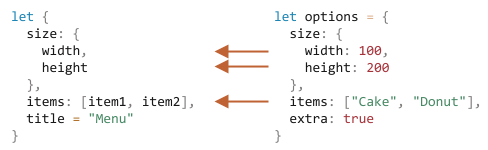

# Destrukturační přiřazení

Dvě nejpoužívanější datové struktury v JavaScriptu jsou objekty a pole.

- Objekty nám umožňují vytvořit jednoduchou entitu, v níž jsou datové prvky uloženy pod klíči.
- Pole nám umožňují shromáždit datové prvky do seřazeného seznamu.

Když je však předáváme nějaké funkci, nemusíme je potřebovat celé. Funkce může požadovat jen určité prvky nebo vlastnosti.

*Destrukturační přiřazení* je speciální syntaxe, která nám umožňuje „rozbalit“ pole nebo objekty do svazku proměnných, což bývá někdy vhodnější.

Destrukturace také skvěle funguje se složitými funkcemi, které mají spoustu parametrů, standardní hodnoty a tak dále. Brzy to uvidíme.

## Destrukturace polí

Zde je příklad, jak je pole destrukturováno do proměnných:

```js
// máme pole obsahující jméno a příjmení
let pole = ["Jan", "Novák"]

*!*
// destrukturační přiřazení
// nastaví křestníJméno = pole[0]
// a příjmení = pole[1]
let [křestníJméno, příjmení] = pole;
*/!*

alert(křestníJméno); // Jan
alert(příjmení);  // Novák
```

Nyní můžeme místo s prvky pole pracovat s proměnnými.

Vypadá to výborně, když to zkombinujeme se `split` nebo jinými metodami vracejícími pole:

```js run
let [křestníJméno, příjmení] = "Jan Novák".split(' ');
alert(křestníJméno); // Jan
alert(příjmení);  // Novák
```

Jak vidíte, syntaxe je jednoduchá. Je tady však několik zvláštních detailů. Podíváme se na další příklady, abychom tomu lépe porozuměli.

````smart header="„Destrukturace“ neznamená „destrukce“"
Tato technika se nazývá „destrukturační přiřazení“, protože provádí „destrukturaci“ kopírováním prvků do proměnných. Samotné pole se však nemění.

Je to jen kratší způsob, jak napsat:
```js
// let [křestníJméno, příjmení] = pole;
let křestníJméno = pole[0];
let příjmení = pole[1];
```
````

````smart header="Ignorování prvků pomocí čárek"
Nechtěné prvky pole můžeme zahodit přidáním čárky:

```js run
*!*
// druhý prvek nepotřebujeme
let [křestníJméno, , titul] = ["Julius", "Caesar", "Konzul", "Římské republiky"];
*/!*

alert( titul ); // Konzul
```

V uvedeném kódu byl druhý prvek pole přeskočen, třetí přiřazen do proměnné `titul` a ostatní prvky pole byly také přeskočeny (protože pro ně nejsou uvedeny žádné proměnné).
````

````smart header="Funguje s libovolným iterovatelným objektem na pravé straně"

...Ve skutečnosti můžeme destrukturační přiřazení použít na libovolný iterovatelný objekt, nejenom na pole:

```js
let [a, b, c] = "abc"; // ["a", "b", "c"]
let [jedna, dvě, tři] = new Set([1, 2, 3]);
```
To funguje, protože vnitřně se destrukturační přiřazení vykonává iterací nad hodnotou vpravo. Je to určitý druh syntaktického cukru pro volání `for..of` nad hodnotou vpravo od `=` a přiřazení hodnot.
````


````smart header="Na levé straně můžeme přiřazovat do čehokoli"
Na levé straně můžeme používat cokoli, do čeho lze přiřazovat.

Například vlastnost objektu:
```js run
let uživatel = {};
[uživatel.křestníJméno, uživatel.příjmení] = "Jan Novák".split(' ');

alert(uživatel.křestníJméno); // Jan
alert(uživatel.příjmení); // Novák
```

````

````smart header="Cyklus pomocí .entries()"
V předchozí kapitole jsme viděli metodu [Object.entries(obj)](mdn:js/Object/entries).

Můžeme ji používat společně s destrukturací k procházení dvojic klíčů a hodnot objektu:

```js run
let uživatel = {
  jméno: "Jan",
  věk: 30
};

// cyklus nad dvojicemi klíč-hodnota
*!*
for (let [klíč, hodnota] of Object.entries(uživatel)) {
*/!*
  alert(`${klíč}:${hodnota}`); // jméno:Jan, poté věk:30
}
```

Podobný kód pro `Map` je jednodušší, protože mapa je iterovatelná:

```js run
let uživatel = new Map();
uživatel.set("jméno", "Jan");
uživatel.set("věk", "30");

*!*
// Map iteruje nad dvojicemi [klíč, hodnota], což je velmi vhodné pro destrukturaci
for (let [klíč, hodnota] of uživatel) {
*/!*
  alert(`${klíč}:${hodnota}`); // jméno:Jan, poté věk:30
}
```
````

````smart header="Trik pro výměnu proměnných"
Existuje dobře známý trik pro výměnu hodnot dvou proměnných použitím destrukturačního přiřazení:

```js run
let host = "Jana";
let správce = "Petr";

// Vyměníme hodnoty: učiníme host=Petr, správce=Jana
*!*
[host, správce] = [správce, host];
*/!*

alert(`${host} ${správce}`); // Petr Jana (úspěšně vyměněno!)
```

Zde jsme vytvořili dočasné pole dvou proměnných a okamžitě je destrukturovali v obráceném pořadí.

Tímto způsobem můžeme vyměnit i více než dvě proměnné.
````

### Zbytek „...“

Jestliže je pole delší než seznam nalevo, „přebývající“ prvky jsou obvykle vypuštěny.

Například zde se vezmou jen první dva prvky a ostatní se jednoduše ignorují:

```js run
let [jméno1, jméno2] = ["Julius", "Caesar", "Konzul", "Římské republiky"];

alert(jméno1); // Julius
alert(jméno2); // Caesar
// Další prvky již nejsou nikam přiřazeny
```

Kdybychom chtěli shromáždit i to, co následuje, můžeme přidat jeden další parametr, do něhož se uloží „zbytek“, pomocí tří teček `"..."`:

```js run
let [jméno1, jméno2, *!*...zbytek*/!*] = ["Julius", "Caesar", *!*"Konzul", "Římské republiky"*/!*];

*!*
// zbytek je pole prvků počínaje třetím
alert(zbytek[0]); // Konzul
alert(zbytek[1]); // Římské republiky
alert(zbytek.length); // 2
*/!*
```

Hodnota proměnné `zbytek` je pole zbývajících prvků pole.

Místo `zbytek` můžeme použít jakékoli jméno proměnné, jen musíme zajistit, aby před ním byly tři tečky a aby bylo v destrukturačním přiřazení uvedeno jako poslední.

```js run
let [jméno1, jméno2, *!*...tituly*/!*] = ["Julius", "Caesar", "Konzul", "Římské republiky"];
// nyní tituly = ["Konzul", "Římské republiky"]
```

### Standardní hodnoty

Pokud je pole kratší než seznam proměnných nalevo, nedojde k chybě. Neuvedené hodnoty se považují za nedefinované:

```js run
*!*
let [křestníJméno, příjmení] = [];
*/!*

alert(křestníJméno); // undefined
alert(příjmení); // undefined
```

Chceme-li, aby chybějící hodnoty nahradila nějaká „standardní“ hodnota, můžeme ji uvést pomocí `=`:

```js run
*!*
// standardní hodnoty
let [jméno = "Host", příjmení = "Anonym"] = ["Julius"];
*/!*

alert(jméno);    // Julius (z pole)
alert(příjmení); // Anonym (použita standardní hodnota)
```

Standardními hodnotami mohou být i složitější výrazy nebo dokonce volání funkcí. Vyhodnocují se jen tehdy, když hodnota není poskytnuta.

Například zde použijeme pro dvě standardní hodnoty funkci `prompt`:

```js run
// spustí prompt jen pro příjmení
let [jméno = prompt('jméno?'), příjmení = prompt('příjmení?')] = ["Julius"];

alert(jméno);    // Julius (z pole)
alert(příjmení); // to, co vrátil prompt
```

Prosíme všimněte si: `prompt` se spustí jen pro chybějící hodnotu (`příjmení`).

## Destrukturace objektů

Destrukturační přiřazení funguje i pro objekty.

Základní syntaxe je:

```js
let {proměnná1, proměnná2} = {proměnná1:…, proměnná2:…}
```

Na pravé straně bychom měli mít existující objekt, který chceme rozdělit do proměnných. Levá strana obsahuje objektu podobný „vzor“ pro odpovídající vlastnosti. V nejjednodušším případě je to seznam názvů proměnných v `{...}`.

Příklad:

```js run
let možnosti = {
  titulek: "Menu",
  šířka: 100,
  výška: 200
};

*!*
let {titulek, šířka, výška} = možnosti;
*/!*

alert(titulek); // Menu
alert(šířka);   // 100
alert(výška);   // 200
```

Vlastnosti `možnosti.titulek`, `možnosti.šířka` a `možnosti.výška` jsou přiřazeny do příslušných proměnných.

Na pořadí nezáleží. Tohle bude fungovat také:

```js
// změníme pořadí v let {...}
let {výška, šířka, titulek} = { titulek: "Menu", výška: 200, šířka: 100 }
```

Vzor na levé straně může být složitější a může specifikovat mapování mezi vlastnostmi a proměnnými.

Chceme-li přiřadit vlastnost do proměnné s jiným názvem, např. přiřadit `možnosti.šířka` do proměnné jménem `š`, pak můžeme nastavit jméno proměnné za dvojtečkou:

```js run
let možnosti = {
  titulek: "Menu",
  šířka: 100,
  výška: 200
};

*!*
// { zdrojováVlastnost: cílováProměnná }
let {šířka: š, výška: v, titulek} = možnosti;
*/!*

// šířka -> š
// výška -> v
// titulek -> titulek

alert(titulek); // Menu
alert(š);       // 100
alert(v);       // 200
```

Dvojtečka ukazuje, „co : jde kam“. V uvedeném příkladu vlastnost `šířka` jde do `š`, vlastnost `výška` jde do `v` a `titulek` se přiřadí do proměnné se stejným názvem.

Pro vlastnosti, které mohou chybět, můžeme nastavit standardní hodnoty pomocí `"="` takto:

```js run
let možnosti = {
  titulek: "Menu"
};

*!*
let {šířka = 100, výška = 200, titulek} = možnosti;
*/!*

alert(titulek);  // Menu
alert(šířka);    // 100
alert(výška);    // 200
```

Stejně jako u polí nebo parametrů funkcí mohou standardní hodnoty být libovolné výrazy nebo dokonce volání funkcí. Budou vyhodnoceny jen tehdy, když hodnota nebude poskytnuta.

V následujícím kódu se `prompt` zeptá na proměnnou `šířka`, ale ne na `titulek`:

```js run
let možnosti = {
  titulek: "Menu"
};

*!*
let {šířka = prompt("šířka?"), titulek = prompt("titulek?")} = možnosti;
*/!*

alert(titulek); // Menu
alert(šířka);   // (to, co vrátil prompt)
```

Můžeme také zkombinovat dvojtečku a rovnítko:

```js run
let možnosti = {
  titulek: "Menu"
};

*!*
let {šířka: š = 100, výška: v = 200, titulek} = možnosti;
*/!*

alert(titulek);  // Menu
alert(š);        // 100
alert(v);        // 200
```

Máme-li složitý objekt s mnoha vlastnostmi, můžeme vytáhnout jen ty, které potřebujeme:

```js run
let možnosti = {
  titulek: "Menu",
  šířka: 100,
  výška: 200
};

// do proměnné vyjmeme jen titulek
let { titulek } = možnosti;

alert(titulek); // Menu
```

### Zbytkový vzor „...“

Co když má objekt více vlastností, než my máme proměnných? Můžeme některé z nich vzít a „zbytek“ někam přiřadit?

Můžeme použít zbytkový vzor, stejně jako jsme to udělali u polí. Některé starší prohlížeče to nepodporují (IE, jako polyfill použijte Babel), ale v moderních to funguje.

Vypadá to takto:

```js run
let možnosti = {
  titulek: "Menu",
  výška: 200,
  šířka: 100
};

*!*
// titulek = vlastnost nazvaná titulek
// zbytek = objekt s ostatními vlastnostmi
let {titulek, ...zbytek} = možnosti;
*/!*

// nyní titulek="Menu", zbytek={výška: 200, šířka: 100}
alert(zbytek.výška); // 200
alert(zbytek.šířka); // 100
```

````smart header="Chyták při neuvedení `let`"
Ve výše uvedených příkladech jsme proměnné deklarovali přímo při přiřazení: `let {…} = {…}`. Můžeme samozřejmě použít i existující proměnné bez uvedení `let`. Je tady však chyták.

Tohle nebude fungovat:
```js run
let titulek, šířka, výška;

// na tomto řádku je chyba
{titulek, šířka, výška} = {titulek: "Menu", šířka: 200, výška: 100};
```

Problém je v tom, že JavaScript zachází s `{...}` v hlavním kódu (ne uvnitř jiného výrazu) jako s kódovým blokem. Takové kódové bloky můžeme používat k seskupení příkazů, například:

```js run
{
  // kódový blok
  let zpráva = "Ahoj";
  // ...
  alert( zpráva );
}
```

Zde tedy JavaScript předpokládá, že máme kódový blok, což je důvod, proč nastane chyba. My místo toho chceme destrukturaci.

Abychom sdělili JavaScriptu, že tohle není kódový blok, můžeme uzavřít výraz do závorek `(...)`:

```js run
let titulek, šířka, výška;

// nyní je to v pořádku
*!*(*/!*{titulek, šířka, výška} = {titulek: "Menu", šířka: 200, výška: 100}*!*)*/!*;

alert( titulek ); // Menu
```
````

## Vnořená destrukturace

Jestliže objekt nebo pole obsahuje jiné vnořené objekty a pole, můžeme vyjmout hlubší části pomocí složitějších vzorů na levé straně.

V následujícím kódu objekt `možnosti` obsahuje jiný objekt ve vlastnosti `velikost` a pole ve vlastnosti `prvky`. Vzor na levé straně přiřazení má stejnou strukturu jako objekt, z něhož vybíráme hodnoty:

```js run
let možnosti = {
  velikost: {
    šířka: 100,
    výška: 200
  },
  prvky: ["Koláč", "Vdolek"],
  extra: true   
};

// destrukturační přiřazení, pro čitelnost rozdělené do více řádků
let {
  velikost: { // zde uvedeme velikost
    šířka,
    výška
  },
  prvky: [prvek1, prvek2], // zde přiřadíme prvky
  titulek = "Menu" // v objektu není přítomen (použije se standardní hodnota)
} = možnosti;

alert(titulek); // Menu
alert(šířka);   // 100
alert(výška);   // 200
alert(prvek1);  // Koláč
alert(prvek2);  // Vdolek
```

Do příslušných proměnných se přiřadí všechny vlastnosti objektu `možnosti` s výjimkou `extra`, která v levé části chybí:



Nakonec tedy máme `šířka`, `výška`, `prvek1`, `prvek2` a `titulek` ze standardní hodnoty.

Všimněte si, že zde nejsou žádné proměnné pro `velikost` a `prvky`, jelikož jsme místo nich vzali jejich obsah.

## Chytré funkční parametry

Stává se, že funkce má mnoho parametrů a většina z nich je nepovinná. To platí zejména pro uživatelská rozhraní. Představte si funkci, která vytváří menu. Může obsahovat šířku, výšku, titulek, seznam prvků a podobně.

Zde je špatný způsob, jak takovou funkci napsat:

```js
function zobrazMenu(titulek = "Bez názvu", šířka = 200, výška = 100, prvky = []) {
  // ...
}
```

Problém v reálném životě spočívá v tom, jak si pamatovat pořadí argumentů. IDE se nám s tím obvykle snaží pomoci, zvláště je-li kód dobře dokumentován, ale i tak... Další problém je v tom, jak volat funkci, když u většiny parametrů chceme ponechat standardní hodnoty.

Takhle?

```js
// undefined tam, kde se má použít standardní hodnota
zobrazMenu("Moje menu", undefined, undefined, ["Prvek1", "Prvek2"])
```

To je ošklivé. A když budeme pracovat s více parametry, bude to nečitelné.

Destrukturace nás přichází zachránit!

Můžeme předávat parametry jako objekt a funkce je okamžitě destrukturuje do proměnných:

```js run
// předáme objekt do funkce
let možnosti = {
  titulek: "Moje menu",
  prvky: ["Prvek1", "Prvek2"]
};

// ...a ta jej okamžitě rozdělí do proměnných
function zobrazMenu(*!*{titulek = "Bez názvu", šířka = 200, výška = 100, prvky = []}*/!*) {
  // titulek, prvky – převzaty z objektu možnosti,
  // šířka, výška – použity standardní hodnoty
  alert( `${titulek} ${šířka} ${výška}` ); // Moje menu 200 100
  alert( prvky ); // Prvek1,Prvek2
}

zobrazMenu(možnosti);
```

S vnořenými objekty a dvojtečkovým mapováním můžeme použít i složitější destrukturaci:

```js run
let možnosti = {
  titulek: "Moje menu",
  prvky: ["Prvek1", "Prvek2"]
};

*!*
function zobrazMenu({
  titulek = "Bez názvu",
  šířka: š = 100, // šířka jde do š
  výška: v = 200, // výška jde do v
  prvky: [prvek1, prvek2] // první prvek pole prvky jde do prvek1, druhý do prvek2
}) {
*/!*
  alert( `${titulek} ${š} ${v}` ); // Moje menu 100 200
  alert( prvek1 ); // Prvek1
  alert( prvek2 ); // Prvek2
}

zobrazMenu(možnosti);
```

Úplná syntaxe je stejná jako u destrukturačního přiřazení:
```js
function({
  vstupujícíVlastnost: názevProměnné = standardníHodnota
  ...
})
```

Pro objekt parametrů pak budeme mít pro vlastnost `vstupujícíVlastnost` proměnnou `názevProměnné` , jejíž standardní hodnotou bude `standardníHodnota`.

Prosíme všimněte si, že taková destrukturace předpokládá, že `zobrazMenu()` má argument. Chceme-li všechny hodnoty standardní, měli bychom uvést prázdný objekt:

```js
zobrazMenu({}); // ok, všechny hodnoty jsou standardní

zobrazMenu(); // tohle ohlásí chybu
```

To můžeme opravit tak, že učiníme `{}` standardní hodnotou celého objektu parametrů:

```js run
function zobrazMenu({ titulek = "Menu", šířka = 100, výška = 200 }*!* = {}*/!*) {
  alert( `${titulek} ${šířka} ${výška}` );
}

zobrazMenu(); // Menu 100 200
```

V uvedeném kódu je celý argumentový objekt standardně `{}`, takže vždy bude co destrukturovat.

## Shrnutí

- Destrukturační přiřazení umožňuje rychlé mapování objektu nebo pole do mnoha proměnných.
- Úplná syntaxe pro objekt:
    ```js
    let {vlastnost : názevProměnné = standardníHodnota, ...zbytek} = objekt
    ```

    To znamená, že vlastnost `vlastnost` má přijít do proměnné `názevProměnné`, a pokud taková vlastnost neexistuje, měla by se použít hodnota `standardníHodnota`.

    Objektové vlastnosti, pro které není uvedeno mapování, se zkopírují do objektu `zbytek`.

- Úplná syntaxe pro pole:

    ```js
    let [prvek1 = standardníHodnota, prvek2, ...zbytek] = pole
    ```

    První prvek se uloží do proměnné `prvek1`, druhý do `prvek2`, ze všech ostatních prvků se vytvoří pole `zbytek`.

- Je možné extrahovat data z vnořených polí nebo objektů. V tom případě musí mít levá strana stejnou strukturu jako pravá.
