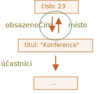

# Metody JSON, toJSON

Dejme tomu, že máme složitý objekt a rádi bychom jej konvertovali na řetězec, abychom jej poslali po síti nebo ho jen vypsali pro účely logování.

Samozřejmě by takový řetězec měl obsahovat všechny důležité vlastnosti.

Můžeme implementovat konverzi například takto:

```js run
let uživatel = {
  jméno: "Jan",
  věk: 30,

*!*
  toString() {
    return `{jméno: "${this.jméno}", věk: ${this.věk}}`;
  }
*/!*
};

alert(uživatel); // {jméno: "Jan", věk: 30}
```

...Během procesu vývoje se však přidávají nové vlastnosti, staré se přejmenovávají a odstraňují. Pokaždé měnit takový `toString` by mohlo být bolestivé. Mohli bychom se pokusit vytvořit cyklus nad vlastnostmi, ale co když je objekt složitý a obsahuje ve vlastnostech vnořené objekty? Museli bychom implementovat i jejich konverzi.

Naštěstí kód, který by tohle všechno zvládl, není třeba psát. Tento úkol byl již vyřešen.

## JSON.stringify

[JSON](https://cs.wikipedia.org/wiki/JSON) (JavaScript Object Notation -- JavaScriptová objektová notace) je obecný formát sloužící k reprezentaci hodnot a objektů. Je popsán ve standardu [RFC 4627](https://tools.ietf.org/html/rfc4627). Původně byl vytvořen pro JavaScript, ale knihovny pro práci s ním poskytuje i mnoho jiných jazyků. Je tedy snadné používat JSON pro výměnu dat, když klient používá JavaScript a server je psán v Ruby, PHP, Javě nebo čemkoli jiném.

JavaScript poskytuje metody:

- `JSON.stringify` pro konverzi objektů na JSON.
- `JSON.parse` pro konverzi JSON zpět na objekty.

Například zde zavoláme `JSON.stringify` na studenta:
```js run
let student = {
  jméno: 'Jan',
  věk: 30,
  jeAdmin: false,
  kurzy: ['html', 'css', 'js'],
  choť: null
};

*!*
let json = JSON.stringify(student);
*/!*

alert(typeof json); // získali jsme řetězec!

alert(json);
*!*
/* objekt zakódovaný do JSON:
{
  "jméno": "Jan",
  "věk": 30,
  "jeAdmin": false,
  "kurzy": ["html", "css", "js"],
  "choť": null
}
*/
*/!*
```

Metoda `JSON.stringify(student)` vezme objekt a konvertuje ho na řetězec.

Výsledný řetězec `json` se nazývá *JSONem zakódovaný*, *serializovaný*, *zřetězený* nebo *marshallovaný* objekt. Jsme připraveni poslat ho po drátě nebo umístit ho do úložiště planých dat.

Prosíme všimněte si, že JSONem zakódovaný objekt má několik důležitých rozdílů oproti objektovému literálu:

- Řetězce používají uvozovky. V JSON nejsou apostrofy ani gravisy. Z `'Jan'` se tedy stane `"Jan"`.
- Názvy vlastností objektů jsou rovněž v uvozovkách. To je povinné. Z `věk:30` se tedy stane `"věk":30`.

`JSON.stringify` lze aplikovat i na primitivy.

JSON podporuje následující datové typy:

- Objekty `{ ... }`
- Pole `[ ... ]`
- Primitivy:
    - řetězce,
    - čísla,
    - booleovské hodnoty `true/false`,
    - `null`.

Příklad:

```js run
// číslo v JSON je prostě číslo
alert( JSON.stringify(1) ) // 1

// řetězec v JSON je stále řetězec, ale v uvozovkách
alert( JSON.stringify('test') ) // "test"

alert( JSON.stringify(true) ); // true

alert( JSON.stringify([1, 2, 3]) ); // [1,2,3]
```

JSON je jazykově nezávislá specifikace určená jen pro data, takže některé objektové vlastnosti specifické pro JavaScript `JSON.stringify` přeskakuje.

Konkrétně:

- Funkční vlastnosti (metody).
- Symbolické klíče a hodnoty.
- Vlastnosti, v nichž je uloženo `undefined`.

```js run
let uživatel = {
  řekniAhoj() { // ignoruje se
    alert("Ahoj");
  },
  [Symbol("id")]: 123, // ignoruje se
  něco: undefined // ignoruje se
};

alert( JSON.stringify(uživatel) ); // {} (prázdný objekt)
```

Obvykle je to dobře. Pokud to není to, co chceme, brzy uvidíme, jak si tento proces můžeme přizpůsobit.

Skvělé je, že vnořené objekty jsou podporovány a automaticky se konvertují.

Příklad:

```js run
let mítink = {
  titul: "Konference",
*!*
  místnost: {
    číslo: 23,
    účastníci: ["jan", "anna"]
  }
*/!*
};

alert( JSON.stringify(mítink) );
/* Celá struktura je zřetězena:
{
  "titul":"Konference",
  "místnost":{"číslo":23,"účastníci":["jan","anna"]},
}
*/
```

Důležité omezení: v objektu nesmějí být kruhové odkazy.

Příklad:

```js run
let místnost = {
  číslo: 23
};

let mítink = {
  titul: "Konference",
  účastníci: ["jan", "anna"]
};

mítink.místo = místnost;       // mítink se odkazuje na místnost
místnost.obsazenoČím = mítink; // místnost se odkazuje na mítink

*!*
JSON.stringify(mítink); // Error: Converting circular structure to JSON
*/!*
```

Zde konverze selže kvůli kruhovému odkazu: `místnost.obsazenoČím` se odkazuje na `mítink` a `mítink.místo` se odkazuje na `místnost`:




## Vyloučení a transformace: replacer

Úplná syntaxe `JSON.stringify` je:

```js
let json = JSON.stringify(hodnota[, replacer, mezery])
```

hodnota
: Hodnota k zakódování.

replacer
: Pole vlastností, které se mají zakódovat, nebo mapovací funkce `function(klíč, hodnota)`.

mezery
: Počet mezer, které se použijí při formátování.

Většinou se `JSON.stringify` používá jen s prvním argumentem. Jestliže však potřebujeme proces nahrazení vyladit, například vyfiltrovat kruhové odkazy, můžeme použít druhý argument funkce `JSON.stringify`.

Předáme-li do něj pole vlastností, budou zakódovány pouze tyto vlastnosti.

Příklad:

```js run
let místnost = {
  číslo: 23
};

let mítink = {
  titul: "Konference",
  účastníci: [{jméno: "Jan"}, {jméno: "Alice"}],
  místo: místnost // mítink se odkazuje na místnost
};

místnost.obsazenoČím = mítink; // místnost se odkazuje na mítink

alert( JSON.stringify(mítink, *!*['titul', 'účastníci']*/!*) );
// {"titul":"Konference","účastníci":[{},{}]}
```

Tady jsme asi příliš přísní. Seznam vlastností se použije na celou strukturu. Objekty v `účastníci` jsou tedy prázdné, protože `jméno` není na seznamu.

Zahrňme na seznam všechny vlastnosti kromě `místnost.obsazenoČím`, která by způsobila kruhový odkaz:

```js run
let místnost = {
  číslo: 23
};

let mítink = {
  titul: "Konference",
  účastníci: [{jméno: "Jan"}, {jméno: "Alice"}],
  místo: místnost // mítink se odkazuje na místnost
};

místnost.obsazenoČím = mítink; // místnost se odkazuje na mítink

alert( JSON.stringify(mítink, *!*['titul', 'účastníci', 'místo', 'jméno', 'číslo']*/!*) );
/*
{
  "titul":"Konference",
  "účastníci":[{"jméno":"Jan"},{"jméno":"Alice"}],
  "místo":{"číslo":23}
}
*/
```

Nyní je serializováno všechno kromě `obsazenoČím`. Seznam vlastností je však poměrně dlouhý.

Naštěstí můžeme jako `replacer` použít funkci místo pole.

Tato funkce bude volána pro každou dvojici `(klíč, hodnota)` a měla by vracet „nahrazenou“ hodnotu, která bude použita místo původní, nebo `undefined`, jestliže hodnota má být přeskočena.

V našem případě můžeme vracet hodnotu `hodnota` tak, „jak je“, pro všechno kromě `obsazenoČím`. Abychom `obsazenoČím` ignorovali, níže uvedený kód vrátí `undefined`:

```js run
let místnost = {
  číslo: 23
};

let mítink = {
  titul: "Konference",
  účastníci: [{jméno: "Jan"}, {jméno: "Alice"}],
  místo: místnost // mítink se odkazuje na místnost
};

místnost.obsazenoČím = mítink; // místnost se odkazuje na mítink

alert( JSON.stringify(mítink, function replacer(klíč, hodnota) {
  alert(`${klíč}: ${hodnota}`);
  return (klíč == 'obsazenoČím') ? undefined : hodnota;
}));

/* dvojice klíč:hodnota, které vstoupily do replaceru:
:             [object Object]
titul:        Konference
účastníci:    [object Object],[object Object]
0:            [object Object]
jméno:        Jan
1:            [object Object]
jméno:        Alice
místo:        [object Object]
číslo:        23
obsazenoČím:  [object Object]
*/
```

Prosíme všimněte si, že funkce `replacer` obdrží každou dvojici klíč/hodnota včetně vnořených objektů a prvků pole. Aplikuje se rekurzívně. Hodnota `this` uvnitř funkce `replacer` je objekt, který obsahuje aktuální vlastnost.

První volání je speciální. Učiní se pomocí speciálního „wrapperového objektu“: `{"": mítink}`. Jinými slovy, první dvojice `(klíč, hodnota)` má prázdný klíč a hodnotou je celý cílový objekt. To je důvod, proč je první řádek ve výše uvedeném příkladu `":[object Object]"`.

Myšlenkou je poskytnout funkci `replacer` co největší moc: má možnost analyzovat a nahradit či přeskočit i celý objekt, je-li to nutné.


## Formátování: mezery

Třetí argument `JSON.stringify(hodnota, replacer, mezery)` je počet mezer, které se použijí pro pěkné formátování.

Žádné objekty převedené na řetězce, které jsme doposud uvedli, neměly odsazení a mezery navíc. To je dobře, jestliže chceme poslat objekt po síti. Argument `mezery` se používá výhradně pro pěkný výstup.

Zde `mezery = 2` říká JavaScriptu, aby zobrazil vnořené objekty na více řádcích s odsazením 2 mezery uvnitř objektu:

```js run
let uživatel = {
  jméno: "Jan",
  věk: 25,
  role: {
    jeAdmin: false,
    jeEditor: true
  }
};

alert(JSON.stringify(uživatel, null, 2));
/* dvoumezerová odsazení:
{
  "jméno": "Jan",
  "věk": 25,
  "role": {
    "jeAdmin": false,
    "jeEditor": true
  }
}
*/

/* pro JSON.stringify(uživatel, null, 4) by výsledek byl více odsazený:
{
    "jméno": "Jan",
    "věk": 25,
    "role": {
        "jeAdmin": false,
        "jeEditor": true
    }
}
*/
```

Třetí argument může být i řetězec. V tom případě se pro odsazení místo mezer použije tento řetězec.

Parametr `mezery` se používá výhradně pro účely logování a pěkného výstupu.

## Vlastní „toJSON“

Stejně jako `toString` pro konverzi na řetězec může objekt poskytovat i metodu `toJSON` pro konverzi na JSON. Pokud je k dispozici, `JSON.stringify` ji automaticky zavolá.

Příklad:

```js run
let místnost = {
  číslo: 23
};

let mítink = {
  titul: "Konference",
  datum: new Date(Date.UTC(2017, 0, 1)),
  místnost
};

alert( JSON.stringify(mítink) );
/*
  {
    "titul":"Konference",
*!*
    "datum":"2017-01-01T00:00:00.000Z",  // (1)
*/!*
    "místnost": {"číslo":23}             // (2)
  }
*/
```

Zde vidíme, že `datum` `(1)` se stalo řetězcem. Je to tím, že všechna data mají vestavěnou metodu `toJSON`, která vrátí řetězec takovéhoto druhu.

Nyní přidáme vlastní metodu `toJSON` do našeho objektu `místnost` `(2)`:

```js run
let místnost = {
  číslo: 23,
*!*
  toJSON() {
    return this.číslo;
  }
*/!*
};

let mítink = {
  titul: "Konference",
  místnost
};

*!*
alert( JSON.stringify(místnost) ); // 23
*/!*

alert( JSON.stringify(mítink) );
/*
  {
    "titul":"Konference",
*!*
    "místnost": 23
*/!*
  }
*/
```

Jak vidíme, `toJSON` se používá jak při přímém volání `JSON.stringify(místnost)`, tak tehdy, když je `místnost` vnořená v jiném kódovaném objektu.


## JSON.parse

K dekódování řetězce JSON potřebujeme další metodu, která se nazývá [JSON.parse](mdn:js/JSON/parse).

Syntaxe:
```js
let hodnota = JSON.parse(řetězec, [reviver]);
```

řetězec
: Řetězec JSON, který se má dekódovat.

reviver
: Nepovinná funkce `function(klíč, hodnota)`, která bude volána pro každou dvojici `(klíč, hodnota)` a může hodnotu transformovat.

Příklad:

```js run
// zřetězené pole
let čísla = "[0, 1, 2, 3]";

čísla = JSON.parse(čísla);

alert( čísla[1] ); // 1
```

Nebo pro vnořené objekty:

```js run
let dataUživatele = '{ "jméno": "Jan", "věk": 35, "jeAdmin": false, "přátelé": [0,1,2,3] }';

let uživatel = JSON.parse(dataUživatele);

alert( uživatel.přátelé[1] ); // 1
```

JSON může být tak složitý, jak jen potřebujeme, objekty a pole mohou obsahovat jiné objekty a pole. Všechny však musejí dodržovat stejný formát JSON.

Toto jsou typické chyby v ručně psaném JSON (někdy jej musíme napsat ručně pro účely ladění):

```js
let json = `{
  *!*jméno*/!*: "Jan",                          // chyba: název vlastnosti bez uvozovek
  "příjmení": *!*'Novák'*/!*,                   // chyba: hodnota v apostrofech (musí být v uvozovkách)
  *!*'jeAdmin'*/!*: false                       // chyba: klíč v apostrofech (musí být v uvozovkách)
  "datumNarození": *!*new Date(2000, 2, 3)*/!*, // chyba: není povoleno "new", jen čisté hodnoty
  "přátelé": [0,1,2,3]                   // zde je vše v pořádku
}`;
```

Kromě toho JSON nepodporuje komentáře. Přidání komentáře do JSON jej učiní neplatným.

Existuje i jiný formát jménem [JSON5](http://json5.org/), který umožňuje klíče bez uvozovek, komentáře apod. To je však samostatná knihovna a není ve specifikaci jazyka.

Standardní JSON je tak přísný ne proto, že by jeho vývojáři byli líní, ale proto, aby umožnil snadnou, spolehlivou a velmi rychlou implementaci parsovacího algoritmu.

## Použití reviveru

Představme si, že jsme ze serveru získali zřetězený objekt `mítink`.

Vypadá takto:

```js
// titul: (titul mítinku), datum: (datum mítinku)
let řetězec = '{"titul":"Konference","datum":"2017-11-30T12:00:00.000Z"}';
```

...A nyní jej musíme *deserializovat*, aby se z něj znovu stal JavaScriptový objekt.

Učiníme to voláním `JSON.parse`:

```js run
let řetězec = '{"titul":"Konference","datum":"2017-11-30T12:00:00.000Z"}';

let mítink = JSON.parse(řetězec);

*!*
alert( mítink.datum.getDate() ); // Chyba!
*/!*
```

Ouha! Chyba!

Hodnota `mítink.datum` je řetězec, ne objekt `Date`. Jak mohl `JSON.parse` vědět, že má tento řetězec transformovat do objektu `Date`?

Jako druhý argument předáme do `JSON.parse` funkci reviveru, která vrátí všechny hodnoty tak, „jak jsou“, ale `datum` změní na `Date`:

```js run
let str = '{"titul":"Konference","datum":"2017-11-30T12:00:00.000Z"}';

*!*
let mítink = JSON.parse(str, function(klíč, hodnota) {
  if (klíč == 'datum') return new Date(hodnota);
  return hodnota;
});
*/!*

alert( mítink.datum.getDate() ); // teď to funguje!
```

Mimochodem, funguje to stejně i pro vnořené objekty:

```js run
let rozvrh = `{
  "seznamMítinků": [
    {"titul":"Konference","datum":"2017-11-30T12:00:00.000Z"},
    {"titul":"Narozeniny","datum":"2017-04-18T12:00:00.000Z"}
  ]
}`;

rozvrh = JSON.parse(rozvrh, function(klíč, hodnota) {
  if (klíč == 'datum') return new Date(hodnota);
  return hodnota;
});

*!*
alert( rozvrh.seznamMítinků[1].datum.getDate() ); // funguje to!
*/!*
```


## Shrnutí

- JSON je datový formát, který má svůj nezávislý standard a knihovny pro většinu programovacích jazyků.
- JSON podporuje plané objekty, pole, řetězce, čísla, booleany a `null`.
- JavaScript poskytuje metody [JSON.stringify](mdn:js/JSON/stringify) pro serializaci do JSON a [JSON.parse](mdn:js/JSON/parse) pro načítání z JSON.
- Obě metody podporují transformační funkce pro elegantní načítání a zápis.
- Má-li objekt metodu `toJSON`, pak ji funkce `JSON.stringify` zavolá.