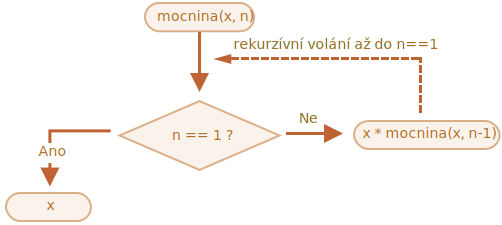

# Rekurze a zásobník

Vraťme se k funkcím a prostudujme je hlouběji.

Naším prvním tématem bude *rekurze*.

Jestliže nejste programátorský nováček, pak to již pravděpodobně znáte a můžete tuto kapitolu přeskočit.

Rekurze je programovací schéma, které je užitečné v situacích, kdy nějakou úlohu můžeme přirozeně rozdělit na několik úloh stejného druhu, ale jednodušších. Nebo když můžeme úlohu zjednodušit na nějakou lehkou akci plus jednodušší variantu téže úlohy. Nebo, jak brzy uvidíme, pro práci s určitými datovými strukturami.

Když funkce řeší úlohu, může při tomto procesu volat mnoho jiných funkcí. Zvláštním případem je, když funkce volá *sebe sama*. To se nazývá *rekurze*.

## Dva způsoby myšlení

Začneme něčím jednoduchým -- napišme funkci `mocnina(x, n)`, která umocní `x` na přirozené číslo `n`. Jinými slovy, vynásobí `x` sebou samým `n`-krát.

```js
mocnina(2, 2) = 4
mocnina(2, 3) = 8
mocnina(2, 4) = 16
```

Existují dva způsoby, jak ji implementovat.

1. Iterativní myšlení: cyklus `for`:

    ```js run
    function mocnina(x, n) {
      let výsledek = 1;

      // vynásobíme výsledek číslem x v cyklu n-krát
      for (let i = 0; i < n; i++) {
        výsledek *= x;
      }

      return výsledek;
    }

    alert( mocnina(2, 3) ); // 8
    ```

2. Rekurzívní myšlení: zjednodušit úlohu a volat sebe samu:

    ```js run
    function mocnina(x, n) {
      if (n == 1) {
        return x;
      } else {
        return x * mocnina(x, n - 1);
      }
    }

    alert( mocnina(2, 3) ); // 8
    ```

Prosíme všimněte si, jak je rekurzívní varianta diametrálně odlišná.

Když je volána `mocnina(x, n)`, její výkon se rozdělí do dvou větví:

```js
              if n==1  = x
             /
mocnina(x, n) =
             \       
              else     = x * mocnina(x, n - 1)
```

1. Je-li `n == 1`, pak je vše triviální. To se nazývá *základ* rekurze, jelikož okamžitě vydá zřejmý výsledek: `mocnina(x, 1)` se rovná `x`.
2. Jinak můžeme reprezentovat `mocnina(x, n)` jako `x * mocnina(x, n - 1)`. V matematice můžeme zapsat <code>x<sup>n</sup> = x * x<sup>n-1</sup></code>. 
To se nazývá *rekurzívní krok*: převedeme úlohu na jednodušší akci (násobení číslem `x`) a jednodušší volání stejné úlohy (`mocnina` s nižším `n`). Další kroky ji budou stále zjednodušovat, až nakonec `n` dosáhne `1`.

Můžeme také říci, že `mocnina` *rekurzívně volá sebe sama*, dokud není `n == 1`.




Například při výpočtu `mocnina(2, 4)` rekurzívní varianta provádí tyto kroky:

1. `mocnina(2, 4) = 2 * mocnina(2, 3)`
2. `mocnina(2, 3) = 2 * mocnina(2, 2)`
3. `mocnina(2, 2) = 2 * mocnina(2, 1)`
4. `mocnina(2, 1) = 2`

Rekurze tedy zredukuje volání funkce na jednodušší, pak na ještě jednodušší a tak dále, dokud výsledek nebude zřejmý.

````smart header="Rekurze je obvykle kratší"
Rekurzívní řešení bývá obvykle kratší než iterativní.

Zde můžeme přepsat totéž pomocí podmíněného operátoru `?` místo příkazu `if`, aby byla `mocnina(x, n)` ještě stručnější, ale stále velmi čitelná:

```js run
function mocnina(x, n) {
  return (n == 1) ? x : (x * mocnina(x, n - 1));
}
```
````

Maximální počet vnořených volání (včetně prvního) se nazývá *hloubka rekurze*. V našem případě to bude přesně `n`.

Maximální možná hloubka rekurze je omezena enginem JavaScriptu. Můžeme se spolehnout, že to bude aspoň 10000, některé enginy umožňují víc, ale 100000 je pravděpodobně nad limit většiny z nich. Existují automatické optimalizace, které nám pomohou se s tím vyrovnat („optimalizace koncového volání“), ale ty zatím nejsou podporovány všude a fungují jen v jednoduchých případech.

Použití rekurze je tím omezené, ale stále zůstává velmi široké. Existuje mnoho úloh, v nichž rekurzívní způsob myšlení dává jednodušší kód, snadnější na údržbu.

## Prováděcí kontext a zásobník

Nyní prozkoumejme, jak rekurzívní volání fungují. K tomu se podíváme funkcím pod čepici.

Informace o procesu spuštění právě běžící funkce je ukládána do jejího *prováděcího (exekučního) kontextu*.

[Prováděcí kontext](https://tc39.github.io/ecma262/#sec-execution-contexts) je interní datová struktura, která obsahuje podrobnosti o výkonu funkce: kde se nachází tok řízení právě teď, aktuální proměnné, hodnotu `this` (zde ji nepoužíváme) a některé další interní detaily.

S každou funkcí je spojen právě jeden prováděcí kontext.

Když funkce vykoná vnořené volání, stane se následující:

- Aktuální funkce je pozastavena.
- Prováděcí kontext s ní spojený se uloží do speciální datové struktury nazývané *zásobník prováděcích kontextů*.
- Je spuštěno vnořené volání.
- Až toto volání skončí, starý prováděcí kontext se vyjme ze zásobníku a vnější funkce se obnoví od místa, kde byla zastavena.

Podívejme se, co se děje během volání `mocnina(2, 3)`.

### mocnina(2, 3)

Na začátku volání `mocnina(2, 3)` si prováděcí kontext uloží proměnné: `x = 2, n = 3`, tok řízení je na řádku `1` této funkce.

Můžeme si to zapsat jako:

<ul class="function-execution-context-list">
  <li>
    <span class="function-execution-context">Kontext: { x: 2, n: 3, na řádku 1 }</span>
    <span class="function-execution-context-call">mocnina(2, 3)</span>
  </li>
</ul>

Na tomto místě začne výkon funkce. Podmínka `n == 1` není splněna, takže tok pokračuje druhou větví `if`:

```js run
function mocnina(x, n) {
  if (n == 1) {
    return x;
  } else {
*!*
    return x * mocnina(x, n - 1);
*/!*
  }
}

alert( mocnina(2, 3) );
```


Proměnné jsou stejné, ale řádek se změní, takže kontext nyní je:

<ul class="function-execution-context-list">
  <li>
    <span class="function-execution-context">Kontext: { x: 2, n: 3, na řádku 5 }</span>
    <span class="function-execution-context-call">mocnina(2, 3)</span>
  </li>
</ul>

K výpočtu `x * mocnina(x, n - 1)` musíme učinit vnořené volání funkce `mocnina` s novými argumenty: `mocnina(2, 2)`.

### mocnina(2, 2)

Aby JavaScript mohl provést vnořené volání, zapamatuje si aktuální prováděcí kontext v *zásobníku prováděcích kontextů*.

Zde voláme stejnou funkci `mocnina`, ale na tom vůbec nezáleží. Proces je pro všechny funkce stejný:

1. Aktuální kontext se uloží na vrchol zásobníku.
2. Pro vnořené volání se vytvoří nový kontext.
3. Až bude vnořené volání ukončeno, předchozí kontext se vyjme ze zásobníku a jeho vykonávání bude pokračovat.

Zde je zásobník kontextů ve chvíli, kdy jsme vstoupili do vnořeného volání `mocnina(2, 2)`:

<ul class="function-execution-context-list">
  <li>
    <span class="function-execution-context">Kontext: { x: 2, n: 2, na řádku 1 }</span>
    <span class="function-execution-context-call">mocnina(2, 2)</span>
  </li>
  <li>
    <span class="function-execution-context">Kontext: { x: 2, n: 3, na řádku 5 }</span>
    <span class="function-execution-context-call">mocnina(2, 3)</span>
  </li>
</ul>

Nový aktuální prováděcí kontext je na vrcholu (a uveden tučně), předchozí uložené kontexty jsou níže.

Až vnořené volání skončí -- bude snadné obnovit předchozí kontext, jelikož si udržuje obě proměnné i přesné místo kódu, na němž se zastavil.

```smart
Na tomto obrázku používáme slovo „řádek“, protože v našem příkladu je na řádku jen jediné volání, ale obecně jeden řádek kódu může obsahovat několik volání, například `mocnina(…) + mocnina(…) + něcoJiného(…)`.

Bylo by tedy přesnější říkat, že provádění se obnoví „ihned po vnořeném volání“.
```

### mocnina(2, 1)

Proces se opakuje: na řádku `5` se učiní nové vnořené volání, tentokrát s argumenty `x=2`, `n=1`.

Vytvoří se nový prováděcí kontext, předchozí se uloží na vrchol zásobníku:

<ul class="function-execution-context-list">
  <li>
    <span class="function-execution-context">Kontext: { x: 2, n: 1, na řádku 1 }</span>
    <span class="function-execution-context-call">mocnina(2, 1)</span>
  </li>
  <li>
    <span class="function-execution-context">Kontext: { x: 2, n: 2, na řádku 5 }</span>
    <span class="function-execution-context-call">mocnina(2, 2)</span>
  </li>
  <li>
    <span class="function-execution-context">Kontext: { x: 2, n: 3, na řádku 5 }</span>
    <span class="function-execution-context-call">mocnina(2, 3)</span>
  </li>
</ul>

Nyní máme 2 staré kontexty a 1 právě probíhající pro `mocnina(2, 1)`.

### Konec

Během provádění `mocnina(2, 1)` je na rozdíl od předchozích případů podmínka `n == 1` splněna, takže bude pracovat první větev `if`:

```js
function mocnina(x, n) {
  if (n == 1) {
*!*
    return x;
*/!*
  } else {
    return x * mocnina(x, n - 1);
  }
}
```

Další vnořená volání už nejsou, takže funkce skončí a vrátí `2`.

Až funkce skončí, její prováděcí kontext už nebude zapotřebí, takže bude odstraněn z paměti. Na vrcholu zásobníku se obnoví předchozí prováděcí kontext:

<ul class="function-execution-context-list">
  <li>
    <span class="function-execution-context">Kontext: { x: 2, n: 2, na řádku 5 }</span>
    <span class="function-execution-context-call">mocnina(2, 2)</span>
  </li>
  <li>
    <span class="function-execution-context">Kontext: { x: 2, n: 3, na řádku 5 }</span>
    <span class="function-execution-context-call">mocnina(2, 3)</span>
  </li>
</ul>

Obnoví se provádění `mocnina(2, 2)`. To zná výsledek vnořeného volání `mocnina(2, 1)`, takže může dokončit výpočet `x * mocnina(x, n - 1)` a vrátit `4`.

Pak se obnoví předchozí kontext:

<ul class="function-execution-context-list">
  <li>
    <span class="function-execution-context">Kontext: { x: 2, n: 3, na řádku 5 }</span>
    <span class="function-execution-context-call">mocnina(2, 3)</span>
  </li>
</ul>

Až skončí, budeme mít výsledek `mocnina(2, 3) = 8`.

Hloubka rekurze v tomto případě byla **3**.

Jak vidíme z výše uvedených ilustrací, hloubka rekurze se rovná nejvyššímu počtu kontextů v zásobníku.

Všimněte si paměťových požadavků. Kontexty zabírají paměť. V našem případě umocnění na `n`-tou ve skutečnosti vyžaduje paměť pro `n` kontextů pro všechny nižší hodnoty `n`.

Algoritmus založený na cyklu ušetří více paměti:

```js
function mocnina(x, n) {
  let výsledek = 1;

  for (let i = 0; i < n; i++) {
    výsledek *= x;
  }

  return výsledek;
}
```

Iterativní `mocnina` používá jediný kontext, v jehož procesu se mění `i` a `výsledek`. Její paměťové požadavky jsou malé, pevné a nezávisejí na velikosti `n`.

**Každou rekurzi lze přepsat do smyčky. Variantu se smyčkou lze obvykle napsat efektivněji.**

...Toto přepsání však někdy není triviální, zvláště když funkce používá různá rekurzívní volání v závislosti na podmínkách a spojuje jejich výsledky, nebo když je větvení složitější. A optimalizace může být nepotřebná a nemusí stát za tu námahu.

Rekurze mohou vydat kratší kód, jednodušší na porozumění a podporu. Optimalizace nejsou nutné všude, většinou potřebujeme dobrý kód, proto používáme rekurzi.   

## Rekurzívní traversaly

Další skvělé využití rekurze je rekurzívní traversal.

Představme si, že máme firmu. Struktura jejího personálu se dá vyjádřit jako objekt:

```js
let firma = {
  prodeje: [{
    jméno: 'Jan',
    plat: 1000
  }, {
    jméno: 'Alice',
    plat: 1600
  }],

  vývoj: {
    pobočky: [{
      jméno: 'Petr',
      plat: 2000
    }, {
      jméno: 'Aleš',
      plat: 1800
    }],

    interní: [{
      jméno: 'Kuba',
      plat: 1300
    }]
  }
};
```

Jinými slovy, firma má různá oddělení.

- Oddělení může mít pole zaměstnanců. Například oddělení `prodeje` má 2 zaměstnance: Jana a Alici.
- Nebo se oddělení může větvit na nižší oddělení, například `vývoj` má dvě větve: `pobočky` a `interní`. Každá z nich má své vlastní zaměstnance.
- Je také možné, že když se nižší oddělení rozroste, rozdělí se na ještě nižší oddělení (nebo týmy).

    Například oddělení `pobočky` se v budoucnu může rozdělit na týmy pro `pobočkaA` a `pobočkaB`. A ty se mohou rozdělit ještě dál. To není na obrázku, je to jen něco, co musíme mít na paměti.

Nyní řekněme, že chceme funkci, která vrátí součet všech platů. Jak ji můžeme napsat?

Iterativní přístup není snadný, protože struktura není jednoduchá. První myšlenkou může být vytvořit cyklus `for` nad objektem `firma` s vnořeným podcyklem nad odděleními 1. úrovně. Pak ale budeme potřebovat další vnořené podcykly, které budou iterovat nad personálem oddělení 2. úrovně, jako je `pobočky`... A v nich pak další podcyklus pro oddělení 3. úrovně, která se mohou objevit v budoucnu? Jestliže do kódu vložíme 3-4 vnořené podcykly, aby procházely jediný objekt, bude to poměrně ošklivé.

Zkusme rekurzi.

Jak vidíme, když naše funkce obdrží oddělení, které má sečíst, mohou nastat dva případy:

1. Buď je to „jednoduché“ oddělení s *polem* zaměstnanců -- pak můžeme sečíst jejich platy v jediném cyklu.
2. Nebo je to *objekt* s `N` podřízenými odděleními -- pak můžeme učinit `N` rekurzívních volání, abychom získali součet pro každé nižší oddělení, a zkombinovat výsledky.

První případ je základem rekurze, triviální případ, když obdržíme pole.

Druhý případ, když obdržíme objekt, je rekurzívní krok. Složitý úkol rozdělíme na podúkoly pro menší oddělení. Ta se pak mohou opět rozdělit, ale dříve nebo později dělení skončí případem (1).

Algoritmus je pravděpodobně ještě snadnější vyčíst z kódu:


```js run
let firma = { // stejný objekt, zkomprimovaný pro stručnost
  platy: [{jméno: 'Jan', plat: 1000}, {jméno: 'Alice', plat: 1600 }],
  vývoj: {
    pobočky: [{jméno: 'Petr', plat: 2000}, {jméno: 'Aleš', plat: 1800 }],
    interní: [{jméno: 'Kuba', plat: 1300}]
  }
};

// Funkce, která odvede práci
*!*
function sečtiPlaty(oddělení) {
  if (Array.isArray(oddělení)) { // případ (1)
    return oddělení.reduce((předchozí, aktuální) => předchozí + aktuální.plat, 0); // sečteme pole
  } else { // případ (2)
    let součet = 0;
    for (let pododdělení of Object.values(oddělení)) {
      součet += sečtiPlaty(pododdělení); // rekurzívní volání pro nižší oddělení, sečteme výsledky
    }
    return součet;
  }
}
*/!*

alert(sečtiPlaty(firma)); // 7700
```

Kód je krátký a snadno srozumitelný (doufejme?). V tom spočívá síla rekurze. Funguje pro jakoukoli úroveň vnoření oddělení.

Zde je diagram volání:


Snadno vidíme princip: pro objekty `{...}` se učiní volání, zatímco pole `[...]` jsou „listy“ rekurzívního stromu a dávají okamžitý výsledek.

Všimněte si, že kód využívá elegantní vlastnosti, které jsme uvedli již dříve:

- Metodu `arr.reduce` vysvětlenou v kapitole <info:array-methods> k získání součtu pole.
- Cyklus `for(hodnota of Object.values(obj))` k iteraci nad hodnotami objektu: `Object.values` vrací jejich pole.


## Rekurzívní struktury

Rekurzívní (rekurzívně definovaná) datová struktura je struktura, která částečně replikuje sama sebe.

Právě jsme ji viděli ve výše uvedeném příkladu struktury firmy.

Firemní *oddělení* je:
- Buď pole lidí.
- Nebo objekt s *odděleními*.

Pro vývojáře webů existují mnohem lépe známé příklady: HTML a XML dokumenty.

V HTML dokumentu může *HTML značka (tag)* obsahovat seznam:
- úryvků textu,
- HTML komentářů,
- jiných *HTML značek* (které mohou opět obsahovat úryvky textu, komentáře nebo jiné značky atd.).

To je opět rekurzívní definice.

Pro lepší porozumění uvedeme ještě jednu rekurzívní strukturu nazývanou „spojový seznam“, která by v některých případech mohla být lepší alternativou k polím.

### Spojový seznam

Představme si, že si chceme uložit seřazený seznam objektů.

Přirozenou volbou by bylo pole:

```js
let pole = [obj1, obj2, obj3];
```

...S poli je však problém. Operace „smazání prvku“ a „vložení prvku“ jsou nákladné. Například operace `pole.unshift(obj)` musí přečíslovat všechny prvky, aby uvolnila místo pro nový objekt `obj`, a je-li pole velké, zabere to čas. Totéž platí pro  `arr.shift()`.

Jediné strukturální modifikace, které nevyžadují masové přečíslování, jsou ty, které pracují s koncem pole: `pole.push/pop`. Pole tedy může být poměrně pomalé pro velké fronty, když musíme pracovat s jeho začátkem.

Alternativně, jestliže potřebujeme opravdu rychlé vkládání a mazání, si můžeme zvolit jinou datovou strukturu nazvanou [lineární spojový seznam](https://cs.wikipedia.org/wiki/Lineární_seznam).

*Prvek spojového seznamu* je rekurzívně definován jako objekt, který obsahuje:
- hodnotu `hodnota`.
- vlastnost `další`, která se odkazuje na další *prvek spojového seznamu* nebo *null*, jestliže tento prvek je poslední.

Příklad:

```js
let seznam = {
  hodnota: 1,
  další: {
    hodnota: 2,
    další: {
      hodnota: 3,
      další: {
        hodnota: 4,
        další: null
      }
    }
  }
};
```

Grafické zobrazení seznamu:


Alternativní kód pro vytvoření:

```js no-beautify
let list = { hodnota: 1 };
list.další = { hodnota: 2 };
list.další.další = { hodnota: 3 };
list.další.další.další = { hodnota: 4 };
list.další.další.další.další = null;
```

Tady můžeme jasně vidět, že zde je více objektů, každý z nich má hodnotu `hodnota` a prvek `další`, který ukazuje na souseda. Proměnná `seznam` je první objekt v řetězci, takže pomocí ukazatelů `další` se z ní můžeme dostat na kterýkoli prvek.

Seznam můžeme snadno rozdělit na více částí a pak znovu spojit:

```js
let druhýSeznam = seznam.další.další;
seznam.další.další = null;
```


Spojení:

```js
seznam.další.další = druhýSeznam;
```

A samozřejmě můžeme na kterémkoli místě vkládat nebo odstraňovat prvky.

Například chceme-li připojit novou hodnotu na začátek seznamu, musíme změnit jeho hlavičku:

```js
let seznam = { hodnota: 1 };
seznam.další = { hodnota: 2 };
seznam.další.další = { hodnota: 3 };
seznam.další.další.další = { hodnota: 4 };

*!*
// připojíme novou hodnotu na začátek seznamu
seznam = { hodnota: "nový prvek", další: seznam };
*/!*
```


Abychom odstranili prvek zprostředka, změníme `další` u předchozího prvku:

```js
seznam.další = seznam.další.další;
```


Způsobili jsme, že `seznam.další` bude přeskakovat `1` rovnou na hodnotu `2`. Hodnota `1` je nyní z řetězce vyřazena. Pokud není uložena někde jinde, bude automaticky odstraněna z paměti.

Na rozdíl od polí zde nedochází k masovému přečíslování, takže můžeme prvky snadno přeskupovat.

Pochopitelně seznamy nejsou vždy lepší než pole, jinak by všichni používali jedině seznamy.

Jejich hlavní nevýhodou je, že nemůžeme snadno přistupovat k prvku podle jeho čísla. V poli je to jednoduché: `pole[n]` je přímý odkaz. Ale v seznamu musíme začít od prvního prvku a jít na `další` celkem `N`-krát, abychom získali N-tý prvek.

...Takové operace však nepotřebujeme vždy. Například když potřebujeme frontu nebo dokonce [frontu s dvojitým koncem](https://en.wikipedia.org/wiki/Double-ended_queue) -- seřazenou strukturu, která musí umožňovat velmi rychlé přidávání a odstraňování prvků z obou konců, ale přístup doprostřed není nutný.

Seznamy můžeme vylepšit:
- Můžeme navíc k vlastnosti `další` přidat vlastnost `předchozí`, která bude odkazovat na předchozí prvek, abychom se mohli snadno vracet zpět.
- Můžeme také přidat proměnnou `konec` odkazující se na poslední prvek seznamu (a aktualizovat ji, když budeme přidávat nebo odebírat prvky z konce).
- ...Tato datová struktura se může lišit podle našich potřeb.

## Shrnutí

Pojmy:
- *Rekurze* je programátorský pojem, který znamená volání funkce sebou samotnou. Pomocí rekurzívních funkcí můžeme řešit úlohy elegantním způsobem.

    Když funkce volá sebe sama, nazývá se to *rekurzívní krok*. *Základ* rekurze jsou funkční argumenty, s nimiž je úloha natolik jednoduchá, že funkce už neučiní další volání.

- [Rekurzívně definovaná](https://en.wikipedia.org/wiki/Recursive_data_type) datová struktura je datová struktura, která může být definována pomocí sebe sama.

    Například spojový seznam může být definován jako datová struktura, která se skládá z objektu odkazujícího se na seznam (nebo null).

    ```js
    seznam = { hodnota, další -> seznam }
    ```

    Stromy jako strom HTML prvků nebo strom firemních oddělení z této kapitoly jsou rovněž přirozeně rekurzívní: mají větve a každá větev může obsahovat další větve.

    K procházení skrz ně mohou být použity rekurzívní funkce, jak jsme viděli v příkladu `sečtiPlaty`.

Každou rekurzívní funkci můžeme přepsat na iterativní. Někdy je to nutné kvůli optimalizaci. Pro mnoho úloh je však rekurzívní řešení dostatečně rychlé a snadnější na napsání i údržbu.
