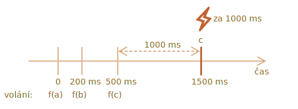

importance: 5

---

# Debouncový dekorátor

Výsledkem dekorátoru `debounce(f, ms)` je wrapper, který pozastaví volání `f`, dokud neuplyne `ms` milisekund neaktivity (žádná volání, „doba vychladnutí“), a pak zavolá `f` jednou s posledními argumenty.

Jinými slovy, `debounce` je jako sekretářka, která přijímá „telefonní hovory“ a čeká, až uplyne `ms` milisekund klidu. Teprve pak předá „šéfovi“ informaci z posledního volání (volá skutečnou funkci `f`).

Například máme funkci `f` a nahradíme ji za `f = debounce(f, 1000)`.

Jestliže je pak obalená funkce volána za 0 ms, 200 ms a 500 ms a pak žádná volání nenastanou, bude skutečná funkce `f` volána jen jednou, a to za 1500 ms. Tedy: po době vychladnutí 1000 ms od posledního volání.



...A obdrží argumenty z posledního volání, ostatní volání jsou ignorována.

Zde je kód pro něj (používá debouncový dekorátor z [knihovny Lodash](https://lodash.com/docs/4.17.15#debounce)):

```js
let f = _.debounce(alert, 1000);

f("a"); 
setTimeout( () => f("b"), 200);
setTimeout( () => f("c"), 500);
// debouncovaná funkce čeká 1000 ms po posledním volání a pak spustí: alert("c")
```

Nyní praktický příklad. Řekněme, že uživatel něco napíše a my bychom chtěli poslat požadavek na server, až bude vstup dokončen.

Nemá smysl posílat požadavek po každém napsaném znaku. Místo toho bychom chtěli počkat a pak zpracovat až celý výsledek.

Ve webovém prohlížeči můžeme nastavit handler události -- funkci, která je volána po každé změně vstupního pole. Normálně je handler události volán velmi často, po každé stisknuté klávese. Když na něj však použijeme `debounce` na 1000 ms, pak bude volán jen jednou, a to 1000 ms po posledním vstupu.

```online

V tomto živém příkladu handler umisťuje výsledek do boxu níže, zkuste si to:

[iframe border=1 src="debounce" height=200]

Vidíte? Druhý vstup volá debouncovanou funkci, takže jeho obsah je zpracován až 1000 ms po posledním vstupu.
```

`debounce` je tedy skvělý způsob, jak zpracovat posloupnost událostí: ať už je to posloupnost stisků kláves, pohybů myši nebo cokoli jiného.

Po posledním volání napřed čeká zadanou dobu a poté spustí svou funkci, která může zpracovat výsledek.

Úkolem je implementovat dekorátor `debounce`.

Rada: když se nad tím zamyslíte, je to pouhých několik řádků :)
