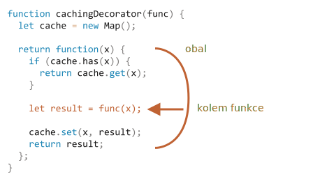

# Dekorátory a forwarding, call/apply

JavaScript poskytuje při práci s funkcemi výjimečnou flexibilitu. Funkce mohou být předávány, používány jako objekty a nyní uvidíme, jak *předávat* volání mezi nimi a jak je *dekorovat*.

## Transparentní cachování

Řekněme, že máme funkci `pomalá(x)`, která značně zatěžuje CPU, ale její výsledky jsou stabilní. Jinými slovy, pro stejná `x` vždy vrací stejný výsledek.

Je-li funkce volána často, můžeme si její výsledky ukládat do cache (pamatovat), abychom se vyhnuli spotřebování dalšího času při opakovaných výpočtech.

Místo přidání této funkcionality do `pomalá()` však vytvoříme wrapperovou (obalovou) funkci, která umožní cachování. Jak uvidíme, přinese nám to mnoho výhod.

Zde je kód a vysvětlení bude následovat:

```js run
function pomalá(x) {
  // zde může být výpočet značně zatěžující CPU
  alert(`Voláno s ${x}`);
  return x;
}

function cachovacíDekorátor(funkce) {
  let cache = new Map();

  return function(x) {
    if (cache.has(x)) {    // je-li v cache takový klíč
      return cache.get(x); // načteme výsledek z cache
    }

    let výsledek = funkce(x);  // jinak zavoláme funkci

    cache.set(x, výsledek);  // a výsledek uložíme do cache (zapamatujeme)
    return výsledek;
  };
}

pomalá = cachovacíDekorátor(pomalá);

<<<<<<< Updated upstream
alert( slow(1) ); // slow(1) is cached
alert( "Again: " + slow(1) ); // the same

alert( slow(2) ); // slow(2) is cached
alert( "Again: " + slow(2) ); // the same as the previous line
=======
alert( pomalá(1) ); // pomalá(1) se uloží do cache a výsledek se vrátí
alert( "Znovu: " + pomalá(1) ); // výsledek funkce pomalá(1) vrácený z cache

alert( pomalá(2) ); // pomalá(2) se uloží do cache a výsledek se vrátí
alert( "Znovu: " + pomalá(2) ); // výsledek funkce pomalá(2) vrácený z cache
>>>>>>> Stashed changes
```

Funkce `cachovacíDekorátor` ve výše uvedeném kódu je *dekorátor*: speciální funkce, která přebírá jinou funkci a mění její chování.

Myšlenkou je, že můžeme volat `cachovacíDekorátor` na kteroukoli funkci a ona nám vrátí cachovací wrapper. To je skvělé, protože můžeme mít mnoho funkcí, které takové chování využijí, a nebudeme potřebovat nic víc než aplikovat na ně `cachovacíDekorátor`.

Oddělením cachování od hlavního kódu funkce navíc udržujeme hlavní kód jednodušší.

Výsledek `cachovacíDekorátor(funkce)` je „wrapper“: `function(x)`, která „obalí“ volání `funkce(x)` do logiky cachování:



Obalená funkce `pomalá` z vnějšího kódu provádí stále totéž, jen byl k jejímu chování přidán aspekt cachování.

Když to tedy shrneme, existuje několik výhod používání oddělené funkce `cachovacíDekorátor` namísto změny kódu samotné funkce `pomalá`:

- Funkce `cachovacíDekorátor` je opakovaně použitelná. Můžeme ji aplikovat na další funkci.
- Logika cachování je oddělená a nezvyšuje složitost samotné funkce `pomalá` (pokud tam nějaká byla).
- V případě potřeby můžeme zkombinovat více dekorátorů (jiné dekorátory budou následovat).

## Použití „funkce.call“ pro kontext

Výše uvedený dekorátor cachování není vhodný pro práci s objektovými metodami.

Například v níže uvedeném kódu metoda `pracovník.pomalá()` přestane po dekoraci fungovat:

```js run
// přidáme do metody pracovník.pomalá cachování
let pracovník = {
  nějakáMetoda() {
    return 1;
  },

  pomalá(x) {
    // zde je úloha značně zatěžující CPU
    alert("Voláno s " + x);
    return x * this.nějakáMetoda(); // (*)
  }
};

// stejný kód jako předtím
function cachovacíDekorátor(funkce) {
  let cache = new Map();
  return function(x) {
    if (cache.has(x)) {
      return cache.get(x);
    }
*!*
    let výsledek = funkce(x); // (**)
*/!*
    cache.set(x, výsledek);
    return výsledek;
  };
}

alert( pracovník.pomalá(1) ); // původní metoda funguje

pracovník.pomalá = cachovacíDekorátor(pracovník.pomalá); // nyní přidáme cachování

*!*
alert( pracovník.pomalá(2) ); // Ouha! Chyba: Nelze načíst vlastnost 'nějakáMetoda' z undefined
*/!*
```

Chyba nastane na řádku `(*)`, který se pokusí přistoupit k `this.nějakáMetoda` a selže. Vidíte proč?

Důvodem je, že wrapper volá původní funkci jako `funkce(x)` na řádku `(**)`. A když je funkce takto volána, obdrží `this = undefined`.

Podobný problém uvidíme, pokud se pokusíme spustit:

```js
let funkce = pracovník.pomalá;
funkce(2);
```

Wrapper tedy předá volání původní metodě, ale bez kontextového `this`. Proto nastane chyba.

Opravme to.

Existuje speciální vestavěná funkční metoda [funkce.call(kontext, ...argumenty)](mdn:js/Function/call), která nám umožňuje volat funkci s výslovným nastavením `this`.

Syntaxe je:

```js
funkce.call(kontext, arg1, arg2, ...)
```

Spustí funkci `funkce`, které poskytne první argument jako `this` a další jako její argumenty.

Abychom to zjednodušili, tato dvě volání provádějí skoro totéž:
```js
funkce(1, 2, 3);
funkce.call(obj, 1, 2, 3)
```

Obě volají funkci `funkce` s argumenty `1`, `2` a `3`. Jediný rozdíl je v tom, že `funkce.call` také nastaví `this` na `obj`.

Jako příklad v níže uvedeném kódu zavoláme `řekniAhoj` v kontextu různých objektů: `řekniAhoj.call(uživatel)` spustí funkci `řekniAhoj`, které poskytne `this=uživatel`, a další řádek nastaví `this=admin`:

```js run
function řekniAhoj() {
  alert(this.jméno);
}

let uživatel = { jméno: "Jan" };
let admin = { jméno: "Admin" };

// použitím call předáme různé objekty jako „this“
řekniAhoj.call( uživatel ); // Jan
řekniAhoj.call( admin ); // Admin
```

A zde použijeme `call`, abychom zavolali `řekni` se zadaným kontextem a větou:


```js run
function řekni(věta) {
  alert(this.jméno + ': ' + věta);
}

let uživatel = { jméno: "Jan" };

// uživatel se stane this a "Ahoj" se stane prvním argumentem
řekni.call( uživatel, "Ahoj" ); // Jan: Ahoj
```

V našem případě můžeme použít `call` ve wrapperu, abychom předali kontext původní funkci:

```js run
let pracovník = {
  nějakáMetoda() {
    return 1;
  },

  pomalá(x) {
    alert("Voláno s " + x);
    return x * this.nějakáMetoda(); // (*)
  }
};

function cachovacíDekorátor(funkce) {
  let cache = new Map();
  return function(x) {
    if (cache.has(x)) {
      return cache.get(x);
    }
*!*
    let výsledek = funkce.call(this, x); // „this“ se nyní předá správně
*/!*
    cache.set(x, výsledek);
    return výsledek;
  };
}

pracovník.pomalá = cachovacíDekorátor(pracovník.pomalá); // nyní do ní přidejme cachování

alert( pracovník.pomalá(2) ); // funguje
alert( pracovník.pomalá(2) ); // funguje, nevolá originál (výsledek je v cache)
```

Nyní je všechno v pořádku.

Abychom to všechno objasnili, podívejme se hlouběji na to, jak se `this` předává:

1. Po dekoraci je `pracovník.pomalá` nyní wrapper `function (x) { ... }`.
2. Když je tedy `pracovník.pomalá(2)` spuštěn, wrapper obdrží `2` jako argument a `this=pracovník` (je to objekt před tečkou).
3. Uvnitř wrapperu za předpokladu, že výsledek ještě není v cache, `funkce.call(this, x)` předá původní metodě aktuální `this` (`=pracovník`) a aktuální argument (`=2`).

## Buďme víceargumentoví

Učiňme nyní `cachovacíDekorátor` ještě univerzálnější. Prozatím funguje jen pro funkce s jediným argumentem.

Jak nyní cachovat metodu `pracovník.pomalá` s více argumenty?

```js
let pracovník = {
  pomalá(min, max) {
    return min + max; // předpokládáme velkou zátěž CPU
  }
};

// měla by si pamatovat volání se stejnými argumenty
pracovník.pomalá = cachovacíDekorátor(pracovník.pomalá);
```

Předtím jsme pro jediný argument `x` mohli jednoduše volat `cache.set(x, výsledek)` pro uložení výsledku a `cache.get(x)` pro jeho získání. Nyní si však musíme pamatovat výsledek pro *kombinaci argumentů* `(min,max)`. Nativní `Map` přijímá jako klíč pouze jedinou hodnotu.

Možných řešení je mnoho:

1. Implementovat novou datovou strukturu podobnou mapě (nebo použít nějakou od třetí strany), která je univerzálnější a umožňuje vícenásobné klíče.
2. Použít vnořené mapy: `cache.set(min)` bude `Map`, v níž bude uložena dvojice `(max, výsledek)`. Pak můžeme získat `výsledek` pomocí `cache.get(min).get(max)`.
3. Spojit dvě hodnoty do jedné. V našem konkrétním případě bychom jako klíč pro `Map` mohli použít jednoduše řetězec `"min,max"`. Pro flexibilitu můžeme umožnit dekorátoru poskytnout *hashovací funkci*, která umí vytvořit z mnoha hodnot jedinou.

Pro mnoho praktických aplikací postačí třetí varianta, takže se zaměříme na ni.

Také do `funkce.call` potřebujeme předávat nejen `x`, ale všechny argumenty. Vzpomeňme si, že ve `function()` můžeme získat pseudopole jejích argumentů jako `arguments`, takže `funkce.call(this, x)` můžeme nahradit za `funkce.call(this, ...arguments)`.

Zde je silnější `cachovacíDekorátor`:

```js run
let pracovník = {
  pomalá(min, max) {
    alert(`Voláno s ${min},${max}`);
    return min + max;
  }
};

function cachovacíDekorátor(funkce, hash) {
  let cache = new Map();
  return function() {
*!*
    let klíč = hash(arguments); // (*)
*/!*
    if (cache.has(klíč)) {
      return cache.get(klíč);
    }

*!*
    let výsledek = funkce.call(this, ...arguments); // (**)
*/!*

    cache.set(klíč, výsledek);
    return výsledek;
  };
}

function hash(argumenty) {
  return argumenty[0] + ',' + argumenty[1];
}

pracovník.pomalá = cachovacíDekorátor(pracovník.pomalá, hash);

alert( pracovník.pomalá(3, 5) ); // funguje
alert( "Znovu " + pracovník.pomalá(3, 5) ); // totéž (v cache)
```

Nyní to funguje pro libovolný počet argumentů (ačkoli bychom museli přizpůsobit libovolnému počtu argumentů i hashovací funkci. Zajímavý způsob, jak to zvládnout, bude probrán níže).

Jsou tady dvě změny:

- Na řádku `(*)` voláme `hash` k vytvoření jediného klíče z `arguments`. Zde použijeme jednoduchou „spojovací“ funkci, která převede argumenty `(3, 5)` na klíč `"3,5"`. Složitější případy mohou vyžadovat jiné hashovací funkce.
- Pak `(**)` používá `funkce.call(this, ...arguments)` k předání kontextu i všech argumentů, které wrapper obdržel (nejen prvního), původní funkci.

## funkce.apply

Místo `funkce.call(this, ...arguments)` můžeme použít `funkce.apply(this, arguments)`.

Syntaxe vestavěné metody [funkce.apply](mdn:js/Function/apply) je:

```js
funkce.apply(kontext, argumenty)
```

Metoda spustí funkci `funkce` tak, že nastaví `this=kontext` a použije objekt podobný poli `argumenty` jako seznam argumentů.

Jediný syntaktický rozdíl mezi `call` a `apply` je, že `call` očekává seznam argumentů, zatímco `apply` přebírá objekt podobný poli, který je obsahuje.

Tato dvě volání jsou tedy téměř ekvivalentní:

```js
funkce.call(kontext, ...argumenty); // předá pole jako seznam s roztaženou syntaxí
funkce.apply(kontext, argumenty);   // totéž jako použití call
```

Obě provádějí stejné volání `funkce` se zadaným kontextem a argumenty.

Je tady jen jeden drobný rozdíl týkající se objektu `argumenty`:

- Roztažená syntaxe `...` umožňuje přidat *iterovatelný* objekt `argumenty` jako seznam do `call`.
- `apply` přijímá jako `argumenty` jedině *objekt podobný poli*.

A pro objekty, které jsou současně iterovatelné a podobné poli, například skutečné pole, můžeme použít kteroukoli z nich, ale `apply` bude pravděpodobně rychlejší, jelikož většina enginů JavaScriptu ji interně lépe optimalizuje.

Předávání všech argumentů společně s kontextem do jiné funkce se nazývá *call forwarding* (nenašel jsem odpovídající český výraz a žádný mě nenapadá -- pozn. překl.).

Toto je jeho nejjednodušší forma:

```js
let wrapper = function() {
  return funkce.apply(this, arguments);
};
```

Když externí kód zavolá takový `wrapper`, je to nerozlišitelné od volání původní funkce `funkce`.

## Vypůjčení metody [#method-borrowing]

Proveďme nyní ještě jedno malé vylepšení hashovací funkce:

```js
function hash(argumenty) {
  return argumenty[0] + ',' + argumenty[1];
}
```

Prozatím funguje jen na dvou argumentech. Bylo by lepší, kdyby dokázala zvládnout jakýkoli počet argumentů v `argumenty`.

Přirozené řešení by bylo použít metodu [arr.join](mdn:js/Array/join):

```js
function hash(argumenty) {
  return argumenty.join();
}
```

...Naneštěstí to nebude fungovat. Je to proto, že voláme `hash(arguments)` a objekt `arguments` je sice iterovatelný i podobný poli, ale není to skutečné pole.

Volání `join` na něm tedy selže, jak vidíme níže:

```js run
function hash() {
*!*
  alert( arguments.join() ); // Chyba: arguments.join není funkce
*/!*
}

hash(1, 2);
```

Stále je tady však snadný způsob, jak použít spojení polí:

```js run
function hash() {
*!*
  alert( [].join.call(arguments) ); // 1,2
*/!*
}

hash(1, 2);
```

Tento trik se nazývá *vypůjčení metody*.

Vezmeme (vypůjčíme si) spojovací metodu z běžného pole (`[].join`) a použijeme `[].join.call`, abychom ji spustili v kontextu `arguments`.

Proč to funguje?

Je to proto, že interní algoritmus nativní metody `pole.join(spojka)` je velmi jednoduchý.

Převezmeme jej ze specifikace téměř „tak, jak tam je“:

1. Nechť `spojka` je první argument, nebo nejsou-li argumenty, pak to bude čárka `","`.
2. Nechť `výsledek` je prázdný řetězec.
3. Připojíme `this[0]` k `výsledek`.
4. Připojíme `spojka` a `this[1]`.
5. Připojíme `spojka` a `this[2]`.
6. ...Budeme to dělat tak dlouho, než bude spojeno `this.length` prvků.
7. Vrátíme `výsledek`.

Technicky to tedy vezme `this` a spojí dohromady `this[0]`, `this[1]` atd. Je to úmyslně napsáno způsobem, který umožňuje jakékoli `this` podobné poli (to není náhoda, tuto praktiku používá mnoho metod). To je také důvod, proč to funguje s `this=arguments`.

## Dekorátory a vlastnosti funkcí

Nahradit funkci nebo metodu dekorovanou funkcí či metodou je obecně bezpečné až na jednu drobnost. Má-li původní funkce v sobě vlastnosti, např. `funkce.početVolání` nebo cokoli jiného, dekorovaná funkce je neposkytne, protože to je wrapper. Člověk tedy musí být opatrný, jestliže je používá.

Například jestliže ve výše uvedeném příkladu má funkce `pomalá` v sobě nějaké vlastnosti, pak `cachovacíDekorátor(pomalá)` je wrapper a tyto vlastnosti nemá.

Některé dekorátory mohou poskytnout své vlastní vlastnosti. Např. dekorátor může počítat, kolikrát byla funkce volána a jak dlouhou dobu zabrala, a poskytnout tuto informaci jako vlastnost wrapperu.

Existuje způsob, jak vytvářet dekorátory, které zachovávají přístup k vlastnostem funkcí, ale to vyžaduje použití speciálního objektu `Proxy` k obalení funkce. Probereme to později v článku <info:proxy#proxy-apply>.

## Shrnutí

*Dekorátor* je obal okolo funkce, který mění její chování. Funkce stále odvádí svou hlavní práci.

Na dekorátory lze pohlížet jako na „prvky“ nebo „aspekty“, které lze přidávat do funkce. Můžeme přidat jeden nebo mnoho. A to všechno beze změny kódu funkce!

Pro implementaci dekorátoru `cachovacíDekorátor` jsme prostudovali metody:

- [funkce.call(kontext, arg1, arg2...)](mdn:js/Function/call) -- volá funkci `funkce` se zadaným kontextem a argumenty.
- [funkce.apply(kontext, argumenty)](mdn:js/Function/apply) -- volá funkci `funkce`, které předá `kontext` jako `this` a objekt podobný poli `argumenty` do seznamu argumentů.

Generický *call forwarding* se obvykle provádí pomocí `apply`:

```js
let wrapper = function() {
  return původníFunkce.apply(this, arguments);
};
```

Viděli jsme také příklad *vypůjčení funkce*, když jsme vzali metodu z objektu a volali ji pomocí `call` v kontextu jiného objektu. Brát metody polí a aplikovat je na `arguments` je poměrně běžné. Alternativou je použít objekt ostatních parametrů, který je skutečným polem.

V divočině číhá mnoho dekorátorů. Řešením úloh v této kapitole si ověřte, jak dobře jste je pochopili.
