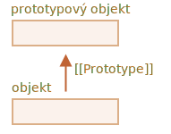
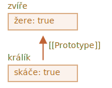
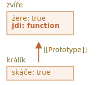
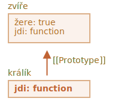

# Prototypová dědičnost

V programování často chceme něco vzít a rozšířit.

Například máme objekt `uživatel` s jeho vlastnostmi a metodami a chceme vytvořit objekty `admin` a `host` jako jeho mírně pozměněné varianty. Rádi bychom použili to, co máme v objektu `uživatel`, nekopírovali ani znovu neimplementovali jeho metody, jen postavili nový objekt na jeho základu.

*Prototypová dědičnost* je prvek jazyka, který nám s tím pomůže.

## [[Prototype]]

V JavaScriptu mají objekty speciální skrytou vlastnost `[[Prototype]]` (jak je nazvána ve specifikaci), která je buď `null`, nebo se odkazuje na jiný objekt. Tento objekt se nazývá „prototyp“:



Když načítáme vlastnost z objektu a ta tam není, JavaScript ji automaticky převezme z prototypu. V programování se to nazývá „prototypová dědičnost“. Brzy prostudujeme mnoho příkladů této dědičnosti i chytřejší jazykové prvky, které jsou na ní postaveny.

Vlastnost `[[Prototype]]` je interní a skrytá, ale je mnoho způsobů, jak ji nastavit.

Jeden z nich je použít speciální název `__proto__`, například takto:

```js run
let zvíře = {
  žere: true
};
let králík = {
  skáče: true
};

*!*
králík.__proto__ = zvíře; // nastaví králík.[[Prototype]] = zvíře
*/!*
```

Když nyní budeme načítat nějakou vlastnost z objektu `králík` a ta tam nebude, JavaScript ji automaticky převezme z objektu `zvíře`.

Například:

```js run
let zvíře = {
  žere: true
};
let králík = {
  skáče: true
};

*!*
králík.__proto__ = zvíře; // (*)
*/!*

// nyní můžeme v králíkovi najít obě vlastnosti:
*!*
alert( králík.žere ); // true (**)
*/!*
alert( králík.skáče ); // true
```

Zde se na řádku `(*)` nastaví, aby `zvíře` bylo prototypem objektu `králík`.

Když se pak `alert` pokusí načíst vlastnost `králík.žere` `(**)`, v objektu `králík` tato vlastnost není, takže JavaScript následuje odkaz `[[Prototype]]` a najde ji v objektu `zvíře` (dívá se zdola nahoru):



Zde můžeme říci, že „objekt `zvíře` je prototyp objektu `králík`“ nebo že „objekt `králík` je prototypově zděděn z objektu `zvíře`“.

Má-li tedy `zvíře` množství užitečných vlastností a metod, pak se stanou automaticky dostupnými i v objektu `králík`. Takové vlastnosti se nazývají „zděděné“.

Máme-li metodu v objektu `zvíře`, můžeme ji volat na objektu `králík`:

```js run
let zvíře = {
  žere: true,
*!*
  jdi() {
    alert("Zvíře jde");
  }
*/!*
};

let králík = {
  skáče: true,
  __proto__: zvíře
};

// jdi se převezme z prototypu
*!*
králík.jdi(); // Zvíře jde
*/!*
```

Tato metoda se automaticky převezme z prototypu, například takto:



Řetězec prototypů může být delší:

```js run
let zvíře = {
  žere: true,
  jdi() {
    alert("Zvíře jde");
  }
};

let králík = {
  skáče: true,
*!*
  __proto__: zvíře
*/!*
};

let dlouhouchý = {
  délkaUcha: 10,
*!*
  __proto__: králík
*/!*
};

// jdi se převezme z řetězce prototypů
dlouhouchý.jdi(); // Zvíře jde
alert(dlouhouchý.skáče); // true (z králíka)
```


Když nyní budeme něco načítat z objektu `dlouhouchý` a nebude to tam, JavaScript to bude hledat v objektu `králík` a pak v objektu `zvíře`.

Existují jen dvě omezení:

1. Odkazy nemohou být kruhové. Pokud se pokusíme nastavit `__proto__` kruhově, JavaScript ohlásí chybu.
2. Hodnota `__proto__` může být buď objekt, nebo `null`. Jiné typy jsou ignorovány.

Možná je to zřejmé, ale přesto: `[[Prototype]]` může být pouze jeden. Objekt nemůže dědit ze dvou jiných objektů.

```smart header="`__proto__` je historický getter/setter pro `[[Prototype]]`"
Je běžnou chybou začínajících vývojářů neznat mezi těmito dvěma rozdíl.

Prosíme všimněte si, že `__proto__` *není totéž* jako interní vlastnost `[[Prototype]]`. Je to getter/setter vlastnosti `[[Prototype]]`. Později uvidíme situace, v nichž na tom záleží. Prozatím to jen mějme na paměti, když se snažíme porozumět jazyku JavaScript.

Vlastnost `__proto__` je poněkud zastaralá. Existuje z historických důvodů, moderní JavaScript naznačuje, že bychom místo čtení/nastavování prototypu měli používat funkce `Object.getPrototypeOf/Object.setPrototypeOf`. Tyto funkce rovněž probereme později.

Specifikace vyžaduje podporu `__proto__` jen od prohlížečů. Ve skutečnosti však podporují `__proto__` všechna prostředí včetně těch na straně serveru, takže jeho používání je poměrně bezpečné.

Protože zápis `__proto__` je intuitivně trochu jasnější, budeme jej používat v příkladech.
```

## Při zápisu se prototyp nepoužívá

Prototyp se používá jen při čtení vlastností.

Operace zápisu a mazání pracují přímo s objektem.

V níže uvedeném příkladu přiřadíme objektu `králík` jeho vlastní metodu `jdi`:

```js run
let zvíře = {
  žere: true,
  jdi() {
    /* tuto metodu králík nepoužije */  
  }
};

let králík = {
  __proto__: zvíře
};

*!*
králík.jdi = function() {
  alert("Králík! Hop hop hop!");
};
*/!*

králík.jdi(); // Králík! Hop hop hop!
```

Od nynějška volání `králík.jdi()` najde metodu rovnou v objektu a spustí ji bez použití prototypu:



Výjimkou jsou přístupové vlastnosti, jelikož přiřazení je zpracováváno setterem. Zápis do takové vlastnosti je tedy ve skutečnosti totéž jako volání funkce.

Z tohoto důvodu bude v níže uvedeném kódu korektně fungovat `admin.celéJméno`:

```js run
let uživatel = {
  jméno: "Jan",
  příjmení: "Novák",

  set celéJméno(hodnota) {
    [this.jméno, this.příjmení] = hodnota.split(" ");
  },

  get celéJméno() {
    return `${this.jméno} ${this.příjmení}`;
  }
};

let admin = {
  __proto__: uživatel,
  jeAdmin: true
};

alert(admin.celéJméno); // Jan Novák (*)

// spustí se setter!
admin.celéJméno = "Alice Cooper"; // (**)

alert(admin.celéJméno); // Alice Cooper, stav admina modifikován
alert(uživatel.celéJméno); // Jan Novák, stav uživatele ochráněn
```

Zde na řádku `(*)` má vlastnost `admin.celéJméno` getter v prototypu `uživatel`, takže ten se zavolá. A na řádku `(**)` má tato vlastnost setter v prototypu, takže ten se zavolá.

## Hodnota „this“

Ve výše uvedeném příkladu se může objevit zajímavá otázka: jaká je hodnota `this` uvnitř `set celéJméno(hodnota)`? Kam se zapíší vlastnosti `this.jméno` a `this.příjmení`: do objektu `uživatel` nebo `admin`?

Odpověď je jednoduchá: na `this` prototyp vůbec nepůsobí.

**Nezáleží na tom, kde je metoda nalezena: zda v objektu nebo v prototypu. Při volání metody je `this` vždy objekt před tečkou.**

Volání setteru `admin.celéJméno=` tedy jako `this` použije objekt `admin`, ne `uživatel`.

To je ve skutečnosti nesmírně důležitá věc, neboť můžeme mít velký objekt s mnoha metodami a objekty, které z něj budou dědit. A když budou dědící objekty spouštět zděděné metody, budou modifikovat jen svůj vlastní stav a ne stav onoho velkého objektu.

Například zde `zvíře` představuje „sklad metod“ a `králík` jej využívá.

Volání `králík.spi()` nastaví `this.jeSpící` na objektu `králík`:

```js run
// zvíře má metody
let zvíře = {
  jdi() {
    if (!this.jeSpící) {
      alert(`Já jdu`);
    }
  },
  spi() {
    this.jeSpící = true;
  }
};

let králík = {
  jméno: "Bílý králík",
  __proto__: zvíře
};

// modifikuje králík.jeSpící
králík.spi();

alert(králík.jeSpící); // true
alert(zvíře.jeSpící); // undefined (v prototypu žádná taková vlastnost není)
```

Výsledný obrázek:


Kdybychom měli jiné objekty, které dědí ze `zvíře`, např. `pták`, `had` atd., tyto objekty by také měly přístup k metodám objektu `zvíře`. Avšak `this` by při každém volání metody byl odpovídající objekt, vyhodnocený v čase volání (před tečkou), ne `zvíře`. Když tedy zapíšeme data do `this`, uloží se do těchto objektů.

Výsledkem je, že metody jsou sdílené, ale stav objektu ne.

## Cyklus for..in

Cyklus `for..in` iteruje i nad zděděnými vlastnostmi.

Například:

```js run
let zvíře = {
  žere: true
};

let králík = {
  skáče: true,
  __proto__: zvíře
};

*!*
// Object.keys vrátí jen jeho vlastní klíče
alert(Object.keys(králík)); // skáče
*/!*

*!*
// for..in cykluje nad vlastními i zděděnými klíči
for(let vlastnost in králík) alert(vlastnost); // skáče, pak žere
*/!*
```

Pokud to není to, co chceme, a rádi bychom zděděné vlastnosti vyloučili, existuje zabudovaná metoda [obj.hasOwnProperty(klíč)](mdn:js/Object/hasOwnProperty): vrátí `true`, jestliže `obj` má svou vlastní (ne zděděnou) vlastnost jménem `klíč`.

Můžeme tedy zděděné vlastnosti odfiltrovat (nebo s nimi udělat něco jiného):

```js run
let zvíře = {
  žere: true
};

let králík = {
  skáče: true,
  __proto__: zvíře
};

for(let vlastnost in králík) {
  let jeVlastní = králík.hasOwnProperty(vlastnost);

  if (jeVlastní) {
    alert(`Naše: ${vlastnost}`); // Naše: skáče
  } else {
    alert(`Zděděná: ${vlastnost}`); // Zděděná: žere
  }
}
```

Zde máme následující řetězec dědičnosti: `králík` dědí ze `zvíře`, to dědí z `Object.prototype` (protože `zvíře` je literální objekt `{...}`, takže to je defaultní) a pak z `null` nad ním:


Všimněte si jedné legrační věci. Odkud pochází metoda `králík.hasOwnProperty`? Tu jsme přece nedefinovali. Když se podíváme na řetězec, uvidíme, že tuto metodu poskytuje `Object.prototype.hasOwnProperty`. Jinými slovy, je zděděná.

...Proč se však `hasOwnProperty` neobjeví v cyklu `for..in` jako metody `žere` a `skáče`, když `for..in` vyjmenovává zděděné vlastnosti?

Odpověď je jednoduchá: není enumerovatelná. Stejně jako všechny ostatní vlastnosti z `Object.prototype` má přepínač `enumerable:false`. A `for..in` vyjmenovává jedině enumerovatelné vlastnosti. To je důvod, proč nevyjmenuje ji ani ostatní vlastnosti z `Object.prototype`.

```smart header="Téměř všechny ostatní metody pro získávání klíčů/hodnot ignorují zděděné vlastnosti"
Téměř všechny ostatní metody pro získávání klíčů/hodnot, například `Object.keys`, `Object.values` a tak dále, zděděné vlastnosti ignorují.

Pracují pouze nad samotným objektem. Vlastnosti z prototypu se *neberou* v úvahu.
```

## Shrnutí

- V JavaScriptu mají všechny vlastnosti skrytou vlastnost `[[Prototype]]`, která je buď jiný objekt, nebo `null`.
- K přístupu k ní můžeme použít `obj.__proto__` (je to historický getter/setter, existují i jiné způsoby, které brzy probereme).
- Objekt, na který odkazuje `[[Prototype]]`, se nazývá „prototyp“.
- Chceme-li načíst vlastnost `obj` nebo volat metodu a ta neexistuje, pak se JavaScript pokusí najít ji v prototypu.
- Operace zápisu a mazání pracují přímo nad objektem a nepoužívají prototyp (za předpokladu, že je to datová vlastnost a ne setter).
- Voláme-li `obj.metoda()` a `metoda` je převzata z prototypu, pak `this` stále odkazuje na `obj`. Metody tedy vždy pracují s aktuálním objektem, i když jsou zděděné.
- Cyklus `for..in` iteruje jak nad vlastními, tak nad zděděnými vlastnostmi. Všechny ostatní metody pro získávání klíčů/hodnot pracují jen nad samotným objektem.
