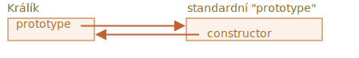
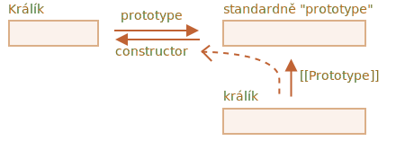

# F.prototype

Pamatujte, že nové objekty mohou být vytvořeny konstruktorem, například `new F()`.

Je-li `F.prototype` objekt, pak operátor `new` jej použije, aby nastavil pro tento nový objekt `[[Prototype]]`.

```smart
JavaScript měl prototypovou dědičnost již od začátku. Byl to jeden z klíčových prvků jazyka.

Ve starých časech k ní však nebyl přímý přístup. Jediné, co spolehlivě fungovalo, byla vlastnost konstruktoru `„prototype“`, popsaná v této kapitole. Existuje tedy mnoho skriptů, které ji stále využívají.
```

Prosíme všimněte si, že `F.prototype` zde znamená regulérní vlastnost jménem `„prototype“` funkce `F`. Zní to trochu podobně pojmu „prototyp“, ale tady máme opravdu na mysli obvyklou vlastnost s tímto názvem.

Zde je příklad:

```js run
let zvíře = {
  žere: true
};

function Králík(jméno) {
  this.jméno = jméno;
}

*!*
Králík.prototype = zvíře;
*/!*

let králík = new Králík("Bílý králík"); //  králík.__proto__ == zvíře

alert( králík.žere ); // true
```

Nastavení `Králík.prototype = zvíře` znamená doslova toto: „Když bude vytvořen `new Králík`, přiřaď `zvíře` do jeho vlastnosti `[[Prototype]]`“.

Výsledný obrázek je následující:


Na obrázku je `„prototype“` vodorovná šipka, která znamená regulérní vlastnost, a `[[Prototype]]` je svislá šipka, která znamená dědění objektu `králík` z objektu `zvíře`.

```smart header="`F.prototype` se použije jen při `new F`"
Vlastnost `F.prototype` se použije, jen když je volán `new F`. Přiřadí `[[Prototype]]` novému objektu.

Jestliže se po vytvoření objektu vlastnost `F.prototype` změní (`F.prototype = <jiný objekt>`), pak nové objekty vytvořené pomocí `new F` budou mít jako `[[Prototype]]` jiný objekt, ale již existujícím objektům zůstane starý prototyp.
```

## Defaultní F.prototype, vlastnost konstruktoru

Vlastnost `„prototype“` má každá funkce, i když ji neuvedeme.

Defaultní `„prototype“` je objekt s jedinou vlastností `constructor`, která ukazuje zpět na samotnou funkci.

Například takto:

```js
function Králík() {}

/* defaultní prototyp
Králík.prototype = { constructor: Králík };
*/
```



Můžeme si to ověřit:

```js run
function Králík() {}
// defaultně:
// Králík.prototype = { constructor: Králík }

alert( Králík.prototype.constructor == Králík ); // true
```

Přirozeně, jestliže nic neuděláme, bude vlastnost `constructor` dostupná skrz `[[Prototype]]` všem králíkům:

```js run
function Králík() {}
// defaultně:
// Králík.prototype = { constructor: Králík }

let králík = new Králík(); // dědí z {constructor: Králík}

alert(králík.constructor == Králík); // true (z prototypu)
```



Vlastnost `constructor` můžeme použít k vytvoření nového objektu stejným konstruktorem, jakým byl vytvořen stávající objekt.

Například zde:

```js run
function Králík(jméno) {
  this.jméno = jméno;
  alert(jméno);
}

let králík = new Králík("Bílý králík");

*!*
let králík2 = new králík.constructor("Černý králík");
*/!*
```

To se hodí, když máme objekt, nevíme, jaký konstruktor pro něj byl použit (např. protože pochází z knihovny třetí strany), a potřebujeme vytvořit další objekt stejného druhu.

Asi nejdůležitější věcí na `„constructor“` je však to, že...

**...samotný JavaScript správnou hodnotu vlastnosti `„constructor“` nezajišťuje.**

Ano, existuje v defaultní vlastnosti funkcí `„prototype“`, ale to je vše. Co se s ním stane později, je zcela na nás.

Konkrétně, jestliže defaultní prototyp úplně nahradíme něčím jiným, žádný `„constructor“` v něm nebude.

Například:

```js run
function Králík() {}
Králík.prototype = {
  skáče: true
};

let králík = new Králík();
*!*
alert(králík.constructor === Králík); // false
*/!*
```

Abychom tedy udrželi správný `„constructor“`, můžeme se rozhodnout, že budeme vlastnosti přidávat do a odebírat z defaultního `„prototype“`, místo abychom jej úplně měnili:

```js
function Králík() {}

// Nepřepíšeme Králík.prototype úplně
// jen do něj něco přidáme
Králík.prototype.skáče = true
// defaultní Králík.prototype.constructor se zachová
```

Nebo alternativně vlastnost `constructor` vytvoříme znovu ručně:

```js
Králík.prototype = {
  skáče: true,
*!*
  constructor: Králík
*/!*
};

// nyní je constructor také korektní, protože jsme jej přidali
```


## Shrnutí

V této kapitole jsme krátce popsali způsob, jak nastavit `[[Prototype]]` pro objekty vytvořené konstruktorem. Později uvidíme pokročilejší programovací vzory, které jsou na tom postaveny.

Všechno je zcela jednoduché, jen několik poznámek, abychom si to ujasnili:

- Vlastnost `F.prototype` (nepleťte si ji s `[[Prototype]]`) nastaví `[[Prototype]]` nových objektů, když je zavolán `new F()`.
- Hodnota `F.prototype` by měla být buď objekt, nebo `null`: jiné hodnoty nefungují.
- Vlastnost `„prototype“` má tento speciální efekt jen tehdy, když je nastavena na konstruktoru a vyvolána pomocí `new`.

Na běžných objektech není `prototype` nic zvláštního:
```js
let uživatel = {
  jméno: "Jan",
  prototype: "Ble-ble" // vůbec žádná magie
};
```

Standardně mají všechny funkce `F.prototype = { constructor: F }`, takže můžeme získat konstruktor objektu přístupem k jeho vlastnosti `„constructor“`.
