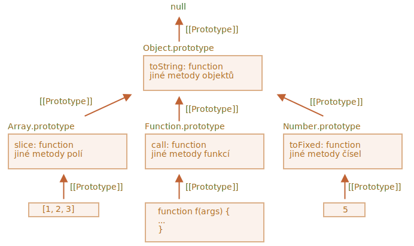

# Nativní prototypy

Vlastnost `„prototype“` je zeširoka využívána samotným jádrem JavaScriptu. Používají ji všechny zabudované konstruktory.

Nejprve se podíváme na detaily a pak na to, jak ji využít k přidání nových schopností vestavěným objektům.

## Object.prototype

Řekněme, že vypíšeme prázdný objekt:

```js run
let obj = {};
alert( obj ); // "[object Object]" ?
```

Kde je kód, který vygeneruje řetězec `"[object Object]"`? Je to vestavěná metoda `toString`, ale kde je? Objekt `obj` je prázdný!

...Krátká notace `obj = {}` je však totéž jako `obj = new Object()`, kde `Object` je vestavěný konstruktor objektu se svou vlastní vlastností `prototype`, která odkazuje na obrovský objekt s metodou `toString` a jinými.

Děje se následující:


Když je zavolán `new Object()` (nebo je vytvořen literální objekt `{...}`), jeho `[[Prototype]]` se nastaví na `Object.prototype` podle pravidla, které jsme probrali v předchozí kapitole:


Když je tedy volána `obj.toString()`, je tato metoda převzata z `Object.prototype`.

Můžeme si to ověřit následovně:

```js run
let obj = {};

alert(obj.__proto__ === Object.prototype); // true

alert(obj.toString === obj.__proto__.toString); //true
alert(obj.toString === Object.prototype.toString); //true
```

Prosíme všimněte si, že ve výše uvedeném řetězci není nad `Object.prototype` žádný další `[[Prototype]]`:

```js run
alert(Object.prototype.__proto__); // null
```

## Jiné zabudované prototypy

Metody v prototypech si uchovávají i jiné vestavěné objekty, např. `Array`, `Date`, `Function` a jiné.

Například když vytvoříme pole `[1, 2, 3]`, interně se použije defaultní konstruktor `new Array()`. Takže `Array.prototype` se stane jeho prototypem a poskytne mu metody. To ušetří spoustu paměti.

Podle specifikace mají všechny vestavěné prototypy na svém vrcholu `Object.prototype`. Proto také někteří lidé říkají, že „všechno je zděděno z objektů“.

Zde je obrázek s celkovým přehledem (pro 3 zabudované objekty, které se tam vejdou):



Ověřme prototypy ručně:

```js run
let pole = [1, 2, 3];

// dědí z Array.prototype?
alert( pole.__proto__ === Array.prototype ); // true

// pak z Object.prototype?
alert( pole.__proto__.__proto__ === Object.prototype ); // true

// a na vrcholu je null.
alert( pole.__proto__.__proto__.__proto__ ); // null
```

Některé metody v prototypech se mohou překrývat, například `Array.prototype` má svou vlastní metodu `toString`, která vypíše prvky oddělené čárkou:

```js run
let pole = [1, 2, 3]
alert(pole); // 1,2,3 <-- výsledek metody Array.prototype.toString
```

Jak jsme už viděli, `Object.prototype` má rovněž `toString`, ale `Array.prototype` je v řetězci blíž, takže se použije varianta pro pole.


Dědičnost zobrazují i prohlížečové nástroje, například vývojářská konzole v Chrome (pro vestavěné objekty bude možná zapotřebí `console.dir`):


Takto fungují i jiné zabudované objekty. Dokonce i funkce -- to jsou objekty z vestavěného konstruktoru `Function` a jejich metody (`call`/`apply` a jiné) se berou z `Function.prototype`. Také funkce mají svůj vlastní `toString`.

```js run
function f() {}

alert(f.__proto__ == Function.prototype); // true
alert(f.__proto__.__proto__ == Object.prototype); // true, zděděna z objektů
```

## Primitivy

Nejzrádnější věc se děje s řetězci, čísly a booleany.

Jak si pamatujeme, nejsou to objekty. Pokud se však pokusíme přistoupit k jejich vlastnostem, vytvoří se dočasné wrappery pomocí vestavěných konstruktorů `String`, `Number` a `Boolean`. Ty poskytnou své metody a zmizí.

Tyto objekty se vytvoří pro nás neviditelně a většina enginů je vyoptimalizuje, ale přesně tímto způsobem to popisuje specifikace. Metody těchto objektů rovněž přebývají v prototypech, které jsou dostupné jako `String.prototype`, `Number.prototype` a `Boolean.prototype`.

```warn header="Hodnoty `null` a `undefined` nemají objektové wrappery"
Speciální hodnoty `null` a `undefined` stojí stranou. Ty nemají objektové wrappery, takže metody a vlastnosti pro ně nejsou dostupné. A neexistují ani odpovídající prototypy.
```

## Měnění nativních prototypů [#native-prototype-change]

Nativní prototypy lze modifikovat. Například přidáme-li metodu do `String.prototype`, stane se dostupnou ve všech řetězcích:

```js run
String.prototype.zobraz = function() {
  alert(this);
};

"BUM!".zobraz(); // BUM!
```

Během procesu vývoje nás mohou napadnout nové zabudované metody, které bychom rádi měli, a můžeme mít sklon přidat je do nativních prototypů. To je však obecně špatný nápad.

```warn
Prototypy jsou globální, takže je snadné získat konflikt. Jestliže dvě knihovny přidají metodu `String.prototype.zobraz`, jedna z nich přepíše metodu druhé.

Modifikace nativního prototypu je tedy obecně považována za špatný nápad.
```

**V moderním programování existuje jen jeden případ, kdy je modifikace nativních prototypů vhodná. Tím je polyfilling.**

Polyfilling je pojem pro nahrazení metody, která existuje ve specifikaci JavaScriptu, ale určitý JavaScriptový engine ji ještě nepodporuje.

Pak ji můžeme implementovat ručně a vsadit ji do zabudovaného prototypu.

Například:

```js run
if (!String.prototype.repeat) { // pokud žádná taková metoda není,
  // přidáme ji do prototypu

  String.prototype.repeat = function(n) {
    // opakuje řetězec n-krát

    // ve skutečnosti by kód měl být trochu složitější
    // (úplný algoritmus je ve specifikaci),
    // ale i nedokonalý polyfill se často považuje za dost dobrý
    return new Array(n + 1).join(this);
  };
}

alert( "La".repeat(3) ); // LaLaLa
```


## Vypůjčení z prototypů

V kapitole <info:call-apply-decorators#method-borrowing> jsme hovořili o vypůjčování metod.

To se děje tak, že vezmeme metodu z jednoho objektu a zkopírujeme ji do druhého.

Některé metody z nativních prototypů se vypůjčují často.

Například jestliže vytváříme objekt podobný poli, můžeme do něj chtít zkopírovat některé metody z `Array`.

Například:

```js run
let obj = {
  0: "Ahoj",
  1: "světe!",
  length: 2,
};

*!*
obj.join = Array.prototype.join;
*/!*

alert( obj.join(',') ); // Ahoj,světe!
```

Funguje to, protože interní algoritmus vestavěné metody `join` se zajímá jen o správné indexy a vlastnost `length`. Nekontroluje, zda objekt je skutečně pole. Takto se chová mnoho zabudovaných metod.

Další možností je dědit nastavením `obj.__proto__` na `Array.prototype`, takže v `obj` budou automaticky dostupné všechny metody `Array`.

To je však nemožné, pokud již `obj` dědí z jiného objektu. Pamatujte, že můžeme dědit jen z jednoho objektu najednou.

Vypůjčování metod je flexibilní a umožňuje nám smíchat funkcionality z různých objektů, jestliže je potřebujeme.

## Shrnutí

- Všechny vestavěné objekty se chovají podle stejného vzorce:
    - Metody jsou uloženy v prototypu (`Array.prototype`, `Object.prototype`, `Date.prototype`, atd.)
    - Samotný objekt si ukládá pouze data (prvky pole, vlastnosti objektu, datum)
- Rovněž primitivy mají metody uložené v prototypech wrapperů: `Number.prototype`, `String.prototype` a `Boolean.prototype`. Wrappery nemají pouze `undefined` a `null`.
- Vestavěné prototypy lze modifikovat nebo do nich vkládat nové metody. Měnit je se však nedoporučuje. Pravděpodobně jediný přijatelný případ je, když přidáváme nový standard, ale JavaScriptový engine ho ještě nepodporuje.
