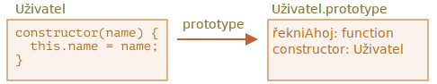

# Základní syntaxe tříd

```quote author="Wikipedie (anglická verze)"
V objektově orientovaném programování je *třída* rozšiřitelná šablona v programovém kódu pro vytváření objektů, která poskytuje počáteční hodnoty stavu (členské proměnné) a implementaci chování (členské funkce nebo metody).
```

V praxi často potřebujeme vytvořit více objektů stejného druhu, např. uživatele, zboží nebo cokoli jiného.

Jak již víme z kapitoly <info:constructor-new>, může nám v tom pomocí `new function`.

V moderním JavaScriptu však existuje pokročilejší konstrukce nazvaná „třída“, která zavádí vynikající nové prvky, užitečné pro objektově orientované programování.

## Syntaxe „class“

Základní syntaxe je:
```js
class MojeTřída {
  // třídní metody
  constructor() { ... }
  metoda1() { ... }
  metoda2() { ... }
  metoda3() { ... }
  ...
}
```

Pak použitím `new MojeTřída()` vytvoříte nový objekt se všemi uvedenými metodami.

Metoda `constructor()` je při `new` volána automaticky, takže v ní můžeme objekt inicializovat.

Například:

```js run
class Uživatel {

  constructor(jméno) {
    this.jméno = jméno;
  }

  řekniAhoj() {
    alert(this.jméno);
  }

}

// Použití:
let uživatel = new Uživatel("Jan");
uživatel.řekniAhoj();
```

Když je zavolán `new Uživatel("Jan")`:
1. Vytvoří se nový objekt.
2. Metoda `constructor` se spustí se zadaným argumentem a přiřadí jej do `this.jméno`.

...Pak můžeme volat objektové metody, například `uživatel.řekniAhoj()`.


```warn header="Mezi třídními metodami není čárka"
Obvyklou chybou začínajících vývojářů je vkládat čárku mezi třídní metody, což má za následek syntaktickou chybu.

Uvedená notace nesmí být zaměňována za objektový literál. Uvnitř třídy nejsou čárky vyžadovány.
```

## Co je to třída?

Co přesně je tedy třída (`class`)? Není to úplně nová entita na úrovni jazyka, jak si můžeme myslet.

Odhoďme veškerou magii a podívejme se, co to ta třída doopravdy je. Pomůže nám to pochopit mnoho složitých aspektů.

V JavaScriptu je třída druh funkce.

Podívejme se sem:

```js run
class Uživatel {
  constructor(jméno) { this.jméno = jméno; }
  řekniAhoj() { alert(this.jméno); }
}

// důkaz: Uživatel je funkce
*!*
alert(typeof Uživatel); // function
*/!*
```

To, co ve skutečnosti provede konstrukce `class Uživatel {...}`, je:

1. Vytvoří funkci jménem `Uživatel`, která se stane výslednou hodnotou deklarace třídy. Kód této funkce se převezme z metody `constructor` (pokud takovou metodu nenapíšeme, předpokládá se, že je prázdný).
2. Uloží do `Uživatel.prototype` třídní metody, např. `řekniAhoj`.

Když po vytvoření objektu `new Uživatel` zavoláme jeho metodu, převezme se z prototypu, přesně jak bylo popsáno v kapitole <info:function-prototype>. Objekt tedy má přístup ke třídním metodám.

Výsledek deklarace `class Uživatel` můžeme ilustrovat jako:



Zde je kód, na kterém to můžeme vidět:

```js run
class Uživatel {
  constructor(jméno) { this.jméno = jméno; }
  řekniAhoj() { alert(this.jméno); }
}

// třída je funkce
alert(typeof Uživatel); // function

// ...nebo přesněji konstruktor
alert(Uživatel === Uživatel.prototype.constructor); // true

// Metody jsou v Uživatel.prototype, např.:
alert(Uživatel.prototype.řekniAhoj); // kód metody řekniAhoj

// v prototypu jsou právě dvě metody
alert(Object.getOwnPropertyNames(Uživatel.prototype)); // constructor, řekniAhoj
```

## Není to jen syntaktický cukr

Někdy lidé říkají, že `class` je „syntaktický cukr“ (syntaxe, která je navržena k tomu, aby byl kód snáze čitelný, ale nezavádí nic nového), protože ve skutečnosti můžeme totéž deklarovat i bez klíčového slova `class`:

```js run
// přepíšeme třídu Uživatel do čistých funkcí

// 1. Vytvoříme funkci konstruktoru
function Uživatel(jméno) {
  this.jméno = jméno;
}
// funkční prototyp má standardně vlastnost "constructor",
// takže ji nemusíme vytvářet

// 2. Přidáme metodu do prototypu
Uživatel.prototype.řekniAhoj = function() {
  alert(this.jméno);
};

// Použití:
let uživatel = new Uživatel("Jan");
uživatel.řekniAhoj();
```

Výsledek této definice je přibližně stejný. Nepochybně tedy existují důvody, proč můžeme `class` považovat za syntaktický cukr, kterým definujeme konstruktor spolu s jeho prototypovými metodami.

Jsou zde však důležité rozdíly.

1. Za prvé, funkce vytvořená pomocí `class` obsahuje speciální vnitřní vlastnost `[[IsClassConstructor]]: true`. Není tedy přesně stejná, jako kdyby byla vytvořena ručně.

    Jazyk si tuto vlastnost ověřuje na různých místech. Například na rozdíl od běžné funkce musí být volána pomocí `new`:

    ```js run
    class Uživatel {
      constructor() {}
    }

    alert(typeof Uživatel); // function
    Uživatel(); // Chyba: Konstruktor třídy Uživatel nesmí být volán bez 'new'
    ```

    Kromě toho řetězcová reprezentace třídního konstruktoru ve většině enginů JavaScriptu začíná „class...“

    ```js run
    class Uživatel {
      constructor() {}
    }

    alert(Uživatel); // class Uživatel { ... }
    ```
    Jsou i jiné rozdíly, které uvidíme později.

2. Třídní metody nejsou enumerovatelné.
    Definice třídy nastavuje přepínač `enumerable` na `false` u všech metod v `"prototype"`.

    To je dobře, protože když provádíme `for..in` nad objektem, nechceme zpravidla jeho třídní metody.

3. Třídy vždy mají `use strict`.
    Veškerý kód uvnitř konstrukce třídy je automaticky ve striktním režimu.

Kromě toho syntaxe `class` přináší mnoho dalších prvků, které probereme později.

## Třídní výraz

Stejně jako funkce mohou i třídy být definovány uvnitř jiného výrazu, předávány, vraceny, přiřazovány atd.

Zde je příklad třídního výrazu:

```js
let Uživatel = class {
  řekniAhoj() {
    alert("Ahoj");
  }
};
```

Obdobně jako pojmenované funkční výrazy, i třídní výrazy mohou mít název.

Jestliže třídní výraz má název, je viditelný jen uvnitř třídy:

```js run
// „Pojmenovaný třídní výraz“
// (takový pojem není ve specifikaci, ale to se podobá pojmenovanému funkčnímu výrazu)
let Uživatel = class *!*MojeTřída*/!* {
  řekniAhoj() {
    alert(MojeTřída); // název MojeTřída je viditelný jen uvnitř třídy
  }
};

new Uživatel().řekniAhoj(); // funguje, zobrazí definici třídy MojeTřída

alert(MojeTřída); // chyba, název MojeTřída není viditelný mimo třídu
```

Můžeme dokonce vytvářet třídy dynamicky „na požádání“, například takto:

```js run
function vytvořTřídu(věta) {
  // deklarujeme třídu a vrátíme ji
  return class {
    řekniAhoj() {
      alert(věta);
    }
  };
}

// Vytvoříme novou třídu
let Uživatel = vytvořTřídu("Ahoj");

new Uživatel().řekniAhoj(); // Ahoj
```


## Gettery/settery

Stejně jako literální objekty mohou třídy obsahovat gettery/settery, vypočítávané vlastnosti a podobně.

Zde je příklad vlastnosti `uživatel.jméno` implementované pomocí `get/set`:

```js run
class Uživatel {

  constructor(jméno) {
    // vyvolá setter
    this.jméno = jméno;
  }

*!*
  get jméno() {
*/!*
    return this._jméno;
  }

*!*
  set jméno(hodnota) {
*/!*
    if (hodnota.length < 3) {
      alert("Jméno je příliš krátké.");
      return;
    }
    this._jméno = hodnota;
  }

}

let uživatel = new Uživatel("Jan");
alert(uživatel.jméno); // Jan

uživatel = new Uživatel(""); // Jméno je příliš krátké.
```

Technicky taková deklarace třídy funguje tak, že vytvoří gettery a settery v prototypu `Uživatel.prototype`.

## Vypočítávané názvy [...]

Zde je příklad s vypočítávaným názvem metody pomocí hranatých závorek `[...]`:

```js run
class Uživatel {

*!*
  ['řekni' + 'Ahoj']() {
*/!*
    alert("Ahoj");
  }

}

new Uživatel().řekniAhoj();
```

Takové vlastnosti se snadno pamatují, neboť připomínají vlastnosti literálních objektů.

## Třídní pole

```warn header="Staré prohlížeče mohou potřebovat polyfill"
Třídní pole byla do jazyka přidána teprve nedávno.
```

Dosud naše třídy obsahovaly pouze metody.

„Třídní pole“ je syntaxe, která umožňuje přidávat libovolné vlastnosti.

Například přidáme vlastnost `jméno` do třídy `class Uživatel`:

```js run
class Uživatel {
*!*
  jméno = "Jan";
*/!*

  řekniAhoj() {
    alert(`Ahoj, ${this.jméno}!`);
  }
}

new Uživatel().řekniAhoj(); // Ahoj, Jan!
```

Zapíšeme do deklarace jednoduše `<název vlastnosti> = <hodnota>` a to je vše.

Důležitý rozdíl třídních polí spočívá v tom, že se nastavují na jednotlivých objektech, ne na `Uživatel.prototype`:

```js run
class Uživatel {
*!*
  jméno = "Jan";
*/!*
}

let uživatel = new Uživatel();
alert(uživatel.jméno); // Jan
alert(Uživatel.prototype.jméno); // undefined
```

Můžeme také přiřazovat hodnoty pomocí složitějších výrazů a volání funkcí:

```js run
class Uživatel {
*!*
  jméno = prompt("Jméno, prosím?", "Jan");
*/!*
}

let uživatel = new Uživatel();
alert(uživatel.jméno); // Jan
```


### Vytváření vázaných metod pomocí třídních polí

Jak jsme demonstrovali v kapitole <info:bind>, funkce v JavaScriptu mají vázané `this`, které závisí na kontextu volání.

Jestliže je tedy objektová metoda předána jinam a volána v jiném kontextu, `this` už nebude obsahovat odkaz na její objekt.

Například tento kód zobrazí `undefined`:

```js run
class Tlačítko {
  constructor(hodnota) {
    this.hodnota = hodnota;
  }

  stiskni() {
    alert(this.hodnota);
  }
}

let tlačítko = new Tlačítko("ahoj");

*!*
setTimeout(tlačítko.stiskni, 1000); // undefined
*/!*
```

Tento problém se nazývá „ztráta `this`“.

Jak jsme probrali v kapitole <info:bind>, existují dva přístupy, jak jej opravit:

1. Předat wrapperovou funkci, například `setTimeout(() => tlačítko.stiskni(), 1000)`.
2. Navázat metodu na objekt, např. v konstruktoru.

Třídní pole poskytují další, docela elegantní syntaxi:

```js run
class Tlačítko {
  constructor(hodnota) {
    this.hodnota = hodnota;
  }
*!*
  stiskni = () => {
    alert(this.hodnota);
  }
*/!*
}

let tlačítko = new Tlačítko("ahoj");

setTimeout(tlačítko.stiskni, 1000); // ahoj
```

Třídní pole `stiskni = () => {...}` se vytvoří pro každý objekt zvlášť, je v něm samostatná funkce pro každý objekt `Tlačítko` a `this` uvnitř ní se odkazuje na tento objekt. Můžeme předávat `tlačítko.stiskni` kamkoli a hodnota `this` bude vždy správná.

Obzvláště užitečné je to v prohlížečových prostředích u listenerů událostí.

## Shrnutí

Základní syntaxe třídy vypadá takto:

```js
class MojeTřída {
  vlastnost = hodnota; // vlastnost

  constructor(...) { // konstruktor
    // ...
  }

  metoda(...) {} // metoda

  get něco(...) {} // getter
  set něco(...) {} // setter

  [Symbol.iterator]() {} // metoda s vypočítávaným názvem (zde symbol)
  // ...
}
```

Technicky je `MojeTřída` funkce (ta, kterou poskytneme jako `constructor`), zatímco metody, gettery a settery se zapisují do prototypu `MojeTřída.prototype`.

V dalších kapitolách se o třídách naučíme víc, včetně dědičnosti a jiných prvků.