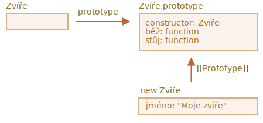
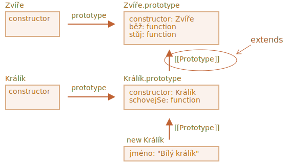
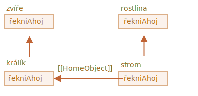

# Třídní dědičnost

Třídní dědičnost je způsob, jak může jedna třída rozšířit jinou.

Můžeme tedy vytvořit novou funkcionalitu nad existující.

## Klíčové slovo „extends“

Řekněme, že máme třídu `Zvíře`:

```js
class Zvíře {
  constructor(jméno) {
    this.rychlost = 0;
    this.jméno = jméno;
  }
  běž(rychlost) {
    this.rychlost = rychlost;
    alert(`${this.jméno} běží rychlostí ${this.rychlost}.`);
  }
  stůj() {
    this.rychlost = 0;
    alert(`${this.jméno} klidně stojí.`);
  }
}

let zvíře = new Zvíře("Moje zvíře");
```

Takto můžeme reprezentovat objekt `zvíře` a třídu `Zvíře` graficky:



...A rádi bychom vytvořili další třídu `Králík`.

Protože králíci jsou zvířata, třída `Králík` by měla být založena na třídě `Zvíře` a mít přístup k metodám zvířete, aby králíci mohli dělat to, co dělají „všeobecná“ zvířata.

Syntaxe pro rozšíření jiné třídy je: `class Potomek extends Rodič`.

Vytvořme třídu `Králík`, která bude zděděna z třídy `Zvíře`:

```js
*!*
class Králík extends Zvíře {
*/!*
  schovejSe() {
    alert(`${this.jméno} se schovává!`);
  }
}

let králík = new Králík("Bílý králík");

králík.běž(5); // Bílý králík běží rychlostí 5.
králík.schovejSe(); // Bílý králík se schovává!
```

Objekt třídy `Králík` má přístup jak k metodám třídy `Králík`, např. `králík.schovejSe()`, tak k metodám třídy `Zvíře`, např. `králík.běž()`.

Interně klíčové slovo `extends` funguje na principu staré dobré mechaniky prototypů. Nastaví `Králík.prototype.[[Prototype]]` na `Zvíře.prototype`. Jestliže tedy metoda není nalezena v `Králík.prototype`, JavaScript ji vezme ze `Zvíře.prototype`.



Například aby engine nalezl metodu `králík.běž`, prověří (na obrázku zdola nahoru):
1. Objekt `králík` (nemá žádné `běž`).
2. Jeho prototyp, tedy `Králík.prototype` (má `schovejSe`, ale ne `běž`).
3. Jeho prototyp, což je (díky `extends`) `Zvíře.prototype`, který konečně má metodu `běž`.

Jak si můžeme pamatovat z kapitoly <info:native-prototypes>, samotný JavaScript používá prototypovou dědičnost pro vestavěné objekty. Například `Date.prototype.[[Prototype]]` je `Object.prototype`. To je důvod, proč mají data přístup k obecným objektovým metodám.

````smart header="Za `extends` smí být jakýkoli výraz"
Syntaxe třídy umožňuje za `extends` specifikovat nejenom třídu, ale jakýkoli výraz.

Například volání funkce, které generuje rodičovskou třídu:

```js run
function f(věta) {
  return class {
    řekniAhoj() { alert(věta); }
  };
}

*!*
class Uživatel extends f("Ahoj") {}
*/!*

new Uživatel().řekniAhoj(); // Ahoj
```
Zde je třída `Uživatel` zděděna z výsledku volání `f("Ahoj")`.

To může být užitečné pro pokročilé programovací vzory, když používáme funkce ke generování tříd závisejících na mnoha podmínkách a můžeme z nich dědit.
````

## Přepisování metod

Nyní se posuňme dál a přepišme metodu. Standardně se všechny metody, které nejsou uvedeny v `class Králík`, berou z `class Zvíře` rovnou tak, „jak jsou“.

Jestliže však specifikujeme ve třídě `Králík` svou vlastní metodu, např. `stůj()`, bude místo toho použita ona:

```js
class Králík extends Zvíře {
  stůj() {
    // ...nyní bude při volání králík.stůj() použita tato metoda
    // namísto stůj() ze třídy Zvíře
  }
}
```

Obvykle však nechceme rodičovskou metodu úplně nahradit, ale spíše na ní stavět, abychom její funkcionalitu vylepšili nebo rozšířili. Uděláme něco v naší metodě, ale v tomto procesu, před ním nebo po něm voláme rodičovskou metodu.

Třídy pro tento účel poskytují klíčové slovo `„super“`.

- `super.metoda(...)` volá rodičovskou metodu.
- `super(...)` volá rodičovský konstruktor (pouze uvnitř našeho konstruktoru).

Například nechme našeho králíka, aby se po zastavení automaticky schoval:

```js run
class Zvíře {

  constructor(jméno) {
    this.rychlost = 0;
    this.jméno = jméno;
  }

  běž(rychlost) {
    this.rychlost = rychlost;
    alert(`${this.jméno} běží rychlostí ${this.rychlost}.`);
  }

  stůj() {
    this.rychlost = 0;
    alert(`${this.jméno} klidně stojí.`);
  }

}

class Králík extends Zvíře {
  schovejSe() {
    alert(`${this.jméno} se schovává!`);
  }

*!*
  stůj() {
    super.stůj(); // volá rodičovskou metodu stůj
    this.schovejSe(); // a poté schovejSe
  }
*/!*
}

let králík = new Králík("Bílý králík");

králík.běž(5); // Bílý králík běží rychlostí 5.
králík.stůj(); // Bílý králík klidně stojí. Bílý králík se schovává!
```

Nyní má `Králík` metodu `stůj`, která při provedení volá rodičovskou metodu `super.stůj()`.

````smart header="Šipkové funkce nemají `super`"
Jak jsme zmínili v kapitole <info:arrow-functions>, šipkové funkce nemají `super`.

Pokud k němu přistoupíme, převezme se z vnější funkce. Například:

```js
class Králík extends Zvíře {
  stůj() {
    setTimeout(() => super.stůj(), 1000); // za 1 sekundu volá rodičovskou metodu stůj
  }
}
```

`super` v šipkové funkci je stejné jako ve `stůj()`, funguje tedy tak, jak je zamýšleno. Kdybychom zde uvedli „obyčejnou“ funkci, nastala by chyba:

```js
// Neočekávaný super
setTimeout(function() { super.stůj() }, 1000);
```
````

## Přepisování konstruktorů

S konstruktory se to začíná trochu zamotávat.

Až dosud `Králík` neměl svůj vlastní `constructor`.

Podle [specifikace](https://tc39.github.io/ecma262/#sec-runtime-semantics-classdefinitionevaluation), jestliže třída rozšiřuje jinou třídu a nemá `constructor`, vygeneruje se následující „prázdný“ `constructor`:

```js
class Králík extends Zvíře {
  // generován pro rozšiřující třídy bez vlastního konstruktoru
*!*
  constructor(...argumenty) {
    super(...argumenty);
  }
*/!*
}
```

Jak vidíme, v zásadě volá rodičovský `constructor` a předá mu všechny argumenty. To se stane, když si nenapíšeme svůj vlastní konstruktor.

Nyní přidejme do třídy `Králík` vlastní konstruktor, který bude navíc k vlastnosti `jméno` specifikovat vlastnost `délkaUcha`:

```js run
class Zvíře {
  constructor(jméno) {
    this.rychlost = 0;
    this.jméno = jméno;
  }
  // ...
}

class Králík extends Zvíře {

*!*
  constructor(jméno, délkaUcha) {
    this.rychlost = 0;
    this.jméno = jméno;
    this.délkaUcha = délkaUcha;
  }
*/!*

  // ...
}

*!*
// Nefunguje!
let králík = new Králík("Bílý králík", 10); // Chyba: this není definováno.
*/!*
```

Ouha! Obdrželi jsme chybu. Nyní nemůžeme vytvářet králíky. Co bylo špatně?

Stručná odpověď zní:

- **Konstruktory ve zděděných třídách musejí volat `super(...)` a (!) musejí to udělat před použitím `this`.**

...Ale proč? Co se tady děje? Tento požadavek zajisté vypadá podivně.

Samozřejmě vysvětlení existuje. Pojďme do detailů, abychom doopravdy pochopili, co se tady odehrává.

V JavaScriptu je rozdíl mezi konstruktorem zděděné třídy (tzv. „odvozeným konstruktorem“) a jinými funkcemi. Odvozený konstruktor má speciální interní vlastnost `[[ConstructorKind]]:"derived"`. To je speciální interní štítek.

Tato vlastnost ovlivňuje jeho chování s `new`.

- Když je pomocí `new` volána obvyklá funkce, vytvoří prázdný objekt a přiřadí jej do `this`.
- Ale když se spustí odvozený konstruktor, neudělá to. Očekává, že tuto práci odvede rodičovský konstruktor.

Odvozený konstruktor tedy musí volat `super`, aby spustil svůj rodičovský (základní) konstruktor, jinak objekt pro `this` nebude vytvořen. A my dostaneme chybu.

Aby konstruktor `Králík` fungoval, musí volat `super()` ještě před použitím `this`, například:

```js run
class Zvíře {

  constructor(jméno) {
    this.rychlost = 0;
    this.jméno = jméno;
  }

  // ...
}

class Králík extends Zvíře {

  constructor(jméno, délkaUcha) {
*!*
    super(jméno);
*/!*
    this.délkaUcha = délkaUcha;
  }

  // ...
}

*!*
// nyní je to v pořádku
let králík = new Králík("Bílý králík", 10);
alert(králík.jméno); // Bílý králík
alert(králík.délkaUcha); // 10
*/!*
```

### Přepisování třídních polí: záludnost

```warn header="Pokročilá poznámka"
Tato poznámka předpokládá, že již máte s třídami určité zkušenosti, možná i z jiných programovacích jazyků.

Poskytuje lepší náhled do jazyka a rovněž vysvětluje chování, které může být zdrojem chyb (ale ne příliš často).

Pokud shledáte obtížným jí porozumět, prostě ji přeskočte a pokračujte ve čtení. Pak se k ní vraťte někdy později.
```

Přepisovat můžeme nejen metody, ale i třídní pole.

Nicméně když přistoupíme k přepsanému poli v rodičovském konstruktoru, je tady ošidné chování, poněkud odlišné od většiny ostatních programovacích jazyků.

Uvažujme tento příklad:

```js run
class Zvíře {
  jméno = 'zvíře';

  constructor() {
    alert(this.jméno); // (*)
  }
}

class Králík extends Zvíře {
  jméno = 'králík';
}

new Zvíře(); // zvíře
*!*
new Králík(); // zvíře
*/!*
```

Zde třída `Králík` rozšiřuje třídu `Zvíře` a přepisuje pole `jméno` svou vlastní hodnotou.

Ve třídě `Králík` není vlastní konstruktor, takže se zavolá konstruktor třídy `Zvíře`.

Zajímavé je, že v obou případech `new Zvíře()` i `new Králík()` volání `alert` na řádku `(*)` zobrazí `zvíře`.

**Jinými slovy, rodičovský konstruktor vždy používá svou vlastní hodnotu pole, ne přepsanou.**

Co je na tom zvláštního?

Pokud to ještě není jasné, prosíme porovnejte si to s metodami.

Zde je stejný kód, ale místo pole `this.jméno` voláme metodu `this.zobrazJméno()`:

```js run
class Zvíře {
  zobrazJméno() {  // namísto this.jméno = 'zvíře'
    alert('zvíře');
  }

  constructor() {
    this.zobrazJméno(); // namísto alert(this.jméno);
  }
}

class Králík extends Zvíře {
  zobrazJméno() {
    alert('králík');
  }
}

new Zvíře(); // zvíře
*!*
new Králík(); // králík
*/!*
```

Prosíme všimněte si: nyní je výstup odlišný.

A to je to, co přirozeně očekáváme. Když je v odvozené třídě volán rodičovský konstruktor, použije přepsanou metodu.

...Ale pro třídní pole tomu tak není. Jak bylo uvedeno, rodičovský konstruktor vždy používá rodičovské pole.

Proč je zde tento rozdíl?

Důvod spočívá v pořadí inicializace polí. Třídní pole je inicializováno:
- Před konstruktorem rodičovské třídy (který nic nerozšiřuje),
- ihned po `super()` pro odvozenou třídu.

V našem případě je `Králík` odvozená třída. Není v ní žádný `constructor()`. Jak bylo dříve uvedeno, je to totéž, jako by tam byl prázdný konstruktor obsahující pouze `super(...argumenty)`.

Takže `new Králík()` volá `super()`, tím spustí rodičovský konstruktor, a (podle pravidla pro odvozené třídy) jsou až poté inicializována jeho třídní pole. Ve chvíli spuštění rodičovského konstruktoru ještě neexistují žádná pole třídy `Králík`, takže se použijí pole třídy `Zvíře`.

Tento jemný rozdíl mezi poli a metodami je specifický pro JavaScript.

Naštěstí se toto chování projevuje jen tehdy, když je přepsané pole použito v rodičovském konstruktoru. Pak může být obtížné pochopit, co se děje, proto to tady vysvětlujeme.

Kdyby to byl problém, můžeme ho opravit použitím metod nebo getterů/setterů namísto polí.

## Super: interní mechanismy, [[HomeObject]]

```warn header="Pokročilá informace"
Jestliže tento tutoriál čtete poprvé, můžete tuto část přeskočit.

Hovoří o interních mechanismech v pozadí dědičnosti a `super`.
```

Pronikněme trochu hlouběji pod kapuci `super`. Uvidíme tam zajímavé věci.

Nejprve je třeba říci, že podle všeho, čemu jsme se dosud naučili, je nemožné, aby `super` vůbec fungovalo!

Ano, zajisté, zeptejme se sami sebe, jak by to mělo technicky fungovat? Když se spustí objektová metoda, dostane jako `this` aktuální objekt. Pokud pak zavoláme `super.metoda()`, engine musí získat metodu `metoda` z prototypu aktuálního objektu. Ale jak?

Tento úkol se může zdát jednoduchý, ale není. Engine zná aktuální objekt `this`, takže může získat rodičovskou metodu `metoda` jako `this.__proto__.metoda`. Naneštěstí takové „naivní“ řešení nebude fungovat.

Demonstrujme si problém. Pro zjednodušení bez tříd, jen s použitím planých objektů.

Pokud nechcete znát detaily, můžete tuto část přeskočit a pokračovat k podkapitole `[[HomeObject]]`. Neuškodí vám to. Nebo si ji přečtěte, pokud chcete porozumět věcem do hloubky.

V níže uvedeném příkladu `králík.__proto__ = zvíře`. Nyní to zkusme: v `králík.žer()` zavolejme `zvíře.žer()` pomocí `this.__proto__`:

```js run
let zvíře = {
  jméno: "Zvíře",
  žer() {
    alert(`${this.jméno} žere.`);
  }
};

let králík = {
  __proto__: zvíře,
  jméno: "Králík",
  žer() {
*!*
    // předpokládáme, že takto funguje super.žer()
    this.__proto__.žer.call(this); // (*)
*/!*
  }
};

králík.žer(); // Králík žere.
```

Na řádku `(*)` převezmeme metodu `žer` z prototypu (`zvíře`) a zavoláme ji v kontextu aktuálního objektu. Prosíme všimněte si, že zde je důležité `.call(this)`, protože pouhé `this.__proto__.žer()` by volalo rodičovskou metodu `žer` v kontextu prototypu, ne aktuálního objektu.

A ve výše uvedeném kódu to skutečně funguje tak, jak zamýšlíme: máme správné `alert`.

Nyní přidáme do řetězce jeden další objekt. Uvidíme, jak se to rozbije:

```js run
let zvíře = {
  jméno: "Zvíře",
  žer() {
    alert(`${this.jméno} žere.`);
  }
};

let králík = {
  __proto__: zvíře,
  žer() {
    // ...poskakujeme po okolí králičím stylem a zavoláme metodu rodiče (zvíře)
    this.__proto__.žer.call(this); // (*)
  }
};

let dlouhouchý = {
  __proto__: králík,
  žer() {
    // ...uděláme něco s dlouhýma ušima a zavoláme metodu rodiče (králík)
    this.__proto__.žer.call(this); // (**)
  }
};

*!*
dlouhouchý.žer(); // Chyba: Překročena maximální velikost zásobníku
*/!*
```

Kód už nefunguje! Když se pokusíme zavolat `dlouhouchý.žer()`, uvidíme chybu.

Nemusí to být tak zřejmé, ale když si projdeme volání `dlouhouchý.žer()`, uvidíme proč. Na obou řádcích `(*)` i `(**)` je hodnota `this` aktuální objekt (`dlouhouchý`). To je podstatné: všechny objektové metody dostanou jako `this` aktuální objekt, ne prototyp nebo něco jiného.

Na obou řádcích `(*)` a `(**)` je tedy hodnota `this.__proto__` naprosto stejná: `králík`. Oba volají `králík.žer` v nekonečné smyčce, aniž by v řetězci postoupily výš.

Zde je obrázek toho, co se stane:


1. Uvnitř `dlouhouchý.žer()` řádek `(**)` volá `králík.žer` a poskytne mu `this=dlouhouchý`.
    ```js
    // uvnitř dlouhouchý.žer() máme this = dlouhouchý
    this.__proto__.žer.call(this) // (**)
    // se promění na
    dlouhouchý.__proto__.žer.call(this)
    // to je
    králík.žer.call(this);
    ```
2. Pak na řádku `(*)` metody `králík.žer` bychom rádi předali volání v řetězci ještě výš, ale `this=dlouhouchý`, takže `this.__proto__.žer` je opět `králík.žer`!

    ```js
    // uvnitř králík.žer() máme rovněž this = dlouhouchý
    this.__proto__.žer.call(this) // (*)
    // se promění na
    dlouhouchý.__proto__.žer.call(this)
    // neboli (opět)
    králík.žer.call(this);
    ```

3. ...Takže `králík.žer` volá sama sebe v nekonečné smyčce, protože nemůže postoupit nikam výš.

Tento problém nelze vyřešit pouze pomocí `this`.

### `[[HomeObject]]`

Aby JavaScript poskytl řešení, přidává navíc jednu speciální vlastnost pro funkce: `[[HomeObject]]`.

Když je funkce specifikována jako metoda třídy nebo objektu, tento objekt se stane hodnotou její vlastnosti `[[HomeObject]]`.

Pak jej `super` používá k tomu, aby vyhodnotil rodičovský prototyp a jeho metody.

Podívejme se, jak to funguje, nejprve s planými objekty:

```js run
let zvíře = {
  jméno: "Zvíře",
  žer() {         // zvíře.žer.[[HomeObject]] == zvíře
    alert(`${this.jméno} žere.`);
  }
};

let králík = {
  __proto__: zvíře,
  jméno: "Králík",
  žer() {         // králík.žer.[[HomeObject]] == králík
    super.žer();
  }
};

let dlouhouchý = {
  __proto__: králík,
  jméno: "Dlouhé ucho",
  žer() {         // dlouhouchý.žer.[[HomeObject]] == dlouhouchý
    super.žer();
  }
};

*!*
// funguje správně
dlouhouchý.žer();  // Dlouhé ucho žere.
*/!*
```

Díky mechanice `[[HomeObject]]` to funguje tak, jak jsme zamýšleli. Metoda, např. `dlouhouchý.žer`, zná svůj `[[HomeObject]]` a převezme rodičovskou metodu z jeho prototypu. Bez jakéhokoli použití `this`.

### Metody nejsou „volné“

Jak již víme, funkce jsou v JavaScriptu obecně „volné“, nevázané k objektům. Mohou tedy být kopírovány mezi objekty a volány s jiným `this`.

Pouhá existence `[[HomeObject]]` však tento princip porušuje, jelikož metody si pamatují své objekty. `[[HomeObject]]` nemůže být změněn, takže tato vazba je trvalá.

Jediné místo v jazyce, kde je `[[HomeObject]]` používán, je `super`. Jestliže tedy metoda nepoužívá `super`, můžeme ji stále považovat za volnou a kopírovat ji mezi objekty. Avšak se `super` se věci mohou pokazit.

Zde je příklad špatného výsledku `super` po kopírování:

```js run
let zvíře = {
  řekniAhoj() {
    alert(`Jsem zvíře`);
  }
};

// králík je zděděn ze zvířete
let králík = {
  __proto__: zvíře,
  řekniAhoj() {
    super.řekniAhoj();
  }
};

let rostlina = {
  řekniAhoj() {
    alert("Jsem rostlina");
  }
};

// strom je zděděn z rostliny
let strom = {
  __proto__: rostlina,
*!*
  řekniAhoj: králík.řekniAhoj // (*)
*/!*
};

*!*
strom.řekniAhoj();  // Jsem zvíře (?!?)
*/!*
```

Volání `strom.řekniAhoj()` zobrazí „Jsem zvíře“. Rozhodně špatně.

Důvod je prostý:
- Na řádku `(*)` je metoda `strom.řekniAhoj` zkopírována z objektu `králík`. Možná jsme se chtěli zdržet zdvojení kódu?
- Její `[[HomeObject]]` je `králík`, protože byla vytvořena v objektu `králík`. Není žádný způsob, jak `[[HomeObject]]` změnit.
- Kód metody `strom.řekniAhoj()` má uvnitř `super.řekniAhoj()`. Ten jde nahoru od objektu `králík` a přebírá tuto metodu z objektu `zvíře`.

Zde je diagram toho, co se stane:



### Metody, ne funkční vlastnosti

`[[HomeObject]]` je definován pro metody ve třídách i v planých objektech. Pro objekty však metody musejí být specifikovány přímo jako `metoda()`, ne jako `„metoda: function()“`.

Rozdíl pro nás nemusí být důležitý, ale pro JavaScript je podstatný.

V níže uvedeném příkladu se pro porovnání používá syntaxe bez metod. Vlastnost `[[HomeObject]]` se nenastaví a dědičnost nefunguje:

```js run
let zvíře = {
  žer: function() { // úmyslně píšeme toto namísto žer() {...
    // ...
  }
};

let králík = {
  __proto__: zvíře,
  žer: function() {
    super.žer();
  }
};

*!*
králík.žer();  // Chyba při volání super (protože není žádný [[HomeObject]])
*/!*
```

## Shrnutí

1. Pro rozšíření třídy: `class Potomek extends Rodič`:
    - To znamená, že `Potomek.prototype.__proto__` bude `Rodič.prototype`, takže metody budou zděděny.
2. Když přepisujeme konstruktor:
    - V konstruktoru třídy `Potomek` musíme před použitím `this` zavolat rodičovský konstruktor pomocí `super()`.
3. Když přepisujeme jinou metodu:
    - V metodě třídy `Potomek` můžeme pomocí `super.metoda()` volat metodu třídy `Rodič`.
4. Interní záležitosti:
    - Metody si pamatují svou třídu/objekt v interní vlastnosti `[[HomeObject]]`. Tímto způsobem `super` vyhodnocuje rodičovské metody.
    - Není tedy bezpečné kopírovat metodu obsahující `super` z jednoho objektu do jiného.

Navíc:
- Šipkové funkce nemají vlastní `this` ani `super`, takže průhledně zapadají do okolního kontextu.
