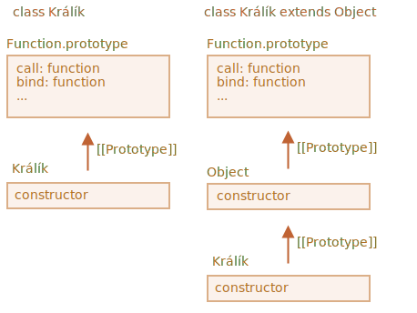

Nejprve se podívejme, proč poslední uvedený kód nefunguje.

Důvod bude zřejmý, když se ho pokusíme spustit. Konstruktor zděděné třídy musí volat `super()`, jinak nebude „definováno“ `„this“`.

Zde je tedy oprava:

```js run
class Králík extends Object {
  constructor(jméno) {
*!*
    super(); // při dědění je nutné volat rodičovský konstruktor
*/!*
    this.jméno = jméno;
  }
}

let králík = new Králík("Bobek");

alert( králík.hasOwnProperty('jméno') ); // true
```

To však ještě není všechno.

I po této opravě bude stále existovat důležitý rozdíl mezi `„class Králík extends Object“` a `class Králík`.

Jak víme, syntaxe „extends“ nastavuje dva prototypy:

1. Mezi `"prototype"` konstruktorů (pro metody).
2. Mezi samotnými konstruktory (pro statické metody).

V případě `class Králík extends Object` to znamená:

```js run
class Králík extends Object {}

alert( Králík.prototype.__proto__ === Object.prototype ); // (1) true
alert( Králík.__proto__ === Object ); // (2) true
```

`Králík` tedy nyní poskytuje přístup ke statickým metodám třídy `Object` přes třídu `Králík`, například:

```js run
class Králík extends Object {}

*!*
// běžně voláme Object.getOwnPropertyNames
alert ( Králík.getOwnPropertyNames({a: 1, b: 2})); // a,b
*/!*
```

Jestliže však nemáme `extends Object`, pak se `Králík.__proto__` nenastaví na `Object`.

Zde je ukázka:

```js run
class Králík {}

alert( Králík.prototype.__proto__ === Object.prototype ); // (1) true
alert( Králík.__proto__ === Object ); // (2) false (!)
alert( Králík.__proto__ === Function.prototype ); // jako standardně kterákoli funkce

*!*
// chyba, ve třídě Králík taková funkce není
alert ( Králík.getOwnPropertyNames({a: 1, b: 2})); // Chyba
*/!*
```

`Králík` tedy v tomto případě neposkytuje přístup ke statickým metodám třídy `Object`.

Mimochodem, `Function.prototype` obsahuje „obecné“ funkční metody, např. `call`, `bind` atd. Ty jsou definitivně dostupné v obou případech, protože pro zabudovaný konstruktor třídy `Object` platí `Object.__proto__ === Function.prototype`.

Zde je obrázek:



Abychom to tedy zkrátili, existují dva rozdíly:

| class Králík | class Králík extends Object  |
|--------------|------------------------------|
| --             | musí v konstruktoru volat `super()` |
| `Králík.__proto__ === Function.prototype` | `Králík.__proto__ === Object` |
