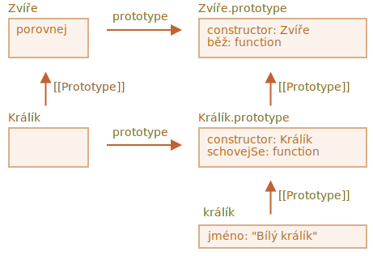

# Statické vlastnosti a metody

<<<<<<< HEAD
Metodu můžeme přiřadit samotné funkci třídy namísto jejímu `„prototype"`. Takové metody se nazývají *statické*.

Ve třídě jsou předznamenány klíčovým slovem `static`, například:
=======
We can also assign a method to the class as a whole. Such methods are called *static*.

In a class declaration, they are prepended by `static` keyword, like this:
>>>>>>> 741d90ce8a730d66e987bff5e9794d6e41cb2f05

```js run
class Uživatel {
*!*
  static statickáMetoda() {
*/!*
    alert(this === Uživatel);
  }
}

Uživatel.statickáMetoda(); // true
```

To ve skutečnosti udělá totéž, jako kdybychom ji přímo přiřadili jako vlastnost:

```js run
class Uživatel { }

Uživatel.statickáMetoda = function() {
  alert(this === Uživatel);
};

Uživatel.statickáMetoda(); // true
```

Hodnota `this` ve volání `Uživatel.statickáMetoda()` je samotný třídní konstruktor `Uživatel` (podle pravidla „objekt před tečkou“).

<<<<<<< HEAD
Statické metody se obvykle používají k implementaci funkcí, které patří třídě, ale žádnému jejímu konkrétnímu objektu.

Například máme objekty třídy `Článek` a potřebujeme funkci, která je bude porovnávat. Přirozené řešení by bylo přidat metodu `Článek.porovnej`, například:
=======
Usually, static methods are used to implement functions that belong to the class as a whole, but not to any particular object of it.

For instance, we have `Article` objects and need a function to compare them.

A natural solution would be to add `Article.compare` static method:
>>>>>>> 741d90ce8a730d66e987bff5e9794d6e41cb2f05

```js run
class Článek {
  constructor(titulek, datum) {
    this.titulek = titulek;
    this.datum = datum;
  }

*!*
  static porovnej(článekA, článekB) {
    return článekA.datum - článekB.datum;
  }
*/!*
}

// použití
let články = [
  new Článek("HTML", new Date(2019, 1, 1)),
  new Článek("CSS", new Date(2019, 0, 1)),
  new Článek("JavaScript", new Date(2019, 11, 1))
];

*!*
články.sort(Článek.porovnej);
*/!*

alert( články[0].titulek ); // CSS
```

<<<<<<< HEAD
Zde metoda `Článek.porovnej` stojí „nad“ články jako způsob jejich porovnávání. Není to metoda článku, ale metoda celé třídy.

Jiným příkladem může být tzv. „tovární“ metoda. Představme si, že potřebujeme několik způsobů, jak vytvořit článek:
=======
Here `Article.compare` method stands "above" articles, as a means to compare them. It's not a method of an article, but rather of the whole class.

Another example would be a so-called "factory" method.

Let's say, we need multiple ways to create an article:
>>>>>>> 741d90ce8a730d66e987bff5e9794d6e41cb2f05

1. Vytvořit jej ze zadaných parametrů (`titulek`, `datum` atd.).
2. Vytvořit prázdný článek s dnešním datem.
3. ...nebo nějak jinak.

První způsob můžeme implementovat konstruktorem. A pro druhý můžeme vytvořit statickou metodu třídy.

<<<<<<< HEAD
Například `Článek.vytvořDnešní()` zde:
=======
Such as `Article.createTodays()` here:
>>>>>>> 741d90ce8a730d66e987bff5e9794d6e41cb2f05

```js run
class Článek {
  constructor(titulek, datum) {
    this.titulek = titulek;
    this.datum = datum;
  }

*!*
  static vytvořDnešní() {
    // pamatujte, že this = Článek
    return new this("Dnešní přehled", new Date());
  }
*/!*
}

let článek = Článek.vytvořDnešní();

alert( článek.titulek ); // Dnešní přehled
```

Nyní pokaždé, když budeme potřebovat vytvořit dnešní přehled, můžeme volat `Článek.vytvořDnešní()`. Opět to není metoda článku, ale metoda celé třídy.

Statické metody se také používají ve třídách vztažených k databázím pro hledání/ukládání/odstraňování záznamů z databáze, například:

```js
<<<<<<< HEAD
// předpokládejme, že Článek je speciální třída pro práci s články
// statická metoda pro odstranění článku:
Článek.odstraň({id: 12345});
=======
// assuming Article is a special class for managing articles
// static method to remove the article by id:
Article.remove({id: 12345});
>>>>>>> 741d90ce8a730d66e987bff5e9794d6e41cb2f05
```

## Statické vlastnosti

[recent browser=Chrome]

Statické vlastnosti jsou rovněž možné. Vypadají jako regulérní třídní vlastnosti, ale jsou předznamenány `static`:

```js run
class Článek {
  static vydavatel = "Ilja Kantor";
}

alert( Článek.vydavatel ); // Ilja Kantor
```

To je totéž jako přímé přiřazení do třídy `Článek`:

```js
Článek.vydavatel = "Ilja Kantor";
```

## Dědičnost statických vlastností a metod [#statics-and-inheritance]

Statické vlastnosti a metody se dědí.

Například `Zvíře.porovnej` a `Zvíře.planeta` v níže uvedeném kódu se dědí a jsou dostupné jako `Králík.porovnej` a `Králík.planeta`:

```js run
class Zvíře {
  static planeta = "Země";

  constructor(jméno, rychlost) {
    this.rychlost = rychlost;
    this.jméno = jméno;
  }

  běž(rychlost = 0) {
    this.rychlost += rychlost;
    alert(`${this.jméno} běží rychlostí ${this.rychlost}.`);
  }

*!*
  static porovnej(zvířeA, zvířeB) {
    return zvířeA.rychlost - zvířeB.rychlost;
  }
*/!*

}

// Zděděn ze Zvíře
class Králík extends Zvíře {
  schovejSe() {
    alert(`${this.jméno} se schovává!`);
  }
}

let králíci = [
  new Králík("Bílý králík", 10),
  new Králík("Černý králík", 5)
];

*!*
králíci.sort(Králík.porovnej);
*/!*

králíci[0].běž(); // Černý králík běží rychlostí 5.

alert(Králík.planeta); // Země
```

Když nyní zavoláme `Králík.porovnej`, bude volána zděděná metoda `Zvíře.porovnej`.

Jak to funguje? Opět pomocí prototypů. Jak jste už možná uhádli, `extends` dává třídě `Králík` do `[[Prototype]]` odkaz na `Zvíře`.



Takže `Králík extends Zvíře` vytvoří dva odkazy `[[Prototype]]`:

1. Funkce `Králík` je prototypově zděděna z funkce `Zvíře`.
2. `Králík.prototype` je prototypově zděděn ze `Zvíře.prototype`.

Výsledkem je, že dědičnost funguje pro regulérní i pro statické metody.

Ověřme si to kódem:

```js run
class Zvíře {}
class Králík extends Zvíře {}

// pro statické metody
alert(Králík.__proto__ === Zvíře); // true

// pro regulérní metody
alert(Králík.prototype.__proto__ === Zvíře.prototype); // true
```

## Shrnutí

Statické metody se používají pro funkcionalitu, která patří třídě „jako celku“ a nevztahuje se ke konkrétní instanci třídy.

Například metoda pro porovnání `Článek.porovnej(článek1, článek2)` nebo tovární metoda `Článek.vytvořDnešní()`.

V deklaraci třídy jsou označeny klíčovým slovem `static`.

Statické vlastnosti používáme tehdy, když chceme uložit data na úrovni třídy, rovněž nesvázané s instancí.

Syntaxe je:

```js
class MojeTřída {
  static vlastnost = ...;

  static metoda() {
    ...
  }
}
```

Technicky je statická deklarace totéž jako přiřazení samotné třídě:

```js
MojeTřída.vlastnost = ...
MojeTřída.metoda = ...
```

Statické vlastnosti a metody se dědí.

Pro `class B extends A` prototyp samotné třídy `B` ukazuje na `A`: `B.[[Prototype]] = A`. Jestliže se tedy pole nenajde v `B`, hledání bude pokračovat v `A`.
