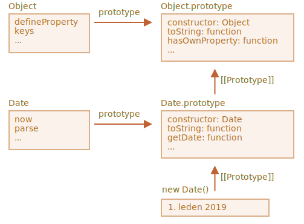

# Rozšiřování vestavěných tříd

Rozšiřovat lze i vestavěné třídy, například Array, Map a jiné.

Například zde `SilnéPole` je zděděno z nativního `Array`:

```js run
// přidáme do něj jednu další metodu (můžeme i víc)
class SilnéPole extends Array {
  jePrázdné() {
    return this.length === 0;
  }
}

let pole = new SilnéPole(1, 2, 5, 10, 50);
alert(pole.jePrázdné()); // false

let filtrovanéPole = pole.filter(prvek => prvek >= 10);
alert(filtrovanéPole); // 10, 50
alert(filtrovanéPole.jePrázdné()); // false
```

Všimněte si prosíme velmi zajímavé věci. Vestavěné metody jako `filter`, `map` a jiné vracejí nové objekty přesně zděděného typu `SilnéPole`. Jejich vnitřní implementace k tomu využívá vlastnost `constructor` objektu, na němž je metoda volána.

V uvedeném příkladu:
```js
pole.constructor === SilnéPole
```

Když je voláno `pole.filter()`, vnitřně vytvoří nové pole výsledků voláním přesně `pole.constructor`, ne základního `Array`. To je vskutku vynikající, protože i nadále můžeme na výsledku používat metody třídy `SilnéPole`.

A navíc si můžeme toto chování sami nastavit.

Můžeme do třídy přidat speciální statický getter `Symbol.species`. Pokud existuje, měl by vracet konstruktor, který bude JavaScriptem vnitřně používán k vytvoření nových entit ve funkcích `map`, `filter` a podobně.

Kdybychom chtěli, aby vestavěné metody jako `map` nebo `filter` vracely regulérní pole, můžeme v `Symbol.species` vracet `Array`, například zde:

```js run
class SilnéPole extends Array {
  jePrázdné() {
    return this.length === 0;
  }

*!*
  // vestavěné metody budou jako konstruktor používat toto
  static get [Symbol.species]() {
    return Array;
  }
*/!*
}

let pole = new SilnéPole(1, 2, 5, 10, 50);
alert(pole.jePrázdné()); // false

// filter vytvoří nové pole s použitím pole.constructor[Symbol.species] jako konstruktoru
let filtrovanéPole = pole.filter(prvek => prvek >= 10);

*!*
// filtrovanéPole není SilnéPole, ale Array
*/!*
alert(filtrovanéPole.jePrázdné()); // Chyba: filtrovanéPole.jePrázdné není funkce
```

Jak vidíte, nyní `.filter` vrací `Array`. Rozšířená funkcionalita se tedy dál nepředává.

```smart header="Obdobně fungují ostatní kolekce"
Obdobně fungují i ostatní kolekce, např. `Map` a `Set`. I ty používají `Symbol.species`.
```

## Zabudované objekty nemají statickou dědičnost

Zabudované objekty mají své vlastní statické metody, například `Object.keys`, `Array.isArray` atd.

Jak už víme, nativní třídy se navzájem rozšiřují. Například třída `Array` rozšiřuje třídu `Object`.

Když jedna třída rozšiřuje druhou, zpravidla z ní dědí statické i nestatické metody. To bylo podrobně vysvětleno v článku [](info:static-properties-methods#statics-and-inheritance).

Avšak vestavěné třídy jsou výjimkou. Ty od sebe navzájem nedědí statická pole.

Například třídy `Array` i `Date` dědí ze třídy `Object`, takže jejich instance obsahují metody z `Object.prototype`. Ale `Array.[[Prototype]]` se neodkazuje na `Object`, takže neexistuje například statická metoda `Array.keys()` (nebo `Date.keys()`).

Na obrázku vidíme strukturu pro `Date` a `Object`:



Jak vidíte, mezi `Date` a `Object` neexistuje žádné spojení. Jsou nezávislé, jedině `Date.prototype` dědí z `Object.prototype`.

To je důležitý rozdíl v dědičnosti mezi vestavěnými objekty oproti tomu, co získáme použitím `extends`.
