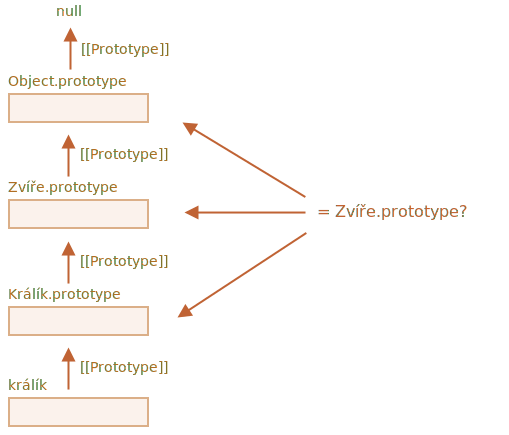

# Ověřování tříd: „instanceof“

Operátor `instanceof` umožňuje ověřit, zda objekt patří do určité třídy. Bere v úvahu i dědičnost.

Toto ověření může být zapotřebí v mnoha případech. Například může být použito k vytvoření *polymorfní* funkce, takové, která zachází se svými argumenty různě v závislosti na jejich typu.

## Operátor instanceof [#ref-instanceof]

Syntaxe je:
```js
obj instanceof Třída
```

Vrací `true`, jestliže `obj` patří do třídy `Třída` nebo do třídy, která je z ní zděděna.

Například:

```js run
class Králík {}
let králík = new Králík();

// je to objekt třídy Králík?
*!*
alert( králík instanceof Králík ); // true
*/!*
```

Funguje to i pro konstruktory:

```js run
*!*
// namísto třídy
function Králík() {}
*/!*

alert( new Králík() instanceof Králík ); // true
```

...A pro zabudované třídy jako `Array`:

```js run
let pole = [1, 2, 3];
alert( pole instanceof Array ); // true
alert( pole instanceof Object ); // true
```

Prosíme všimněte si, že `pole` patří i do třídy `Object`. Je to proto, že třída `Array` je prototypově zděděna z třídy `Object`.

Normálně `instanceof` při ověřování prozkoumává prototypový řetězec. Můžeme si však také nastavit vlastní logiku ve statické metodě `Symbol.hasInstance`.

Algoritmus operátoru `obj instanceof Třída` funguje zhruba následovně:

1. Pokud existuje statická metoda `Symbol.hasInstance`, pak ji jen zavolá: `Třída[Symbol.hasInstance](obj)`. Ta by měla vrátit buď `true`, nebo `false`, a jsme hotovi. Tímto způsobem si můžeme chování `instanceof` sami nastavit.

    Například:

    ```js run
    // nastavíme ověření instanceOf tak, aby předpokládalo,
    // že všechno, co má vlastnost můžeŽrát, je zvíře
    class Zvíře {
      static [Symbol.hasInstance](obj) {
        if (obj.můžeŽrát) return true;
      }
    }

    let obj = { můžeŽrát: true };

    alert(obj instanceof Zvíře); // true: zavolá se Zvíře[Symbol.hasInstance](obj)
    ```

<<<<<<< HEAD
2. Většina tříd nemá `Symbol.hasInstance`. V tom případě je použita standardní logika: `obj instanceOf Třída` zjistí, zda se `Třída.prototype` rovná některému z prototypů v prototypovém řetězci objektu `obj`.
=======
2. Most classes do not have `Symbol.hasInstance`. In that case, the standard logic is used: `obj instanceof Class` checks whether `Class.prototype` is equal to one of the prototypes in the `obj` prototype chain.
>>>>>>> d78b01e9833009fab534462e05c03cffc51bf0e3

    Jinými slovy, porovnává jeden po druhém:
    ```js
    obj.__proto__ === Třída.prototype?
    obj.__proto__.__proto__ === Třída.prototype?
    obj.__proto__.__proto__.__proto__ === Třída.prototype?
    ...
    // je-li kterákoli odpověď true, vrátí true
    // jinak, pokud jsme dosáhli konce řetězce, vrátí false
    ```

    V uvedeném příkladu `králík.__proto__ === Králík.prototype`, takže odpověď je vydána okamžitě.

    V případě dědičnosti bude shoda nalezena ve druhém kroku:

    ```js run
    class Zvíře {}
    class Králík extends Zvíře {}

    let králík = new Králík();
    *!*
    alert(králík instanceof Zvíře); // true
    */!*

    // králík.__proto__ === Zvíře.prototype (není shoda)
    *!*
    // králík.__proto__.__proto__ === Zvíře.prototype (shoda!)
    */!*
    ```

Na tomto obrázku je vidět, co `králík instanceof Zvíře` porovnává se `Zvíře.prototype`:



Mimochodem, existuje také metoda [objA.isPrototypeOf(objB)](mdn:js/object/isPrototypeOf), která vrátí `true`, jestliže se `objA` nachází někde v prototypovém řetězci objektu `objB`. Test `obj instanceof Třída` tedy lze přepsat na `Třída.prototype.isPrototypeOf(obj)`.

Veselé je, že samotný konstruktor `Třída` se na ověřování nepodílí! Záleží jen na prototypovém řetězci a na `Třída.prototype`.

To může vést k zajímavým důsledkům, když je vlastnost `prototype` změněna po vytvoření objektu.

Například zde:

```js run
function Králík() {}
let králík = new Králík();

// změníme prototyp
Králík.prototype = {};

// ...už to není králík!
*!*
alert( králík instanceof Králík ); // false
*/!*
```

## Bonus: Object.prototype.toString pro typ

Už víme, že plané objekty se převádějí na řetězec jako `[object Object]`:

```js run
let obj = {};

alert(obj); // [object Object]
alert(obj.toString()); // totéž
```

Taková je jejich implementace metody `toString`. Existuje však skrytá vlastnost, která činí `toString` ve skutečnosti mnohem silnější. Můžeme ji používat jako rozšířený `typeof` a alternativu pro `instanceof`.

Zní to zvláštně? Určitě ano. Odhalme to.

Podle [specifikace](https://tc39.github.io/ecma262/#sec-object.prototype.tostring) může být vestavěný `toString` extrahován z objektu a spuštěn v kontextu jakékoli jiné hodnoty. A na oné hodnotě pak závisí jeho výsledek.

- Pro číslo to bude `[object Number]`
- Pro boolean to bude `[object Boolean]`
- Pro `null`: `[object Null]`
- Pro `undefined`: `[object Undefined]`
- Pro pole: `[object Array]`
- ...atd. (nastavitelně).

Předveďme si to:

```js run
// pro přehlednost si zkopírujeme metodu toString do proměnné
let metodaToString = Object.prototype.toString;

// jakého typu je tohle?
let pole = [];

alert( metodaToString.call(pole) ); // [object *!*Array*/!*]
```

Zde jsme použili metodu [call](mdn:js/function/call), popsanou v kapitole [](info:call-apply-decorators), ke spuštění funkce `metodaToString` v kontextu `this=pole`.

Vnitřně algoritmus metody `toString` prozkoumává `this` a vrací odpovídající výsledek. Další příklady:

```js run
let s = Object.prototype.toString;

alert( s.call(123) ); // [object Number]
alert( s.call(null) ); // [object Null]
alert( s.call(alert) ); // [object Function]
```

### Symbol.toStringTag

Chování metody `toString` můžeme nastavit pomocí speciální objektové vlastnosti `Symbol.toStringTag`.

Například:

```js run
let uživatel = {
  [Symbol.toStringTag]: "Uživatel"
};

alert( {}.toString.call(uživatel) ); // [object Uživatel]
```

Tato vlastnost existuje u většiny objektů specifických pro určité prostředí. Uvedeme některé příklady specifické pro prohlížeč:

```js run
// toStringTag v objektu a třídě specifické pro určité prostředí:
alert( window[Symbol.toStringTag]); // Window
alert( XMLHttpRequest.prototype[Symbol.toStringTag] ); // XMLHttpRequest

alert( {}.toString.call(window) ); // [object Window]
alert( {}.toString.call(new XMLHttpRequest()) ); // [object XMLHttpRequest]
```

Jak vidíte, výsledkem je přesně `Symbol.toStringTag` (pokud existuje), zabalený do `[object ...]`.

Nakonec tedy máme „typeof na steroidech“, který funguje nejen pro primitivní datové typy, ale i pro zabudované objekty a dokonce se dá nastavit.

Když tedy chceme u vestavěných objektů zjistit název typu jako řetězec a ne ho jen ověřit, můžeme místo `instanceof` používat `{}.toString.call`.

## Shrnutí

Shrňme si metody pro ověření typu, které známe:

|               | funguje pro   |  vrací      |
|---------------|-------------|---------------|
| `typeof`      | primitivy  |  řetězec       |
| `{}.toString` | primitivy, vestavěné objekty, objekty se `Symbol.toStringTag`   |       řetězec |
| `instanceof`  | objekty     |  true/false   |

Jak vidíme, `{}.toString` je technicky „pokročilejší“ `typeof`.

A když pracujeme s třídní hierarchií a chceme si ověřit třídu, přičemž chceme vzít v úvahu dědičnost, opravdu se zaleskne operátor `instanceof`.
