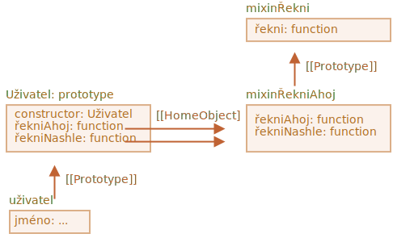

# Mixiny

V JavaScriptu můžeme dědit jen z jednoho objektu. Objekt může mít jen jeden `[[Prototype]]` a třída může rozšiřovat pouze jednu jinou třídu.

To se však někdy může zdát omezující. Máme například třídu `ZametačUlic` a třídu `Bicykl` a chtěli bychom vytvořit jejich směs: `ZametacíBicykl`.

Nebo máme třídu `Uživatel` a třídu `GenerátorUdálostí`, která implementuje generování událostí, a rádi bychom přidali funkcionalitu třídy `GenerátorUdálostí` do třídy `Uživatel`, aby naši uživatelé mohli generovat události.

Koncept, který nám s tím pomůže, existuje a nazývá se „mixiny“.

Jak je definováno ve Wikipedii, [mixin](https://cs.wikipedia.org/wiki/Mixin) je třída obsahující metody, které mohou být používány v jiných třídách, aniž by z ní tyto třídy musely být zděděny.

Jinými slovy, *mixin* poskytuje metody, které implementují určité chování, ale nepoužíváme ho samostatně, nýbrž přidáváme jeho chování do jiných tříd.

## Příklad mixinu

Nejjednodušší způsob, jak implementovat mixin v JavaScriptu, je vytvořit objekt s užitečnými metodami, abychom je mohli snadno připojit do prototypu libovolné třídy.

Například zde je použit mixin `mixinŘekniAhoj`, aby do třídy `Uživatel` přidal nějaké „mluvení“:

```js run
*!*
// mixin
*/!*
let mixinŘekniAhoj = {
  řekniAhoj() {
    alert(`Ahoj ${this.jméno}`);
  },
  řekniNashle() {
    alert(`Nashle ${this.jméno}`);
  }
};

*!*
// použití:
*/!*
class Uživatel {
  constructor(jméno) {
    this.jméno = jméno;
  }
}

// zkopírujeme metody
Object.assign(Uživatel.prototype, mixinŘekniAhoj);

// nyní Uživatel může říci ahoj
new Uživatel("Jan").řekniAhoj(); // Ahoj Jan
```

Není tady žádná dědičnost, ale jen prosté kopírování metod. `Uživatel` tedy může dědit z jiné třídy a současně zahrnout mixin, aby „přimíchal“ („mix-in“) další metody, například:

```js
class Uživatel extends Osoba {
  // ...
}

Object.assign(Uživatel.prototype, mixinŘekniAhoj);
```

Mixiny mohou využívat dědičnost mezi sebou.

Například zde `mixinŘekniAhoj` dědí z `mixinŘekni`:

```js run
let mixinŘekni = {
  řekni(věta) {
    alert(věta);
  }
};

let mixinŘekniAhoj = {
  __proto__: mixinŘekni, // (nebo můžeme k nastavení prototypu použít Object.setPrototypeOf)

  řekniAhoj() {
    *!*
    // volání rodičovské metody
    */!*
    super.řekni(`Ahoj ${this.jméno}`); // (*)
  },
  řekniNashle() {
    super.řekni(`Nashle ${this.jméno}`); // (*)
  }
};

class Uživatel {
  constructor(jméno) {
    this.jméno = jméno;
  }
}

// zkopírujeme metody
Object.assign(Uživatel.prototype, mixinŘekniAhoj);

// nyní Uživatel může říci ahoj
new Uživatel("Jan").řekniAhoj(); // Ahoj Jan
```

Prosíme všimněte si, že volání rodičovské metody `super.řekni()` z `mixinŘekniAhoj` (na řádcích označených `(*)`) hledá metodu v prototypu onoho mixinu, ne této třídy.

Zde je diagram (viz pravou část):



Je to proto, že metody `řekniAhoj` a `řekniNashle` byly původně vytvořeny v `mixinŘekniAhoj`. I když jsou tedy zkopírovány, jejich interní vlastnost `[[HomeObject]]` se odkazuje na `mixinŘekniAhoj`, jak je vidět na uvedeném obrázku.

Když `super` hledá rodičovské metody v `[[HomeObject]].[[Prototype]]`, znamená to, že prohledává `mixinŘekniAhoj.[[Prototype]]`.

## MixinUdálosti

Vytvořme nyní mixin pro skutečný život.

Důležitou vlastností mnoha objektů prohlížeče (například) je, že mohou generovat události. Události jsou skvělý způsob, jak „vysílat informaci“ každému, kdo ji chce. Vytvořme tedy mixin, který nám umožní snadno přidat funkce vztažené k události do jakékoli třídy nebo objektu.

- Mixin bude poskytovat metodu `.spusť(název, [...data])`, která bude „generovat událost“, když se stane něco důležitého. Argument `název` je název události, za nímž mohou následovat další argumenty s daty události.
- Dále metodu `.zapni(název, handler)`, která přidá funkci `handler` jako posluchače událostí se zadaným názvem. Funkce `handler` bude volána, když se spustí událost se zadaným názvem `název`, a převezme argumenty z volání `.spusť`.
- ...A metodu `.vypni(název, handler)`, která odstraní posluchače `handler`.

Po přidání mixinu bude objekt `uživatel` moci generovat událost `"přihlášen"`, když se uživatel přihlásí. A jiný objekt, třeba `kalendář`, bude moci takovým událostem naslouchat, aby pak načetl kalendář pro přihlášenou osobu.

Nebo `menu` může generovat událost `"vybrán"`, když je vybrán jeho prvek, a jiné objekty mohou přiřazovat handlery, které budou na tuto událost reagovat. A tak dále.

Zde je kód:

```js run
let mixinUdálosti = {
  /**
   * Přihlášení k naslouchání události, použití:
   *  menu.zapni('vybrán', function(prvek) { ... })
  */
  zapni(názevUdálosti, handler) {
    if (!this._handleryUdálostí) this._handleryUdálostí = {};
    if (!this._handleryUdálostí[názevUdálosti]) {
      this._handleryUdálostí[názevUdálosti] = [];
    }
    this._handleryUdálostí[názevUdálosti].push(handler);
  },

  /**
   * Odhlášení z naslouchání události, použití:
   *  menu.vypni('vybrán', handler)
   */
  vypni(názevUdálosti, handler) {
    let handlery = this._handleryUdálostí?.[názevUdálosti];
    if (!handlery) return;
    for (let i = 0; i < handlery.length; i++) {
      if (handlery[i] === handler) {
        handlery.splice(i--, 1);
      }
    }
  },

  /**
   * Generování události se zadaným názvem a daty
   *  this.spusť('vybrán', data1, data2);
   */
  spusť(názevUdálosti, ...argumenty) {
    if (!this._handleryUdálostí?.[názevUdálosti]) {
      return; // pro událost s tímto názvem nejsou žádné handlery
    }

    // volání handlerů
    this._handleryUdálostí[názevUdálosti].forEach(handler => handler.apply(this, argumenty));
  }
};
```


- `.zapni(názevUdálosti, handler)` -- přiřadí funkci `handler`, která se má spustit vždy, když nastane událost s uvedeným názvem. Technicky je zde vlastnost `_handleryUdálostí`, do níž se ukládá pole handlerů pro každý název události, a funkce je prostě přidána do tohoto seznamu.
- `.vypni(názevUdálosti, handler)` -- odstraní funkci ze seznamu handlerů.
- `.spusť(názevUdálosti, ...argumenty)` -- generuje událost: všechny handlery z `_handleryUdálostí[názevUdálosti]` jsou volány se seznamem argumentů `...argumenty`.

Použití:

```js run
// Vytvoříme třídu
class Menu {
  vyber(hodnota) {
    this.spusť("vybrán", hodnota);
  }
}
// Přidáme mixin s metodami vztahujícími se k událostem
Object.assign(Menu.prototype, mixinUdálosti);

let menu = new Menu();

// přidáme handler, který bude volán při výběru:
*!*
menu.zapni("vybrán", hodnota => alert(`Vybrána hodnota: ${hodnota}`));
*/!*

// spustí událost => výše uvedený handler se spustí a zobrazí:
// Vybrána hodnota: 123
menu.vyber("123");
```

Kdybychom nyní chtěli přidat jakýkoli kód, který bude reagovat na výběr z menu, můžeme mu naslouchat pomocí `menu.zapni(...)`.

A mixin `mixinUdálosti` usnadňuje přidání takového chování do tolika tříd, do kolika bychom chtěli, aniž bychom narušovali řetězec dědičnosti.

## Shrnutí

*Mixin* -- je generický pojem objektově orientovaného programování: třída, která obsahuje metody pro jiné třídy.

Některé jiné jazyky umožňují vícenásobnou dědičnost. JavaScript ji nepodporuje, ale mixiny mohou být implementovány zkopírováním metod do prototypu.

Mixiny můžeme používat jako způsob rozšiřování třídy přidáváním dalšího chování, například ošetřování událostí, jak jsme viděli výše.

Mixiny se mohou stát příčinou konfliktu, jestliže náhodou přepíší již existující metody třídy. Obecně bychom si tedy měli dobře rozmyslet názvy metod v mixinu, abychom minimalizovali pravděpodobnost, že se tak stane.
