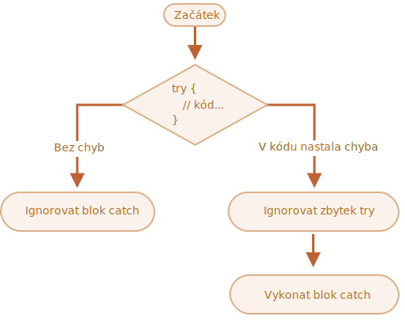

# Ošetřování chyb, „try...catch“

Ať jsme sebelepší programátoři, v našich skriptech se někdy vyskytnou chyby. Může se to stát naší vinou, kvůli neočekávanému uživatelskému vstupu, chybné odpovědi serveru nebo z tisíce jiných důvodů.

V případě chyby skript obvykle „spadne“ (okamžitě se zastaví) a vypíše chybu na konzoli.

Existuje však syntaktická konstrukce `try...catch`, která nám umožňuje „zachytávat“ chyby, takže skript může místo spadnutí udělat něco rozumnějšího.

## Syntaxe „try...catch“

Konstrukce `try...catch` má dva hlavní bloky: `try` a za ním `catch`:

```js
try {

  // kód...

} catch (chyba) {

  // ošetření chyby

}
```

Funguje následovně:

1. Nejprve se spustí kód v bloku `try {...}`.
2. Pokud v něm nejsou chyby, blok `catch (chyba)` je ignorován: řízení dosáhne konce `try`, přeskočí blok `catch` a pokračuje dál.
3. Pokud nastane chyba, výkon bloku `try` se ukončí a řízení pokračuje začátkem bloku `catch (chyba)`. Proměnná `chyba` (můžeme ji pojmenovat jakkoli) bude obsahovat chybový objekt s podrobnostmi o tom, co se stalo.



Chyba uvnitř bloku `try {...}` tedy neshodí skript -- máme šanci ji zpracovat v bloku `catch`.

Podívejme se na příklady.

- Příklad bez chyby: zobrazí `alert` `(1)` a `(2)`:

    ```js run
    try {

      alert('Spuštěn začátek bloku try');  // *!*(1) <--*/!*

      // ...zde nejsou žádné chyby

      alert('Spuštěn konec bloku try');   // *!*(2) <--*/!*

    } catch (chyba) {

      alert('Blok catch je ignorován, protože nenastaly žádné chyby'); // (3)

    }
    ```
- Příklad s chybou: zobrazí `(1)` a `(3)`:

    ```js run
    try {

      alert('Spuštěn začátek bloku try');  // *!*(1) <--*/!*

    *!*
      lalala; // chyba, proměnná není definována!
    */!*

      alert('Spuštěn konec bloku try (nikdy nedosaženo)');  // (2)

    } catch (chyba) {

      alert(`Nastala chyba!`); // *!*(3) <--*/!*

    }
    ```


````warn header="`try...catch` funguje jen pro běhové chyby"
Aby `try...catch` fungoval, kód musí být spustitelný. Jinými slovy, musí to být platný kód v JavaScriptu.

Nebude fungovat, když bude kód syntakticky nesprávný, například bude obsahovat neuzavřené složené závorky:

```js run
try {
  {{{{{{{{{{{{
} catch (chyba) {
  alert("Engine tomuto kódu nerozumí, kód je nesprávný");
}
```

JavaScriptový engine nejdříve načte kód a pak jej spustí. Chyby, které nastanou při fázi načítání, se nazývají „překladové“ (parse-time) chyby a nelze se z nich zotavit (zevnitř kódu). Je to proto, že engine tomuto kódu nedokáže porozumět.

Blok `try...catch` tedy umí ošetřit jen chyby, které se vyskytnou v platném kódu. Takové chyby se nazývají „běhové (runtime) chyby“ nebo někdy „výjimky“.
````


````warn header="`try...catch` funguje synchronně"
Jestliže výjimka nastane v „naplánovaném“ kódu, např. v `setTimeout`, pak ji `try...catch` neodchytí:

```js run
try {
  setTimeout(function() {
    neexistujícíProměnná; // skript tady spadne
  }, 1000);
} catch (chyba) {
  alert( "nebude to fungovat" );
}
```

Je to proto, že samotná funkce se spustí později, když engine již opustil konstrukci `try...catch`.

Abychom zachytili výjimku uvnitř naplánované funkce, `try...catch` musí být uvnitř této funkce:
```js run
setTimeout(function() {
  try {    
    neexistujícíProměnná; // try...catch tuto chybu zpracuje
  } catch {
    alert( "zde je odchycena chyba!" );
  }
}, 1000);
```
````

## Chybový objekt

Když nastane chyba, JavaScript vygeneruje objekt obsahující podrobnosti o této chybě. Tento objekt je pak předán jako argument do bloku `catch`:

```js
try {
  // ...
} catch (chyba) { // <-- „chybový objekt“, místo „chyba“ můžeme použít jakýkoli název
  // ...
}
```

U všech vestavěných chyb má chybový objekt dvě hlavní vlastnosti:

`name` (název)
: Název chyby. Například pro nedefinovanou proměnnou je to `"ReferenceError"`.

`message` (zpráva)
: Textová zpráva o podrobnostech chyby.

Ve většině prostředí jsou k dispozici i další nestandardní vlastnosti. Jedna z nejpoužívanějších a nejpodporovanějších je:

`stack` (zásobník)
: Aktuální zásobník volání: řetězec s informací o posloupnosti vnořených volání, která vedla k chybě. Používá se pro účely ladění.

Například:

```js run untrusted
try {
*!*
  lalala; // chyba, proměnná není definována!
*/!*
} catch (chyba) {
  alert(chyba.name); // ReferenceError
  alert(chyba.message); // lalala is not defined
  alert(chyba.stack); // ReferenceError: lalala is not defined at (...zásobník volání)

  // Můžeme také zobrazit chybu jako celek
  // Chyba se pak převede na řetězec ve tvaru "name: message"
  alert(chyba); // ReferenceError: lalala is not defined
}
```

## Vazba „catch“ je nepovinná

[recent browser=new]

Pokud nepotřebujeme podrobnosti o chybě, `catch` ji může vynechat:

```js
try {
  // ...
} catch { // <-- bez (chyba)
  // ...
}
```

## Použití „try...catch“

Prozkoumejme případ použití `try...catch` z reálného života.

Jak už víme, JavaScript podporuje metodu [JSON.parse(str)](mdn:js/JSON/parse) k načtení hodnot zakódovaných do JSON.

Obvykle se používá k dekódování dat získaných po síti, ze serveru nebo z jiného zdroje.

Načteme data a zavoláme `JSON.parse` následovně:

```js run
let json = '{"jméno": "Jan", "věk": 30}'; // data ze serveru

*!*
let uživatel = JSON.parse(json); // převedeme textovou reprezentaci na objekt JS
*/!*

// nyní je uživatel objekt s vlastnostmi z řetězce
alert( uživatel.jméno ); // Jan
alert( uživatel.věk );  // 30
```

Podrobnější informace o JSON naleznete v kapitole <info:json>.

**Je-li `json` poškozen, pak `JSON.parse` vygeneruje chybu, takže skript „spadne“.**

Měli bychom se s tím spokojit? Ovšemže ne!

Tímto způsobem, je-li s daty něco špatně, návštěvník se o tom nikdy nedozví (pokud si neotevře vývojářskou konzoli). A lidé opravdu nemají rádi, když něco „jen tak spadne“ bez jakéhokoli chybového hlášení.

Použijme tedy k ošetření chyby `try...catch`:

```js run
let json = "{ špatný json }";

try {

*!*
  let uživatel = JSON.parse(json); // <-- když nastane chyba...
*/!*
  alert( uživatel.jméno ); // nespustí se

} catch (chyba) {
*!*
  // ...provádění skočí sem
  alert( "Omlouváme se, v datech byly chyby, pokusíme se o ně požádat ještě jednou." );
  alert( chyba.name );
  alert( chyba.message );
*/!*
}
```

Zde používáme blok `catch` jen k zobrazení zprávy, ale můžeme toho udělat mnohem víc: poslat nový požadavek po síti, nabídnout návštěvníkovi alternativu, poslat informace o chybě na logovací zařízení... Všechno je mnohem lepší než pouhé spadnutí.

## Vyvolávání našich vlastních chyb

Co když je `json` syntakticky správně, ale neobsahuje požadovanou vlastnost `jméno`?

Například:

```js run
let json = '{ "věk": 30 }'; // neúplná data

try {

  let uživatel = JSON.parse(json); // <-- žádná chyba
*!*
  alert( uživatel.jméno ); // jméno není!
*/!*

} catch (chyba) {
  alert( "toto se nespustí" );
}
```

Zde `JSON.parse` proběhl normálně, ale absence vlastnosti `jméno` pro nás ve skutečnosti představuje chybu.

Abychom sjednotili ošetřování chyb, použijeme operátor `throw`.

### Operátor „throw“

Operátor `throw` vygeneruje chybu.

Jeho syntaxe je:

```js
throw <chybový objekt>
```

Technicky můžeme jako chybový objekt použít cokoli. Může to být dokonce i primitiv, např. číslo nebo řetězec, ale je lepší používat objekty, přednostně s vlastnostmi `name` a `message` (abychom zůstali alespoň zčásti kompatibilní se zabudovanými chybami).

JavaScript obsahuje mnoho vestavěných konstruktorů pro standardní chyby: `Error`, `SyntaxError`, `ReferenceError`, `TypeError` a jiné. I ty můžeme použít k vytvoření chybových objektů.

Jejich syntaxe je:

```js
let chyba = new Error(zpráva);
// nebo
let chyba = new SyntaxError(zpráva);
let chyba = new ReferenceError(zpráva);
// ...
```

Ve vestavěných chybách (ne ve všech objektech, pouze v chybách) je vlastnost `name` přesný název konstruktoru a `message` se převezme z argumentu.

Například:

```js run
let chyba = new Error("Dějí se věci o_O");

alert(chyba.name); // Error
alert(chyba.message); // Dějí se věci o_O
```

Podívejme se, jaký druh chyby generuje `JSON.parse`:

```js run
try {
  JSON.parse("{ špatný json o_O }");
} catch (chyba) {
*!*
  alert(chyba.name); // SyntaxError
*/!*
  alert(chyba.message); // Unexpected token š in JSON at position 2
}
```

Jak vidíme, je to `SyntaxError`.

A v našem případě je absence vlastnosti `jméno` chyba, jelikož `jméno` musí mít každý uživatel.

Vyvolejme tedy chybu:

```js run
let json = '{ "věk": 30 }'; // neúplná data

try {

  let uživatel = JSON.parse(json); // <-- žádná chyba

  if (!uživatel.jméno) {
*!*
    throw new SyntaxError("Neúplná data: chybí jméno"); // (*)
*/!*
  }

  alert( uživatel.jméno );

} catch (chyba) {
  alert( "Chyba JSONu: " + chyba.message ); // Chyba JSONu: Neúplná data: chybí jméno
}
```

Na řádku `(*)` operátor `throw` generuje chybu `SyntaxError` se zadanou zprávou `message`, stejným způsobem, jakým by ji vygeneroval samotný JavaScript. Výkon bloku `try` okamžitě skončí a tok řízení skočí do bloku `catch`.

Nyní se `catch` stalo jediným místem pro ošetření všech chyb: jak pro `JSON.parse`, tak pro jiné případy.

## Opětovné vyvolání

Ve výše uvedeném příkladu jsme použili `try...catch` ke zpracování nekorektních dat. Je však možné, že uprostřed bloku `try {...}` nastane i *jiná neočekávaná chyba*? Například programátorská chyba (proměnná není definována) nebo něco jiného, nejenom tahle věc s „nekorektními daty“.

Například:

```js run
let json = '{ "věk": 30 }'; // neúplná data

try {
  uživatel = JSON.parse(json); // <-- zapomněli jsme uvést „let“ před proměnnou uživatel

  // ...
} catch (chyba) {
  alert("Chyba JSONu: " + chyba); // Chyba JSONu: ReferenceError: uživatel is not defined
  // (ve skutečnosti to není chyba JSONu)
}
```

Samozřejmě, všechno je možné! Programátoři dělají chyby. I v open-source utilitách (se zveřejněným zdrojovým kódem), které používají milióny lidí desítky let, může být náhle odhalena chyba, která vede ke strašlivým útokům hackerů.

V našem případě je `try...catch` použit k tomu, aby zachytil chyby „nekorektních dat“. Ze své povahy však `catch` zachytí *všechny* chyby zevnitř `try`. Tady obdrží nečekanou chybu, ale stále zobrazí stejnou zprávu `"Chyba JSONu"`. To je špatně a ztěžuje to ladění kódu.

Abychom se takovým problémům vyhnuli, můžeme využít techniku „opětovného vyvolání“. Pravidlo je jednoduché:

**Blok catch by měl zpracovávat jen chyby, které zná, a „opětovně vyvolat“ všechny ostatní.**

Techniku „opětovného vyvolání“ můžeme podrobněji vysvětlit takto:

1. Blok catch zachytí všechny chyby.
2. V bloku `catch (chyba) {...}` analyzujeme chybový objekt `chyba`.
3. Nevíme-li, jak jej zpracovat, vyvoláme `throw chyba`.

Obvykle můžeme ověřit typ chyby operátorem `instanceof`:

```js run
try {
  uživatel = { /*...*/ };
} catch (chyba) {
*!*
  if (chyba instanceof ReferenceError) {
*/!*
    alert('ReferenceError'); // "ReferenceError" kvůli přístupu k nedefinované proměnné
  }
}
```

Můžeme také získat název třídy chyby z vlastnosti `chyba.name`. Tu mají všechny nativní chyby. Další možností je načíst `chyba.constructor.name`.

V níže uvedeném kódu můžeme využít opětovné vyvolání tak, že `catch` bude zpracovávat pouze `SyntaxError`:

```js run
let json = '{ "věk": 30 }'; // neúplná data
try {

  let uživatel = JSON.parse(json);

  if (!uživatel.jméno) {
    throw new SyntaxError("Neúplná data: chybí jméno");
  }

*!*
  blabla(); // neočekávaná chyba
*/!*

  alert( uživatel.jméno );

} catch (chyba) {

*!*
  if (chyba instanceof SyntaxError) {
    alert( "Chyba JSONu: " + chyba.message );
  } else {
    throw chyba; // opětovné vyvolání (*)
  }
*/!*

}
```

Chyba vyvolaná na řádku `(*)` zevnitř bloku `catch` „vypadne“ z bloku `try...catch` a buď může být zachycena vnější konstrukcí `try...catch` (pokud existuje), nebo shodí skript.

Blok `catch` tedy ve skutečnosti ošetří jen chyby, s nimiž si umí poradit, a všechny ostatní „přeskočí“.

Níže uvedený příklad předvádí, jak lze takové chyby zachytit další úrovní `try...catch`:

```js run
function načtiData() {
  let json = '{ "věk": 30 }';

  try {
    // ...
*!*
    blabla(); // chyba!
*/!*
  } catch (chyba) {
    // ...
    if (!(chyba instanceof SyntaxError)) {
*!*
      throw chyba; // opětovné vyvolání (neumíme si s ní poradit)
*/!*
    }
  }
}

try {
  načtiData();
} catch (chyba) {
*!*
  alert( "Externí catch zachytil chybu: " + chyba ); // chytili jsme ji!
*/!*
}
```

Zde `načtiData` umí ošetřit jedině `SyntaxError`, zatímco vnější `try...catch` umí ošetřit všechno.

## try...catch...finally

Počkat, to ještě není všechno.

Konstrukce `try...catch` může mít ještě jednu kódovou klauzuli: `finally`.

Pokud existuje, spustí se ve všech případech:

- po `try`, pokud nenastaly žádné chyby,
- po `catch`, pokud nastaly chyby.

Rozšířená syntaxe vypadá následovně:

```js
*!*try*/!* {
   ... pokusíme se spustit kód ...
} *!*catch*/!* (chyba) {
   ... ošetříme chyby ...
} *!*finally*/!* {
   ... toto se vždy spustí ...
}
```

Zkuste si spustit tento kód:

```js run
try {
  alert( 'try' );
  if (confirm('Vyvolat chybu?')) ŠPATNÝ_KÓD();
} catch (chyba) {
  alert( 'catch' );
} finally {
  alert( 'finally' );
}
```

Tento kód má dvě možné cesty průběhu:

1. Pokud odpovíte „Ano“ na „Vyvolat chybu?“, pak `try -> catch -> finally`.
2. Pokud odpovíte „Ne“, pak `try -> finally`.

Klauzule `finally` se často používá, když začnete něco dělat a chcete to ukončit, ať je výsledek jakýkoli.

Například chceme změřit čas, jaký spotřebuje funkce `fib(n)` pro výpočet Fibonacciho čísel. Přirozeně můžeme zahájit měření předtím, než se spustí, a ukončit je posléze. Co když však během volání funkce nastane chyba? Konkrétně implementace `fib(n)` v níže uvedeném kódu vrátí chybu pro záporná nebo necelá čísla.

Klauzule `finally` je skvělé místo, v němž můžeme ukončit měření, ať funkce dopadne jakkoli.

Zde `finally` zaručuje, že čas bude správně změřen v obou situacích -- v případě úspěšného spuštění `fib` i v případě, že během něj nastane chyba:

```js run
let číslo = +prompt("Zadejte kladné celé číslo", 35)

let rozdíl, výsledek;

function fib(n) {
  if (n < 0 || Math.trunc(n) != n) {
    throw new Error("Číslo nesmí být záporné a musí být celé.");
  }
  return n <= 1 ? n : fib(n - 1) + fib(n - 2);
}

let začátek = Date.now();

try {
  výsledek = fib(číslo);
} catch (chyba) {
  výsledek = 0;
*!*
} finally {
  rozdíl = Date.now() - začátek;
}
*/!*

alert(výsledek || "nastala chyba");

alert( `výkon funkce trval ${rozdíl} ms` );
```

Můžete si to ověřit, když spustíte kód a do `prompt` zadáte `35` -- spustí se normálně, `finally` přijde po `try`. A pak zadejte `-1` -- okamžitě nastane chyba a výkon funkce bude trvat `0 ms`. Obě měření proběhla správně.

Jinými slovy, funkce může skončit pomocí `return` nebo `throw`, na tom nezáleží. Klauzule `finally` se spustí v obou případech.

```smart header="Proměnné uvnitř `try...catch...finally` jsou lokální"
Prosíme všimněte si, že proměnné `výsledek` a `rozdíl` ve výše uvedeném kódu jsou deklarovány *před* `try...catch`.

Jinak kdybychom deklarovali `let` v bloku `try`, proměnné by byly viditelné jen uvnitř bloku.
```

````smart header="`finally` a `return`"
Klauzule `finally` funguje při *jakémkoli* opuštění bloku `try...catch`. To platí i pro výslovně uvedený `return`.

V níže uvedeném příkladu je `return` uvnitř `try`. V tom případě se `finally` spustí právě předtím, než se řízení vrátí do vnějšího kódu.

```js run
function funkce() {

  try {
*!*
    return 1;
*/!*

  } catch (chyba) {
    /* ... */
  } finally {
*!*
    alert( 'finally' );
*/!*
  }
}

alert( funkce() ); // nejprve se spustí alert z finally a pak tento
```
````

````smart header="`try...finally`"

Užitečná je i konstrukce `try...finally` bez klauzule `catch`. Používáme ji, když zde nechceme ošetřovat chyby (necháme je vypadnout ven), ale chceme mít jistotu, že procesy, které jsme zahájili, budou dokončeny.

```js
function funkce() {
  // začneme dělat něco, co musíme dokončit (např. měření)
  try {
    // ...
  } finally {
    // dokončíme to, i když všechno spadne
  }
}
```
Ve výše uvedeném kódu chyba vzniklá uvnitř `try` vždy vypadne, protože zde není `catch`. Ale `finally` zafunguje ještě předtím, než tok řízení opustí funkci.
````

## Globální zachycení

```warn header="Specifické pro určité prostředí"
Informace z této části nejsou součástí jádra JavaScriptu.
```

Představme si, že jsme získali fatální chybu mimo `try...catch` a skript spadl. Například programátorskou chybu nebo něco jiného strašného.

Existuje způsob, jak na takové výskyty reagovat? Můžeme chtít chybu zalogovat, zobrazit něco uživateli (ten obvykle chybové zprávy nevidí) a podobně.

Ve specifikaci žádný není, ale prostředí jej obvykle poskytují, protože je opravdu užitečný. Například Node.js má k tomuto účelu [`process.on("uncaughtException")`](https://nodejs.org/api/process.html#process_event_uncaughtexception). A v prohlížeči můžeme přiřadit speciální vlastnosti [window.onerror](mdn:api/GlobalEventHandlers/onerror) funkci, která se spustí v případě nezachycené chyby.

Syntaxe:

```js
window.onerror = function(zpráva, url, řádek, sloupec, chyba) {
  // ...
};
```

`zpráva`
: Chybová zpráva.

`url`
: URL skriptu, v němž došlo k chybě.

`řádek`, `sloupec`
: Číslo řádku a sloupce, v nichž chyba nastala.

`chyba`
: Chybový objekt.

Například:

```html run untrusted refresh height=1
<script>
*!*
  window.onerror = function(zpráva, url, řádek, sloupec, chyba) {
    alert(`${zpráva}\n Na ${line}:${col} adresy ${url}`);
  };
*/!*

  function načtiData() {
    špatnáFunkce(); // Ouha, něco se pokazilo!
  }

  načtiData();
</script>
```

Úkolem globálního handleru `window.onerror` obvykle nebývá obnovit výkon skriptu -- to je v případě programátorských chyb už zřejmě nemožné, ale poslat vývojářům chybovou zprávu.

Existují i webové služby, které poskytují logování chyb pro tyto případy, například <https://errorception.com> nebo <https://www.muscula.com>.

Fungují následovně:

1. Zaregistrujete se na službě a dostanete od ní kousek kódu v JS (nebo URL skriptu), který si vložíte na stránku.
2. Skript v JS nastaví uživatelskou funkci `window.onerror`.
3. Když nastane chyba, skript pošle službě síťový požadavek s informací o chybě.
4. Pak se můžeme přihlásit na webové rozhraní služby a chyby si prohlédnout.

## Shrnutí

Konstrukce `try...catch` nám umožňuje ošetřovat běhové chyby. Doslova nám umožňuje „pokusit se“ *(anglicky „try“)* spustit kód a „zachytit“ *(anglicky „catch“)* chyby, které v něm mohou nastat.

Syntaxe je:

```js
try {
  // spustí se tento kód
} catch (chyba) {
  // pokud nastala chyba, skočí se sem
  // v proměnné chyba je chybový objekt
} finally {
  // toto se provede v každém případě po try/catch
}
```

Sekce `catch` nebo `finally` tam nemusí být, takže fungují i kratší konstrukce `try...catch` a `try...finally`.

Chybové objekty mají následující vlastnosti:

- `message` -- chybová zpráva čitelná člověkem.
- `name` -- řetězec s názvem chyby (název konstruktoru chyby).
- `stack` (nestandardní, ale široce podporovaná) -- zásobník v okamžiku vzniku chyby.

Pokud chybový objekt nepotřebujeme, můžeme jej vynechat použitím `catch {` namísto `catch (chyba) {`.

Můžeme také generovat své vlastní chyby pomocí operátoru `throw`. Technicky může být argumentem `throw` cokoli, ale obvykle to bývá chybový objekt zděděný z vestavěné třídy `Error`. O rozšiřování chyb se dozvíme více v příští kapitole.

Velmi důležitým vzorcem ošetřování chyb je *opětovné vyvolání*: blok `catch` obvykle očekává a umí ošetřit jen chybu určitého typu, takže chyby, které nezná, by měl opětovně vyvolat.

I když nemáme `try...catch`, většina prostředí nám umožňuje nastavit „globální“ chybový handler, který bude zachytávat chyby, které „vypadnou“. V prohlížeči je to `window.onerror`.
