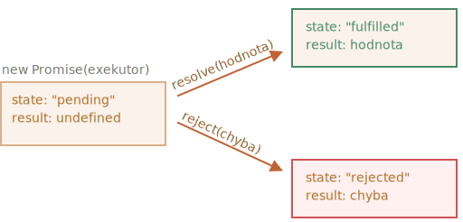
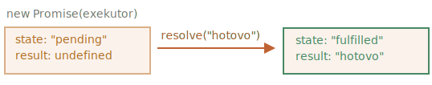
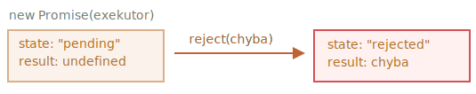

# Příslib

Představte si, že jste špičkový zpěvák a vaši fanoušci se dnem i nocí dožadují vaší nejnovější písně.

Abyste získali trochu klidu, slíbíte jim, že jim píseň pošlete, až bude vydána. Dáte svým fanouškům seznam. Mohou do něj vyplnit svou emailovou adresu, takže až bude píseň k dispozici, všichni podepsaní ji okamžitě dostanou. A i kdyby se něco ošklivě pokazilo, například kdyby vyhořelo nahrávací studio a vy byste nemohli svou píseň vydat, stále byste jim to mohli oznámit.

Všichni jsou šťastní: vy, protože vás lidé už neobléhají, a fanoušci, protože o píseň nepřijdou.

To je analogie ze skutečného života s tím, co často máme v programování:

1. „Produkující kód“, který něco provádí a nějakou dobu mu to trvá. Například kód, který načítá data ze sítě. To je „zpěvák“.
2. „Konzumující kód“, který chce mít výsledek „produkujícího kódu“, až bude připraven. Tento výsledek může být potřeba v mnoha funkcích. To jsou „fanoušci“.
3. *Příslib* (anglicky *promise*) je speciální JavaScriptový objekt, který spojuje „produkující kód“ a „konzumující kód“ dohromady. V pojmech naší analogie to je „podpisový seznam“. „Produkující kód“ dostane čas, který potřebuje k vyprodukování slibovaného výsledku, a „příslib“ zprostředkuje výsledek veškerému podepsanému kódu, až bude připraven.

Tato analogie není zcela přesná, protože JavaScriptové přísliby jsou složitější než pouhý podpisový seznam: mají další možnosti a omezení. Pro začátek však postačí.

Syntaxe konstruktoru objektu příslibu je:

```js
let příslib = new Promise(function(resolve, reject) {
  // exekutor (produkující kód, „zpěvák“)
});
```

Funkce předaná do konstruktoru `new Promise` se nazývá *exekutor*. Když je vytvořen `new Promise`, exekutor se automaticky spustí. Obsahuje produkující kód, který by měl nakonec vyprodukovat výsledek. V pojmech výše uvedené analogie: exekutor je „zpěvák“.

Jeho argumenty `resolve` a `reject` jsou callbacky, které poskytuje samotný JavaScript. Náš kód je obsažen pouze v exekutoru.

Když exekutor získá výsledek, ať je to dříve či později, na tom nezáleží, měl by volat jeden z těchto callbacků:

- `resolve(hodnota)` — pokud práce skončila úspěšně, s výsledkem `hodnota`.
- `reject(chyba)` — pokud došlo k chybě, `chyba` je chybový objekt.

Když to tedy shrneme: exekutor se automaticky spustí a pokusí se provést svou práci. Když je s tímto pokusem hotov, volá buď `resolve`, jestliže byl úspěšný, nebo `reject`, pokud nastala chyba.

Objekt `příslib` vracený konstruktorem `new Promise` obsahuje tyto interní vlastnosti:

- `state` — na začátku `"pending"` *(„čekající na vyřízení“)*, pak se změní buď na `"fulfilled"` *(„splněný“)*, když je voláno `resolve`, nebo na `"rejected"` *(„zamítnutý“)*, když je voláno `reject`.
- `result` — na začátku `undefined`, pak se změní buď na `hodnota`, když je voláno `resolve(hodnota)`, nebo na `chyba`, když je voláno `reject(chyba)`.

Exekutor tedy nakonec uvede objekt `příslib` do jednoho z těchto stavů:



Později uvidíme, jak se na tyto změny mohou zapsat „fanoušci“.

Zde je příklad konstruktoru příslibu a jednoduchý exekutor s „produkujícím kódem“, který zabere nějaký čas (pomocí `setTimeout`):

```js run
let příslib = new Promise(function(resolve, reject) {
  // tato funkce se spustí automaticky, když se vytvoří příslib

  // po 1 sekundě signalizuje, že práce je hotová s výsledkem „hotovo“
  setTimeout(() => *!*resolve("hotovo")*/!*, 1000);
});
```

Při spuštění uvedeného kódu uvidíme dvě věci:

1. Exekutor je volán automaticky a okamžitě (pomocí `new Promise`).
2. Exekutor obdrží dva argumenty: `resolve` a `reject`. Tyto funkce jsou předdefinovány enginem JavaScriptu, takže je nemusíme vytvářet. Měli bychom jen volat jednu z nich, až budeme připraveni.

    Po jedné sekundě „zpracovávání“ exekutor zavolá `resolve("hotovo")`, aby vytvořil výsledek. Tím se změní stav objektu `příslib`:



To byl příklad úspěšného dokončení práce, „splněný příslib“.

A nyní uvedeme příklad exekutoru, který zamítne příslib s chybou:

```js
let příslib = new Promise(function(resolve, reject) {
  // po 1 sekundě signalizuje, že práce je hotová s chybou
  setTimeout(() => *!*reject(new Error("Ouha!"))*/!*, 1000);
});
```

Volání `reject(...)` uvede objekt příslibu do stavu `"rejected"`:



Když to tedy shrneme, exekutor by měl provést nějakou práci (zpravidla něco, co zabere nějaký čas) a pak volat buď `resolve`, nebo `reject`, aby změnil stav odpovídajícího objektu příslibu.

Příslib, který je buď vyřešený, nebo zamítnutý, se nazývá „usazený“ *(„settled“)*, oproti původně „čekajícímu“ *(„pending“)* příslibu.

````smart header="Výsledek nebo chyba může být pouze jeden"
Exekutor by měl volat pouze jednou `resolve` nebo jednou `reject`. Jakákoli změna stavu je konečná.

Veškerá další volání `resolve` a `reject` jsou ignorována:

```js
let příslib = new Promise(function(resolve, reject) {
*!*
  resolve("hotovo");
*/!*

  reject(new Error("…")); // ignorováno
  setTimeout(() => resolve("…")); // ignorováno
});
```

Myšlenkou je, že práce prováděná exekutorem může mít pouze jeden výsledek nebo chybu.

Navíc `resolve`/`reject` očekává pouze jediný argument (nebo žádný) a všechny další argumenty bude ignorovat.
````

```smart header="Zamítnutí s objekty třídy `Error`"
V případě, že se něco pokazí, by exekutor měl volat `reject`. To je možné volat s argumentem libovolného typu (stejně jako `resolve`). Doporučuje se však používat objekty třídy `Error` (nebo objekty zděděné z třídy `Error`). Důvod bude brzy zřejmý.
```

````smart header="Okamžité volání `resolve`/`reject`"
V praxi exekutor obvykle provádí něco asynchronně a volá `resolve`/`reject` až za nějakou dobu, ale to nemusí. Můžeme volat `resolve` nebo `reject` i okamžitě, například:

```js
let příslib = new Promise(function(resolve, reject) {
  // odvést tuto práci nám nezabere žádný čas
  resolve(123); // okamžitě vydáme výsledek: 123
});
```

Může se to stát například tehdy, když začneme dělat nějakou práci, ale pak uvidíme, že všechno už bylo dokončeno a uloženo do cache.

To je pěkné. Hned máme příslib splněný.
````

```smart header="Vlastnosti `state` a `result` jsou interní"
Vlastnosti `state` a `result` objektu Promise jsou interní. Nemůžeme k nim přistupovat přímo. Můžeme k tomu použít metody `.then`/`.catch`/`.finally`, které jsou popsány níže.
```

## Konzumenti: then, catch, finally

Objekt Promise slouží jako spojení mezi exekutorem („produkující kód“ nebo „zpěvák“) a konzumujícími funkcemi („fanoušci“), které obdrží výsledek nebo chybu. Konzumující funkce můžeme registrovat (zapsat) použitím metod `.then`, `.catch` a `.finally`.

### then

Základní a nejdůležitější z nich je `.then`.

Její syntaxe je:

```js
příslib.then(
  function(výsledek) { *!*/* zpracování úspěšného výsledku */*/!* },
  function(chyba) { *!*/* zpracování chyby */*/!* }
);
```

Prvním argumentem `.then` je funkce, která se spustí, když je příslib splněn, a obdrží výsledek.

Druhým argumentem `.then` je funkce, která se spustí, když je příslib zamítnut, a obdrží chybu.

Například zde je reakce na úspěšně provedený příslib:

```js run
let příslib = new Promise(function(resolve, reject) {
  setTimeout(() => resolve("hotovo!"), 1000);
});

// resolve spustí první funkci v .then
příslib.then(
*!*
  výsledek => alert(výsledek), // zobrazí „hotovo!“ za 1 sekundu
*/!*
  chyba => alert(chyba) // nespustí se
);
```

Byla spuštěna první funkce.

A v případě zamítnutí se spustí druhá:

```js run
let příslib = new Promise(function(resolve, reject) {
  setTimeout(() => reject(new Error("Ouha!")), 1000);
});

// reject spustí druhou funkci v .then
příslib.then(
  result => alert(result), // nespustí se
*!*
  chyba => alert(chyba) // zobrazí „Error: Ouha!“ za 1 sekundu
*/!*
);
```

Jestliže nás zajímají pouze úspěšná dokončení, můžeme funkci `.then` poskytnout pouze jeden argument:

```js run
let příslib = new Promise(resolve => {
  setTimeout(() => resolve("hotovo!"), 1000);
});

*!*
příslib.then(alert); // zobrazí „hotovo!“ za 1 sekundu
*/!*
```

### catch

Pokud nás zajímají pouze chyby, můžeme jako první argument použít `null`: `.then(null, funkceOšetřujícíChybu)`. Nebo můžeme použít `.catch(funkceOšetřujícíChybu)`, což je přesně totéž:


```js run
let příslib = new Promise((resolve, reject) => {
  setTimeout(() => reject(new Error("Ouha!")), 1000);
});

*!*
// .catch(f) je totéž jako příslib.then(null, f)
příslib.catch(alert); // zobrazí „Error: Ouha!“ za 1 sekundu
*/!*
```

Volání `.catch(f)` je zcela analogické `.then(null, f)`, je to jen zkratka.

### finally

Stejně jako existuje klauzule `finally` v běžném bloku `try {...} catch {...}`, existuje i `finally` v příslibech.

Volání `.finally(f)` se podobá `.then(f, f)` v tom smyslu, že `f` se spustí vždy, když se příslib usadí: ať už je splněn nebo zamítnut.

`finally` je vhodný handler pro provádění úklidu, např. zastavení našich indikátorů nahrávání, protože již nejsou zapotřebí, ať bude výsledek jakýkoli.

Například:

```js
new Promise((resolve, reject) => {
  /* udělá něco, co trvá nějaký čas, a pak volá resolve/reject */
})
*!*
  // spustí se vždy, když se příslib usadí, nezáleží na tom, zda úspěšně nebo ne
  .finally(() => zastav indikátor nahrávání)
  // indikátor nahrávání se tedy vždy zastaví dříve, než zpracujeme výsledek nebo chybu
*/!*
  .then(výsledek => zobraz výsledek, chyba => zobraz chybu)
```

Při tom všem však `finally(f)` není přesně totéž jako `then(f, f)`. Je mezi nimi několik drobných rozdílů:

1. Handler `finally` nemá žádné argumenty. Ve `finally` nevíme, zda byl příslib úspěšný nebo ne. To je v pořádku, jelikož naším úkolem obvykle bývá provést „obecné“ finalizační procedury.
2. Handler `finally` předává výsledky a chyby dalšímu handleru.

    Například zde je výsledek předán skrz `finally` do `then`:
    ```js run
    new Promise((resolve, reject) => {
      setTimeout(() => resolve("výsledek"), 2000)
    })
      .finally(() => alert("Příslib připraven"))
      .then(výsledek => alert(výsledek)); // <-- .then zpracuje výsledek
    ```

    A zde je v příslibu chyba, která se předá skrz `finally` do `catch`:

    ```js run
    new Promise((resolve, reject) => {
      throw new Error("chyba");
    })
      .finally(() => alert("Příslib připraven"))
      .catch(chyba => alert(chyba));  // <-- .catch zpracuje chybový objekt
    ```

To se velmi hodí, protože `finally` není určeno k tomu, aby zpracovalo výsledek příslibu. Předá ho tedy dál.

O zřetězení příslibů a předávání výsledků mezi jednotlivými handlery si povíme více v následující kapitole.

````smart header="Můžeme připojit handlery k již usazeným příslibům"
Pokud příslib čeká na vyřízení, handlery `.then/catch/finally` na něj počkají. Jinak, pokud se příslib již usadil, jednoduše se spustí:

```js run
// příslib bude splněn ihned po vytvoření
let příslib = new Promise(resolve => resolve("hotovo!"));

příslib.then(alert); // hotovo! (zobrazí se hned teď)
```

Všimněte si, že to činí přísliby silnějšími než „podpisový seznam“ z reálného života. Jestliže už zpěvák svou píseň vydal a nějaká osoba se podepíše na podpisový seznam až pak, píseň už pravděpodobně nedostane. Podpisy v reálném životě musejí být učiněny ještě před událostí.

Přísliby jsou flexibilnější. Můžeme přidávat handlery kdykoli: pokud je výsledek už hotov, handler se jednoduše spustí.
````

Dále uvidíme praktičtější příklady, jak nám přísliby mohou pomoci psát asynchronní kód.

## Příklad: načtiSkript [#loadscript]

Mějme funkci `načtiSkript` pro načtení skriptu z předchozí kapitoly.

Zde je varianta založená na callbacku, jen pro připomenutí:

```js
function načtiSkript(src, callback) {
  let skript = document.createElement('script');
  skript.src = src;

*!*
  skript.onload = () => callback(null, skript);
  skript.onerror = () => callback(new Error(`Chyba načítání skriptu pro ${src}`));
*/!*

  document.head.append(skript);
}
```

Přepišme ji s použitím příslibů.

Nová funkce `načtiSkript` nebude vyžadovat callback. Místo toho vytvoří a vrátí objekt Promise, který se splní, až bude načítání hotovo. Vnější kód do něj může přidávat handlery (podepisující funkce) prostřednictvím `.then`:

```js run
function načtiSkript(src) {
  return new Promise(function(resolve, reject) {
    let skript = document.createElement('script');
    skript.src = src;

    skript.onload = () => resolve(skript);
    skript.onerror = () => reject(new Error(`Chyba načítání skriptu pro ${src}`));

    document.head.append(skript);
  });
}
```

Použití:

```js run
let příslib = načtiSkript("https://cdnjs.cloudflare.com/ajax/libs/lodash.js/4.17.11/lodash.js");

příslib.then(
  skript => alert(`${skript.src} je načten!`),
  chyba => alert(`Chyba: ${chyba.message}`)
);

příslib.then(skript => alert('Další handler...'));
```

Hned vidíme několik výhod oproti vzoru založenému na callbacku:


| Přísliby | Callbacky |
|----------|-----------|
| Přísliby nám umožňují dělat věci v přirozeném pořadí. Nejprve spustíme `načtiSkript(skript)` a pak do `.then` napíšeme, co máme dělat s výsledkem. | Musíme mít funkci `callback` k dispozici, už když voláme `načtiSkript(script, callback)`. Jinými slovy, ještě *před* voláním `načtiSkript` musíme vědět, co dělat s výsledkem. |
| Můžeme volat `.then` na příslibu tolikrát, kolikrát chceme. Pokaždé přidáme na „podpisový seznam“ nového „fanouška“, novou podepsanou funkci. Více o tom v další kapitole: [](info:promise-chaining). | Callback může být pouze jeden. |

Přísliby nám tedy poskytují lepší tok kódu a flexibilitu. Je toho však ještě víc. Uvidíme to v dalších kapitolách.
