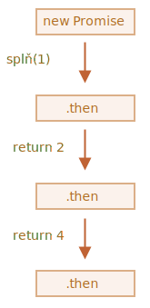
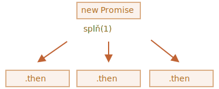
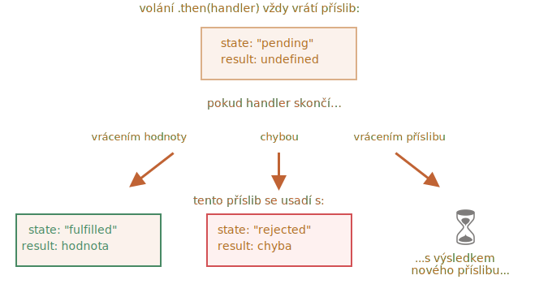

# Zřetězení příslibů

Vraťme se k problému zmíněnému v kapitole <info:callbacks>: máme posloupnost asynchronních úloh, které mají být provedeny jedna po druhé -- například načítání skriptů. Jak ji můžeme správně zapsat do kódu?

Přísliby nám k tomu poskytují spoustu návodů.

V této kapitole vysvětlíme zřetězení příslibů.

Vypadá takto:

```js run
new Promise(function(splň, zamítni) {

  setTimeout(() => splň(1), 1000); // (*)

}).then(function(výsledek) { // (**)

  alert(výsledek); // 1
  return výsledek * 2;

}).then(function(výsledek) { // (***)

  alert(výsledek); // 2
  return výsledek * 2;

}).then(function(výsledek) {

  alert(výsledek); // 4
  return výsledek * 2;

});
```

Myšlenkou je, že výsledek se předává skrz řetěz handlerů `.then`.

Průběh je následující:
1. Úvodní příslib se vyhodnotí za 1 sekundu `(*)`.
2. Pak se volá handler `.then` `(**)`, který následně vytvoří nový příslib (splněn s hodnotou `2`).
3. Další `then` `(***)` získá výsledek předchozího, zpracuje jej (vynásobí dvěma) a předá jej dalšímu handleru.
4. ...a tak dále.

Jak je výsledek předáván řetězem handlerů, vidíme posloupnost volání `alert`: `1` -> `2` -> `4`.



Celé to funguje proto, že každé volání `.then` vrátí nový příslib, takže na něm můžeme volat další `.then`.

Když handler vrátí nějakou hodnotu, tato hodnota se stane výsledkem onoho příslibu, takže další `.then` se volá s ní.

**Klasická začátečnická chyba: technicky můžeme také přidat mnoho handlerů `.then` k jednomu příslibu. To není zřetězení.**

Například:
```js run
let příslib = new Promise(function(splň, zamítni) {
  setTimeout(() => splň(1), 1000);
});

příslib.then(function(výsledek) {
  alert(výsledek); // 1
  return výsledek * 2;
});

příslib.then(function(výsledek) {
  alert(výsledek); // 1
  return výsledek * 2;
});

příslib.then(function(výsledek) {
  alert(výsledek); // 1
  return výsledek * 2;
});
```

To, co jsme tady udělali, je připojení několika handlerů k jedinému příslibu. Ty však nepředávají výsledek jeden druhému, ale namísto toho jej nezávisle zpracovávají.

Zde je obrázek (porovnejte ho s výše uvedeným zřetězením):



Všechny funkce `.then` na stejném příslibu obdrží stejný výsledek -- výsledek onoho příslibu. V uvedeném kódu tedy všechna volání `alert` zobrazí totéž: `1`.

V praxi jen zřídka potřebujeme více handlerů pro jeden příslib. Zřetězení se používá mnohem častěji.

## Vracení příslibů

Handler, použitý v `.then(handler)`, může vytvořit a vrátit příslib.

V tom případě následující handlery počkají, než se usadí, a pak obdrží jeho výsledek.

Například:

```js run
new Promise(function(splň, zamítni) {

  setTimeout(() => splň(1), 1000);

}).then(function(výsledek) {

  alert(výsledek); // 1

*!*
  return new Promise((splň, zamítni) => { // (*)
    setTimeout(() => splň(výsledek * 2), 1000);
  });
*/!*

}).then(function(výsledek) { // (**)

  alert(výsledek); // 2

  return new Promise((splň, zamítni) => {
    setTimeout(() => splň(výsledek * 2), 1000);
  });

}).then(function(výsledek) {

  alert(výsledek); // 4

});
```

Zde první `.then` zobrazí `1` a vrátí `new Promise(…)` na řádku `(*)`. Tento příslib se po jedné sekundě splní a výsledek (argument funkce `splň`, zde je to `výsledek * 2`) se předá handleru druhé funkce `.then`. Tento handler je na řádku `(**)`. Zobrazí `2` a provede totéž.

Výsledek je tedy stejný jako v předchozím příkladu: 1 -> 2 -> 4, ale nyní s jednosekundovou prodlevou mezi jednotlivými voláními `alert`.

Vracení příslibů nám umožňuje vystavět řetězy asynchronních akcí.

## Příklad: načtiSkript

Využijme tuto možnost s „promisifikovanou“ funkcí `načtiSkript`, definovanou v [předchozí kapitole](info:promise-basics#loadscript), k načtení skriptů po jednom za sebou:

```js run
načtiSkript("/article/promise-chaining/one.js")
  .then(function(skript) {
    return načtiSkript("/article/promise-chaining/two.js");
  })
  .then(function(skript) {
    return načtiSkript("/article/promise-chaining/three.js");
  })
  .then(function(skript) {
    // použijeme funkce deklarované ve skriptech,
    // abychom ukázali, že se opravdu načetly
    jedna();
    dvě();
    tři();
  });
```

Tento kód lze trochu zkrátit použitím šipkových funkcí:

```js run
načtiSkript("/article/promise-chaining/one.js")
  .then(skript => načtiSkript("/article/promise-chaining/two.js"))
  .then(skript => načtiSkript("/article/promise-chaining/three.js"))
  .then(skript => {
    // skripty jsou načteny, můžeme použít funkce v nich deklarované
    jedna();
    dvě();
    tři();
  });
```


Zde každé volání metody `načtiSkript` vrátí příslib a další `.then` se spustí, když se tento příslib splní. Pak iniciuje načtení dalšího skriptu. Skripty se tedy načtou jeden po druhém.

Můžeme do řetězu přidat další asynchronní akce. Prosíme všimněte si, že kód je stále „plochý“ -- narůstá směrem dolů, ne doprava. Není zde ani stopa po „pyramidě zkázy“.

Technicky můžeme přidat `.then` přímo do každého volání `načtiSkript`, například:

```js run
načtiSkript("/article/promise-chaining/one.js").then(skript1 => {
  načtiSkript("/article/promise-chaining/two.js").then(skript2 => {
    načtiSkript("/article/promise-chaining/three.js").then(skript3 => {
      // tato funkce má přístup k proměnným skript1, skript2 a skript3
      jedna();
      dvě();
      tři();
    });
  });
});
```

Tento kód dělá totéž: načte 3 skripty za sebou. Avšak „narůstá směrem doprava“. Máme tedy stejný problém jako s callbacky.

Začátečníci v používání příslibů někdy zřetězení neznají, takže píší tímto způsobem. Obecně se dává přednost zřetězení.

Někdy se hodí napsat přímo `.then`, protože vnořená funkce má přístup k vnějšímu prostoru proměnných. V uvedeném příkladu má nejvnitřněji vnořený callback přístup ke všem proměnným `skript1`, `skript2`, `skript3`. To je však spíše výjimka než pravidlo.


````smart header="Thenable objekty"
Abychom byli přesní, handler může vrátit ne přímo příslib, ale tzv. „thenable“ objekt -- libovolný objekt, který obsahuje metodu `.then`. S ním se bude zacházet stejně jako s příslibem.

Myšlenkou je, že knihovny třetích stran mohou implementovat objekty „kompatibilní s příslibem“ na vlastní pěst. Tyto objekty mohou mít rozšířenou množinu metod, ale současně být kompatibilní s nativními přísliby, protože implementují `.then`.

Zde je příklad thenable objektu:

```js run
class Thenable {
  constructor(číslo) {
    this.číslo = číslo;
  }
  then(splň, zamítni) {
    alert(splň); // function() { native code }
    // splní se s this.číslo*2 za 1 sekundu
    setTimeout(() => splň(this.číslo * 2), 1000); // (**)
  }
}

new Promise(splň => splň(1))
  .then(výsledek => {
*!*
    return new Thenable(výsledek); // (*)
*/!*
  })
  .then(alert); // za 1000 ms zobrazí 2
```

JavaScript prověří objekt vrácený handlerem `.then` na řádku `(*)`: jestliže obsahuje volatelnou metodu s názvem `then`, pak tuto metodu zavolá, přičemž jako argumenty jí poskytne nativní funkce `splň`, `zamítni` (podobně jako exekutor) a počká, dokud není jedna z nich zavolána. V uvedeném příkladu se za 1 sekundu volá `splň(2)` `(**)`. Pak se výsledek předá řetězem dál.

Tato vlastnost nám umožňuje integrovat do zřetězení příslibů naše vlastní objekty, aniž bychom museli dědit z `Promise`.
````


## Větší příklad: fetch

Ve front-end programování se přísliby často používají pro síťové požadavky. Podívejme se tedy na rozšířený příklad.

Použijme metodu [fetch](info:fetch) k načtení informací o uživateli ze vzdáleného serveru. Tato metoda má mnoho nepovinných parametrů, které jsou popsány v [samostatných kapitolách](info:fetch), ale základní syntaxe je poměrně jednoduchá:

```js
let příslib = fetch(url);
```

To vytvoří síťový požadavek na `url` a vrátí příslib. Tento příslib se splní s objektem `odpověď`, když vzdálený server vrátí hlavičky odpovědi, ale *dříve, než je načtena celá odpověď*.

Abychom načetli celou odpověď, měli bychom volat metodu `odpověď.text()`: vrátí příslib, který se splní, až bude ze vzdáleného serveru stažen celý text, a tento text bude výsledkem.

Následující kód vytvoří požadavek na `user.json` a načte jeho text ze serveru:

```js run
fetch('/article/promise-chaining/user.json')
  // následující .then se spustí, až vzdálený server odpoví
  .then(function(odpověď) {
    // odpověď.text() vrátí nový příslib, který se splní s celým textem odpovědi,
    // až se odpověď načte
    return odpověď.text();
  })
  .then(function(text) {
    // ...a zde je obsah vzdáleného souboru
    alert(text); // {"name": "iliakan", "isAdmin": true}
  });
```

Objekt `odpověď` vrácený metodou `fetch` obsahuje také metodu `odpověď.json()`, která načte vzdálená data a rozparsuje je z JSONu. To je v našem případě ještě vhodnější, takže k tomu přejděme.

Pro stručnost budeme používat šipkové funkce:

```js run
// totéž jako výše, ale odpověď.json() rozparsuje vzdálený obsah z JSONu
fetch('/article/promise-chaining/user.json')
  .then(odpověď => odpověď.json())
  .then(uživatel => alert(uživatel.name)); // iliakan, získali jsme jméno uživatele
```

Nyní s načteným uživatelem něco udělejme.

Můžeme například vytvořit další požadavek na GitHub, načíst uživatelský profil a zobrazit avatar:

```js run
// Vytvoříme požadavek na user.json
fetch('/article/promise-chaining/user.json')
  // Načteme ho jako json
  .then(odpověď => odpověď.json())
  // Vytvoříme požadavek na GitHub
  .then(uživatel => fetch(`https://api.github.com/users/${uživatel.name}`))
  // Načteme odpověď jako json
  .then(odpověď => odpověď.json())
  // Zobrazíme obrázek avatara (uživatelGitHubu.avatar_url) na 3 sekundy (můžeme jej animovat)
  .then(uživatelGitHubu => {
    let obrázek = document.createElement('img');
    obrázek.src = uživatelGitHubu.avatar_url;
    obrázek.className = "promise-avatar-example";
    document.body.append(obrázek);

    setTimeout(() => obrázek.remove(), 3000); // (*)
  });
```

Kód funguje; podrobnosti jsou uvedeny v komentářích. Je zde však potenciální problém, typická chyba začátečníků v používání příslibů.

Podívejme se na řádek `(*)`: jak můžeme něco udělat *poté*, co se avatar přestal zobrazovat a byl odstraněn? Chtěli bychom například zobrazit formulář pro editaci tohoto uživatele nebo něco jiného. Zatím k tomu žádný způsob nemáme.

Abychom tento řetěz učinili rozšiřitelným, musíme vrátit příslib, který se splní, až se avatar přestane zobrazovat.

Například:

```js run
fetch('/article/promise-chaining/user.json')
  .then(odpověď => odpověď.json())
  .then(uživatel => fetch(`https://api.github.com/users/${uživatel.name}`))
  .then(odpověď => odpověď.json())
*!*
  .then(uživatelGitHubu => new Promise(function(splň, zamítni) { // (*)
*/!*
    let obrázek = document.createElement('img');
    obrázek.src = uživatelGitHubu.avatar_url;
    obrázek.className = "promise-avatar-example";
    document.body.append(obrázek);

    setTimeout(() => {
      obrázek.remove();
*!*
      splň(uživatelGitHubu); // (**)
*/!*
    }, 3000);
  }))
  // spustí se za 3 sekundy
  .then(uživatelGitHubu => alert(`Ukončeno zobrazení uživatele ${uživatelGitHubu.name}`));
```

Funguje to tak, že handler `.then` na řádku `(*)` nyní vrátí `new Promise`, který se usadí až po volání `splň(uživatelGitHubu)` ve funkci `setTimeout` `(**)`. Další `.then` v řetězu na to bude čekat.

Je dobrým zvykem, že asynchronní akce by měla vždy vrátit příslib. Důsledkem bude, že můžeme plánovat akce po ní; i když neplánujeme rozšířit řetěz hned, můžeme to potřebovat později.

Nakonec rozdělíme kód na opakovaně použitelné funkce:

```js run
function načtiJson(url) {
  return fetch(url)
    .then(odpověď => odpověď.json());
}

function načtiUživateleGitHubu(jméno) {
  return načtiJson(`https://api.github.com/users/${jméno}`);
}

function zobrazAvatar(uživatelGitHubu) {
  return new Promise(function(splň, zamítni) {
    let obrázek = document.createElement('img');
    obrázek.src = uživatelGitHubu.avatar_url;
    obrázek.className = "promise-avatar-example";
    document.body.append(obrázek);

    setTimeout(() => {
      obrázek.remove();
      splň(uživatelGitHubu);
    }, 3000);
  });
}

// Použijeme je:
načtiJson('/article/promise-chaining/user.json')
  .then(uživatel => načtiUživateleGitHubu(uživatel.name))
  .then(zobrazAvatar)
  .then(uživatelGitHubu => alert(`Ukončeno zobrazení uživatele ${uživatelGitHubu.name}`));
  // ...
```

## Shrnutí

Pokud handler `.then` (nebo `catch/finally`, na tom nezáleží) vrátí příslib, zbytek řetězu počká, dokud se tento příslib neusadí. Až se tak stane, jeho výsledek (nebo chyba) se předá dál.

Zde je úplný obrázek:


