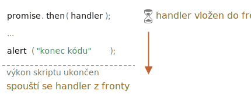

# Mikroúlohy

Příslibové handlery `.then`/`.catch`/`.finally` jsou vždy asynchronní.

I když je příslib okamžitě splněn, kód na řádcích *pod* `.then`/`.catch`/`.finally` se vykoná ještě před těmito handlery.

Zde je ukázka:

```js run
let příslib = Promise.resolve();

příslib.then(() => alert("příslib hotov!"));

alert("konec kódu"); // tento alert se zobrazí jako první
```

Pokud si ji spustíte, uvidíte napřed `konec kódu` a až poté `příslib hotov!`.

To je zvláštní, protože příslib je očividně hotov již od začátku.

Proč se `.then` spustí až pak? Co se děje?

## Fronta mikroúloh

Asynchronní úlohy potřebují vhodný management. Proto standard ECMA specifikuje vnitřní frontu `PromiseJobs`, častěji nazývanou „fronta mikroúloh“ (pojem z V8).

Jak je uvedeno ve [specifikaci](https://tc39.github.io/ecma262/#sec-jobs-and-job-queues):

- Fronta funguje na principu „první dovnitř, první ven“: úlohy vložené jako první se spustí jako první.
- Provádění úlohy se spustí jen tehdy, když neběží nic jiného.

Nebo, abychom to zjednodušili, když je příslib připraven, vloží se do fronty jeho handlery `.then/catch/finally`; zatím nebudou spuštěny. Až se motor JavaScriptu oprostí od právě prováděného kódu, vybere úlohu z fronty a spustí ji.

To je důvod, proč se v uvedeném příkladu jako první zobrazí „konec kódu“.



Příslibové handlery touto vnitřní frontou vždy procházejí.

Jestliže máme řetěz s více `.then/catch/finally`, je každý z nich spuštěn asynchronně. To znamená, že nejprve je vložen do fronty a spustí se až tehdy, když bude dokončen právě prováděný kód i handlery ve frontě před ním.

**Co když nám záleží na pořadí? Jak můžeme zajistit, aby se `konec kódu` objevil až po `příslib hotov!`?**

Jednoduše, prostě jej vložíme do fronty pomocí `.then`:

```js run
Promise.resolve()
  .then(() => alert("příslib hotov!"))
  .then(() => alert("konec kódu"));
```

Nyní je pořadí takové, jaké jsme zamýšleli.

## Neošetřené odmítnutí

Pamatujete si na událost `unhandledrejection` z článku <info:promise-error-handling>?

Nyní přesně vidíme, jak JavaScript zjistí, že nastalo neošetřené odmítnutí.

**„Neošetřené odmítnutí“ nastane, když na konci fronty mikroúloh není ošetřena příslibová chyba.**

Za normálních okolností, pokud očekáváme chybu, přidáme do řetězu příslibů `.catch`, aby ji ošetřil:

```js run
let příslib = Promise.reject(new Error("Příslib selhal!"));
*!*
příslib.catch(chyba => alert('odchyceno'));
*/!*

// nespustí se: chyba je ošetřena
window.addEventListener('unhandledrejection', událost => alert(událost.reason));
```

Jestliže však zapomeneme přidat `.catch`, pak motor po vyprázdnění fronty mikroúloh tuto událost spustí:

```js run
let příslib = Promise.reject(new Error("Příslib selhal!"));

// Příslib selhal!
window.addEventListener('unhandledrejection', událost => alert(událost.reason));
```

Co když tuto chybu ošetříme později? Například:

```js run
let příslib = Promise.reject(new Error("Příslib selhal!"));
*!*
setTimeout(() => příslib.catch(chyba => alert('odchyceno')), 1000);
*/!*

// Příslib selhal!
window.addEventListener('unhandledrejection', událost => alert(událost.reason));
```

Když to nyní spustíme, uvidíme nejprve `Příslib selhal!` a pak `odchyceno`.

Kdybychom nevěděli o frontě mikroúloh, mohli bychom se divit: „Proč se handler `unhandledrejection` spustil? Vždyť jsme tu chybu zachytili a ošetřili!“

Nyní však rozumíme, že `unhandledrejection` se generuje, když je fronta mikroúloh dokončena: motor prozkoumá přísliby, a pokud některý z nich je ve stavu zamítnutí, událost se spustí.

V uvedeném příkladu se spustí i `.catch`, který přidala funkce `setTimeout`. Stane se to však později, až poté, co již nastala událost `unhandledrejection`, takže se tím nic nezmění.

## Shrnutí

Zpracování příslibů je vždy asynchronní, jelikož všechny příslibové akce procházejí vnitřní frontou „příslibových úkolů“, nazývanou také „fronta mikroúloh“ (pojem z V8).

Proto jsou handlery `.then/catch/finally` volány vždy až poté, co skončí aktuálně prováděný kód.

Jestliže potřebujeme zaručit, aby se část kódu spustila až po `.then/catch/finally`, můžeme ji přidat do zřetězeného volání `.then`.

Ve většině motorů JavaScriptu, včetně prohlížečů a Node.js, je koncept mikroúloh úzce spojen se „smyčkou událostí“ a „makroúlohami“. Protože tyto záležitosti přímo nesouvisejí s přísliby, probereme je v jiné části tutoriálu v článku <info:event-loop>.
