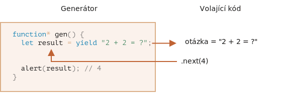
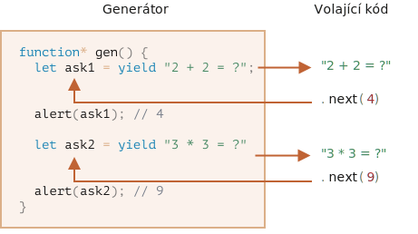

# Generátory

Běžné funkce vracejí jen jednu jedinou hodnotu (nebo žádnou).

Generátory mohou na požádání vrátit (vydat, anglicky „yield“) více hodnot, jednu po druhé. Výborně spolupracují s [iterovatelnými objekty](info:iterable) a umožňují nám snadno vytvářet datové proudy.

## Generátorové funkce

K vytvoření generátoru potřebujeme speciální syntaktický konstrukt: `function*`, tzv. „generátorovou funkci“.

Vypadá takto:

```js
function* generujPosloupnost() {
  yield 1;
  yield 2;
  return 3;
}
```

Generátorové funkce se chovají jinak než obyčejné. Když je taková funkce volána, nespustí se její kód. Místo toho vrátí speciální objekt, zvaný „generátorový objekt“, aby její běh řídil.

Podívejme se:

```js run
function* generujPosloupnost() {
  yield 1;
  yield 2;
  return 3;
}

// „generátorová funkce“ vytvoří „generátorový objekt“
let generátor = generujPosloupnost();
*!*
alert(generátor); // [object Generator]
*/!*
```

Běh kódu funkce ještě nezačal:


Hlavní metoda generátoru je `next()`. Když je volána, spustí běh funkce až do nejbližšího příkazu `yield <hodnota>` (`hodnota` nemusí být uvedena, pak je `undefined`). Pak se běh funkce přeruší a vydaná `hodnota` je vrácena vnějšímu kódu.

Výsledkem funkce `next()` je vždy objekt se dvěma vlastnostmi:
- `value`: vydaná hodnota.
- `done`: `true`, jestliže kód funkce skončil, jinak `false`.

Například zde vytvoříme generátor a získáme jeho první vydanou hodnotu:

```js run
function* generujPosloupnost() {
  yield 1;
  yield 2;
  return 3;
}

let generátor = generujPosloupnost();

*!*
let jedna = generátor.next();
*/!*

alert(JSON.stringify(jedna)); // {value: 1, done: false}
```

Prozatím jsme získali jenom první hodnotu a běh funkce je na druhém řádku:


Volejme znovu `generátor.next()`. Metoda obnoví běh kódu a vrátí další `yield`:

```js
let dvě = generátor.next();

alert(JSON.stringify(dvě)); // {value: 2, done: false}
```


A když ji zavoláme potřetí, běh dosáhne příkazu `return`, který funkci ukončí:

```js
let tři = generátor.next();

alert(JSON.stringify(tři)); // {value: 3, *!*done: true*/!*}
```


Nyní generátor skončil. Měli bychom to poznat z `done:true` a jako poslední výsledek zpracovat `value:3`.

Další volání `generátor.next()` už nebudou mít smysl. Pokud je učiníme, vrátí stejný objekt: `{done: true}`.

```smart header="`function* f(…)` nebo `function *f(…)`?"
Obě syntaxe jsou správné.

Obvykle se však dává přednost první syntaxi, jelikož hvězdička `*` označuje, že jde o generátorovou funkci. Popisuje druh funkce a ne její název, takže by měla být připojena ke klíčovému slovu `function`.
```

## Generátory jsou iterovatelné

Jak jste již pravděpodobně usoudili z pohledu na metodu `next()`, generátory jsou [iterovatelné](info:iterable).

Můžeme cyklovat nad jejich hodnotami pomocí `for..of`:

```js run
function* generujPosloupnost() {
  yield 1;
  yield 2;
  return 3;
}

let generátor = generujPosloupnost();

for(let hodnota of generátor) {
  alert(hodnota); // 1, pak 2
}
```

Vypadá to mnohem lépe než volání `.next().value`, že?

...Ale prosíme všimněte si: uvedený příklad zobrazí `1`, pak `2` a to je vše. Nezobrazí `3`!

Je to proto, že iterace `for..of` ignoruje poslední hodnotu `value`, když je `done: true`. Jestliže tedy chceme, aby `for..of` zobrazilo všechny výsledky, musíme je vrátit pomocí `yield`:

```js run
function* generujPosloupnost() {
  yield 1;
  yield 2;
*!*
  yield 3;
*/!*
}

let generátor = generujPosloupnost();

for(let hodnota of generátor) {
  alert(hodnota); // 1, pak 2, pak 3
}
```

Protože generátory jsou iterovatelné, můžeme používat veškerou funkcionalitu vztahující se k iterovatelným objektům, např. roztaženou syntaxi `...`:

```js run
function* generujPosloupnost() {
  yield 1;
  yield 2;
  yield 3;
}

let posloupnost = [0, ...generujPosloupnost()];

alert(posloupnost); // 0, 1, 2, 3
```

V uvedeném kódu `...generujPosloupnost()` přetvoří iterovatelný generátorový objekt na pole prvků (více o roztažené syntaxi si přečtěte v kapitole [](info:rest-parameters-spread#spread-syntax)).

## Používání generátorů pro iterovatelné objekty

Před nějakou dobou, v kapitole [](info:iterable), jsme vytvořili objekt `rozsah`, který vracel hodnoty `začátek..konec`.

Zde si tento kód připomeňme:

```js run
let rozsah = {
  začátek: 1,
  konec: 5,

  // for..of na objektu rozsah volá tuto metodu jednou na samém začátku
  [Symbol.iterator]() {
    // ...vrací objekt iterátoru:
    // od této chvíle for..of pracuje jen s tímto objektem a ptá se ho na další hodnoty
    return {
      aktuální: this.začátek,
      poslední: this.konec,

      // next() je volána cyklem for..of při každé iteraci
      next() {
        // měla by vrátit hodnotu jako objekt {done:.., value :...}
        if (this.aktuální <= this.poslední) {
          return { done: false, value: this.aktuální++ };
        } else {
          return { done: true };
        }
      }
    };
  }
};

// iterace nad rozsahem vrací čísla od rozsah.začátek do rozsah.konec
alert([...rozsah]); // 1,2,3,4,5
```

Pro iteraci můžeme použít generátorovou funkci, když ji poskytneme jako `Symbol.iterator`.

Zde je stejný `rozsah`, ale mnohem kompaktnější:

```js run
let rozsah = {
  začátek: 1,
  konec: 5,

  *[Symbol.iterator]() { // zkratka pro [Symbol.iterator]: function*()
    for(let hodnota = this.začátek; hodnota <= this.konec; hodnota++) {
      yield hodnota;
    }
  }
};

alert( [...rozsah] ); // 1,2,3,4,5
```

Funguje to, protože `rozsah[Symbol.iterator]()` nyní vrací generátor a metody generátoru jsou přesně to, co `for..of` očekává:
- obsahuje metodu `.next()`
- která vrací hodnoty ve tvaru `{value: ..., done: true/false}`

To samozřejmě není náhoda. Generátory byly do jazyka JavaScript přidány s ohledem na iterátory, aby je bylo možné lehce implementovat.

Varianta s generátorem je mnohem stručnější než původní iterovatelný kód objektu `rozsah` a udržuje si stejnou funkcionalitu.

```smart header="Generátory mohou generovat hodnoty donekonečna"
V uvedených příkladech jsme generovali konečné posloupnosti, ale můžeme vytvořit i generátor, který vydává hodnoty neustále. Například nekonečnou posloupnost pseudonáhodných čísel.

To by samozřejmě vyžadovalo `break` (nebo `return`) v cyklu `for..of` nad takovým generátorem. Jinak by se cyklus opakoval donekonečna a skript by zůstal viset.
```

## Skládání generátorů

Skládání generátorů je speciální vlastnost generátorů, která je umožňuje průhledně „zanořit“ do sebe navzájem.

Například máme funkci, která generuje posloupnost čísel:

```js
function* generujPosloupnost(začátek, konec) {
  for (let i = začátek; i <= konec; i++) yield i;
}
```

Nyní bychom ji rádi znovu použili, aby generovala složitější posloupnost:
- nejprve číslice `0..9` (s kódy znaků 48 až 57),
- po nich písmena velké abecedy `A..Z` (s kódy znaků 65 až 90),
- po nich písmena malé abecedy `a..z` (s kódy znaků 97 až 122).

Tuto posloupnost můžeme použít například k vytváření hesel tím, že z ní budeme vybírat znaky (můžeme přidat i syntaktické znaky), ale napřed ji vygenerujme.

Když chceme v obyčejné funkci zkombinovat výsledky z několika jiných funkcí, zavoláme je, uložíme si jejich výsledky a nakonec je spojíme.

Pro generátory existuje speciální syntaxe `yield*` k „vnoření“ (složení) jednoho generátoru do jiného.

Složený generátor:

```js run
function* generujPosloupnost(začátek, konec) {
  for (let i = začátek; i <= konec; i++) yield i;
}

function* generujKódyHesel() {

*!*
  // 0..9
  yield* generujPosloupnost(48, 57);

  // A..Z
  yield* generujPosloupnost(65, 90);

  // a..z
  yield* generujPosloupnost(97, 122);
*/!*

}

let řetězec = '';

for(let kód of generujKódyHesel()) {
  řetězec += String.fromCharCode(kód);
}

alert(řetězec); // 0..9A..Za..z
```

Direktiva `yield*` *deleguje* výkon na jiný generátor. Tento pojem znamená, že `yield* gen` iteruje nad generátorem `gen` a průhledně předává jeho výstupy ven, jako by byly vydány vnějším generátorem.

Výsledek je stejný, jako kdybychom vložili kód z vnořených generátorů:

```js run
function* generujPosloupnost(začátek, konec) {
  for (let i = začátek; i <= konec; i++) yield i;
}

function* generujAlfanumerickou() {

*!*
  // yield* generujPosloupnost(48, 57);
  for (let i = 48; i <= 57; i++) yield i;

  // yield* generujPosloupnost(65, 90);
  for (let i = 65; i <= 90; i++) yield i;

  // yield* generujPosloupnost(97, 122);
  for (let i = 97; i <= 122; i++) yield i;
*/!*

}

let řetězec = '';

for(let kód of generujAlfanumerickou()) {
  řetězec += String.fromCharCode(kód);
}

alert(řetězec); // 0..9A..Za..z
```

Skládání generátorů je přirozený způsob, jak vložit běh jednoho generátoru do druhého. Nepoužívá další paměť, do níž by se ukládaly průběžné výsledky.

## „yield“ je obousměrná ulice

Až dosud se generátory podobaly iterovatelným objektům se speciální syntaxí pro generování hodnot. Ve skutečnosti však jsou mnohem silnější a flexibilnější.

Je to proto, že `yield` je obousměrná ulice: nejenom vrací výsledek ven, ale také umí předat hodnotu dovnitř generátoru.

Abychom tak učinili, měli bychom volat `generátor.next(arg)` s argumentem. Tento argument se stane výsledkem `yield`.

Podívejme se na příklad:

```js run
function* gen() {
*!*
  // Předá otázku vnějšímu kódu a počká na odpověď
  let výsledek = yield "2 + 2 = ?"; // (*)
*/!*

  alert(výsledek);
}

let generátor = gen();

let otázka = generátor.next().value; // <-- yield vrátí hodnotu

generátor.next(4); // --> předá výsledek do generátoru
```



1. První volání `generátor.next()` by mělo být vždy učiněno bez argumentu (je-li argument předán, je ignorován). Zahájí běh a vrátí výsledek prvního `yield "2+2=?"`. V tuto chvíli generátor pozastaví svůj běh a zůstane na řádku `(*)`.
2. Pak, jak je znázorněno na obrázku, se výsledek `yield` stane hodnotou proměnné `otázka` ve volajícím kódu.
3. Na `generátor.next(4)` se generátor obnoví a jako výsledek získá `4`: `let výsledek = 4`.

Prosíme všimněte si, že vnější kód nemusí volat `next(4)` okamžitě. Může to nějakou dobu trvat. To není problém: generátor počká.

Například:

```js
// obnoví generátor za nějakou dobu
setTimeout(() => generátor.next(4), 1000);
```

Jak vidíme, na rozdíl od běžných funkcí si generátor a volající kód mohou vyměňovat výsledky předáváním hodnot v příkazech `next/yield`.

Aby to bylo jasnější, následuje další příklad s více voláními:

```js run
function* gen() {
  let dotaz1 = yield "2 + 2 = ?";

  alert(dotaz1); // 4

  let dotaz2 = yield "3 * 3 = ?"

  alert(dotaz2); // 9
}

let generátor = gen();

alert( generátor.next().value ); // "2 + 2 = ?"

alert( generátor.next(4).value ); // "3 * 3 = ?"

alert( generátor.next(9).done ); // true
```

Běh kódu vidíme na obrázku:



1. První `.next()` zahájí běh... Dosáhne prvního `yield`.
2. Výsledek je vrácen vnějšímu kódu.
3. Druhé `.next(4)` předá `4` zpět generátoru jako výsledek prvního `yield` a obnoví jeho běh.
4. ...Běh dosáhne druhého `yield`, které se stane výsledkem volání generátoru.
5. Třetí `.next(9)` předá do generátoru `9` jako výsledek druhého `yield` a obnoví jeho běh, který dosáhne konce funkce, takže `done: true`.

Je to jako pingpong. Každé `next(hodnota)` (s výjimkou prvního) předá do generátoru hodnotu, která se stane výsledkem aktuálního `yield`, a pak získá zpět výsledek dalšího `yield`.

## generátor.throw

Jak jsme viděli v uvedených příkladech, vnější kód může předat generátoru hodnotu jako výsledek `yield`.

...Může v něm však také vyvolat chybu. To je přirozené, neboť chyba je druh výsledku.

Abychom předali chybu do `yield`, měli bychom volat `generátor.throw(chyba)`. V takovém případě je `chyba` vyvolána na řádku s tímto `yield`.

Například zde vydání `"2 + 2 = ?"` vede k chybě:

```js run
function* gen() {
  try {
    let výsledek = yield "2 + 2 = ?"; // (1)

    alert("Běh se sem nedostane, protože výše bude vyvolána výjimka");
  } catch(e) {
    alert(e); // zobrazí chybu
  }
}

let generátor = gen();

let otázka = generátor.next().value;

*!*
generátor.throw(new Error("Odpověď nenalezena v mé databázi")); // (2)
*/!*
```

Chyba, vhozená do generátoru na řádku `(2)`, povede k výjimce na řádku `(1)` s `yield`. V uvedeném příkladu ji `try..catch` zachytí a zobrazí.

Pokud ji nezachytíme, pak stejně jako každá výjimka „vypadne“ z generátoru do volajícího kódu.

Aktuální řádek volajícího kódu je řádek s `generátor.throw`, označený `(2)`. Tam ji tedy můžeme zachytit, například takto:

```js run
function* generuj() {
  let výsledek = yield "2 + 2 = ?"; // Chyba na tomto řádku
}

let generátor = generuj();

let otázka = generátor.next().value;

*!*
try {
  generátor.throw(new Error("Odpověď nenalezena v mé databázi"));
} catch(e) {
  alert(e); // zobrazí chybu
}
*/!*
```

Pokud zde tuto chybu nezachytíme, pak jako obvykle propadne do vnějšího volajícího kódu (je-li nějaký), a není-li zachycena, shodí skript.

## generátor.return

`generátor.return(hodnota)` ukončí běh generátoru a vrátí zadanou hodnotu `hodnota`.

```js
function* gen() {
  yield 1;
  yield 2;
  yield 3;
}

const g = gen();

g.next();        // { value: 1, done: false }
g.return('nic'); // { value: "nic", done: true }
g.next();        // { value: undefined, done: true }
```

Jestliže na dokončeném generátoru znovu použijeme `generátor.return()`, vrátí tuto hodnotu znovu ([MDN](https://developer.mozilla.org/en-US/docs/Web/JavaScript/Reference/Global_Objects/Generator/return)).

Tuto metodu nepoužíváme často, protože většinou chceme získat všechny vracené hodnoty, ale může být užitečná, když chceme generátor zastavit za specifických podmínek.

## Shrnutí

- Generátory se vytvářejí generátorovými funkcemi `function* f(…) {…}`.
- Uvnitř generátorů (pouze tam) existuje operátor `yield`.
- Vnější kód a generátor si mohou vyměňovat výsledky pomocí volání `next/yield`.

V moderním JavaScriptu se generátory používají jen zřídka, ale někdy se mohou hodit, protože schopnost funkce vyměňovat si data s volajícím kódem při jejím běhu je poměrně unikátní. A samozřejmě jsou vynikající pro vytváření iterovatelných objektů.

V další kapitole se navíc dozvíme o asynchronních generátorech, které se používají k načítání proudů asynchronně generovaných dat (např. stránkovaných dat při stahování ze sítě) v cyklech `for await ... of`.

Při programování webů pracujeme s datovými proudy často, takže to je další velmi důležitý případ použití.
