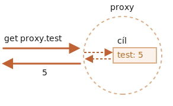

# Třídy Proxy a Reflect

Objekt třídy `Proxy` obaluje jiný objekt a zachytává operace na něm, například čtení nebo zápis vlastností a jiné. Volitelně je zpracovává sám o sobě nebo průhledně umožňuje objektu, aby je zpracovával sám.

Proxy jsou používány v mnoha knihovnách a některých frameworcích prohlížečů. V tomto článku uvidíme mnoho praktických aplikací.

## Proxy

Syntaxe:

```js
let proxy = new Proxy(cíl, handler)
```

- `cíl` -- je objekt, který má být obalen, může to být cokoli včetně funkcí.
- `handler` -- konfigurace proxy: objekt s „pastmi“, metodami, které zachytávají operace, např. past `get` pro načítání vlastností objektu `cíl`, past `set` pro zápis vlastnosti do objektu `cíl`, a tak dále.

Jestliže pro operaci prováděnou na `proxy` existuje odpovídající past v objektu `handler`, pak se spustí a proxy dostane šanci operaci zpracovat, v opačném případě je operace provedena na objektu `cíl`.

Jako počáteční příklad vytvořme proxy bez jakýchkoli pastí:

```js run
let cíl = {};
let proxy = new Proxy(cíl, {}); // prázdný handler

proxy.test = 5; // zápis do proxy (1)
alert(cíl.test); // 5, vlastnost se objeví v objektu cíl!

alert(proxy.test); // 5, můžeme ji z proxy také načíst (2)

for(let klíč in proxy) alert(klíč); // test, iterace funguje (3)
```

Protože zde nejsou žádné pasti, všechny operace na `proxy` jsou předány objektu `cíl`.

1. Operace zápisu `proxy.test=` nastaví hodnotu v objektu `cíl`.
2. Operace čtení `proxy.test` vrátí hodnotu z objektu `cíl`.
3. Iterace nad objektem `proxy` vrací hodnoty z objektu `cíl`.

Jak vidíme, bez pastí je `proxy` průhledným obalem kolem objektu `cíl`.



`Proxy` je speciální „exotický objekt“, který nemá své vlastní vlastnosti. Je-li objekt `handler` prázdný, průhledně předává operace objektu `cíl`.

Abychom aktivovali jeho další schopnosti, přidejme pasti.

Co s nimi můžeme zachytávat?

Pro většinu operací na objektech je ve specifikaci JavaScriptu tzv. „interní metoda“, která popisuje, jak operace funguje na nejnižší úrovni. Například `[[Get]]`, interní metoda k načtení vlastnosti, `[[Set]]`, interní metoda k zápisu vlastnosti, a tak dále. Tyto metody se používají jen ve specifikaci, volat přímo názvem je nemůžeme.

Pasti proxy zachytávají vyvolávání těchto metod. Jsou vyjmenovány ve [specifikaci Proxy](https://tc39.es/ecma262/#sec-proxy-object-internal-methods-and-internal-slots) a v následující tabulce.

Pro každou interní metodu je v této tabulce past: název metody, který můžeme přidat do parametru `handler` při volání `new Proxy`, abychom operaci zachytili:

| Interní metoda | Metoda handleru | Spustí se při... |
|-----------------|----------------|-------------|
| `[[Get]]` | `get` | načítání vlastnosti |
| `[[Set]]` | `set` | zápisu do vlastnosti |
| `[[HasProperty]]` | `has` | operátoru `in` |
| `[[Delete]]` | `deleteProperty` | operátoru `delete` |
| `[[Call]]` | `apply` | volání funkce |
| `[[Construct]]` | `construct` | operátoru `new` |
| `[[GetPrototypeOf]]` | `getPrototypeOf` | [Object.getPrototypeOf](mdn:/JavaScript/Reference/Global_Objects/Object/getPrototypeOf) |
| `[[SetPrototypeOf]]` | `setPrototypeOf` | [Object.setPrototypeOf](mdn:/JavaScript/Reference/Global_Objects/Object/setPrototypeOf) |
| `[[IsExtensible]]` | `isExtensible` | [Object.isExtensible](mdn:/JavaScript/Reference/Global_Objects/Object/isExtensible) |
| `[[PreventExtensions]]` | `preventExtensions` | [Object.preventExtensions](mdn:/JavaScript/Reference/Global_Objects/Object/preventExtensions) |
| `[[DefineOwnProperty]]` | `defineProperty` | [Object.defineProperty](mdn:/JavaScript/Reference/Global_Objects/Object/defineProperty), [Object.defineProperties](mdn:/JavaScript/Reference/Global_Objects/Object/defineProperties) |
| `[[GetOwnProperty]]` | `getOwnPropertyDescriptor` | [Object.getOwnPropertyDescriptor](mdn:/JavaScript/Reference/Global_Objects/Object/getOwnPropertyDescriptor), `for..in`, `Object.keys/values/entries` |
| `[[OwnPropertyKeys]]` | `ownKeys` | [Object.getOwnPropertyNames](mdn:/JavaScript/Reference/Global_Objects/Object/getOwnPropertyNames), [Object.getOwnPropertySymbols](mdn:/JavaScript/Reference/Global_Objects/Object/getOwnPropertySymbols), `for..in`, `Object.keys/values/entries` |

```warn header="Invarianty"
JavaScript vyžaduje některé invarianty -- podmínky, které musejí interní metody a pasti splňovat.

Většina z nich se týká návratových hodnot:
- `[[Set]]` musí vracet `true`, jestliže byla hodnota úspěšně zapsána, jinak `false`.
- `[[Delete]]` musí vracet `true`, jestliže byla hodnota úspěšně smazána, jinak `false`.
- ...a tak dále, další uvidíme v příkladech níže.

Existují i některé další invarianty, například:
- `[[GetPrototypeOf]]` aplikovaná na proxy objekt musí vracet stejnou hodnotu jako `[[GetPrototypeOf]]` aplikovaná na cílový objekt tohoto proxy objektu. Jinými slovy, načítání prototypu proxy musí vždy vrátit prototyp cílového objektu.

Pasti mohou tyto operace zachytávat, ale musejí dodržovat tato pravidla.

Invarianty zajišťují korektní a konzistentní chování prvků jazyka. Úplný seznam invariant je obsažen ve [specifikaci](https://tc39.es/ecma262/#sec-proxy-object-internal-methods-and-internal-slots). Pokud nebudete dělat něco podivného, pravděpodobně je neporušíte.
```

Podívejme se na praktických příkladech, jak to funguje.

## Výchozí hodnota s pastí „get“

Nejběžnější pasti jsou pro čtení a zápis vlastností.

Abychom zachytili čtení, `handler` by měl obsahovat metodu `get(cíl, vlastnost, příjemce)`.

Když je vlastnost načítána, tato metoda se spustí s následujícími argumenty:

- `cíl` -- je cílový objekt, ten, který byl předán do `new Proxy` jako první argument,
- `vlastnost` -- název vlastnosti,
- `příjemce` -- je-li cílová vlastnost getter, pak `příjemce` je objekt, který bude při volání tohoto getteru použit jako `this`. Obvykle je to samotný objekt `proxy` (nebo objekt, který je z něj zděděn, pokud dědíme z proxy). Prozatím tento argument nepotřebujeme, takže ho podrobněji vysvětlíme později.

Použijme `get` k implementaci výchozích hodnot objektu.

Vytvořme číselné pole, které bude pro neexistující hodnoty vracet `0`.

Když se pokoušíme načíst neexistující prvek pole, obyčejně získáme `undefined`, ale my obalíme běžné pole do proxy, která bude obsahovat past na načítání a vracet `0`, pokud načítaná vlastnost neexistuje:

```js run
let čísla = [0, 1, 2];

čísla = new Proxy(čísla, {
  get(cíl, vlastnost) {
    if (vlastnost in cíl) {
      return cíl[vlastnost];
    } else {
      return 0; // výchozí hodnota
    }
  }
});

*!*
alert( čísla[1] ); // 1
alert( čísla[123] ); // 0 (takový prvek není)
*/!*
```

Jak vidíme, s pastí `get` je něco takového docela snadné.

Můžeme použít `Proxy` k implementaci jakékoli logiky pro „výchozí“ hodnoty.

Představme si, že máme slovník s větami a jejich překlady:

```js run
let slovník = {
  'Ahoj': 'Hola',
  'Nashle': 'Adiós'
};

alert( slovník['Ahoj'] ); // Hola
alert( slovník['Vítejte'] ); // undefined
```

Prozatím načtení věty, kterou `slovník` neobsahuje, vrací `undefined`. V praxi je však obvykle lepší nechat větu nepřeloženou než vrátit `undefined`. Nechme tedy slovník, aby v takovém případě vrátil místo `undefined` nepřeloženou větu.

Abychom toho dosáhli, obalíme `slovník` do proxy, která zachytává operace načítání:

```js run
let slovník = {
  'Ahoj': 'Hola',
  'Nashle': 'Adiós'
};

slovník = new Proxy(slovník, {
*!*
  get(cíl, věta) { // zachytíme načítání vlastnosti ze slovníku
*/!*
    if (věta in cíl) { // máme-li ji ve slovníku,
      return cíl[věta]; // vrátíme její překlad
    } else {
      // jinak vrátíme nepřeloženou větu
      return věta;
    }
  }
});

// Podívejte se na různé věty ve slovníku!
// Přinejhorším nebudou přeloženy.
alert( slovník['Ahoj'] ); // Hola
*!*
alert( slovník['Vítejte v Proxy']); // Vítejte v Proxy (bez překladu)
*/!*
```

````smart
Prosíme všimněte si, jak proxy přepisuje proměnnou:

```js
slovník = new Proxy(slovník, ...);
```

Proxovaný objekt by měl cílový objekt všude zcela nahradit. Na cílový objekt by se po jeho nahrazení proxovaným objektem neměl nikdo nikde odkazovat. Jinak snadno naděláme nepořádek.
````

## Ověřování pomocí pasti „set“

Řekněme, že chceme pole výlučně pro čísla. Bude-li přidána hodnota jiného typu, měla by nastat chyba.

Když se zapisuje do vlastnosti, spustí se past `set`.

`set(cíl, vlastnost, hodnota, příjemce)`:

- `cíl` -- je cílový objekt, ten, který byl předán do `new Proxy` jako první argument,
- `vlastnost` -- název vlastnosti,
- `hodnota` -- hodnota vlastnosti,
- `příjemce` -- podobně jako u pasti `get`, má význam jen pro settery.

Past `set` by měla vracet `true`, je-li nastavení úspěšné, a jinak `false` (vyvolá `TypeError`).

Použijme ji k ověřování nových hodnot:

```js run
let čísla = [];

čísla = new Proxy(čísla, { // (*)
*!*
  set(cíl, vlastnost, hodnota) { // zachytává zápis do vlastností
*/!*
    if (typeof hodnota == 'number') {
      cíl[vlastnost] = hodnota;
      return true;
    } else {
      return false;
    }
  }
});

čísla.push(1); // úspěšně přidáno
čísla.push(2); // úspěšně přidáno
alert("Délka pole je: " + čísla.length); // 2

*!*
čísla.push("test"); // TypeError ('set' na proxy vrátila false)
*/!*

alert("Na tento řádek se nikdy nedostaneme (chyba na řádku výše)");
```

Prosíme všimněte si, že zabudovaná funkcionalita polí stále funguje! Hodnoty se přidávají metodou `push`. Vlastnost `length` se při přidávání hodnot automaticky zvyšuje. Naše proxy nic nepokazila.

Metody přidávání hodnot do polí jako `push`, `unshift` a podobně nemusíme kvůli přidání ověření přepisovat, protože vnitřně používají operaci `[[Set]]`, kterou proxy zachytává.

Kód je tedy čistý a výstižný.

```warn header="Nezapomínejte vracet `true`"
Jak bylo řečeno výše, existují invarianty, které je třeba dodržovat.

Pro `set` musíme při úspěšném zápisu vracet `true`.

Pokud na to zapomeneme nebo vrátíme jakoukoli nepravdivou hodnotu, operace vyvolá `TypeError`.
```

## Iterace pomocí „ownKeys“ a „getOwnPropertyDescriptor“

Metoda `Object.keys`, cyklus `for..in` a většina ostatních metod, které iterují nad vlastnostmi objektu, používají k načtení seznamu vlastností interní metodu `[[OwnPropertyKeys]]` (kterou zachytává past `ownKeys`).

Tyto metody se liší v detailech:
- `Object.getOwnPropertyNames(obj)` vrací nesymbolické klíče.
- `Object.getOwnPropertySymbols(obj)` vrací symbolické klíče.
- `Object.keys/values()` vrací nesymbolické klíče/hodnoty s přepínačem `enumerable` (přepínače vlastností byly vysvětleny v kapitole <info:property-descriptors>).
- `for..in` cykluje nad nesymbolickými klíči s přepínačem `enumerable` a také nad klíči prototypu.

...Všechny však začínají se seznamem vlastností vráceným touto metodou.

V následujícím příkladu použijeme past `ownKeys`, abychom cyklus `for..in` nad objektem `uživatel`, stejně jako metody `Object.keys` a `Object.values`, přiměli přeskakovat vlastnosti začínající podtržítkem `_`:

```js run
let uživatel = {
  jméno: "Jan",
  věk: 30,
  _heslo: "***"
};

uživatel = new Proxy(uživatel, {
*!*
  ownKeys(cíl) {
*/!*
    return Object.keys(cíl).filter(klíč => !klíč.startsWith('_'));
  }
});

// „ownKeys“ odfiltruje _heslo
for(let klíč in uživatel) alert(klíč); // jméno, pak: věk

// stejný efekt má na těchto metodách:
alert( Object.keys(uživatel) ); // jméno,věk
alert( Object.values(uživatel) ); // Jan,30
```

Dosud to funguje.

Ale jestliže vrátíme klíč, který v tomto objektu neexistuje, `Object.keys` jej nezpracuje:

```js run
let uživatel = { };

uživatel = new Proxy(uživatel, {
*!*
  ownKeys(cíl) {
*/!*
    return ['a', 'b', 'c'];
  }
});

alert( Object.keys(uživatel) ); // <prázdný seznam>
```

Proč? Důvod je prostý: metoda `Object.keys` vrací jen vlastnosti s přepínačem `enumerable`. Aby si jej ověřila, volá pro každou vlastnost interní metodu `[[GetOwnProperty]]`, aby získala [její deskriptor](info:property-descriptors). A protože zde žádná vlastnost není, její deskriptor je prázdný a neobsahuje přepínač `enumerable`, a tak je vlastnost přeskočena.

Aby `Object.keys` vracel vlastnost, musí buď tato vlastnost v objektu existovat s přepínačem `enumerable`, nebo můžeme zachytávat volání metody `[[GetOwnProperty]]` (to dělá past `getOwnPropertyDescriptor`) a vracet deskriptor obsahující `enumerable: true`.

Zde je příklad:

```js run
let uživatel = { };

uživatel = new Proxy(uživatel, {
  ownKeys(cíl) { // volána jednou pro získání seznamu vlastností
    return ['a', 'b', 'c'];
  },

  getOwnPropertyDescriptor(cíl, vlastnost) { // volána pro každou vlastnost
    return {
      enumerable: true,
      configurable: true
      /* ...další přepínače, pravděpodobně "value:..." */
    };
  }

});

alert( Object.keys(uživatel) ); // a, b, c
```

Poznamenejme to znovu: jestliže vlastnost v objektu chybí, potřebujeme jen zachycovat `[[GetOwnProperty]]`.

## Ochrana vlastností pomocí „deleteProperty“ a jiných pastí

Existuje široce přijímaná konvence, že vlastnosti a metody začínající podtržítkem `_` jsou interní. Nemělo by se k nim přistupovat zvnějšku objektu.

Technicky to však možné je:

```js run
let uživatel = {
  jméno: "Jan",
  _heslo: "tajné"
};

alert(uživatel._heslo); // tajné
```

Abychom zabránili jakémukoli přístupu k vlastnostem, které začínají `_`, použijme proxy.

Potřebujeme tyto pasti:
- `get` k vyvolání chyby při načítání takové vlastnosti,
- `set` k vyvolání chyby při zapisování do ní,
- `deleteProperty` k vyvolání chyby při jejím mazání,
-  `ownKeys` k vyloučení vlastností začínajících `_` z cyklu `for..in` a metod jako `Object.keys`.

Zde je kód:

```js run
let uživatel = {
  jméno: "Jan",
  _heslo: "***"
};

uživatel = new Proxy(uživatel, {
*!*
  get(cíl, vlastnost) {
*/!*
    if (vlastnost.startsWith('_')) {
      throw new Error("Přístup zamítnut");
    }
    let hodnota = cíl[vlastnost];
    return (typeof hodnota === 'function') ? hodnota.bind(cíl) : hodnota; // (*)
  },
*!*
  set(cíl, vlastnost, hodnota) { // k zachycení zápisu do vlastnosti
*/!*
    if (vlastnost.startsWith('_')) {
      throw new Error("Přístup zamítnut");
    } else {
      cíl[vlastnost] = hodnota;
      return true;
    }
  },
*!*
  deleteProperty(cíl, vlastnost) { // k zachycení mazání vlastnosti
*/!*
    if (vlastnost.startsWith('_')) {
      throw new Error("Přístup zamítnut");
    } else {
      delete cíl[vlastnost];
      return true;
    }
  },
*!*
  ownKeys(cíl) { // k zachycení seznamu vlastností
*/!*
    return Object.keys(cíl).filter(klíč => !klíč.startsWith('_'));
  }
});

// „get“ neumožňuje načíst _heslo
try {
  alert(uživatel._heslo); // Chyba: Přístup zamítnut
} catch(e) { alert(e.message); }

// „set“ neumožňuje zapsat do _heslo
try {
  uživatel._heslo = "test"; // Chyba: Přístup zamítnut
} catch(e) { alert(e.message); }

// „deleteProperty“ neumožňuje smazat _heslo
try {
  delete uživatel._heslo; // Chyba: Přístup zamítnut
} catch(e) { alert(e.message); }

// „ownKeys“ odfiltruje _heslo
for(let klíč in uživatel) alert(klíč); // jméno
```

Prosíme všimněte si důležitého detailu v pasti `get` na řádku `(*)`:

```js
get(cíl, vlastnost) {
  // ...
  let hodnota = cíl[vlastnost];
*!*
  return (typeof hodnota === 'function') ? hodnota.bind(cíl) : hodnota; // (*)
*/!*
}
```

Proč potřebujeme, aby funkce volala `hodnota.bind(cíl)`?

Důvodem je, že objektové metody, např. `uživatel.ověřHeslo()`, musejí být schopny k `_heslo` přistupovat:

```js
uživatel = {
  // ...
  ověřHeslo(hodnota) {
    // objektová metoda musí být schopna _heslo číst
    return hodnota === this._heslo;
  }
}
```

Volání `uživatel.ověřHeslo()` získá jako `this` proxovaný objekt `uživatel` (objekt před tečkou se stane `this`), takže když se pokusí o přístup k `this._heslo`, aktivuje se past `get` (ta se spustí při načítání jakékoli vlastnosti) a vyvolá se chyba.

Proto na řádku `(*)` navážeme kontext objektových metod na původní objekt, `cíl`. Pak jejich následná volání budou jako `this` používat `cíl` bez jakýchkoli pastí.

Toto řešení zpravidla funguje, ale není ideální, protože nějaká metoda může předat neproxovaný objekt někam jinam a pak nastane zmatek: kde je původní objekt a kde proxovaný?

Kromě toho objekt může být proxován několikrát (vícenásobné proxy mohou k objektu přidávat různé „úpravy“), a jestliže do metody předáme neobalený objekt, důsledky mohou být nečekané.

Taková proxy by tedy neměla být používána všude.

```smart header="Soukromé vlastnosti třídy"
Moderní JavaScriptové motory nativně podporují ve třídách soukromé vlastnosti, začínající znakem `#`. Jsou popsány v článku <info:private-protected-properties-methods>. Žádné proxy nejsou zapotřebí.

Takové vlastnosti však mají své vlastní problémy. Například nejsou děděny.
```

## „in“ pro rozsah s pastí „has“

Podívejme se na další příklady.

Máme objekt rozsahu:

```js
let rozsah = {
  začátek: 1,
  konec: 10
};
```

K ověření, zda číslo leží v rozsahu `rozsah`, bychom rádi používali operátor `in`.

Volání `in` zachytává past `has`.

`has(cíl, vlastnost)`

- `cíl` -- je cílový objekt, předaný jako první argument do `new Proxy`,
- `vlastnost` -- název vlastnosti.

Zde je demo:

```js run
let rozsah = {
  začátek: 1,
  konec: 10
};

rozsah = new Proxy(rozsah, {
*!*
  has(cíl, vlastnost) {
*/!*
    return vlastnost >= cíl.začátek && vlastnost <= cíl.konec;
  }
});

*!*
alert(5 in rozsah); // true
alert(50 in rozsah); // false
*/!*
```

Pěkný syntaktický cukr, že? A implementuje se velmi jednoduše.

## Obalování funkcí: „apply“ [#proxy-apply]

Do proxy můžeme obalit i funkci.

Past `apply(cíl, thisArg, args)` zpracovává volání proxy jako funkce:

- `cíl` je cílový objekt (funkce je v JavaScriptu objekt),
- `thisArg` je hodnota `this`,
- `args` je seznam argumentů.

Vzpomeňme si například na dekorátor `zpozdi(f, ms)`, který jsme vytvořili v článku <info:call-apply-decorators>.

V onom článku jsme to udělali bez proxy. Volání `zpozdi(f, ms)` vrátilo funkci, která funkci `f` předává všechna volání za `ms` milisekund.

Zde je předchozí implementace založená na funkcích:

```js run
function zpozdi(f, ms) {
  // vrátí obal, který po uplynutí zadaného času předá volání funkci f
  return function() { // (*)
    setTimeout(() => f.apply(this, arguments), ms);
  };
}

function řekniAhoj(uživatel) {
  alert(`Ahoj, ${uživatel}!`);
}

// po tomto obalení budou volání řekniAhoj pozdržena o 3 sekundy
řekniAhoj = zpozdi(řekniAhoj, 3000);

řekniAhoj("Jan"); // Ahoj, Jan! (po 3 sekundách)
```

Jak jsme již viděli, většinou to funguje. Obalová funkce `(*)` provede volání po stanoveném čase.

Avšak obalová funkce nepředává dál operace čtení a zápisu do vlastností nebo cokoli jiného. Po obalení ztratíme přístup k vlastnostem původní funkce, např. `name`, `length` a jiným:

```js run
function zpozdi(f, ms) {
  return function() {
    setTimeout(() => f.apply(this, arguments), ms);
  };
}

function řekniAhoj(uživatel) {
  alert(`Ahoj, ${uživatel}!`);
}

*!*
alert(řekniAhoj.length); // 1 (length=délka, délka funkce je počet argumentů v její deklaraci)
*/!*

řekniAhoj = zpozdi(řekniAhoj, 3000);

*!*
alert(řekniAhoj.length); // 0 (v deklaraci obalu je 0 argumentů)
*/!*
```

`Proxy` je mnohem silnější, jelikož cílovému objektu předává všechno.

Použijme `Proxy` místo obalové funkce:

```js run
function zpozdi(f, ms) {
  return new Proxy(f, {
    apply(cíl, thisArg, args) {
      setTimeout(() => cíl.apply(thisArg, args), ms);
    }
  });
}

function řekniAhoj(uživatel) {
  alert(`Ahoj, ${uživatel}!`);
}

řekniAhoj = zpozdi(řekniAhoj, 3000);

*!*
alert(řekniAhoj.length); // 1 (*) proxy předá cíli operaci „get length“
*/!*

řekniAhoj("Jan"); // Ahoj, Jan! (po 3 sekundách)
```

Výsledek je stejný, ale nyní se původní funkci předávají nejen volání, ale všechny operace na proxy. Po obalení se tedy `řekniAhoj.length` na řádku `(*)` vrátí správně.

Získali jsme „bohatší“ obal.

Existují i jiné pasti: jejich úplný seznam je uveden na začátku tohoto článku. Jejich vzorec použití je podobný uvedenému.

## Reflect

`Reflect` je vestavěný objekt, který zjednodušuje vytváření `Proxy`.

Již jsme uvedli, že interní metody, např. `[[Get]]`, `[[Set]]` a jiné, jsou jen specifikační a nemůžeme je volat přímo.

Objekt `Reflect` to částečně umožňuje. Jeho metody jsou minimální obaly okolo interních metod.

Zde jsou příklady operací a volání `Reflect`, která udělají totéž:

| Operace | Volání `Reflect` | Interní metoda |
|-----------------|----------------|-------------|
| `obj[vlastnost]` | `Reflect.get(obj, vlastnost)` | `[[Get]]` |
| `obj[vlastnost] = hodnota` | `Reflect.set(obj, vlastnost, hodnota)` | `[[Set]]` |
| `delete obj[vlastnost]` | `Reflect.deleteProperty(obj, vlastnost)` | `[[Delete]]` |
| `new F(hodnota)` | `Reflect.construct(F, hodnota)` | `[[Construct]]` |
| ... | ... | ... |

Například:

```js run
let uživatel = {};

Reflect.set(uživatel, 'jméno', 'Jan');

alert(uživatel.jméno); // Jan
```

Konkrétně nám `Reflect` umožňuje volat operátory (`new`, `delete`...) jako funkce (`Reflect.construct`, `Reflect.deleteProperty`, ...). To je zajímavá schopnost, ale tady je důležitá jiná věc.

**Pro každou interní metodu, kterou může zachytit `Proxy`, je v `Reflect` odpovídající metoda se stejným názvem a argumenty jako past v `Proxy`.**

Můžeme tedy používat `Reflect` k předání operace původnímu objektu.

V tomto příkladu obě pasti `get` a `set` průhledně (jako by neexistovaly) předají objektu operace čtení nebo zápisu a zobrazí zprávu:

```js run
let uživatel = {
  jméno: "Jan",
};

uživatel = new Proxy(uživatel, {
  get(cíl, vlastnost, příjemce) {
    alert(`GET ${vlastnost}`);
*!*
    return Reflect.get(cíl, vlastnost, příjemce); // (1)
*/!*
  },
  set(cíl, vlastnost, hodnota, příjemce) {
    alert(`SET ${vlastnost}=${hodnota}`);
*!*
    return Reflect.set(cíl, vlastnost, hodnota, příjemce); // (2)
*/!*
  }
});

let jméno = uživatel.jméno; // zobrazí "GET jméno"
uživatel.jméno = "Petr"; // zobrazí "SET jméno=Petr"
```

Zde:

- `Reflect.get` načte vlastnost objektu.
- `Reflect.set` zapíše vlastnost objektu a vrátí `true`, je-li úspěšná, jinak `false`.

Všechno je přitom jednoduché: jestliže past chce předat volání objektu, stačí jí volat `Reflect.<metoda>` se stejnými argumenty.

Ve většině případů můžeme udělat totéž i bez `Reflect`, například načítání vlastnosti pomocí `Reflect.get(cíl, vlastnost, příjemce)` můžeme nahradit za `cíl[vlastnost]`. Jsou tady však důležité drobnosti.

### Proxování getteru

Podívejme se na příklad, který demonstruje, proč je `Reflect.get` lepší. A také uvidíme, proč `get/set` mají třetí argument `příjemce`, který jsme zatím nepoužívali.

Máme objekt `uživatel` s vlastností `_jméno` a jejím getterem.

Zde je proxy okolo něj:

```js run
let uživatel = {
  _jméno: "Host",
  get jméno() {
    return this._jméno;
  }
};

*!*
let uživatelProxy = new Proxy(uživatel, {
  get(cíl, vlastnost, příjemce) {
    return cíl[vlastnost];
  }
});
*/!*

alert(uživatelProxy.jméno); // Host
```

Past `get` je zde „průhledná“, vrací původní vlastnost a nic jiného nedělá. To pro náš příklad stačí.

Vypadá to, že je všechno v pořádku. Učiňme však tento příklad trochu složitějším.

Po zdědění jiného objektu `admin` z objektu `uživatel` můžeme pozorovat nesprávné chování:

```js run
let uživatel = {
  _jméno: "Host",
  get jméno() {
    return this._jméno;
  }
};

let uživatelProxy = new Proxy(uživatel, {
  get(cíl, vlastnost, příjemce) {
    return cíl[vlastnost]; // (*) cíl = uživatel
  }
});

*!*
let admin = {
  __proto__: uživatelProxy,
  _jméno: "Admin"
};

// Očekáváme: Admin
alert(admin.jméno); // vypíše: Host (?!?)
*/!*
```

Načtení `admin.jméno` by mělo vrátit `"Admin"`, ne `"Host"`!

V čem je problém? Udělali jsme snad něco špatně s dědičností?

Pokud však odstraníme proxy, bude všechno fungovat tak, jak očekáváme.

Problém je ve skutečnosti v proxy na řádku `(*)`.

1. Když načítáme `admin.jméno`, objekt `admin` takovou vlastnost nemá, a proto hledání přejde k jeho prototypu.
2. Prototypem je `uživatelProxy`.
3. Když načítáme vlastnost `jméno` z proxy, spustí se jeho past `get` a na řádku `(*)` ji vrátí z původního objektu jako `cíl[vlastnost]`.

    Volání `cíl[vlastnost]`, když `vlastnost` je getter, spustí kód tohoto getteru v kontextu `this=cíl`. Výsledkem je tedy `this._jméno` z původního objektu `cíl`, což je: z objektu `uživatel`.

Abychom takové situace opravili, potřebujeme `příjemce`, třetí argument pasti `get`. Ten udržuje správné `this`, které bude předáno getteru. V našem případě to je `admin`.

Jak předat kontext getteru? Pro běžnou funkci bychom mohli použít `call/apply`, ale tohle je getter, ten se „nevolá“, jenom se k němu přistupuje.

Může to udělat `Reflect.get`. Pokud ji použijeme, bude všechno fungovat správně.

Zde je opravená varianta:

```js run
let uživatel = {
  _jméno: "Host",
  get jméno() {
    return this._jméno;
  }
};

let uživatelProxy = new Proxy(uživatel, {
  get(cíl, vlastnost, příjemce) { // příjemce = admin
*!*
    return Reflect.get(cíl, vlastnost, příjemce); // (*)
*/!*
  }
});


let admin = {
  __proto__: uživatelProxy,
  _jméno: "Admin"
};

*!*
alert(admin.jméno); // Admin
*/!*
```

Nyní je getteru předán `příjemce`, který si udržuje odkaz na správné `this` (což je `admin`), pomocí `Reflect.get` na řádku `(*)`.

Tuto past můžeme ještě zkrátit:

```js
get(cíl, vlastnost, příjemce) {
  return Reflect.get(*!*...arguments*/!*);
}
```

Metody `Reflect` jsou pojmenovány přesně stejně jako pasti a přijímají stejné argumenty. Byly tak úmyslně navrženy.

`return Reflect...` tedy poskytuje bezpečný a srozumitelný způsob, jak předat dál operaci a zajistit, abychom nezapomněli na nic, co se k ní vztahuje.

## Omezení proxy

Proxy poskytují unikátní způsob, jak změnit nebo upravit chování existujících objektů na nejnižší úrovni. Přesto nejsou dokonalé a mají svá omezení.

### Zabudované objekty: Interní sloty

Mnoho zabudovaných objektů, např. `Map`, `Set`, `Date`, `Promise` a jiné, využívá tzv. „interní sloty“.

Podobají se vlastnostem, ale jsou rezervovány pro vnitřní, výhradně specifikační účely. Například `Map` si ukládá prvky do interního slotu `[[MapData]]`. Vestavěné metody k nim přistupují přímo, ne interními metodami `[[Get]]/[[Set]]`. `Proxy` je tedy nemůže zachytit.

Proč se o to starat? Jsou přece interní!

Zde je důvod. Když bude podobný vestavěný objekt proxován, proxy objekt nebude tyto interní sloty mít, takže vestavěné metody selžou.

Například:

```js run
let mapa = new Map();

let proxy = new Proxy(mapa, {});

*!*
proxy.set('test', 1); // Chyba
*/!*
```

Vnitřně si `Map` ukládá všechna data do svého interního slotu `[[MapData]]`. Proxy takový slot nemá. [Vestavěná metoda `Map.prototype.set`](https://tc39.es/ecma262/#sec-map.prototype.set) se pokusí přistoupit k interní vlastnosti `this.[[MapData]]`, ale protože `this=proxy`, nenajde ji v `proxy` a prostě selže.

Naštěstí existuje způsob, jak to opravit:

```js run
let mapa = new Map();

let proxy = new Proxy(mapa, {
  get(cíl, vlastnost, příjemce) {
    let hodnota = Reflect.get(...arguments);
*!*
    return typeof hodnota == 'function' ? hodnota.bind(cíl) : hodnota;
*/!*
  }
});

proxy.set('test', 1);
alert(proxy.get('test')); // 1 (funguje!)
```

Teď to funguje dobře, protože past `get` naváže funkční vlastnosti, např. `mapa.set`, na samotný cílový objekt (`mapa`).

Na rozdíl od předchozího příkladu hodnota `this` uvnitř `proxy.set(...)` nebude `proxy`, ale původní `mapa`. Když se tedy vnitřní implementace metody `set` pokusí přistoupit k internímu slotu `this.[[MapData]]`, uspěje.

```smart header="`Array` nemá interní sloty"
Významná výjimka: vestavěné `Array` nepoužívá interní sloty. Je tomu tak z historických důvodů, jelikož se objevilo již před dlouhou dobou.

Při proxování pole tedy takový problém nenastává.
```

### Soukromá pole

Obdobný problém nastává se soukromými třídními poli.

Například metoda `vraťJméno()` přistupuje k soukromé vlastnosti `#jméno` a po proxování se rozbije:

```js run
class Uživatel {
  #jméno = "Host";

  vraťJméno() {
    return this.#jméno;
  }
}

let uživatel = new Uživatel();

uživatel = new Proxy(uživatel, {});

*!*
alert(uživatel.vraťJméno()); // Chyba
*/!*
```

Důvodem je, že soukromá pole jsou implementována pomocí interních slotů. Při přístupu k nim JavaScript nepoužívá `[[Get]]/[[Set]]`.

Při volání `vraťJméno()` je hodnota `this` proxovaný `uživatel`, který neobsahuje slot se soukromými poli.

Opět to opraví řešení s navázáním metody:

```js run
class Uživatel {
  #jméno = "Host";

  vraťJméno() {
    return this.#jméno;
  }
}

let uživatel = new Uživatel();

uživatel = new Proxy(uživatel, {
  get(cíl, vlastnost, příjemce) {
    let hodnota = Reflect.get(...arguments);
    return typeof hodnota == 'function' ? hodnota.bind(cíl) : hodnota;
  }
});

alert(uživatel.vraťJméno()); // Host
```

Při tom všem však toto řešení má nevýhody, jak bylo vysvětleno dříve: vystaví metodě původní objekt, čímž umožní, aby byl předáván dál a rozbíjel ostatní proxovanou funkcionalitu.

### Proxy != cíl

Proxovaný a původní objekt jsou různé objekty. To je přirozené, ne?

Když tedy použijeme původní objekt jako klíč a pak jej naproxujeme, proxovaný objekt nebude nalezen:

```js run
let všichniUživatelé = new Set();

class Uživatel {
  constructor(jméno) {
    this.jméno = jméno;
    všichniUživatelé.add(this);
  }
}

let uživatel = new Uživatel("Jan");

alert(všichniUživatelé.has(uživatel)); // true

uživatel = new Proxy(uživatel, {});

*!*
alert(všichniUživatelé.has(uživatel)); // false
*/!*
```

Jak vidíme, po naproxování nenajdeme objekt `uživatel` v množině `všichniUživatelé`, jelikož proxovaný objekt je jiný.

```warn header="Proxy nezachycují test striktní rovnosti `===`"
Proxy mohou zachytit mnoho operátorů, např. `new` (pomocí `construct`), `in` (pomocí `has`), `delete` (pomocí `deleteProperty`) a tak dále.

Neexistuje však žádný způsob, jak zachytit test striktní rovnosti objektů. Objekt je striktně roven pouze sám sobě a žádné jiné hodnotě.

Všechny operace a vestavěné třídy, které porovnávají objekty, tedy budou rozlišovat mezi objektem a jeho proxy. Tady neexistuje žádná průhledná náhrada.
```

## Zrušitelné proxy

*Zrušitelná* proxy je proxy, která může být zakázána.

Řekněme, že máme zdroj a chtěli bychom k němu kdykoli uzavřít přístup.

Můžeme to udělat tak, že jej obalíme do zrušitelné proxy bez jakýchkoli pastí. Taková proxy pak bude předávat objektu operace a my ji budeme moci kdykoli zakázat.

Syntaxe je:

```js
let {proxy, revoke} = Proxy.revocable(cíl, handler)
```

Toto volání vrátí objekt s `proxy` a funkci `revoke`, která tuto proxy zakáže.

Zde je příklad:

```js run
let objekt = {
  data: "Cenná data"
};

let {proxy, revoke} = Proxy.revocable(objekt, {});

// předáme někam proxy místo objektu...
alert(proxy.data); // Cenná data

// později v našem kódu
revoke();

// proxy nadále nefunguje (je zakázána)
alert(proxy.data); // Chyba
```

Volání `revoke()` odstraní z proxy veškeré interní odkazy na cílový objekt, takže již nebudou propojeny.

Na začátku je `revoke` od `proxy` odděleno, takže můžeme předávat `proxy` dále, zatímco `revoke` zůstane v aktuálním rozsahu platnosti.

Můžeme také metodu `revoke` navázat na proxy nastavením `proxy.revoke = revoke`.

Další možností je vytvořit `WeakMap`, která obsahuje `proxy` jako klíč a odpovídající metodu `revoke` jako hodnotu, což nám umožní snadno najít `revoke` pro požadovanou proxy:

```js run
*!*
let zákazy = new WeakMap();
*/!*

let objekt = {
  data: "Cenná data"
};

let {proxy, revoke} = Proxy.revocable(objekt, {});

zákazy.set(proxy, revoke);

// ..někde jinde v našem kódu..
revoke = zákazy.get(proxy);
revoke();

alert(proxy.data); // Chyba (zakázáno)
```

Zde používáme `WeakMap` místo `Map`, protože neblokuje sběr odpadků. Pokud se proxovaný objekt stane „nedosažitelným“ (např. protože na něj už nebude odkazovat žádná proměnná), `WeakMap` umožní, aby byl odstraněn z paměti spolu s jeho metodou `revoke`, která už nadále nebude zapotřebí.

## Odkazy

- Specifikace: [Proxy](https://tc39.es/ecma262/#sec-proxy-object-internal-methods-and-internal-slots).
- MDN: [Proxy](mdn:/JavaScript/Reference/Global_Objects/Proxy).

## Shrnutí

`Proxy` je obal okolo objektu, který objektu předává operace na něm prováděné a může některé z nich zachytit.

Může obalit objekt jakéhokoli druhu včetně tříd a funkcí.

Syntaxe je:

```js
let proxy = new Proxy(cíl, {
  /* pasti */
});
```

...Pak můžeme všude používat `proxy` místo objektu `cíl`. Proxy nemá své vlastní vlastnosti nebo metody. Jestliže mu je poskytnuta past, zachytí příslušnou operaci, jinak ji předá objektu `cíl`.

Můžeme zachytávat:
- Čtení (`get`), zápis (`set`), mazání (`deleteProperty`) vlastnosti (i neexistující).
- Volání funkce (past `apply`).
- Operátor `new` (past `construct`).
- Mnoho dalších operací (jejich úplný seznam je na začátku tohoto článku a v [dokumentaci](mdn:/JavaScript/Reference/Global_Objects/Proxy)).

To nám umožňuje vytvářet „virtuální“ vlastnosti a metody, implementovat výchozí hodnoty, pozorovatelné objekty, dekorátory funkcí a mnoho dalšího.

Můžeme také obalit objekt vícekrát do různých proxy a dekorovat jej tak různými aspekty funkcionality.

API [Reflect](mdn:/JavaScript/Reference/Global_Objects/Reflect) je navrženo k doplnění [Proxy](mdn:/JavaScript/Reference/Global_Objects/Proxy). Pro každou past `Proxy` existuje v `Reflect` odpovídající metoda se stejnými argumenty. K předávání volání cílovým objektům bychom měli používat tyto metody.

Proxy mají určitá omezení:

- Vestavěné objekty mají „interní sloty“ a přístup k nim nemůže být proxován. Viz výše.
- Totéž platí pro soukromá třídní pole, protože ta jsou vnitřně implementována pomocí slotů. Volání proxovaných metod tedy musí nastavovat cílový objekt jako `this`, aby se k nim dalo přistupovat.
- Nelze zachytávat testy rovnosti objektů `===`.
- Výkon: výsledky benchmarků závisejí na motoru, ale obecně přístup k vlastnosti i přes tu nejjednodušší proxy trvá několikrát déle. V praxi na tom však záleží jen u některých objektů, které tvoří „úzké hrdlo“.
