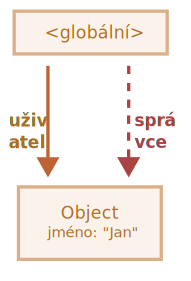
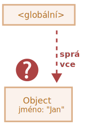
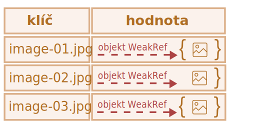
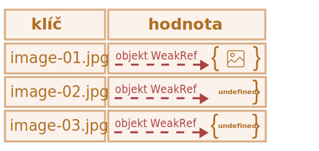
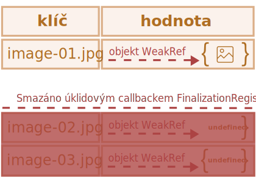

# WeakRef a FinalizationRegistry

```warn header="„Skryté“ prvky jazyka"
Tento článek pokrývá velmi úzce zaměřené téma, s nímž se většina vývojářů v praxi setká jen velmi vzácně (a možná ani neví o jeho existenci).

Pokud se JavaScript teprve začínáte učit, doporučujeme vám tuto kapitolu přeskočit.
```

Vzpomeňme si na základní koncept *principu dosažitelnosti* z kapitoly <info:garbage-collection> a poznamenejme, že motor JavaScriptu zaručeně udrží v paměti hodnoty, které jsou dostupné nebo se používají.

Například:


```js
// proměnná uživatel obsahuje silný odkaz na objekt
let uživatel = { jméno: "Jan" };

// přepíšeme hodnotu proměnné uživatel
uživatel = null;

// odkaz je ztracen a objekt bude vymazán z paměti

```

Nebo podobný, ale trošku složitější kód se dvěma silnými odkazy:

```js
// proměnná uživatel obsahuje silný odkaz na objekt
let uživatel = { jméno: "Jan" };

// zkopírujeme silný odkaz na objekt do proměnné správce
*!*
let správce = uživatel;
*/!*

// přepíšeme hodnotu proměnné uživatel
uživatel = null;

// objekt je stále dosažitelný z proměnné správce
```
Objekt `{ jméno: "Jan" }` bude smazán z paměti teprve tehdy, až na něj nebudou existovat žádné silné odkazy (tedy až přepíšeme i hodnotu proměnné `správce`).

V JavaScriptu existuje koncept nazývaný `WeakRef`, který se v tomto případě chová poněkud odlišně.


````smart header="Pojmy: „silný odkaz“, „slabý odkaz“"
**Silný odkaz** - je odkaz na objekt nebo hodnotu, který zabraňuje jejich smazání sběračem odpadků. Udržuje tedy objekt nebo hodnotu v paměti, na níž ukazuje.

To znamená, že objekt nebo hodnota zůstane v paměti a nebude odklizen sběračem odpadků, dokud na něj budou existovat aktivní silné odkazy.

Běžné odkazy na objekty v JavaScriptu jsou silné odkazy. Například:

```js
// proměnná uživatel obsahuje silný odkaz na objekt
let uživatel = { jméno: "Jan" };
```
**Slabý odkaz** - je odkaz na objekt nebo hodnotu, který *nebrání* jejich smazání sběračem odpadků.
Objekt nebo hodnota může být smazán sběračem odpadků, jestliže všechny zbývající odkazy na něj jsou slabé.
````

## WeakRef


````warn header="Upozornění"
Než se do toho ponoříme, stojí za zmínku, že korektní používání struktur probíraných v tomto článku vyžaduje velmi opatrné přemýšlení a je lépe se jim vyhnout, pokud je to možné.
````

`WeakRef` - je objekt, který obsahuje slabý odkaz na jiný objekt, nazývaný `cíl` nebo `referent`. 

Zvláštnost `WeakRef` spočívá v tom, že nebrání sběrači odpadků v odstranění svého referovaného objektu. Jinými slovy, objekt `WeakRef` neponechává objekt `referent` naživu.

Vezměme nyní jako referovaný objekt proměnnou `uživatel` a vytvořme na ni slabý odkaz z proměnné `správce`.
Abychom vytvořili slabý odkaz, musíme použít konstruktor třídy `WeakRef` a předat mu cílový objekt (objekt, na který chceme slabý odkaz vytvořit).

V našem případě to bude proměnná `uživatel`:


```js
// proměnná uživatel obsahuje silný odkaz na objekt
let uživatel = { jméno: "Jan" };

// proměnná správce obsahuje slabý odkaz na objekt
*!*
let správce = new WeakRef(uživatel);
*/!*

```

Následující diagram zobrazuje dva druhy odkazů: silný odkaz pomocí proměnné `uživatel` a slabý odkaz pomocí proměnné `správce`:

  

Pak v určitém okamžiku přestaneme používat proměnnou `uživatel` - bude přepsána, opustí rozsah platnosti atd., zatímco instanci `WeakRef` v proměnné `správce` budeme udržovat:

```js
// přepíšeme hodnotu proměnné uživatel
uživatel = null;
```

Slabý odkaz na objekt nestačí k jeho udržení „naživu“. Když budou všechny zbývající odkazy na referovaný objekt slabé, sběrač odpadků může tento objekt zničit a paměť, kterou objekt obsazoval, může být využita k něčemu jinému.

Dokud však není objekt skutečně zničen, slabý odkaz jej může vracet, i když na něj už neexistují žádné silné odkazy.
Náš objekt se tedy stává něčím jako „[Schrödingerova kočka](https://cs.wikipedia.org/wiki/Schr%C3%B6dingerova_ko%C4%8Dka)“ – nemůžeme s jistotou vědět, zda je „živý“ nebo „mrtvý“:



Když v této chvíli chceme získat objekt z instance `WeakRef`, použijeme její metodu `deref()`.

Metoda `deref()` vrátí referovaný objekt, na který `WeakRef` ukazuje, pokud je tento objekt stále v paměti. Jestliže byl objekt smazán sběračem odpadků, pak metoda `deref()` vrátí `undefined`:


```js
let ref = správce.deref();

if (ref) {
  // objekt je stále dostupný: můžeme s ním provádět jakékoli manipulace
} else {
  // objekt byl odklizen sběračem odpadků
}
```

## Případy použití WeakRef

`WeakRef` se obvykle používá k vytváření mezipamětí (cache) nebo [asociativních polí](https://cs.wikipedia.org/wiki/Asociativn%C3%AD_pole), do nichž se ukládají objekty náročné na zdroje.
To nám umožňuje vyhnout se tomu, aby tyto objekty nemohly být odklizeny sběračem odpadků jen proto, že jsou uloženy v mezipaměti nebo asociativním poli.

Jedním z primárních příkladů je situace, kdy máme větší množství objektů binárních obrázků (reprezentovaných například jako `ArrayBuffer` nebo `Blob`) a chceme ke každému z nich připojit název nebo cestu.
Existující datové struktury nejsou pro tento účel příliš vhodné:

- Použijeme-li k vytvoření asociací mezi názvy a obrázky nebo opačně `Map`, objekty obrázků budou stále zůstávat v paměti, neboť se budou nacházet v `Map` jako klíče nebo hodnoty.
- Ani `WeakMap` se pro tento účel nehodí, protože objekty představované jako klíče `WeakMap` používají slabé odkazy a nejsou tedy chráněny před smazáním sběračem odpadků.

V této situaci však potřebujeme datovou strukturu, která by používala slabé odkazy ve svých hodnotách.

K tomuto účelu můžeme použít kolekci `Map`, jejíž hodnoty jsou instance `WeakRef`, které odkazují na potřebné velké objekty.
Důsledkem bude, že tyto velké a nepotřebné objekty nebudeme udržovat v paměti déle, než bychom měli.

Kromě toho to je způsob, jak získat z mezipaměti objekt obrázku, je-li stále dosažitelný.
Pokud již byl odstraněn sběračem odpadků, můžeme jej přegenerovat nebo stáhnout znovu.

Tímto způsobem v některým situacích spotřebujeme méně paměti.

## Příklad číslo 1: použití WeakRef pro mezipaměť

Následující úryvek kódu demonstruje techniku používání `WeakRef`.  

Zkráceně řečeno, použijeme `Map`, jejíž klíče budou řetězce a jejíž hodnoty budou objekty `WeakRef`.
Jestliže objekt ve `WeakRef` ještě nebyl odklizen sběračem odpadků, získáme jej z mezipaměti.
V opačném případě jej znovu stáhneme a uložíme do mezipaměti pro případné další znovupoužití:

```js
function stáhniObrázek() {
    // abstraktní funkce pro stahování obrázků...
}

function najdiVMezipaměti(stáhniObrázek) { // (1)
    const paměťObrázků = new Map(); // (2)

    return (názevObrázku) => { // (3)
        const obrázekVPaměti = paměťObrázků.get(názevObrázku); // (4)

        if (obrázekVPaměti?.deref()) { // (5)
            return obrázekVPaměti?.deref();
        }

        const novýObrázek = stáhniObrázek(názevObrázku); // (6)
        paměťObrázků.set(názevObrázku, new WeakRef(novýObrázek)); // (7)

        return novýObrázek;
    };
}

const vraťObrázekVPaměti = najdiVMezipaměti(stáhniObrázek);
```  

Podívejme se podrobně, co se tady děje:
1. `najdiVMezipaměti` - je funkce vyššího řádu, která jako argument obdrží jinou funkci, `stáhniObrázek`. V tomto příkladu můžeme podrobný popis funkce `stáhniObrázek` vynechat, jelikož to může být jakákoli logika stahování obrázků.
2. `paměťObrázků` - je úložiště obrázků, do něhož se ukládají výsledky funkce `stáhniObrázek` ve formě řetězcových klíčů (název obrázku) a objektů třídy `WeakRef` jako hodnot.
3. Vrátíme anonymní funkci, jejímž argumentem je název obrázku. Tento argument bude použit jako klíč pro uložený obrázek.
4. Snažíme se získat uložený výsledek z úložiště podle zadaného klíče (název obrázku).
5. Jestliže úložiště obsahuje pro zadaný klíč nějakou hodnotu a objekt `WeakRef` nebyl odklizen sběračem odpadků, vrátíme uložený výsledek.
6. Jestliže pro požadovaný klíč neexistuje v úložišti žádný záznam nebo metoda `deref()` vrátí `undefined` (což znamená, že objekt `WeakRef` byl odklizen sběračem odpadků), funkce `stáhniObrázek` stáhne obrázek znovu.
7. Stažený obrázek uložíme do úložiště jako objekt `WeakRef`.

Nyní máme kolekci `Map`, jejíž klíče jsou řetězce s názvy obrázků a jejíž hodnoty jsou objekty `WeakRef` obsahující samotné obrázky.

Tato technika nám pomůže vyhnout se zabírání velkého množství paměti pro objekty náročné na zdroje, které již nikdo nepoužívá.
Rovněž šetří paměť a čas v případě opakovaného použití uložených objektů.

Následuje vizuální reprezentace toho, jak tento kód vypadá:

 

Tato implementace však má své nevýhody: po čase bude `Map` plná řetězcových klíčů, které ukazují na `WeakRef`, jejichž referovaný objekt již byl odstraněn sběračem:



Jedním způsobem, jak tento problém vyřešit, je pravidelně procházet úložiště a odstraňovat „mrtvé“ záznamy.
Dalším způsobem je použít finalizátory, které prozkoumáme později. 


## Příklad číslo 2: použití WeakRef ke sledování DOM objektů

Dalším případem použití `WeakRef` je sledování DOM objektů.

Představme si scénář, v němž kód nebo knihovna třetí strany pracuje s elementy na naší stránce tak dlouho, dokud existují v DOMu. Může to být například externí utilita pro monitorování a oznamování stavu systému (běžně nazývaná „logger“ – program, který posílá informační zprávy nazývané „logy“).

Interaktivní příklad: 

[codetabs height=420 src="weakref-dom"]  

Když kliknete na tlačítko „Začít posílat zprávy“, začnou se objevovat zprávy (logy) v tzv. „okně zobrazování zpráv“ (element třídy `.window__body`).

Jakmile je však tento element z DOMu smazán, logger by měl přestat zprávy zasílat. Abyste odstranění tohoto elementu reprodukovali, stačí kliknout na tlačítko „Zavřít“ v pravém horním rohu.

Abychom si nekomplikovali práci a neposílali oznámení kódu třetí strany pokaždé, když je a když není náš DOM element k dispozici, postačí na něj vytvořit slabý odkaz pomocí `WeakRef`.    

Když bude element odstraněn z DOMu, logger si toho všimne a přestane zprávy posílat.

Nyní se blíže podívejme na zdrojový kód (*záložka `index.js`*):

1. Získáme DOM element tlačítka „Začít posílat zprávy“.
2. Získáme DOM element tlačítka „Zavřít“.
3. Získáme DOM element okna zobrazení logů pomocí konstruktoru `new WeakRef()`. Pak bude proměnná `odkazNaElementOkna` obsahovat slabý odkaz na tento DOM element.
4. Přidáme k tlačítku „Začít posílat zprávy“ posluchače událostí, který bude zajišťovat rozběhnutí loggeru po kliknutí na tlačítko.
5. Přidáme k tlačítku „Zavřít“ posluchače událostí, který bude zajišťovat zavření okna s logy po kliknutí na tlačítko.
6. Pomocí `setInterval` začneme každou sekundu zobrazovat zprávu.
7. Jestliže je DOM element okna zobrazujícího zprávy stále dostupný a udržovaný v paměti, vytvoříme a pošleme novou zprávu.
8. Jestliže metoda `deref()` vrátí `undefined`, znamená to, že DOM element byl odstraněn z paměti. V tom případě logger přestane zobrazovat zprávy a zruší časovač.
9. Tento `alert` bude volán poté, co bude DOM element okna zobrazování zpráv odstraněn z paměti (tj. po kliknutí na tlačítko „Zavřít“). **Všimněte si, že k odstranění z paměti nemusí dojít okamžitě. Závisí to výhradně na vnitřních mechanismech sběrače odpadků.**

   Tento proces nemůžeme ovládat přímo z kódu. Přesto však máme možnost vynutit si spuštění sběru odpadků z prohlížeče.
   
   Například v Google Chrome to provedeme tak, že otevřeme vývojářské nástroje (`key:Ctrl` + `key:Shift` + `key:J` ve Windows/Linuxu nebo `key:Option` + `key:⌘` + `key:J` v macOS), přejdeme na záložku „Výkon“ („Performance“) a klikneme na ikonu odpadkového koše -- „Uvolnění paměti“ („Collect garbage“):

   

    <br>
    Tuto funkcionalitu podporuje většina moderních prohlížečů. Po provedení těchto akcí se okamžitě spustí <code>alert</code>.

## FinalizationRegistry

Nyní nastal čas pohovořit o finalizátorech. Než budeme pokračovat, ujasníme si terminologii:

**Úklidový callback (finalizátor)** - je funkce, která je spuštěna, když je objekt registrovaný ve `FinalizationRegistry` odstraněn z paměti sběračem odpadků.

Jejím účelem je poskytnout možnost provést další operace vztahující se k objektu poté, co byl definitivně odstraněn z paměti.

**Registr** (nebo `FinalizationRegistry`) - je speciální objekt v JavaScriptu, který spravuje registraci a deregistraci objektů a jejich úklidových callbacků.

Tento mechanismus umožňuje registrovat objekt ke sledování a připojit k němu úklidový callback.
V zásadě je to struktura, která ukládá informace o registrovaných objektech a jejich úklidových callbaccích a pak, když jsou objekty odstraněny z paměti, tyto callbacky automaticky vyvolává.

Abychom vytvořili instanci třídy `FinalizationRegistry`, musíme volat její konstruktor, který obsahuje jediný argument - úklidový callback (finalizátor).  

Syntaxe:

```js
function úklidovýCallback(uchovávanáHodnota) { 
  // kód úklidového callbacku
}

const registr = new FinalizationRegistry(úklidovýCallback);
```

Zde:

- `úklidovýCallback` - úklidový callback, který bude automaticky zavolán, až bude registrovaný objekt odstraněn z paměti.
- `uchovávanáHodnota` - hodnota, která je předána úklidovému callbacku jako argument. Pokud `uchovávanáHodnota` je objekt, registr si na něj uchovává silný odkaz.
- `registr` - instance třídy `FinalizationRegistry`.

Metody třídy `FinalizationRegistry`:

- `register(cíl, uchovávanáHodnota [, registračníZnámka])` - používá se k registraci objektů v registru.

  `cíl` - objekt registrovaný pro sledování. Pokud je `cíl` odstraněn sběračem odpadků, bude zavolán úklidový callback s argumentem `uchovávanáHodnota`.
  
  Nepovinná `registračníZnámka` – známka pro zrušení registrace. Můžeme ji předat, abychom mohli registraci objektu zrušit ještě dříve, než jej sběrač odpadků odstraní. Zpravidla se jako `registračníZnámka` používá objekt `cíl`, což je standardní praktika.
- `unregister(registračníZnámka)` - metoda `unregister` se používá ke zrušení registrace objektu v registru. Obsahuje jeden argument - `registračníZnámka` (známka pro zrušení registrace, která byla zadána při registraci objektu).

Přejděme nyní k jednoduchému příkladu. Využijme již známý objekt `uživatel` a vytvořme instanci třídy `FinalizationRegistry`:  

```js
let uživatel = { jméno: "Jan" };

const registr = new FinalizationRegistry((uchovávanáHodnota) => {
  console.log(`${uchovávanáHodnota} byl odstraněn sběračem odpadků.`);
});
```

Pak objekt, pro který požadujeme úklidový callback, zaregistrujeme voláním metody `register`:

```js
registr.register(uživatel, uživatel.jméno);
```

Registr si na registrovaný objekt neuchovává silný odkaz, protože by tím ztratil smysl. Kdyby si jej uchovával, objekt by nikdy nebyl sběračem odpadků odklizen.

Jestliže objekt bude odklizen sběračem odpadků, může být někdy v budoucnu zavolán náš úklidový callback, kterému se předá `uchovávanáHodnota`:

```js
// Když je objekt uživatel odklizen sběračem odpadků, vypíše se na konzoli následující zpráva:
"Jan byl odstraněn sběračem odpadků."
```

Existují však situace, v nichž se i v implementacích využívajících úklidový callback může stát, že úklidový callback nebude nikdy zavolán.

Například:
- Když běh programu zcela skončí  (např. při zavření záložky v prohlížeči).
- Když se samotná instance `FinalizationRegistry` stane nedosažitelnou z JavaScriptového kódu.
  Jestliže objekt, který vytvořil instanci třídy `FinalizationRegistry`, opustí rozsah platnosti nebo bude smazán, úklidové callbacky registrované v tomto registru nemusejí být vyvolány.

## Ukládání do mezipaměti pomocí FinalizationRegistry

Když se vrátíme k našemu příkladu *slabé* mezipaměti, můžeme si všimnout následujícího:
- I když byly hodnoty zabalené do `WeakRef` odklizeny sběračem odpadků, stále je tady problém s „únikem paměti“ v podobě zbývajících klíčů, jejichž hodnoty sběrač odpadků odstranil.

Následuje vylepšený příklad mezipaměti s využitím `FinalizationRegistry`:

```js
function stáhniObrázek() {
  // abstraktní funkce pro načítání obrázků...
}

function najdiVMezipaměti(stáhniObrázek) {
  const paměťObrázků = new Map();

  *!*
  const registr = new FinalizationRegistry((názevObrázku) => { // (1)
    const obrázekVPaměti = paměťObrázků.get(názevObrázku);
    if (obrázekVPaměti && !obrázekVPaměti.deref()) paměťObrázků.delete(názevObrázku);
  });
  */!*

  return (názevObrázku) => {
    const obrázekVPaměti = paměťObrázků.get(názevObrázku);
    
    if (obrázekVPaměti?.deref()) {
      return obrázekVPaměti?.deref();
    }

    const novýObrázek = stáhniObrázek(názevObrázku);
    paměťObrázků.set(názevObrázku, new WeakRef(novýObrázek));
    *!*
    registr.register(novýObrázek, názevObrázku); // (2)
    */!*

    return novýObrázek;
  };
}

const vraťObrázekVPaměti = najdiVMezipaměti(stáhniObrázek);
```

1. Abychom zajistili úklid „mrtvých“ záznamů v mezipaměti, když jsou připojené objekty ve `WeakRef` odklizeny sběračem odpadků, vytvoříme úklidový registr `FinalizationRegistry`.

   Důležitým bodem zde je, že v úklidovém callbacku bychom měli ověřovat, zda záznam byl odstraněn sběračem odpadků a nebyl znovu přidán, abychom nesmazali „živý“ záznam.
2. Když je stažena a umístěna do mezipaměti nová hodnota (obrázek), zaregistrujeme ji v registru finalizátorů, abychom mohli sledovat objekt `WeakRef`.

Tato implementace obsahuje pouze aktuální neboli „živé“ dvojice klíč/hodnota. V tomto případě je každý objekt `WeakRef` zaregistrován ve `FinalizationRegistry` a poté, co jsou objekty odstraněny sběračem odpadků, úklidový callback smaže všechny hodnoty `undefined`.

Na obrázku je vizuální reprezentace vylepšeného kódu: 



Klíčovým aspektem vylepšené implementace je, že finalizátory umožňují vytváření paralelních procesů mezi „hlavním“ programem a úklidovými callbacky. V kontextu JavaScriptu je „hlavním“ programem náš JavaScriptový kód, který je spuštěn a běží v naší aplikaci nebo webové stránce.

Proto může mezi okamžikem, kdy je objekt označen ke smazání sběračem odpadků, a skutečným spuštěním úklidového callbacku nastat určitá časová prodleva. Je důležité pochopit, že během této prodlevy může hlavní program provést v objektu jakékoli změny nebo jej dokonce vrátit zpět do paměti.

Z tohoto důvodu musíme v úklidovém callbacku ověřovat, zda hlavní program nepřidal záznam zpět do mezipaměti, abychom se vyhnuli mazání „živých“ záznamů. Obdobně když v mezipaměti hledáme klíč, je možné, že jeho hodnota byla vymazána sběračem odpadků, ale úklidový callback ještě nebyl spuštěn.

Takové situace vyžadují při práci s `FinalizationRegistry` zvláštní pozornost.

## Použití WeakRef a FinalizationRegistry v praxi

Přejděme od teorie k praxi. Představte si scénář ze skutečného života, kdy si uživatel synchronizuje své fotografie na mobilním zařízení s nějakou cloudovou službou (např. [iCloud](https://cs.wikipedia.org/wiki/ICloud) nebo [Fotky Google](https://cs.wikipedia.org/wiki/Fotky_Google)) a chce si je prohlížet z jiných zařízení. Takové služby nabízejí kromě základní functionality prohlížení fotografií řadu dalších funkcí, například:

- Editaci fotografií a videoefektů.
- Vytváření „vzpomínek“ a alb.
- Montáž videa ze série fotografií.
- ...a mnoho dalšího.

Jako příklad zde uvedeme poměrně primitivní implementaci takové služby. Hlavním smyslem je ukázat možný scénář společného použití `WeakRef` a `FinalizationRegistry` ve skutečném životě.

Bude to vypadat následovně:


<br>
Na levé straně je cloudová knihovna fotografií (jsou zobrazeny jako náhledy). Můžeme si zvolit obrázky, jaké chceme, a kliknutím na tlačítko „Vytvořit koláž“ na pravé straně stránky z nich vytvořit koláž. Výslednou koláž si pak můžeme stáhnout jako obrázek.
</br><br>

Abychom zvýšili rychlost načítání stránky, bude rozumné stahovat a zobrazovat náhledy fotografií v *komprimované* kvalitě. Když však ze zvolených fotografií budeme vytvářet koláž, stáhneme a použijeme je v *plné* kvalitě.

Níže vidíme, že vnitřní velikost náhledů je 240x240 pixelů. Tuto velikost jsme zvolili, abychom zvýšili rychlost nahrávání. Navíc v režimu prohlížení nepotřebujeme fotografie v plné velikosti.


<br>
Předpokládejme, že potřebujeme vytvořit koláž čtyř fotografií: vybereme si je a pak klikneme na tlačítko „Vytvořit koláž“. V tuto chvíli funkce <code>najdiVMezipaměti</code>, kterou už známe, ověří, zda je požadovaný obrázek v mezipaměti. Pokud ne, stáhne jej z cloudu a uloží jej do mezipaměti pro další použití. To se bude odehrávat pro každý zvolený obrázek:
</br><br>


</br>

Když budete sledovat výstup na konzoli, uvidíte, které z fotografií byly staženy z cloudu - ty jsou označeny jako <span style="background-color:#133159;color:white;font-weight:500">STAŽENÝ_OBRÁZEK</span> (<span style="background-color:#133159;color:white;font-weight:500">FETCHED_IMAGE</span>). Protože to je první pokus o vytvoření koláže, znamená to, že v této chvíli je „slabá mezipaměť“ ještě prázdná, a tak všechny fotografie budou staženy z cloudu a uloženy do ní.

Společně s procesem stahování obrázků je zde však také proces čištění paměti sběračem odpadků. To znamená, že objekt uložený v mezipaměti, na který se odkazujeme slabým odkazem, je smazán sběračem odpadků. A náš finalizátor se úspěšně spustí a tím smaže klíč, pod nímž byl obrázek uložen v mezipaměti. Oznamuje nám to <span style="background-color:#901e30;color:white;font-weight:500;">SMAZANÝ_OBRÁZEK</span> (<span style="background-color:#901e30;color:white;font-weight:500;">DELETED_IMAGE</span>):


<br>
Pak zjistíme, že se nám výsledná koláž nelíbí, a rozhodneme se jeden obrázek změnit a vytvořit novou. To uděláme jednoduše tak, že smažeme nechtěný obrázek, vybereme jiný a opět klikneme na tlačítko „Vytvořit koláž“:
</br><br>


<br>
Tentokrát však všechny obrázky nebyly staženy ze sítě, ale jeden z nich byl převzat ze slabé mezipaměti: o tom nám říká zpráva <span style="background-color:#385950;color:white;font-weight:500;">OBRÁZEK_Z_PAMĚTI</span> (<span style="background-color:#385950;color:white;font-weight:500;">CACHED_IMAGE</span>). To znamená, že v okamžiku vytvoření koláže sběrač odpadků náš obrázek ještě nesmazal a my jsme ho jen vytáhli z mezipaměti, čímž jsme snížili počet síťových požadavků a urychlili celkovou dobu procesu vytváření obrázků:
</br><br>


<br>
„Pohrajme si“ ještě dál. Znovu nahraďme jeden z obrázků jiným a vytvořme novou koláž:
</br><br>


<br>
Výsledek je tentokrát ještě působivější. Ze čtyř zvolených obrázků byly tři vytaženy ze slabé mezipaměti a pouze jeden musel být stažen ze sítě. Síťová zátěž byla snížena zhruba o 75%. Úžasné, ne?
</br><br>


</br>

Je samozřejmě důležité mít na paměti, že takové chování není zaručeno a závisí na specifické implementaci a operacích sběrače odpadků.

Při tom okamžitě vyvstává zcela logická otázka: proč se spoléháme na sběrač odpadků a nepoužijeme místo toho obyčejnou mezipaměť, v níž bychom mohli záznamy spravovat sami? Je to pravda, v naprosté většině případů není potřeba `WeakRef` a `FinalizationRegistry` používat.

Zde jsme jednoduše předvedli alternativní implementaci podobné functionality použitím netriviálního přístupu se zajímavými vlastnostmi jazyka. Stále se však na tento příklad nemůžeme spolehnout, potřebujeme-li stabilní a předvídatelný výsledek.

Tento příklad si můžete [otevřít na pískovišti](sandbox:weakref-finalizationregistry).

## Shrnutí

`WeakRef` - byla navržena pro vytváření slabých odkazů na objekty a umožňuje jejich smazání z paměti sběračem odpadků, pokud na ně už neexistují žádné silné odkazy. To se vyplatí pro adresování rozsáhlého využití paměti a optimalizaci využití systémových zdrojů v aplikacích.

`FinalizationRegistry` - je nástroj pro registraci callbacků, které budou spuštěny při smazání objektů, na které již neexistují žádné silné odkazy. To nám umožňuje uvolnit zdroje spojené s těmito objekty nebo provést jiné nezbytné operace, než bude objekt z paměti odklizen.