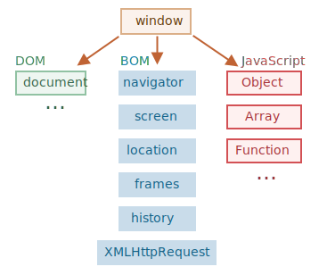

# Prostředí prohlížeče a jeho specifikace

Jazyk JavaScript byl původně vytvořen pro webové prohlížeče. Od té doby se vyvinul v jazyk se širokým využitím na mnoha platformách.

Platformou může být prohlížeč, webový server nebo jiný *hostitel*, třeba i „chytrý“ automat na kávu, pokud dokáže spouštět JavaScriptové skripty. Každý z nich poskytuje vlastní specifickou funkcionalitu. Specifikace JavaScriptu ji nazývá *hostitelské prostředí*.

Hostitelské prostředí poskytuje k jádru jazyka navíc své vlastní objekty a funkce. Webové prohlížeče poskytují způsoby, jak ovládat webové stránky, Node.js poskytuje prvky pro serverovou stranu a tak dále.

Pohled z ptačí perspektivy nám ukazuje, co máme, když spouštíme JavaScript ve webovém prohlížeči:



Je zde „kořenový“ objekt nazvaný `window`, který má dvě role:

1. Za prvé, je to globální objekt pro JavaScriptový kód, jak je popsáno v kapitole <info:global-object>.
2. Za druhé, představuje „okno prohlížeče“ a poskytuje metody, jak je ovládat.

Můžeme jej například použít jako globální objekt:

```js run global
function řekniAhoj() {
  alert("Ahoj");
}

// globální funkce jsou metody globálního objektu:
window.řekniAhoj();
```

A můžeme jej použít jako okno prohlížeče, abychom si zobrazili výšku okna:

```js run
alert(window.innerHeight); // výška vnitřního okna
```

Existují i další metody a vlastnosti specifické pro okna, které probereme později.

## DOM (Document Object Model)

Document Object Model, zkráceně DOM, představuje veškerý obsah stránky jako objekty, které mohou být modifikovány.

Hlavním „vstupním bodem“ stránky je objekt `document`. S jeho pomocí můžeme na stránce cokoli změnit nebo vytvořit.

Například:
```js run
// změníme barvu pozadí na červenou
document.body.style.background = "red";

// po 1 sekundě ji změníme zpět
setTimeout(() => document.body.style.background = "", 1000);
```

Tady jsme použili `document.body.style`, ale je toho mnohem, mnohem více. Vlastnosti a metody jsou popsány ve specifikaci: [DOM Living Standard](https://dom.spec.whatwg.org).

```smart header="DOM není jen pro prohlížeče"
Specifikace DOMu vysvětluje strukturu dokumentu a poskytuje objekty, pomocí nichž s ní lze manipulovat. Kromě prohlížečů existují i jiné nástroje, které používají DOM.

Například DOM mohou používat i skripty na straně serveru, které stahují a zpracovávají HTML stránky. Ty však mohou podporovat jen část specifikace.
```

```smart header="CSSOM pro nastavování stylů"
Existuje také samostatná specifikace [CSS Object Model (CSSOM)](https://www.w3.org/TR/cssom-1/) pro CSS pravidla a styly, která vysvětluje, jakým způsobem jsou reprezentovány v podobě objektů a jak je lze načítat a ukládat.

Když měníme pravidla stylů v dokumentu, CSSOM se používá společně s DOMem. V praxi je však CSSOM zapotřebí jen zřídka, jelikož málokdy potřebujeme měnit CSS pravidla v JavaScriptu (obvykle jen přidáváme a odebíráme CSS třídy, neměníme jejich CSS pravidla), ale i to je možné provést.
```

## BOM (Browser Object Model)

Browser Object Model (BOM) představuje další objekty, které poskytuje prohlížeč (hostitelské prostředí) pro práci se vším ostatním kromě dokumentu.

Například:

- Objekt [navigator](mdn:api/Window/navigator) poskytuje informace o prohlížeči a operačním systému. Obsahuje mnoho vlastností, ale dvě nejznámější jsou: `navigator.userAgent` -- o aktuálním prohlížeči, a `navigator.platform` -- o platformě (může pomoci rozlišit Windows/Linux/Mac atd.).
- Objekt [location](mdn:api/Window/location) nám umožňuje načíst aktuální URL a může přesměrovat prohlížeč na jiné.

Takto můžeme objekt `location` použít:

```js run
alert(location.href); // zobrazí aktuální URL
if (confirm("Přejít na Wikipedii?")) {
  location.href = "https://cs.wikipedia.org"; // přesměruje prohlížeč na jiné URL
}
```

Součástí BOMu jsou i funkce `alert/confirm/prompt`: ty se nevztahují přímo k dokumentu, ale představují čistě prohlížečové metody pro komunikaci s uživatelem.

```smart header="Specifikace"
BOM je součástí všeobecné [specifikace HTML](https://html.spec.whatwg.org).

Ano, čtete správně. Specifikace HTML na <https://html.spec.whatwg.org> není jen o „jazyce HTML“ (značky, atributy), ale pokrývá i hromadu objektů, metod a rozšíření DOMu specifických pro prohlížeče. Je to „HTML v širším slova smyslu“. Navíc některé části mají další specifikace, které jsou uvedeny na <https://spec.whatwg.org>.
```

## Shrnutí

Hovoříme-li o standardech, pak máme:

Specifikaci DOM
: Popisuje strukturu dokumentu, manipulaci s ní a události dokumentu, viz <https://dom.spec.whatwg.org>.

Specifikaci CSSOM
: Popisuje styly a jejich pravidla, manipulaci s nimi a jejich vazbu na dokument, viz <https://www.w3.org/TR/cssom-1/>.

Specifikaci HTML
: Popisuje jazyk HTML (např. jeho značky) a také BOM (browser object model -- objektový model prohlížeče) -- různé funkce prohlížeče: `setTimeout`, `alert`, `location` a podobně, viz <https://html.spec.whatwg.org>. Přebírá specifikaci DOMu a rozšiřuje ji o mnoho dalších vlastností a metod.

Některé třídy jsou navíc popsány odděleně na <https://spec.whatwg.org/>.

Tyto odkazy si prosím zapamatujte, neboť tady je toho k naučení tolik, že je nemožné to všechno obsáhnout a pamatovat si.

Kdybyste si chtěli přečíst o nějaké vlastnosti nebo metodě, pěkným zdrojem je i manuál Mozilly na <https://developer.mozilla.org/en-US/>, ale příslušná specifikace může být lepší: je sice složitější a delší na přečtení, ale poskytne vám solidní a úplné základní znalosti.

Když chcete něco najít, často se vyplatí použít internetové hledání „WHATWG [pojem]“ nebo „MDN [pojem]“, např. <https://google.com?q=whatwg+localstorage>, <https://google.com?q=mdn+localstorage>.

Nyní přejdeme k učení DOMu, jelikož hlavní roli v uživatelském rozhraní hraje dokument.
