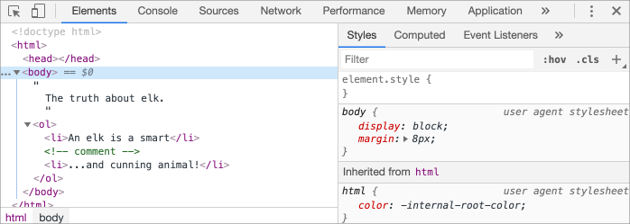
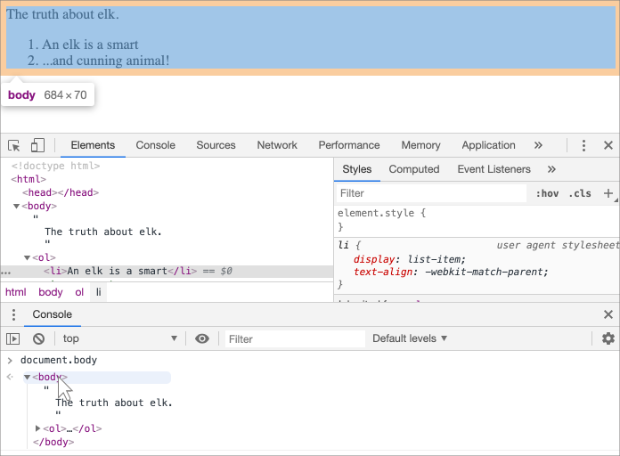

libs:
  - d3
  - domtree

---

# DOM strom

Páteří každého HTML dokumentu jsou značky neboli tagy.

Podle DOMu (Document Object Model) je každá HTML značka objekt. Vnořené značky jsou „dětmi“ vnějších. Text uvnitř značky je také objekt.

Všechny tyto objekty jsou v JavaScriptu dostupné a my můžeme s jejich pomocí měnit stránku.

Například `document.body` je objekt, který představuje značku `<body>`.

Po spuštění tohoto kódu `<body>` na 3 sekundy změní barvu na červenou:

```js run
document.body.style.background = 'red'; // změní barvu pozadí na červenou

setTimeout(() => document.body.style.background = '', 3000); // vrátí ji zpět
```

Zde jsme použili `style.background`, abychom změnili barvu pozadí `document.body`, ale existuje mnoho dalších vlastností, například:

- `innerHTML` -- HTML obsah uzlu.
- `offsetWidth` -- šířka uzlu (v pixelech)
- ...a tak dále.

Brzy se naučíme další způsoby, jak manipulovat s DOMem, ale nejprve musíme poznat jeho strukturu.

## Příklad DOMu

Začněme s následujícím jednoduchým dokumentem:

```html run no-beautify
<!DOCTYPE HTML>
<html>
<head>
  <title>O losovi</title>
</head>
<body>
  Pravda o losovi.
</body>
</html>
```

DOM reprezentuje HTML v podobě stromové struktury značek. Vypadá následovně:

<div class="domtree"></div>

<script>
let node1 = {"name":"HTML","nodeType":1,"children":[{"name":"HEAD","nodeType":1,"children":[{"name":"#text","nodeType":3,"content":"\n  "},{"name":"TITLE","nodeType":1,"children":[{"name":"#text","nodeType":3,"content":"About elk"}]},{"name":"#text","nodeType":3,"content":"\n"}]},{"name":"#text","nodeType":3,"content":"\n"},{"name":"BODY","nodeType":1,"children":[{"name":"#text","nodeType":3,"content":"\n  The truth about elk.\n"}]}]}

drawHtmlTree(node1, 'div.domtree', 690, 320);
</script>

```online
Na uvedeném obrázku můžete klikat na elementové uzly a jejich děti se budou rozbalovat a schovávat.
```

Každý uzel stromu je objektem.

Značky jsou *elementové uzly* (nebo jen elementy) a tvoří strukturu stromu: jeho kořenem je `<html>`, jeho dětmi jsou `<head>` a `<body>`, a tak dále.

Text uvnitř elementů tvoří *textové uzly*, označené jako `#text`. Textový uzel obsahuje pouze řetězec. Nesmí mít děti a je vždy listem stromu.

Například značka `<title>` obsahuje text `"O losovi"`.

Prosíme, všimněte si těchto zvláštních znaků v textových uzlech:

- konec řádku: `↵` (v JavaScriptu znám jako `\n`)
- mezera: `␣`

Mezery a konce řádků jsou zcela platnými znaky, tak jako písmena a číslice. Tvoří textové uzly a stávají se součástí DOMu. Například v uvedeném příkladu značka `<head>` obsahuje před `<title>` několik mezer, které se staly uzlem `#text` (který obsahuje pouze znak konce řádku a několik mezer).

Existují jen dvě výjimky na nejvyšší úrovni:
1. Mezery a konce řádků před `<head>` se z historických důvodů ignorují.
2. Jestliže vložíme něco za `</body>`, bude to automaticky přemístěno dovnitř `body` na konec, jelikož specifikace HTML vyžaduje, aby všechen obsah byl uvnitř `<body>`. Za `</body>` tedy nemohou být žádné mezery.

V ostatních případech je všechno jasné -- jestliže jsou v dokumentu mezery (stejně jako kterýkoli jiný znak), stanou se v DOMu textovými uzly, a pokud je odstraníme, nebudou tam.

Zde nejsou žádné textové uzly, které by obsahovaly jen mezery:

```html no-beautify
<!DOCTYPE HTML>
<html><head><title>O losovi</title></head><body>Pravda o losovi.</body></html>
```

<div class="domtree"></div>

<script>
let node2 = {"name":"HTML","nodeType":1,"children":[{"name":"HEAD","nodeType":1,"children":[{"name":"TITLE","nodeType":1,"children":[{"name":"#text","nodeType":3,"content":"About elk"}]}]},{"name":"BODY","nodeType":1,"children":[{"name":"#text","nodeType":3,"content":"The truth about elk."}]}]}

drawHtmlTree(node2, 'div.domtree', 690, 210);
</script>

```smart header="Mezery na začátku a konci řetězce a textové uzly obsahující pouze mezery jsou v nástrojích obvykle skryty"
Prohlížečové nástroje (brzy se o nich dozvíme), které pracují s DOMem, obvykle nezobrazují mezery na začátku a konci textu a prázdné textové uzly (konce řádků) mezi značkami.

Vývojářské nástroje tímto způsobem šetří místo na obrazovce.

Na dalších obrázcích DOMu je také někdy budeme vypouštět, když nebudou mít význam. Tyto mezery zpravidla nemají vliv na to, jak je dokument zobrazen.
```

## Automatické opravy

Jestliže prohlížeč narazí na poškozený HTML kód, při vytváření DOMu jej automaticky opraví.

Například nejvyšší značka bude vždy `<html>`. I kdyby v dokumentu nebyla, bude v DOMu vždy existovat, protože prohlížeč ji vytvoří. Totéž platí pro `<body>`.

Například jestliže je HTML soubor tvořen jediným slovem `"Ahoj"`, pak jej prohlížeč zabalí do `<html>` a `<body>`, přidá požadovanou značku `<head>` a DOM bude vypadat následovně:


<div class="domtree"></div>

<script>
let node3 = {"name":"HTML","nodeType":1,"children":[{"name":"HEAD","nodeType":1,"children":[]},{"name":"BODY","nodeType":1,"children":[{"name":"#text","nodeType":3,"content":"Hello"}]}]}

drawHtmlTree(node3, 'div.domtree', 690, 150);
</script>

Prohlížeče při generování DOMu automaticky zpracují chyby v dokumentu, uzavřou značky a podobně.

Dokument s neuzavřenými značkami:

```html no-beautify
<p>Ahoj
<li>mami
<li>a
<li>tati
```

...se stane normálním DOMem, jelikož prohlížeč načte značky a obnoví chybějící části:

<div class="domtree"></div>

<script>
let uzel4 = {"name":"HTML","nodeType":1,"children":[{"name":"HEAD","nodeType":1,"children":[]},{"name":"BODY","nodeType":1,"children":[{"name":"P","nodeType":1,"children":[{"name":"#text","nodeType":3,"content":"Hello"}]},{"name":"LI","nodeType":1,"children":[{"name":"#text","nodeType":3,"content":"Mom"}]},{"name":"LI","nodeType":1,"children":[{"name":"#text","nodeType":3,"content":"and"}]},{"name":"LI","nodeType":1,"children":[{"name":"#text","nodeType":3,"content":"Dad"}]}]}]}

drawHtmlTree(uzel4, 'div.domtree', 690, 360);
</script>

````warn header="Tabulky mají vždy `<tbody>`"
Zajímavým „zvláštním případem“ jsou tabulky. Podle specifikace DOMu musejí mít značku `<tbody>`, ale HTML kód ji může vynechat. Pak prohlížeč vytvoří `<tbody>` v DOMu automaticky.

Pro HTML:

```html no-beautify
<table id="tabulka"><tr><td>1</td></tr></table>
```

Struktura DOMu bude následující:
<div class="domtree"></div>

<script>
let uzel5 = {"name":"TABLE","nodeType":1,"children":[{"name":"TBODY","nodeType":1,"children":[{"name":"TR","nodeType":1,"children":[{"name":"TD","nodeType":1,"children":[{"name":"#text","nodeType":3,"content":"1"}]}]}]}]};

drawHtmlTree(uzel5,  'div.domtree', 600, 200);
</script>

Vidíte? Značka `<tbody>` se zjevila odnikud. Při práci s tabulkami bychom to měli mít na paměti, abychom se vyhnuli překvapením.
````

## Ostatní typy uzlů

Existují i jiné typy uzlů, než elementové a textové.

Například komentáře:

```html
<!DOCTYPE HTML>
<html>
<body>
  Pravda o losovi.
  <ol>
    <li>Los je elegantní</li>
*!*
    <!-- komentář -->
*/!*
    <li>...a mazané zvíře!</li>
  </ol>
</body>
</html>
```

<div class="domtree"></div>

<script>
let node6 = {"name":"HTML","nodeType":1,"children":[{"name":"HEAD","nodeType":1,"children":[]},{"name":"BODY","nodeType":1,"children":[{"name":"#text","nodeType":3,"content":"\n  Pravda o losovi.\n  "},{"name":"OL","nodeType":1,"children":[{"name":"#text","nodeType":3,"content":"\n    "},{"name":"LI","nodeType":1,"children":[{"name":"#text","nodeType":3,"content":"Los je elegantní"}]},{"name":"#text","nodeType":3,"content":"\n    "},{"name":"#comment","nodeType":8,"content":"comment"},{"name":"#text","nodeType":3,"content":"\n    "},{"name":"LI","nodeType":1,"children":[{"name":"#text","nodeType":3,"content":"...a mazané zvíře!"}]},{"name":"#text","nodeType":3,"content":"\n  "}]},{"name":"#text","nodeType":3,"content":"\n\n\n"}]}]};

drawHtmlTree(node6, 'div.domtree', 690, 500);
</script>

Tady vidíme mezi dvěma textovými uzly nový typ stromového uzlu -- *komentářový uzel*, označený jako `#comment`.

Může nás napadnout -- proč se vlastně do DOMu přidává komentář? Ten přece nemá na vzhled stránky žádný vliv. Existuje však pravidlo -- jestliže je něco v HTML, musí to být i v DOM stromu.

**Vše v HTML, včetně komentářů, se stává součástí DOMu.**

Dokonce i direktiva `<!DOCTYPE...>` na samém začátku HTML je DOM uzlem. V DOM stromu se nachází těsně před `<html>`. O tom ví jen málokdo. Nebudeme na tento uzel sahat, nebudeme jej ani kreslit v diagramech, ale je tam.

Objekt `document`, který představuje celý dokument, je formálně také DOM uzlem.

Celkem existuje [12 typů uzlů](https://dom.spec.whatwg.org/#node). V praxi obvykle pracujeme se čtyřmi z nich:

1. `document` -- „vstupní bod“ DOMu.
2. elementové uzly -- HTML značky, stavební kameny stromu.
3. textové uzly -- obsahují text.
4. komentáře -- někdy do nich můžeme vkládat informace, které se nezobrazí, ale JS je může z DOMu načíst.

## Podívejte se sami

Chcete-li vidět strukturu DOMu v reálném čase, zkuste [Live DOM Viewer](https://software.hixie.ch/utilities/js/live-dom-viewer/). Stačí psát do dokumentu a ten se za okamžik zobrazí jako DOM.

Dalším způsobem, jak prozkoumávat DOM, je používat prohlížečové vývojářské nástroje. Právě ty používáme při programování.

Abyste tak učinili, otevřete si webovou stránku [elk.html](elk.html), zapněte si prohlížečové vývojářské nástroje a přepněte se na záložku Elements.

Měla by vypadat přibližně takto:




Vidíte DOM, klikáte na elementy, vidíte jejich detaily a podobně.

Prosíme všimněte si, že struktura DOMu ve vývojářských nástrojích je zjednodušená. Textové uzly jsou zobrazeny pouze jako text. A „prázdné“ textové uzly (obsahující jen mezery) nejsou zobrazeny vůbec. To je dobře, neboť ve většině případů nás zajímají pouze elementové uzly.

Po kliknutí na tlačítko <span class="devtools" style="background-position:-328px -124px"></span> v levém horním rohu si můžeme zvolit uzel z webové stránky pomocí myši (nebo jiného ukazovacího zařízení) a „prozkoumat“ jej (záložka Elements se na něj posune). To funguje skvěle, když máme obrovskou HTML stránku (a odpovídající obrovský DOM) a chceme se podívat na umístění určitého jejího elementu.

Další způsob, jak to udělat, je kliknout pravým tlačítkem na webovou stránku a v kontextovém menu zvolit „Prozkoumat“ („Inspect“).


V pravé části nástrojů se nacházejí následující podzáložky:
- **Styles** -- můžeme vidět CSS aplikované na aktuální element, jedno pravidlo po druhém, včetně vestavěných pravidel (zobrazena šedě). Téměř všechno můžeme na místě editovat, včetně rozměrů a vnějších i vnitřních okrajů boxu.
- **Computed** -- vidíme CSS aplikované na element podle vlastností: pro každou vlastnost vidíme pravidlo, které ji definuje (včetně CSS dědičnosti a podobně).
- **Event Listeners** -- vidíme posluchače událostí připojené k DOM elementům (probereme je v příští části tutoriálu).
- ...a tak dále.

Nejlepší způsob, jak je prostudovat, je klikat kolem dokola. Většinu hodnot lze na místě editovat.

## Interakce s konzolí

Při práci s DOMem na něj můžeme také chtít aplikovat JavaScript. Například můžeme chtít načíst uzel a spustit nějaký kód, který ho modifikuje, abychom viděli výsledek. Následuje několik rad, jak cestovat mezi záložkou Elements a konzolí.

Pro začátek:

1. Na záložce Elements zvolte první značku `<li>`.
2. Stiskněte `key:Esc` -- přímo pod záložkou Elements se otevře konzole.

Nyní je poslední zvolený element k dispozici jako `$0`, předposlední zvolený jako `$1`, a tak dále.

Můžeme na nich spouštět příkazy. Například `$0.style.background = 'red'` obarví zvolený prvek seznamu červeně, takto:


Tímto způsobem tedy získáme uzel ze záložky Elements v konzoli.

Existuje i opačná cesta. Jestliže se nějaká proměnná odkazuje na DOM uzel, můžeme v konzoli použít příkaz `inspect(uzel)`, abychom jej viděli v záložce Elements.

Nebo si prostě můžeme vypsat DOM uzel v konzoli a prozkoumat jej „na místě“, například `document.body` následovně:



To samozřejmě slouží pro účely ladění. Od následující kapitoly budeme k DOMu přistupovat a modifikovat jej pomocí JavaScriptu.

Prohlížečové vývojářské nástroje představují při vývoji značnou pomoc: můžeme prozkoumávat DOM, zkoušet různé věci a vidíme, co se pokazilo.

## Shrnutí

HTML/XML dokument je v prohlížeči reprezentován DOM stromem.

- Značky se stávají elementovými uzly a tvoří jeho strukturu.
- Text se stává textovými uzly.
- ...atd., vše, co je v HTML, včetně komentářů, má v DOMu své místo.

Pomocí vývojářských nástrojů můžeme DOM prozkoumávat a ručně jej měnit.

V této kapitole jsme uvedli základy, nejpoužívanější a nejdůležitější akce, s kterými začneme. Rozsáhlá dokumentace vývojářských nástrojů Chrome (Chrome Developer Tools) se nachází na <https://developers.google.com/web/tools/chrome-devtools>. Nejlepší způsob, jak se naučit nástroje používat, je klikat sem a tam a číst menu: většina možností je zřejmá. Až je budete později obecně znát, přečtěte si dokumentaci a naučte se zbytek.

DOM uzly obsahují vlastnosti a metody, které nám umožňují mezi nimi cestovat, měnit je, přesunovat je na stránce a podobně. Dostaneme se k nim v dalších kapitolách.
