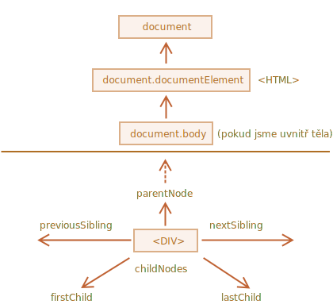
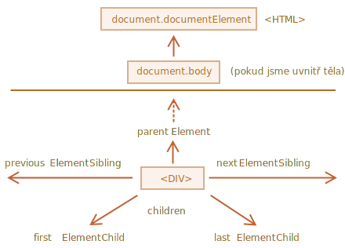

libs:
  - d3
  - domtree

---


# Procházení DOMem

DOM nám umožňuje provádět s elementy a jejich obsahem všechno, co chceme, ale nejprve se musíme dostat k příslušnému DOM objektu.

Všechny operace na DOMu začínají na objektu `document`. To je hlavní „vstupní bod“ DOMu. Odtamtud můžeme přistupovat k jakémukoli uzlu.

Následující obrázek ukazuje odkazy, které nám umožňují pohybovat se mezi DOM uzly:



Proberme je podrobněji.

## Na vrcholu: documentElement a body

Vrchní uzly stromu jsou dostupné přímo jako vlastnosti objektu `document`:

`<html>` = `document.documentElement`
: Nejvyšší uzel dokumentu je `document.documentElement`. To je DOM uzel značky `<html>`.

`<body>` = `document.body`
: Další zeširoka používaný DOM uzel je element `<body>` -- `document.body`.

`<head>` = `document.head`
: Značka `<head>` je dostupná jako `document.head`.

````warn header="Je tady chyták: `document.body` může být `null`"
Skript nemůže přistupovat k elementu, který v okamžiku jeho spuštění neexistuje.

Konkrétně, jestliže je skript umístěn uvnitř `<head>`, pak `document.body` nebude k dispozici, protože prohlížeč je ještě nenačetl.

V následujícím příkladu tedy první `alert` zobrazí `null`:

```html run
<html>

<head>
  <script>
*!*
    alert( "Ze značky HEAD: " + document.body ); // null, zatím není žádné <body>
*/!*
  </script>
</head>

<body>

  <script>
    alert( "Ze značky BODY: " + document.body ); // HTMLBodyElement, nyní existuje
  </script>

</body>
</html>
```
````

```smart header="Ve světě DOMu `null` znamená „neexistuje“"
V DOMu hodnota `null` znamená „neexistuje“ nebo „takový uzel není“.
```

## Děti: childNodes, firstChild, lastChild

Od nynějška budeme používat následující dva pojmy:

- **Dětské uzly (nebo děti)** -- elementy, které jsou přímými dětmi. Jinými slovy, jsou vnořeny přímo v daném uzlu. Například `<head>` a `<body>` jsou dětmi elementu `<html>`.
- **Potomci** -- všechny elementy, které jsou vnořeny v daném uzlu, tedy děti, jejich děti a tak dále.

Například `<body>` zde má děti `<div>` a `<ul>` (a několik prázdných textových uzlů):

```html run
<html>
<body>
  <div>Začátek</div>

  <ul>
    <li>
      <b>Informace</b>
    </li>
  </ul>
</body>
</html>
```

...A potomci `<body>` jsou nejen přímé děti `<div>` a `<ul>`, ale i hlouběji vnořené elementy, například `<li>` (dítě `<ul>`) a `<b>` (dítě `<li>`) -- celý podstrom.

**Všechny dětské uzly včetně textových obsahuje kolekce `childNodes`.**

Následující příklad zobrazí děti elementu `document.body`:

```html run
<html>
<body>
  <div>Začátek</div>

  <ul>
    <li>Informace</li>
  </ul>

  <div>Konec</div>

  <script>
*!*
    for (let i = 0; i < document.body.childNodes.length; i++) {
      alert( document.body.childNodes[i] ); // Text, DIV, Text, UL, ..., SCRIPT
    }
*/!*
  </script>
  ...něco dalšího...
</body>
</html>
```

Prosíme všimněte si zde jednoho zajímavého detailu. Když uvedený příklad spustíme, posledním zobrazeným elementem bude `<script>`. Ve skutečnosti dokument obsahuje ještě další prvky pod ním, ale ve chvíli spuštění skriptu je prohlížeč ještě nenačetl, takže je skript nevidí.

**Rychlý přístup k prvnímu a poslednímu dítěti poskytují vlastnosti `firstChild` a `lastChild`.**

Jsou to jenom zkratky. Pokud dětské uzly existují, vždy platí následující:
```js
elem.childNodes[0] === elem.firstChild
elem.childNodes[elem.childNodes.length - 1] === elem.lastChild
```

Existuje i speciální funkce `elem.hasChildNodes()`, která zjistí, zda element má nějaké dětské uzly.

### Kolekce DOMu

Jak vidíme, `childNodes` vypadá jako pole. Ve skutečnosti to však není pole, ale *kolekce* -- speciální iterovatelný objekt podobný poli.

To má dva důležité důsledky:

1. Můžeme nad ním iterovat pomocí `for..of`:
  ```js
  for (let uzel of document.body.childNodes) {
    alert(uzel); // zobrazí všechny uzly z kolekce
  }
  ```
  Je to proto, že objekt je iterovatelný (poskytuje požadovanou vlastnost `Symbol.iterator`).

2. Metody polí nefungují, protože tento objekt není pole:
  ```js run
  alert(document.body.childNodes.filter); // undefined (neobsahuje metodu filter!)
  ```

To první je pěkné. To druhé lze tolerovat, protože jestliže chceme metody polí, můžeme z kolekce vytvořit „opravdové“ pole pomocí metody `Array.from`:

  ```js run
  alert( Array.from(document.body.childNodes).filter ); // function
  ```

```warn header="DOM kolekce jsou pouze pro čtení"
DOM kolekce, ba dokonce *všechny* navigační vlastnosti uvedené v této kapitole jsou pouze pro čtení.

Nemůžeme nahradit dítě něčím jiným pomocí přiřazení `childNodes[i] = ...`.

Ke změnám v DOMu jsou zapotřebí jiné metody. Uvidíme je v příští kapitole.
```

```warn header="DOM kolekce jsou živé"
Téměř všechny DOM kolekce až na několik drobných výjimek jsou *živé*. Jinými slovy, odrážejí aktuální stav DOMu.

Jestliže si budeme udržovat odkaz na `elem.childNodes` a budeme v DOMu přidávat nebo odstraňovat uzly, automaticky se to v této kolekci projeví.
```

````warn header="Nepoužívejte `for..in` pro iterování nad kolekcemi"
Kolekce jsou iterovatelné pomocí `for..of`. Někdy se k tomu lidé snaží použít `for..in`.

Prosíme, nedělejte to. Cyklus `for..in` iteruje nad všemi enumerovatelnými vlastnostmi. A kolekce mají některé vzácně používané vlastnosti „navíc“, které obvykle nechceme získat:

```html run
<body>
<script>
  // zobrazí 0, 1, length, item, values a další.
  for (let vlastnost in document.body.childNodes) alert(vlastnost);
</script>
</body>
```
````

## Sourozenci a rodič

*Sourozenci* jsou uzly, které jsou dětmi stejného rodiče.

Například zde jsou `<head>` a `<body>` sourozenci:

```html
<html>
  <head>...</head><body>...</body>
</html>
```

- `<body>` se nazývá „další“ nebo „pravý“ sourozenec `<head>`,
- `<head>` se nazývá „předchozí“ nebo „levý“ sourozenec `<body>`.

Dalšího sourozence poskytuje vlastnost `nextSibling` a předchozího vlastnost `previousSibling`.

Rodič je dostupný ve vlastnosti `parentNode`.

Příklad:

```js run
// rodičem <body> je <html>
alert( document.body.parentNode === document.documentElement ); // true

// po <head> následuje <body>
alert( document.head.nextSibling ); // HTMLBodyElement

// před <body> se nachází <head>
alert( document.body.previousSibling ); // HTMLHeadElement
```

## Navigace pouze po elementech

Dosud uvedené navigační vlastnosti odkazují na *všechny* uzly. Například ve vlastnosti `childNodes` vidíme textové uzly, elementové uzly a dokonce i komentářové uzly, pokud existují.

V mnoha úlohách však nechceme textové nebo komentářové uzly. Chceme manipulovat s elementovými uzly, které představují značky a tvoří strukturu stránky.

Podívejme se tedy na další navigační odkazy, které berou v úvahu jen *elementové uzly*:



Odkazy jsou podobné výše uvedeným, jen se slovem `Element` uprostřed:

- `children` -- jen ty děti, které jsou elementy. 
- `firstElementChild`, `lastElementChild` -- první a poslední dětský element.
- `previousElementSibling`, `nextElementSibling` -- sousední elementy.
- `parentElement` -- rodičovský element.

````smart header="Proč `parentElement`? Může snad rodič *nebýt* element?"
Vlastnost `parentElement` vrací „elementového“ rodiče, zatímco vlastnost `parentNode` vrací „jakéhokoli“ rodiče. Tyto vlastnosti jsou obvykle stejné: obě vracejí rodiče.

Jedinou výjimkou je `document.documentElement`:

```js run
alert( document.documentElement.parentNode ); // document
alert( document.documentElement.parentElement ); // null
```

Důvodem je, že rodičem kořenového uzlu `document.documentElement` (`<html>`) je `document`. Avšak `document` není elementový uzel, takže jej `parentNode` vrací a `parentElement` ne.

Tento detail může být užitečný, když se chceme přesunout od libovolného elementu `elem` nahoru až na `<html>`, ale ne na `document`:
```js
while(elem = elem.parentElement) { // jdeme nahoru až na <html>
  alert( elem );
}
```
````
Pozměňme jeden z uvedených příkladů: nahraďme `childNodes` za `children`. Teď bude zobrazovat jen elementy:

```html run
<html>
<body>
  <div>Začátek</div>

  <ul>
    <li>Informace</li>
  </ul>

  <div>Konec</div>

  <script>
*!*
    for (let elem of document.body.children) {
      alert(elem); // DIV, UL, DIV, SCRIPT
    }
*/!*
  </script>
  ...
</body>
</html>
```

## Další odkazy: tabulky [#dom-navigation-tables]

Dosud jsme popisovali základní navigační vlastnosti.

Určité druhy DOM elementů mohou pro pohodlnější přístup poskytovat další vlastnosti, specifické pro jejich typ.

Výborným příkladem jsou tabulky, které představují zvlášť důležitý případ:

Element **`<table>`** podporuje tyto vlastnosti (navíc k výše uvedeným):
- `table.rows` -- kolekce elementů `<tr>` tabulky.
- `table.caption/tHead/tFoot` -- odkazy na elementy `<caption>`, `<thead>`, `<tfoot>`.
- `table.tBodies` -- kolekce elementů `<tbody>` (podle standardu jich může být více, ale vždy bude nejméně jeden -- i když není ve zdrojovém HTML kódu, prohlížeč jej do DOMu vloží).

Elementy **`<thead>`, `<tfoot>`, `<tbody>`** poskytují vlastnost `rows`:
- `tbody.rows` -- kolekce `<tr>` uvnitř.

**`<tr>`:**
- `tr.cells` -- kolekce buněk `<td>` a `<th>` uvnitř příslušného `<tr>`.
- `tr.sectionRowIndex` -- pozice (index) příslušného `<tr>` uvnitř uzavírajícího `<thead>/<tbody>/<tfoot>`.
- `tr.rowIndex` -- celkové pořadí tohoto `<tr>` v tabulce (mezi všemi tabulkovými řádky).

**`<td>` a `<th>`:**
- `td.cellIndex` -- pořadí této buňky uvnitř uzavírajícího `<tr>`.

Příklad použití:

```html run height=100
<table id="tabulka">
  <tr>
    <td>jedna</td><td>dvě</td>
  </tr>
  <tr>
    <td>tři</td><td>čtyři</td>
  </tr>
</table>

<script>
  // získáme td s "dvě" (první řádek, druhý sloupec)
  let td = tabulka.*!*rows[0].cells[1]*/!*;
  td.style.backgroundColor = "red"; // zvýrazníme ji
</script>
```

Specifikace: [tabulková data](https://html.spec.whatwg.org/multipage/tables.html).

Dodatečné navigační vlastnosti existují i pro HTML formuláře. Podíváme se na ně později, až začneme s formuláři  pracovat.

## Shrnutí

Máme-li zadaný DOM uzel, můžeme se z něj pomocí navigačních vlastností dostat na jeho bezprostřední sousedy.

Vlastnosti se dělí do dvou základních sad:

- Pro všechny uzly: `parentNode`, `childNodes`, `firstChild`, `lastChild`, `previousSibling`, `nextSibling`.
- Jen pro elementové uzly: `parentElement`, `children`, `firstElementChild`, `lastElementChild`, `previousElementSibling`, `nextElementSibling`.

Některé druhy DOM elementů, např. tabulky, poskytují další vlastnosti a kolekce pro přístup ke svému obsahu.
