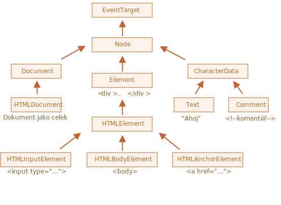

# Vlastnosti uzlů: typ, značka a obsah

Získejme trochu hlubší náhled na DOM uzly.

V této kapitole se dozvíme víc o tom, jak vypadají, a naučíme se jejich nejpoužívanější vlastnosti.

## Třídy DOM uzlů

Různé DOM uzly mohou mít různé vlastnosti. Například elementový uzel odpovídající značce `<a>` má vlastnosti týkající se odkazu, uzel odpovídající značce `<input>` má vlastnosti týkající se vstupu a podobně. Textové uzly nejsou stejné jako elementové, ale i mezi nimi všemi existují společné vlastnosti a metody, jelikož všechny třídy DOM uzlů tvoří jednu hierarchii.

Každý DOM uzel náleží do příslušné vestavěné třídy.

Kořenem hierarchie je třída [EventTarget](https://dom.spec.whatwg.org/#eventtarget). Z ní je zděděna třída [Node](https://dom.spec.whatwg.org/#interface-node) a z ní jsou zděděny ostatní DOM uzly.

Zde je obrázek, vysvětlení bude následovat:



Třídy jsou:

- [EventTarget](https://dom.spec.whatwg.org/#eventtarget) -- je kořenová „abstraktní“ třída pro všechno.

    Objekty této třídy nejsou nikdy vytvořeny. Třída slouží jako báze, takže všechny DOM uzly podporují tzv. „události“. Prostudujeme je později.

- [Node](https://dom.spec.whatwg.org/#interface-node) -- je také „abstraktní“ třída, která slouží jako báze pro DOM uzly.

    Poskytuje jádro stromové funkcionality: `parentNode`, `nextSibling`, `childNodes` a podobně (to jsou gettery). Objekty třídy `Node` nejsou nikdy vytvořeny, ale existují další třídy, které jsou z ní zděděny (a tedy dědí funkcionalitu třídy `Node`).

- [Document](https://dom.spec.whatwg.org/#interface-document), z historických důvodů je z něj často zděděn `HTMLDocument` (ačkoli nejnovější specifikace to nenařizuje) -- je dokument jako celek.

    Přímo do této třídy patří globální objekt `document`, který slouží jako vstupní bod DOMu.

- [CharacterData](https://dom.spec.whatwg.org/#interface-characterdata) -- „abstraktní“ třída, z níž jsou zděděny:
    - [Text](https://dom.spec.whatwg.org/#interface-text) -- třída odpovídající textu uvnitř elementů, např. `Ahoj` v `<p>Ahoj</p>`.
    - [Comment](https://dom.spec.whatwg.org/#interface-comment) -- třída pro komentáře. Ty se nezobrazují, ale každý komentář se stává prvkem DOMu.

- [Element](https://dom.spec.whatwg.org/#interface-element) -- je základní třídou pro DOM elementy.

    Poskytuje navigaci na úrovni elementů, např. `nextElementSibling` nebo `children`, a vyhledávací metody, např. `getElementsByTagName`, `querySelector`.

    Prohlížeč podporuje nejen HTML, ale také XML a SVG. Třída `Element` tedy slouží jako báze pro specifičtější třídy: `SVGElement`, `XMLElement` (ty zde nebudeme potřebovat) a `HTMLElement`.

- A konečně [HTMLElement](https://html.spec.whatwg.org/multipage/dom.html#htmlelement) je základní třída pro všechny HTML elementy. S ní budeme pracovat většinu času.

    Jsou z ní zděděny konkrétní HTML elementy:
    - [HTMLInputElement](https://html.spec.whatwg.org/multipage/forms.html#htmlinputelement) -- třída pro elementy `<input>`,
    - [HTMLBodyElement](https://html.spec.whatwg.org/multipage/semantics.html#htmlbodyelement) -- třída pro elementy `<body>`,
    - [HTMLAnchorElement](https://html.spec.whatwg.org/multipage/semantics.html#htmlanchorelement) -- třída pro elementy `<a>`,
    - ...a podobně.

Existuje mnoho dalších značek s vlastními třídami, které mohou mít specifické vlastnosti a metody. Naproti tomu některé elementy, například `<span>`, `<section>` nebo `<article>`, nemají žádné specifické vlastnosti, takže jsou instancemi třídy `HTMLElement`.

Celá sada vlastností a metod každého uzlu je tedy výsledkem řetězce dědičností.

Uvažujme například DOM objekt pro element `<input>`. Ten patří do třídy [HTMLInputElement](https://html.spec.whatwg.org/multipage/forms.html#htmlinputelement).

Jeho vlastnosti a metody jsou sjednocením následujících (vyjmenovány v pořadí dědičnosti):

- `HTMLInputElement` -- tato třída poskytuje vlastnosti specifické pro vstup,
- `HTMLElement` -- poskytuje metody (a gettery/settery) společné pro HTML elementy,
- `Element` -- poskytuje generické metody elementů,
- `Node` -- poskytuje vlastnosti společné pro DOM uzly,
- `EventTarget` -- poskytuje podporu událostí (budou vysvětleny v dalších kapitolách),
- ...a nakonec je vše zděděno z třídy `Object`, takže k dispozici jsou i metody „planého objektu“, např. `hasOwnProperty`.

Chceme-li vidět název třídy DOM uzlu, můžeme si vzpomenout, že objekt zpravidla obsahuje vlastnost `constructor`. Ta se odkazuje na třídní konstruktor a jeho název je v `constructor.name`:

```js run
alert( document.body.constructor.name ); // HTMLBodyElement
```

...Nebo můžeme prostě použít `toString`:

```js run
alert( document.body ); // [object HTMLBodyElement]
```

Můžeme také ověřit dědičnost pomocí `instanceof`:

```js run
alert( document.body instanceof HTMLBodyElement ); // true
alert( document.body instanceof HTMLElement ); // true
alert( document.body instanceof Element ); // true
alert( document.body instanceof Node ); // true
alert( document.body instanceof EventTarget ); // true
```

Jak vidíme, DOM uzly jsou obvyklé JavaScriptové objekty a k dědičnosti využívají třídy založené na prototypech.

To je dobře vidět i při vypsání elementu v prohlížeči příkazem `console.dir(elem)`. V konzoli pak uvidíte `HTMLElement.prototype`, `Element.prototype` a tak dále.

```smart header="`console.dir(elem)` oproti `console.log(elem)`"
Většina prohlížečů ve svých vývojářských nástrojích podporuje dva příkazy: `console.log` a `console.dir`. Oba vypíší své argumenty na konzoli. Pro JavaScriptové objekty obvykle oba příkazy zobrazí totéž.

Pro DOM elementy se však liší:

- `console.log(elem)` zobrazí DOM strom elementu.
- `console.dir(elem)` zobrazí element jako DOM objekt, což je dobré pro prozkoumání jeho vlastností.

Zkuste si to na `document.body`.
```

````smart header="IDL ve specifikaci"
Ve specifikaci nejsou DOM třídy popsány v JavaScriptu, ale ve speciálním jazyce pro popis rozhraní nazvaném [Interface description language](https://en.wikipedia.org/wiki/Interface_description_language) (IDL), kterému je obvykle snadné porozumět.

V IDL je před každou vlastností uveden její typ, například `DOMString`, `boolean` a podobně.

Uvádíme úryvek z popisu s komentáři:

```js
// Definice HTMLInputElement
*!*
// Dvojtečka ":" znamená, že HTMLInputElement je zděděn z HTMLElement
*/!*
interface HTMLInputElement: HTMLElement {
  // sem přijdou vlastnosti a metody elementů <input>

*!*
  // "DOMString" znamená, že hodnotou vlastnosti je řetězec
*/!*
  attribute DOMString accept;
  attribute DOMString alt;
  attribute DOMString autocomplete;
  attribute DOMString value;

*!*
  // vlastnost s booleovskou hodnotou (true/false)
  attribute boolean autofocus;
*/!*
  ...
*!*
  // teď metoda: "void" znamená, že metoda nevrací žádnou hodnotu
*/!*
  void select();
  ...
}
```
````

## Vlastnost „nodeType“

Vlastnost `nodeType` poskytuje ještě jeden, „staromódní“ způsob, jak získat „typ“ DOM uzlu.

Obsahuje číselnou hodnotu:
- `elem.nodeType == 1` pro elementové uzly,
- `elem.nodeType == 3` pro textové uzly,
- `elem.nodeType == 9` pro objekt dokumentu,
- ve [specifikaci](https://dom.spec.whatwg.org/#node) je uvedeno několik dalších hodnot.

Příklad:

```html run
<body>
  <script>
  let elem = document.body;

  // prozkoumejme: jaký druh uzlu je v elem?
  alert(elem.nodeType); // 1 => element

  // a jeho první dítě je...
  alert(elem.firstChild.nodeType); // 3 => text

  // pro objekt document je typ 9
  alert( document.nodeType ); // 9
  </script>
</body>
```

V moderních skriptech můžeme ke zjištění typu uzlu použít `instanceof` a další testy založené na třídách, ale `nodeType` může být někdy jednodušší. Vlastnost `nodeType` můžeme jenom číst, ne měnit.

## Značka: nodeName a tagName

Máme-li DOM uzel, můžeme načíst název jeho značky z vlastností `nodeName` nebo `tagName`:

Příklad:

```js run
alert( document.body.nodeName ); // BODY
alert( document.body.tagName ); // BODY
```

Je nějaký rozdíl mezi `tagName` a `nodeName`?

Jistě, rozdíl se odráží v jejich názvech, ale to je samozřejmě příliš jemné.

- Vlastnost `tagName` existuje pouze pro uzly třídy `Element`.
- Vlastnost `nodeName` je definována pro každý `Node`:
    - u elementů má stejný význam jako `tagName`.
    - u uzlů jiných typů (textové, komentářové atd.) obsahuje řetězec s typem uzlu.

Jinými slovy, `tagName` je podporována jen v elementových uzlech (protože pochází ze třídy `Element`), zatímco `nodeName` nám může něco říci i o uzlech jiných typů.

Srovnejme například `tagName` a `nodeName` pro `document` a komentářový uzel:


```html run
<body><!-- komentář -->

  <script>
    // pro komentář
    alert( document.body.firstChild.tagName ); // undefined (není to element)
    alert( document.body.firstChild.nodeName ); // #comment

    // pro dokument
    alert( document.tagName ); // undefined (není to element)
    alert( document.nodeName ); // #document
  </script>
</body>
```

Jestliže pracujeme pouze s elementy, můžeme používat `tagName` i `nodeName` - není v tom žádný rozdíl.

```smart header="Název značky je vždy velkými písmeny, nejsme-li v režimu XML"
Prohlížeč má dva režimy zpracování dokumentů: HTML a XML. Pro webové stránky se obvykle používá režim HTML. Režim XML je povolen, když prohlížeč obdrží XML dokument s hlavičkou: `Content-Type: application/xml+xhtml`.

V režimu HTML je hodnota `tagName/nodeName` vždy velkými písmeny: bude to `BODY` pro `<body>` i pro `<BoDy>`.

V režimu XML jsou velká a malá písmena ponechána beze změny. V současnosti se režim XML používá zřídkakdy.
```


## innerHTML: obsah

Vlastnost [innerHTML](https://w3c.github.io/DOM-Parsing/#the-innerhtml-mixin) umožňuje získat HTML kód uvnitř elementu jako řetězec.

Můžeme ji také měnit. Je to tedy jeden z nejsilnějších způsobů, jak měnit stránku.

Následující příklad zobrazí obsah `document.body` a pak jej celý nahradí za jiný:

```html run
<body>
  <p>Odstavec</p>
  <div>Div</div>

  <script>
    alert( document.body.innerHTML ); // načte aktuální obsah
    document.body.innerHTML = 'Nové TĚLO!'; // nahradí jej za jiný
  </script>

</body>
```

Můžeme se pokusit vložit vadný HTML kód, prohlížeč naše chyby opraví:

```html run
<body>

  <script>
    document.body.innerHTML = '<b>test'; // zapomněli jsme uzavřít značku
    alert( document.body.innerHTML ); // <b>test</b> (opraveno)
  </script>

</body>
```

```smart header="Skripty se nespustí"
Jestliže `innerHTML` vloží do dokumentu značku `<script>`, skript se stane součástí HTML kódu, ale nespustí se.
```

### Pozor: „innerHTML+=“ obsah zcela přepíše

Můžeme přidat HTML kód do elementu pomocí `elem.innerHTML+="další html"`.

Třeba takto:

```js
chatDiv.innerHTML += "<div>Ahoj !</div>";
chatDiv.innerHTML += "Jak se máš?";
```

Při tom bychom si však měli dávat velký pozor, protože to, co se stane, *nebude* přidání obsahu, ale jeho úplné přepsání.

Technicky následující dva řádky udělají totéž:

```js
elem.innerHTML += "...";
// je kratší způsob, jak napsat:
*!*
elem.innerHTML = elem.innerHTML + "..."
*/!*
```

Jinými slovy, `innerHTML+=` udělá následující:

1. Odstraní starý obsah.
2. Zapíše místo něj nový obsah `innerHTML` (zřetězení starého a nového obsahu).

**Když je obsah „vynulován“ a od základů přepsán, všechny obrázky a další zdroje budou znovu načteny**.

V uvedeném příkladu `chatDiv` řádek `chatDiv.innerHTML+="Jak se máš?"` znovu vytvoří HTML obsah a znovu načte `smile.gif` (doufejme, že je v mezipaměti). Jestliže `chatDiv` obsahuje spoustu dalšího textu a obrázků, bude opakované načtení jasně viditelné.

Má to i další vedlejší efekty. Například jestliže návštěvník vybral myší existující text, většina prohlížečů po přepsání `innerHTML` výběr zruší. A pokud v něm byl `<input>`, do něhož návštěvník zadal text, bude tento text odstraněn. A podobně.

Naštěstí kromě `innerHTML` existují i jiné způsoby, jak přidat HTML kód. Brzy je prostudujeme.

## outerHTML: celý HTML kód elementu

Vlastnost `outerHTML` obsahuje celý HTML kód elementu. Je to jako `innerHTML` plus element samotný.

Zde je příklad:

```html run
<div id="elem">Ahoj <b>světe</b></div>

<script>
  alert(elem.outerHTML); // <div id="elem">Ahoj <b>světe</b></div>
</script>
```

**Pozor: na rozdíl od `innerHTML` zápis do `outerHTML` nezmění element, ale místo toho jej v DOMu nahradí novým.**

Ano, zní to zvláštně a zvláštní to také je, proto tomu zde věnujeme zvláštní poznámku. Podívejte se.

Uvažujme tento příklad:

```html run
<div>Ahoj, světe!</div>

<script>
  let div = document.querySelector('div');

*!*
  // nahradí div.outerHTML za <p>...</p>
*/!*
  div.outerHTML = '<p>Nový element</p>'; // (*)

*!*
  // Páni! 'div' je pořád stejný!
*/!*
  alert(div.outerHTML); // <div>Ahoj, světe!</div> (**)
</script>
```

To vypadá opravdu divně, že?

Na řádku `(*)` jsme nahradili `div` za `<p>Nový element</p>`. Ve vnějším dokumentu (DOMu) vidíme místo `<div>` nový obsah. Ale jak vidíme na řádku `(**)`, hodnota staré proměnné `div` se nezměnila!

Přiřazení do `outerHTML` nezmění DOM element (objekt, na který v tomto případě odkazuje proměnná `div`), ale odstraní jej z DOMu a na jeho místo vloží nový HTML kód.

Při `div.outerHTML=...` se tedy stalo následující:
- `div` byl odstraněn z dokumentu.
- Na jeho místo byl vložen jiný kousek HTML kódu `<p>Nový element</p>`.
- `div` má stále svou původní hodnotu. Nový HTML kód se neuložil do žádné proměnné.

Je velmi snadné udělat tady chybu: změnit `div.outerHTML` a pak pokračovat v práci s `div`, jako by v sobě měl nový obsah. Ale tak to není. Něco takového je v pořádku pro `innerHTML`, ale ne pro `outerHTML`.

Můžeme do `elem.outerHTML` zapisovat, ale měli bychom mít na paměti, že tím nezměníme element, do něhož zapisujeme (`elem`). Namísto toho vložíme na jeho místo nový HTML kód. Odkazy na nové elementy můžeme získat prohledáváním DOMu.

## nodeValue/data: obsah textového uzlu

Vlastnost `innerHTML` platí jen pro elementové uzly.

Jiné druhy uzlů, například textové, mají její protějšek: vlastnosti `nodeValue` a `data`. Pro praktické použití jsou obě téměř stejné, jsou mezi nimi jen drobné rozdíly ve specifikaci. Budeme tedy používat `data`, protože je kratší.

Příklad načtení obsahu textového uzlu a komentáře:

```html run height="50"
<body>
  Ahoj
  <!-- Komentář -->
  <script>
    let text = document.body.firstChild;
*!*
    alert(text.data); // Ahoj
*/!*

    let komentář = text.nextSibling;
*!*
    alert(komentář.data); // Komentář
*/!*
  </script>
</body>
```

U textových uzlů si dokážeme představit důvod, proč je načítáme nebo měníme, ale u komentářů?

Vývojáři do nich někdy vkládají informace nebo instrukce pro šablony v HTML, například:

```html
<!-- if jeSprávce -->
  <div>Vítáme vás, pane správce!</div>
<!-- /if -->
```

...Pak JavaScript může číst z jejich vlastnosti `data` a zpracovat vložené instrukce.

## textContent: čistý text

Vlastnost `textContent` poskytuje přístup k *textu* uvnitř elementu: obsahuje pouze text, zbavený všech `<značek>`.

Příklad:

```html run
<div id="zprávy">
  <h1>Titulek!</h1>
  <p>Marťané útočí na lidi!</p>
</div>

<script>
  // Titulek! Marťané útočí na lidi!
  alert(zprávy.textContent);
</script>
```

Jak vidíme, vrátila nám pouhý text. Všechny jeho `<značky>` byly odstraněny, ale text z nich zůstal.

V praxi je načítání takového textu zapotřebí jen zřídka.

**Mnohem užitečnější je do `textContent` zapisovat, protože nám umožňuje „bezpečný“ zápis textu.**

Řekněme, že máme libovolný řetězec, například zadaný uživatelem, a chceme jej zobrazit.

- Pomocí `innerHTML` jej vložíme „jako HTML kód“ se všemi HTML značkami.
- Pomocí `textContent` jej vložíme „jako text“, se všemi symboly se zachází doslovně.

Porovnejte si tyto dva způsoby:

```html run
<div id="elem1"></div>
<div id="elem2"></div>

<script>
  let jméno = prompt("Jak se jmenuješ?", "<b>Medvídek Pú!</b>");

  elem1.innerHTML = jméno;
  elem2.textContent = jméno;
</script>
```

1. První `<div>` obdrží jméno „jako HTML“: ze všech značek se stanou značky, takže jméno vidíme tučně.
2. Druhý `<div>` obdrží jméno „jako text", takže vidíme doslova `<b>Medvídek Pú!</b>`.

Ve většině případů očekáváme, že uživatel zadá text, a chceme s ním zacházet jako s textem. Nechceme mít na stránce neočekávaný HTML kód. Přiřazením do `textContent` toho dosáhneme.

## Vlastnost „hidden“

Atribut `hidden` a stejnojmenná DOM vlastnost specifikuje, zda je element viditelný nebo ne.

Můžeme jej používat v HTML nebo do něj přiřadit hodnotu v JavaScriptu, třeba takto:

```html run height="80"
<div>Oba následující divy jsou skryté</div>

<div hidden>Pomocí atributu „hidden“</div>

<div id="elem">JavaScript nastavil vlastnost „hidden“</div>

<script>
  elem.hidden = true;
</script>
```

Technicky `hidden` funguje stejně jako `style="display:none"`, ale je kratší na napsání.

Zde je blikající element:


```html run height=50
<div id="elem">Blikající element</div>

<script>
  setInterval(() => elem.hidden = !elem.hidden, 1000);
</script>
```

## Další vlastnosti

DOM elementy mají i další vlastnosti, zejména ty, které závisejí na třídě:

- `value` -- hodnota `<input>`, `<select>` a `<textarea>` (`HTMLInputElement`, `HTMLSelectElement`...).
- `href` -- „href“ pro `<a href="...">` (`HTMLAnchorElement`).
- `id` -- hodnota atributu „id“, pro všechny elementy (`HTMLElement`).
- ...a mnoho dalších...

Příklad:

```html run height="80"
<input type="text" id="elem" value="hodnota">

<script>
  alert(elem.type); // "text"
  alert(elem.id); // "elem"
  alert(elem.value); // hodnota
</script>
```

Většina standardních HTML atributů má odpovídající DOM vlastnost a my k ní můžeme takto přistupovat.

Pokud chcete znát celý seznam podporovaných vlastností v určité třídě, můžete jej najít ve specifikaci. Například `HTMLInputElement` je zdokumentován v <https://html.spec.whatwg.org/#htmlinputelement>.

Nebo pokud je chceme rychle zjistit nebo nás zajímá specifikace pro konkrétní prohlížeč, můžeme si prvek vždy vypsat pomocí `console.dir(elem)` a vlastnosti si přečíst. Nebo můžeme prozkoumat „Vlastnosti DOMu“ (DOM properties) v záložce Elements v prohlížečových vývojářských nástrojích.

## Shrnutí

Každý DOM uzel patří do určité třídy. Tyto třídy tvoří hierarchii. Výsledkem dědičnosti je celá sada vlastností a metod.

Hlavní vlastnosti DOM uzlů jsou:

`nodeType`
: Můžeme ji použít ke zjištění, zda uzel je textový nebo elementový. Vlastnost má číselnou hodnotu: `1` pro elementy, `3` pro textové uzly, několik dalších pro jiné typy uzlů. Pouze pro čtení.

`nodeName/tagName`
: U elementů název značky (velkými písmeny, nejsme-li v režimu XML). U jiných uzlů `nodeName` popisuje, co je to za uzel. Pouze pro čtení.

`innerHTML`
: HTML obsah elementu. Může být měněn.

`outerHTML`
: Úplný HTML kód elementu. Operace zápisu do `elem.outerHTML` se nedotkne samotného `elem`, ale místo toho jej ve vnějším kontextu nahradí novým HTML kódem.

`nodeValue/data`
: Obsah neelementového uzlu (textového, komentářového). Obě vlastnosti jsou téměř stejné, obvykle používáme `data`. Mohou být měněny.

`textContent`
: Text uvnitř elementu: HTML zbavený všech `<značek>`. Zápis do této vlastnosti vloží text do elementu tak, že se všemi speciálními znaky a značkami se bude zacházet jako s textem. Dokáže bezpečně vložit uživatelem vytvořený text a ochránit jej před nechtěnými změnami v HTML.

`hidden`
: Když se nastaví na `true`, udělá totéž jako `display:none` v CSS.

DOM uzly obsahují i jiné vlastnosti, které závisejí na jejich třídě. Například elementy `<input>` (`HTMLInputElement`) podporují `value`, `type`, zatímco elementy `<a>` (`HTMLAnchorElement`) podporují `href` a podobně. Většina standardních HTML atributů má odpovídající DOM vlastnost.

Nicméně HTML atributy a DOM vlastnosti nejsou vždy totožné, jak uvidíme v příští kapitole.