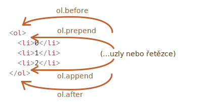

# Modifikace dokumentu

Klíčem k vytváření „živých“ stránek je modifikace DOMu.

Zde uvidíme, jak vytvářet nové elementy „za běhu“ a jak modifikovat obsah existující stránky.

## Příklad: zobrazení zprávy

Předveďme si to na příkladu. Přidáme na stránku zprávu, která bude vypadat lépe než `alert`.

Bude to vypadat následovně:

```html autorun height="80"
<style>
.upozornění {
  padding: 15px;
  border: 1px solid #d6e9c6;
  border-radius: 4px;
  color: #3c763d;
  background-color: #dff0d8;
}
</style>

*!*
<div class="upozornění">
  <strong>Nazdar!</strong> Právě čteš důležitou zprávu.
</div>
*/!*
```

To byl příklad v HTML. Nyní vytvořme stejný `div` v JavaScriptu (předpokládáme, že styly jsou již definovány v HTML/CSS).

## Vytvoření elementu

K vytvoření DOM uzlu slouží dvě metody:

`document.createElement(značka)`
: Vytvoří nový *elementový uzel* se zadanou značkou:

    ```js
    let div = document.createElement('div');
    ```

`document.createTextNode(text)`
: Vytvoří nový *textový uzel* se zadaným textem:

    ```js
    let textovýUzel = document.createTextNode('Tady jsem');
    ```

Většinou potřebujeme vytvářet elementové uzly, například `div` pro naši zprávu.

### Vytvoření zprávy

Vytvoření značky `div` pro zprávu se skládá ze tří kroků:

```js
// 1. Vytvoříme element <div>
let div = document.createElement('div');

// 2. Nastavíme jeho třídu na "upozornění"
div.className = "upozornění";

// 3. Vložíme do něj obsah
div.innerHTML = "<strong>Nazdar!</strong> Právě čteš důležitou zprávu.";
```

Vytvořili jsme element. Prozatím se však nachází jen v proměnné jménem `div` a ne na stránce, takže ho nemůžeme vidět.

## Metody pro vkládání

Aby se nám `div` ukázal, musíme ho vložit někam do `document`, například do elementu `<body>`, na který se odkazuje `document.body`.

K tomu slouží speciální metoda `append`: `document.body.append(div)`.

Zde je celý kód:

```html run height="80"
<style>
.upozornění {
  padding: 15px;
  border: 1px solid #d6e9c6;
  border-radius: 4px;
  color: #3c763d;
  background-color: #dff0d8;
}
</style>

<script>
  let div = document.createElement('div');
  div.className = "upozornění";
  div.innerHTML = "<strong>Nazdar!</strong> Právě čteš důležitou zprávu.";

*!*
  document.body.append(div);
*/!*
</script>
```

Tady jsme volali `append` na `document.body`, ale metodu `append` můžeme volat i na kterémkoli jiném elementu, abychom do něj vložili další element. Můžeme například něco připojit k `<div>` voláním `div.append(dalšíElement)`.

Existují i další vkládací metody, které specifikují jiná místa, kam se má vkládat:

- `uzel.append(...uzly nebo řetězce)` -- připojí uzly nebo řetězce *na konec* uzlu `uzel`,
- `uzel.prepend(...uzly nebo řetězce)` -- vloží uzly nebo řetězce *na začátek* uzlu `uzel`,
- `uzel.before(...uzly nebo řetězce)` –- vloží uzly nebo řetězce *před* `uzel`,
- `uzel.after(...uzly nebo řetězce)` –- vloží uzly nebo řetězce *za* `uzel`,
- `uzel.replaceWith(...uzly nebo řetězce)` –- nahradí `uzel` zadanými uzly nebo řetězci.

Argumenty těchto metod je jakýkoli seznam DOM uzlů, které se mají vložit, nebo textových řetězců (z nich se automaticky vytvoří textové uzly).

Podívejme se na ně v akci.

Následuje příklad, jak pomocí těchto metod přidat prvky do seznamu a text před a za něj:

```html autorun
<ol id="ol">
  <li>0</li>
  <li>1</li>
  <li>2</li>
</ol>

<script>
  ol.before('před'); // vloží řetězec "před" před <ol>
  ol.after('za'); // vloží řetězec "za" za <ol>

  let liPrvní = document.createElement('li');
  liPrvní.innerHTML = 'začátek';
  ol.prepend(liPrvní); // vloží liPrvní na začátek <ol>

  let liPoslední = document.createElement('li');
  liPoslední.innerHTML = 'konec';
  ol.append(liPoslední); // vloží liPoslední na konec <ol>
</script>
```

Na obrázku je zobrazeno, co tyto metody dělají:



Výsledný seznam tedy bude:

```html
před
<ol id="ol">
  <li>začátek</li>
  <li>0</li>
  <li>1</li>
  <li>2</li>
  <li>konec</li>
</ol>
za
```

Jak bylo uvedeno, tyto metody dokáží vložit více uzlů a částí textu při jednom volání.

Například zde se vloží řetězec a element:

```html run
<div id="div"></div>
<script>
  div.before('<p>Ahoj</p>', document.createElement('hr'));
</script>
```

Prosíme všimněte si, že text se vloží „jako text“, ne „jako HTML“, takže znaky jako `<` a `>` budou příslušným způsobem upraveny.

Výsledný HTML tedy je:

```html run
*!*
&lt;p&gt;Ahoj&lt;/p&gt;
*/!*
<hr>
<div id="div"></div>
```

Jinými slovy, řetězce se vloží bezpečným způsobem stejně, jak to dělá `elem.textContent`.

Tyto metody tedy můžeme použít jedině ke vkládání DOM uzlů a částí textu.

Ale co když chceme vložit HTML řetězec „jako html“, aby v něm fungovaly všechny značky a všechno ostatní, stejně, jak to provádí `elem.innerHTML`?

## insertAdjacentHTML/Text/Element

K tomu můžeme použít jinou, víceúčelovou metodu: `elem.insertAdjacentHTML(kam, html)`.

Prvním parametrem je kódové slovo, které specifikuje, kam se má vkládat, relativně vůči `elem`. Musí to být jedno z následujících:

- `"beforebegin"` -- vloží `html` bezprostředně před `elem`,
- `"afterbegin"` -- vloží `html` do `elem` na začátek,
- `"beforeend"` -- vloží `html` do `elem` na konec,
- `"afterend"` -- vloží `html` bezprostředně za `elem`.

Druhým parametrem je HTML řetězec, který bude vložen „jako HTML“.

Příklad:

```html run
<div id="div"></div>
<script>
  div.insertAdjacentHTML('beforebegin', '<p>Ahoj</p>');
  div.insertAdjacentHTML('afterend', '<p>Sbohem</p>');
</script>
```

...Vytvoří:

```html run
<p>Ahoj</p>
<div id="div"></div>
<p>Sbohem</p>
```

Tímto způsobem můžeme ke stránce připojit libovolný HTML.

Varianty vkládání jsou znázorněny na obrázku:


Snadno si všimneme podobností mezi tímto a předchozím obrázkem. Místa pro vkládání jsou ve skutečnosti stejná, ale tato metoda vkládá HTML.

Tato metoda má dvě sesterské metody:

- `elem.insertAdjacentText(kam, text)` -- stejná syntaxe, ale řetězec `text` se místo HTML vloží „jako text“,
- `elem.insertAdjacentElement(kam, elem)` -- stejná syntaxe, ale vloží element.

Tyto metody existují hlavně proto, aby syntaxe byla „jednotná“. V praxi se většinou používá jen `insertAdjacentHTML`, protože pro elementy a text máme metody `append/prepend/before/after` -- jsou kratší na napsání a umějí vkládat uzly nebo části textu.

Zde je tedy alternativní varianta zobrazení zprávy:

```html run
<style>
.upozornění {
  padding: 15px;
  border: 1px solid #d6e9c6;
  border-radius: 4px;
  color: #3c763d;
  background-color: #dff0d8;
}
</style>

<script>
  document.body.insertAdjacentHTML("afterbegin", `<div class="upozornění">
    <strong>Nazdar!</strong> Právě čteš důležitou zprávu.
  </div>`);
</script>
```

## Odstranění uzlu

K odstranění uzlu slouží metoda `uzel.remove()`.

Nechme naši zprávu za jednu sekundu zmizet:

```html run untrusted
<style>
.upozornění {
  padding: 15px;
  border: 1px solid #d6e9c6;
  border-radius: 4px;
  color: #3c763d;
  background-color: #dff0d8;
}
</style>

<script>
  let div = document.createElement('div');
  div.className = "upozornění";
  div.innerHTML = "<strong>Nazdar!</strong> Právě čteš důležitou zprávu.";

  document.body.append(div);
*!*
  setTimeout(() => div.remove(), 1000);
*/!*
</script>
```

Prosíme všimněte si, že jestliže chceme *přemístit* element na jiné místo, nemusíme jej z původního místa odstraňovat.

**Všechny vkládací metody automaticky odstraní uzel z místa, kde se nacházel předtím.**

Například prohoďme elementy navzájem:

```html run height=50
<div id="první">První</div>
<div id="druhý">Druhý</div>
<script>
  // není třeba volat remove
  druhý.after(první); // vezme #druhý a za něj vloží #první
</script>
```

## Klonování uzlů: cloneNode

Jak vložit další podobnou zprávu?

Mohli bychom vytvořit funkci a vložit kód do ní. Alternativním způsobem však je *klonovat* existující `div` a změnit text uvnitř něj (pokud to potřebujeme).

Někdy, když máme velký element, to může být rychlejší a jednodušší.

- Volání `elem.cloneNode(true)` vytvoří „hluboký“ klon elementu -- se všemi atributy a podelementy. Jestliže zavoláme `elem.cloneNode(false)`, bude klon vytvořen bez dětských elementů.

Příklad kopírování zprávy:

```html run height="120"
<style>
.upozornění {
  padding: 15px;
  border: 1px solid #d6e9c6;
  border-radius: 4px;
  color: #3c763d;
  background-color: #dff0d8;
}
</style>

<div class="upozornění" id="div">
  <strong>Nazdar!</strong> Právě čteš důležitou zprávu.
</div>

<script>
*!*
  let div2 = div.cloneNode(true); // naklonujeme zprávu
  div2.querySelector('strong').innerHTML = 'Sbohem!'; // změníme klon

  div.after(div2); // zobrazíme klon za existujícím <div>
*/!*
</script>
```

## DocumentFragment [#document-fragment]

`DocumentFragment` je speciální DOM uzel, který slouží jako obal pro předávání seznamů uzlů.

Můžeme k němu přidávat další uzly, ale když jej někam vložíme, místo něj se vloží jeho obsah.

Například následující funkce `vraťObsahSeznamu` vygeneruje fragment s prvky `<li>`, které jsou následně vloženy do `<ul>`:

```html run
<ul id="ul"></ul>

<script>
function vraťObsahSeznamu() {
  let fragment = new DocumentFragment();

  for(let i=1; i<=3; i++) {
    let li = document.createElement('li');
    li.append(i);
    fragment.append(li);
  }

  return fragment;
}

*!*
ul.append(vraťObsahSeznamu()); // (*)
*/!*
</script>
```

Prosíme všimněte si, že na posledním řádku `(*)` jsme připojili `DocumentFragment`, ale ten „vymizí“ a výsledná struktura bude následující:

```html
<ul>
  <li>1</li>
  <li>2</li>
  <li>3</li>
</ul>
```

`DocumentFragment` se explicitně používá jen zřídka. Proč bychom měli něco připojovat ke speciálnímu druhu uzlu, když místo něj můžeme vrátit pole uzlů? Přepsaný příklad:

```html run
<ul id="ul"></ul>

<script>
function vraťObsahSeznamu() {
  let výsledek = [];

  for(let i=1; i<=3; i++) {
    let li = document.createElement('li');
    li.append(i);
    výsledek.push(li);
  }

  return výsledek;
}

*!*
ul.append(...vraťObsahSeznamu()); // append + operátor "..." = přátelé!
*/!*
</script>
```

Zmínili jsme `DocumentFragment` hlavně proto, že na něm jsou postaveny určité koncepty, například element [šablony](info:template-element), který probereme mnohem později.

## Vkládací a odebírací metody ze staré školy

[old]

Existují i metody pro manipulaci s DOMem „ze staré školy“, které jsou zachovány z historických důvodů.

Tyto metody pocházejí z mnohem dřívější doby. V současnosti není důvod je používat, jelikož moderní metody, např. `append`, `prepend`, `before`, `after`, `remove`, `replaceWith`, jsou flexibilnější.

Jediným důvodem, proč zde tyto metody uvádíme, je, že je můžete najít v mnoha starých skriptech:

`rodičovskýElement.appendChild(uzel)`
: Připojí `uzel` jako poslední dítě elementu `rodičovskýElement`.

    Následující příklad přidá nový `<li>` na konec `<ol>`:

    ```html run height=100
    <ol id="seznam">
      <li>0</li>
      <li>1</li>
      <li>2</li>
    </ol>

    <script>
      let novýLi = document.createElement('li');
      novýLi.innerHTML = 'Ahoj, světe!';

      seznam.appendChild(novýLi);
    </script>
    ```

`rodičovskýElement.insertBefore(uzel, dalšíSourozenec)`
: Vloží `uzel` před uzel `dalšíSourozenec` do elementu `rodičovskýElement`.

    Následující kód vloží nový prvek seznamu před druhý `<li>`:

    ```html run height=100
    <ol id="seznam">
      <li>0</li>
      <li>1</li>
      <li>2</li>
    </ol>
    <script>
      let novýLi = document.createElement('li');
      novýLi.innerHTML = 'Ahoj, světe!';

    *!*
      seznam.insertBefore(novýLi, seznam.children[1]);
    */!*
    </script>
    ```
    Chceme-li vložit `novýLi` jako první element, můžeme to udělat následovně:

    ```js
    seznam.insertBefore(novýLi, seznam.firstChild);
    ```

`rodičovskýElement.replaceChild(uzel, původníDítě)`
: Nahradí `původníDítě` mezi dětmi elementu `rodičovskýElement` uzlem `uzel`.

`rodičovskýElement.removeChild(uzel)`
: Odstraní `uzel` z elementu `rodičovskýElement` (za předpokladu, že `uzel` je jeho dítětem).

    Následující příklad odstraní první `<li>` z `<ol>`:

    ```html run height=100
    <ol id="seznam">
      <li>0</li>
      <li>1</li>
      <li>2</li>
    </ol>

    <script>
      let li = seznam.firstElementChild;
      seznam.removeChild(li);
    </script>
    ```

Všechny tyto metody vracejí vložený nebo odstraněný uzel. Jinými slovy, `rodičovskýElement.appendChild(uzel)` vrátí `uzel`. Návratová hodnota se však obvykle nepoužívá, prostě jen zavoláme metodu.

## Pár slov o „document.write“

Existuje ještě jedna, velice stará metoda pro přidávání na webovou stránku: `document.write`.

Syntaxe:

```html run
<p>Někde na stránce...</p>
*!*
<script>
  document.write('<b>Pozdrav od JS</b>');
</script>
*/!*
<p>Konec</p>
```

Volání `document.write(html)` zapíše `html` na stránku „právě tady a teď“. Řetězec `html` může být dynamicky generován, takže metoda je do určité míry flexibilní. Můžeme v JavaScriptu vytvořit webovou stránku obsahující vše potřebné a zapsat ji.

Tato metoda pochází ještě z doby, kdy neexistoval žádný DOM, žádné standardy... Z opravdu dávné doby. Stále však existuje, protože jsou skripty, které ji využívají.

V moderních skriptech ji vidíme jen zřídka, a to kvůli následujícímu důležitému omezení:

**Volání `document.write` funguje jen tehdy, dokud se stránka načítá.**

Pokud ji zavoláme později, stávající obsah dokumentu bude smazán.

Příklad:

```html run
<p>Po jedné sekundě bude obsah této stránky nahrazen...</p>
*!*
<script>
  // document.write po 1 sekundě
  // tedy po načtení této stránky, takže existující obsah se smaže
  setTimeout(() => document.write('<b>...Tímto.</b>'), 1000);
</script>
*/!*
```

Ve stavu „po načtení“ je tedy víceméně nepoužitelná, na rozdíl od ostatních DOM metod, které jsme tady probrali.

To je její nevýhoda.

Má však i výhodu. Technicky, když je `document.write` zavolána a něco zapíše, zatímco prohlížeč načítá („parsuje“) přicházející HTML, prohlížeč to zpracuje tak, jako by to bylo v původním HTML kódu.

Funguje tedy bleskově rychle, protože se nekoná *žádná modifikace DOMu*. Zapisuje rovnou do textu stránky, dokud ještě DOM není vytvořen.

Pokud tedy potřebujeme dynamicky přidat do HTML velké množství textu, nacházíme se ve fázi načítání stránky a záleží nám na rychlosti, tato metoda nám může pomoci. V praxi však tyto požadavky málokdy přicházejí současně. A ve skriptech tuto metodu vidíme převážně proto, že jsou prostě staré.

## Shrnutí

- Metody pro vytváření nových uzlů:
    - `document.createElement(značka)` -- vytvoří element se zadanou značkou,
    - `document.createTextNode(hodnota)` -- vytvoří textový uzel (používá se málokdy),
    - `elem.cloneNode(hluboce)` -- naklonuje element, pokud `hluboce==true`, pak se všemi potomky.

- Vkládání a odstraňování:
    - `uzel.append(...uzly nebo řetězce)` -- vloží do `uzel` na jeho konec,
    - `uzel.prepend(...uzly nebo řetězce)` -- vloží do `uzel` na jeho začátek,
    - `uzel.before(...uzly nebo řetězce)` -- vloží bezprostředně před `uzel`,
    - `uzel.after(...uzly nebo řetězce)` -- vloží bezprostředně za `uzel`,
    - `uzel.replaceWith(...uzly nebo řetězce)` -- nahradí `uzel`,
    - `uzel.remove()` -- odstraní `uzel`.

    Textové řetězce se vkládají „jako text“.

- Existují i metody „ze staré školy“:
    - `rodič.appendChild(uzel)`
    - `rodič.insertBefore(uzel, dalšíSourozenec)`
    - `rodič.removeChild(uzel)`
    - `rodič.replaceChild(novýElement, uzel)`

    Všechny tyto metody vracejí `uzel`.

- Máme-li nějaký HTML kód v proměnné `html`, pak jej `elem.insertAdjacentHTML(kam, html)` vloží na místo, které závisí na hodnotě `kam`:
    - `"beforebegin"` -- vloží `html` bezprostředně před `elem`,
    - `"afterbegin"` -- vloží `html` do `elem` na jeho začátek,
    - `"beforeend"` -- vloží `html` do `elem` na jeho konec,
    - `"afterend"` -- vloží `html` bezprostředně za `elem`.

    Existují i podobné metody `elem.insertAdjacentText` a `elem.insertAdjacentElement`, které vkládají textové řetězce a elementy, ale používají se jen zřídka.

- Pro připojení HTML ke stránce, ještě než skončilo její načítání:
    - `document.write(html)`

    Po dokončení načítání stránky toto volání smaže dokument. K vidění převážně ve starých skriptech.
