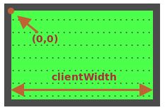

Míč má `position:absolute`. To znamená, že jeho souřadnice `left/top` se měří od nejbližšího umístěného elementu, kterým je `#hřiště` (protože má `position:relative`).

Souřadnice začínají od vnitřního levého horního rohu hřiště:



Vnitřní šířka/výška hřiště je obsažena v `clientWidth/clientHeight`. Střed hřiště má tedy souřadnice `(clientWidth/2, clientHeight/2)`.

...Jestliže však nastavíme `míč.style.left/top` na tyto hodnoty, nebude uprostřed hřiště celý míč, ale jeho levý horní roh:

```js
míč.style.left = Math.round(hřiště.clientWidth / 2) + 'px';
míč.style.top = Math.round(hřiště.clientHeight / 2) + 'px';
```

Vypadá to následovně:

[iframe height=180 src="ball-half"]

Abychom umístili střed míče do středu hřiště, měli bychom posunout míč o polovinu jeho šířky doleva a o polovinu jeho výšky nahoru:

```js
míč.style.left = Math.round(hřiště.clientWidth / 2 - míč.offsetWidth / 2) + 'px';
míč.style.top = Math.round(hřiště.clientHeight / 2 - míč.offsetHeight / 2) + 'px';
```

Nyní je míč konečně uprostřed.

````warn header="Pozor: chyták!"

Kód nebude správně fungovat, jestliže `` nebude mít žádnou šířku/výšku:

```html

```
````

Když prohlížeč nezná šířku a výšku obrázku (z atributů značky nebo z CSS), předpokládá, že jsou rovny `0`, dokud načítání obrázku neskončí.

Hodnota `míč.offsetWidth` tedy bude `0`, dokud se obrázek nenačte. To bude mít v uvedeném kódu za následek špatné souřadnice.

Po prvním načtení si prohlížeč obvykle uloží obrázek do vyrovnávací paměti a při jeho opětovném načtení bude znát velikost okamžitě. Avšak při prvním načtení bude hodnota `míč.offsetWidth` rovna `0`.

Měli bychom to opravit přidáním `width/height` do ``:

```html

```

...Nebo uvést velikost v CSS:

```css
#míč {
  width: 40px;
  height: 40px;
}
```
