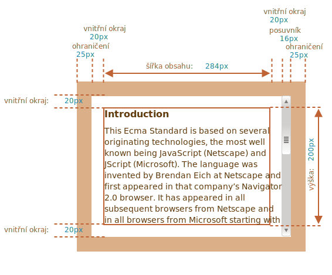
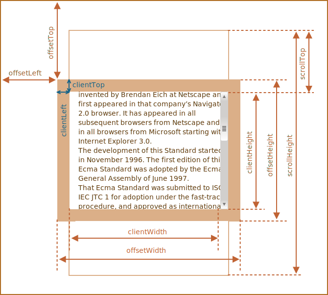
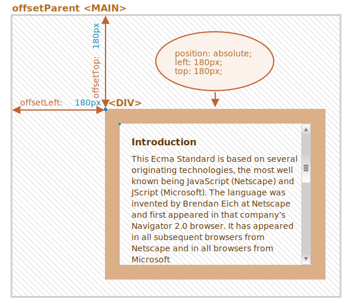
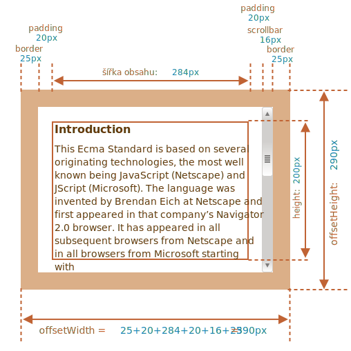
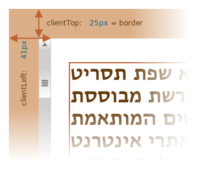
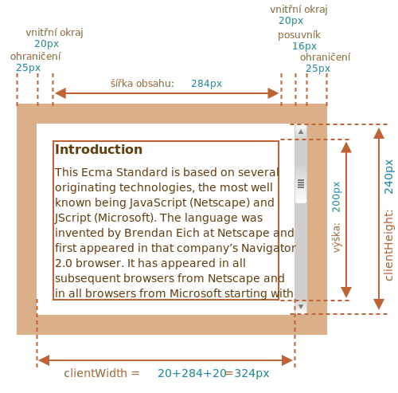
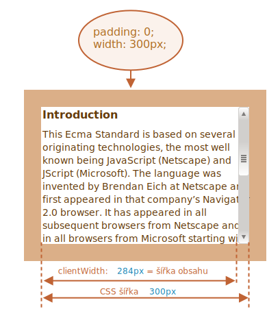
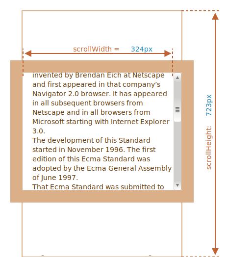
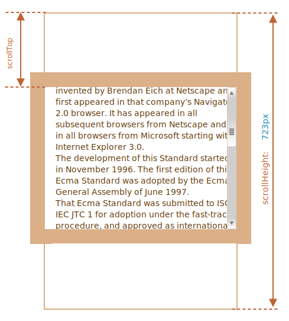

# Velikost a rolování elementu

JavaScript obsahuje mnoho vlastností, které nám umožňují načítat informace o šířce, výšce a jiných geometrických vlastnostech elementu.

Často je potřebujeme, když v JavaScriptu přemisťujeme nebo umisťujeme elementy.

## Ukázkový element

Jako ukázkový element, na němž budeme tyto vlastnosti předvádět, budeme používat následující element:

```html no-beautify
<div id="příklad">
  ...Text...
</div>
<style>
  #příklad {
    width: 300px;
    height: 200px;
    border: 25px solid #E8C48F;
    padding: 20px;
    overflow: auto;
  }
</style>
```

Má ohraničení (border), vnitřní okraje (padding) i rolování (scrolling), tedy celou sadu vlastností. Nejsou v něm vnější okraje (margin), jelikož ty nejsou součástí samotného elementu, a proto pro ně neexistují speciální vlastnosti.

Element vypadá takto:



Můžete si [otevřít dokument na pískovišti](sandbox:metric).

```smart header="Nezapomeňte na posuvník"
Uvedený obrázek zobrazuje nejsložitější případ, kdy element obsahuje posuvník. Některé prohlížeče (ne všechny) si pro něj rezervují místo, které berou z obsahu (na obrázku označeno jako „šířka obsahu“).

Bez posuvníku by tedy šířka obsahu byla `300px`, ale jestliže je šířka posuvníku `16px` (na různých zařízeních a prohlížečích se šířka může lišit), zbude jen `300 - 16 = 284px`, což bychom měli brát v úvahu. Proto příklady v této kapitole předpokládají, že element obsahuje posuvník. Bez něj jsou některé výpočty jednodušší.
```

```smart header="Oblast `padding-bottom` může být zaplněna textem"
Na našich obrázcích budou vnitřní okraje obvykle zobrazeny prázdné, ale pokud element obsahuje větší množství textu a ten přeteče, prohlížeč běžně zobrazuje „přetékající“ text v dolním vnitřním okraji `padding-bottom`.
```

## Geometrie

Následující obrázek obsahuje přehled všech geometrických vlastností:



Hodnoty těchto vlastností jsou technicky čísla, ale tato čísla jsou „v pixelech“, jsou to tedy pixelové míry.

Začněme tyto vlastnosti prozkoumávat od vnějšku elementu.

## offsetParent, offsetLeft/Top

Tyto vlastnosti jsou zapotřebí jen zřídka, ale jsou to ty „nejvíce vnější“ geometrické vlastnosti, proto začneme u nich.

Vlastnost `offsetParent` obsahuje nejbližšího předka, kterého prohlížeč používá k výpočtu souřadnic při vykreslování.

Je to nejbližší předek, který je jedním z následujících:

1. má umístění v CSS (`position` je `absolute`, `relative`, `fixed` nebo `sticky`), nebo
2. `<td>`, `<th>` nebo `<table>`,  nebo
3. `<body>`.

Vlastnosti `offsetLeft/offsetTop` poskytují souřadnice x/y vzhledem k levému hornímu rohu předka `offsetParent`.

V následujícím příkladu je `offsetParent` vnitřního `<div>` element `<main>` a `offsetLeft/offsetTop` se počítají od jeho levého horního rohu (`180`):

```html run height=10
<main style="position: relative" id="hlavní">
  <article>
    <div id="příklad" style="position: absolute; left: 180px; top: 180px">...</div>
  </article>
</main>
<script>
  alert(příklad.offsetParent.id); // hlavní
  alert(příklad.offsetLeft); // 180 (poznámka: je to číslo, ne řetězec "180px")
  alert(příklad.offsetTop); // 180
</script>
```



Je několik případů, kdy `offsetParent` je `null`:

1. U nezobrazených elementů (mají `display:none` nebo nejsou v dokumentu).
2. U `<body>` a `<html>`.
3. U elementů obsahujících `position:fixed`.

## offsetWidth/Height

Přejděme nyní k samotnému elementu.

Tyto dvě vlastnosti jsou nejjednodušší. Poskytují „vnější“ šířku/výšku elementu, nebo jinými slovy jeho úplnou velikost včetně ohraničení.



Pro náš ukázkový element:

- `offsetWidth = 390` -- vnější šířka, lze vypočítat jako vnitřní CSS šířka (`300px`) plus vnitřní okraje (`2 * 20px`) a ohraničení (`2 * 25px`).
- `offsetHeight = 290` -- vnější výška.

````smart header="U nezobrazených elementů jsou geometrické vlastnosti nulové nebo null"
Geometrické vlastnosti se počítají jen pro zobrazené elementy.

Jestliže element (nebo některý z jeho předků) má `display:none` nebo není v dokumentu, pak jsou všechny jeho geometrické vlastnosti nulové (nebo `null` v případě `offsetParent`).

Když jsme například vytvořili element, ale ještě jsme ho nevložili do dokumentu anebo tento element nebo některý z jeho předků má `display:none`, pak `offsetParent` je `null` a `offsetWidth`, `offsetHeight` jsou `0`.

Toho můžeme využít ke zjištění, zda element je skrytý, například takto:

```js
function jeSkrytý(elem) {
  return !elem.offsetWidth && !elem.offsetHeight;
}
```

Prosíme všimněte si, že taková funkce `jeSkrytý` vrací `true` i pro elementy, které jsou na obrazovce, ale jejich velikost je nulová.
````

## clientTop/Left

Uvnitř elementu máme ohraničení.

K jeho změření slouží vlastnosti `clientTop` a `clientLeft`.

V našem příkladu:

- `clientLeft = 25` -- šířka levého ohraničení
- `clientTop = 25` -- šířka horního ohraničení


...Abychom však byli přesní: tyto vlastnosti neobsahují šířku a výšku ohraničení, ale relativní souřadnice vnitřní části vzhledem k vnější části.

Jaký je v tom rozdíl?

Uvidíme jej, když budeme mít dokument čtený zprava doleva (operační systém je v arabském nebo hebrejském jazyce). Posuvník pak není napravo, ale nalevo a `clientLeft` pak zahrnuje i šířku posuvníku.

V takovém případě `clientLeft` nebude `25`, ale i se šířkou posuvníku `25 + 16 = 41`.

Příklad v hebrejštině:



## clientWidth/Height

Tyto vlastnosti poskytují velikost plochy ležící uvnitř ohraničení elementu.

Obsahují šířku obsahu společně s vnitřními okraji, ale bez posuvníku:



Na uvedeném obrázku se nejprve věnujme vlastnosti `clientHeight`.

Není tu vodorovný posuvník, takže je to přesně součet toho, co je uvnitř ohraničení: výška z CSS `200px` plus horní a dolní vnitřní okraj (`2 * 20px`), celkem `240px`.

Nyní `clientWidth` -- šířka obsahu zde není `300px`, ale `284px`, protože `16px` zabírá posuvník. Součet je tedy `284px` plus levý a pravý vnitřní okraj, celkem `324px`.

**Pokud element nemá vnitřní okraje, pak `clientWidth/Height` je přesně šířka a výška obsahu, ležícího uvnitř ohraničení a posuvníku (pokud tam nějaký je).**



Když tedy nemáme vnitřní okraje, můžeme použitím `clientWidth/clientHeight` zjistit velikost plochy obsahu.

## scrollWidth/Height

Tyto vlastnosti se podobají `clientWidth/clientHeight`, ale zahrnují i odrolované (skryté) části:



Na uvedeném obrázku:

- `scrollHeight = 723` -- je celá vnitřní výška plochy obsahu včetně odrolovaných částí.
- `scrollWidth = 324` -- je celá vnitřní šířka, vodorovné rolování zde nemáme, takže je rovna `clientWidth`.

Pomocí těchto vlastností můžeme zvětšit element na celou jeho šířku a výšku.

Třeba takto:

```js
// zvětšíme element na celou výšku jeho obsahu
element.style.height = `${element.scrollHeight}px`;
```

```online
Kliknutím na tlačítko zvětšíte element:

<div id="element" style="width:300px;height:200px; padding: 0;overflow: auto; border:1px solid black;">text text text text text text text text text text text text text text text text text text text text text text text text text text text text text text text text text text text text text text text text text text text text text text text text text text text text text text text text text text text text text text text text text text text text text text text text text text text text text text text text text text text text text text text text text text text text text text text text text text text text text text text text text text text text text text text text text text text text text text text text text text text text text text text text text text text text text text text text text text text text</div>

<button style="padding:0" onclick="element.style.height = `${element.scrollHeight}px`">element.style.height = `${element.scrollHeight}px`</button>
```

## scrollLeft/scrollTop

Vlastnosti `scrollLeft/scrollTop` jsou šířka/výška skryté, odrolované části elementu.

Na následujícím obrázku vidíme `scrollHeight` a `scrollTop` pro blok se svislým rolováním.



Jinými slovy, `scrollTop` udává, „kolik bylo odrolováno“.

````smart header="`scrollLeft/scrollTop` mohou být měněny"
Většina zde uvedených geometrických vlastností slouží pouze pro čtení, ale `scrollLeft/scrollTop` se dají měnit. Prohlížeč pak bude rolovat elementem.

```online
Jestliže kliknete na následující element, spustí se kód `elem.scrollTop += 10`, který způsobí, že obsah elementu odroluje o `10px` dolů.

<div onclick="this.scrollTop+=10" style="cursor:pointer;border:1px solid black;width:100px;height:80px;overflow:auto">Klikněte<br>sem<br>1<br>2<br>3<br>4<br>5<br>6<br>7<br>8<br>9</div>
```

Nastavení `scrollTop` na `0` nebo na obrovskou hodnotu, např. `1e9`, způsobí, že element odroluje až ke svému hornímu nebo dolnímu okraji.
````

## Nezjišťujte šířku a výšku z CSS

Právě jsme uvedli geometrické vlastnosti DOM elementů, pomocí nichž můžeme zjišťovat šířky a výšky a vypočítávat vzdálenosti.

Jak ale víme z kapitoly <info:styles-and-classes>, můžeme načítat CSS výšku a šířku funkcí `getComputedStyle`.

Proč tedy nenačíst šířku elementu funkcí `getComputedStyle`, například takto?

```js run
let elem = document.body;

alert( getComputedStyle(elem).width ); // zobrazí CSS šířku elementu
```

Proč bychom místo toho měli používat geometrické vlastnosti? Důvody jsou dva:

1. Za prvé, CSS vlastnosti `width/height` závisejí na jiné vlastnosti: `box-sizing`, která definuje, „co je“ CSS šířka a výška. Změna v `box-sizing` pro účely CSS může takový kód v JavaScriptu rozbít.
2. Za druhé, CSS vlastnosti `width/height` mohou být `auto`, například u elementu uvedeného přímo v HTML:

    ```html run
    <span id="elem">Ahoj!</span>

    <script>
    *!*
      alert( getComputedStyle(elem).width ); // auto
    */!*
    </script>
    ```
    
    Z pohledu CSS je `width:auto` zcela v pořádku, ale v JavaScriptu potřebujeme přesnou velikost v `px`, abychom ji mohli použít ve výpočtech. Zde nám tedy CSS šířka není k ničemu.

A existuje ještě jeden důvod: posuvník. Někdy kód, který bez posuvníku funguje správně, bude s posuvníkem dělat chyby, protože posuvník v některých prohlížečích zabírá místo z obsahu. Skutečná šířka dostupná pro obsah je tedy *menší* než CSS šířka. Vlastnosti `clientWidth/clientHeight` to berou v úvahu.

...Ale u `getComputedStyle(elem).width` je situace jiná. Některé prohlížeče (např. Chrome) vracejí skutečnou vnitřní šířku, od níž je odečten posuvník, zatímco jiné (např. Firefox) vracejí CSS šířku (a posuvník ignorují). Tyto rozdíly mezi prohlížeči jsou důvodem, proč nepoužívat `getComputedStyle`, ale spolehnout se na geometrické vlastnosti.

```online
Pokud si váš prohlížeč vyhrazuje místo pro posuvník (většina prohlížečů pro Windows to dělá), pak si to zde můžete otestovat.

[iframe src="cssWidthScroll" link border=1]

Element s textem má CSS `width:300px`.

V operačním systému Desktop Windows si Firefox, Chrome i Edge rezervují místo pro posuvník. Ale Firefox zobrazí `300px`, zatímco Chrome a Edge zobrazí méně. Je to proto, že Firefox vrací CSS šířku a ostatní prohlížeče vracejí „skutečnou“ šířku.
```

Prosíme všimněte si, že popsaný rozdíl má význam jen při načítání `getComputedStyle(...).width` v JavaScriptu, vizuálně je všechno v pořádku.

## Shrnutí

Elementy obsahují následující geometrické vlastnosti:

- `offsetParent` -- je nejbližší umístěný předek nebo `td`, `th`, `table`, `body`.
- `offsetLeft/offsetTop` -- souřadnice vzhledem k levému hornímu rohu předka `offsetParent`.
- `offsetWidth/offsetHeight` -- „vnější“ šířka/výška elementu včetně ohraničení.
- `clientLeft/clientTop` -- vzdálenosti od vnějšího levého/horního okraje k vnitřnímu (obsah + vnitřní okraje) levému/hornímu okraji. V OS čtených zleva doprava to jsou vždy šířky levých/horních ohraničení. V OS čtených zprava doleva je svislý posuvník nalevo, proto `clientLeft` zahrnuje i jeho šířku.
- `clientWidth/clientHeight` -- šířka/výška obsahu včetně vnitřních okrajů, ale bez posuvníku.
- `scrollWidth/scrollHeight` -- šířka/výška obsahu, podobně jako `clientWidth/clientHeight`, ale zahrnuje i odrolovanou, neviditelnou část elementu.
- `scrollLeft/scrollTop` -- šířka/výška odrolované horní části elementu od jeho levého horního rohu.

Všechny vlastnosti jsou pouze pro čtení s výjimkou `scrollLeft/scrollTop`, jejichž změna vyvolá rolování elementu.
