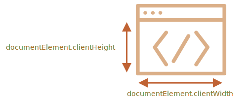

# Velikost a rolování okna

Jak zjistíme šířku a výšku okna prohlížeče? Jak získáme šířku a výšku celého dokumentu včetně odrolované části? Jak můžeme rolovat stránku v JavaScriptu?

Pro zjištění informací tohoto druhu můžeme použít kořenový element dokumentu `document.documentElement`, který odpovídá značce `<html>`. Jsou tady však i další metody a zvláštnosti, které bychom měli vzít v úvahu.

## Šířka a výška okna

K získání šířky a výšky okna můžeme použít vlastnosti `clientWidth/clientHeight` elementu `document.documentElement`:



```online
Například toto tlačítko zobrazí výšku vašeho okna:

<button onclick="alert(document.documentElement.clientHeight)">alert(document.documentElement.clientHeight)</button>
```

````warn header="Nepoužívejte `window.innerWidth/innerHeight`"
Prohlížeče podporují i vlastnosti jako `window.innerWidth/innerHeight`. Vypadají jako ty, které chceme, tak proč bychom je neměli použít?

Jestliže v dokumentu je posuvník a zabírá nějaké místo, pak `clientWidth/clientHeight` poskytují šířku/výšku bez něj (odečítají jej). Jinými slovy, vracejí šířku/výšku viditelné části dokumentu, která je dostupná pro obsah.

`window.innerWidth/innerHeight` zahrnují i posuvník.

Pokud je v dokumentu posuvník a zabírá nějaké místo, následující dva řádky zobrazí různé hodnoty:
```js run
alert( window.innerWidth ); // šířka celého okna
alert( document.documentElement.clientWidth ); // šířka okna minus šířka posuvníku
```

Ve většině případů potřebujeme znát šířku *dostupného* okna, abychom mohli něco nakreslit nebo umístit uvnitř posuvníků (pokud tam nějaké jsou), takže bychom měli použít `documentElement.clientHeight/clientWidth`.
````

```warn header="`DOCTYPE` je důležité"
Prosíme všimněte si, že geometrické vlastnosti na nejvyšší úrovni mohou fungovat trochu jinak, když v HTML kódu není `<!DOCTYPE HTML>`. Může dojít k podivnému chování.

V moderním HTML bychom `DOCTYPE` měli vždy psát.
```

## Šířka a výška dokumentu

Když je kořenový element dokumentu `document.documentElement` a uzavírá všechen obsah, teoreticky bychom mohli změřit velikost celého dokumentu pomocí `document.documentElement.scrollWidth/scrollHeight`.

Avšak na tomto elementu, pro celou stránku, tyto vlastnosti nefungují tak, jak zamýšlíme. V Chrome/Safari/Opeře, pokud není rolování, pak `documentElement.scrollHeight` může být dokonce menší než `documentElement.clientHeight`! Podivné, že?

Abychom spolehlivě zjistili výšku celého dokumentu, měli bychom vzít maximum z těchto vlastností:

```js run
let výškaSRolováním = Math.max(
  document.body.scrollHeight, document.documentElement.scrollHeight,
  document.body.offsetHeight, document.documentElement.offsetHeight,
  document.body.clientHeight, document.documentElement.clientHeight
);

alert('Výška celého dokumentu včetně odrolované části: ' + výškaSRolováním);
```

Proč tomu tak je? Raději se neptejte. Tyto nekonzistence pocházejí z dřívější doby, není to „chytrá“ logika.

## Zjištění aktuální velikosti rolování [#page-scroll]

DOM elementy obsahují svou aktuální velikost posunu ve vlastnostech `scrollLeft/scrollTop`.

Pro rolování dokumentu funguje `document.documentElement.scrollLeft/scrollTop` ve většině prohlížečů kromě starších založených na WebKitu, např. Safari (chyba [5991](https://bugs.webkit.org/show_bug.cgi?id=5991)), kde bychom místo `document.documentElement` měli používat `document.body`.

Naštěstí si tyto zvláštnosti nemusíme vůbec pamatovat, neboť velikost posunu je k dispozici ve speciálních vlastnostech `window.pageXOffset/pageYOffset`:

```js run
alert('Aktuální odrolování shora: ' + window.pageYOffset);
alert('Aktuální odrolování zleva: ' + window.pageXOffset);
```

Tyto vlastnosti jsou pouze pro čtení.

```smart header="Jsou k dispozici i jako vlastnosti `scrollX` a `scrollY` objektu `window`"
Z historických důvodů existují obě vlastnosti, ale jsou stejné:
- `window.pageXOffset` je totéž jako `window.scrollX`.
- `window.pageYOffset` je totéž jako `window.scrollY`.
```

## Rolování: scrollTo, scrollBy, scrollIntoView [#window-scroll]

```warn
Abychom mohli rolovat stránku v JavaScriptu, musí být vytvořen celý její DOM.

Pokud se například pokusíme rolovat stránku skriptem v `<head>`, nebude to fungovat.
```

Běžné elementy můžeme rolovat tak, že měníme vlastnosti `scrollTop/scrollLeft`.

Se stránkou můžeme udělat totéž pomocí `document.documentElement.scrollTop/scrollLeft` (s výjimkou Safari, v němž bychom místo toho měli použít `document.body.scrollTop/Left`).

Alternativně je tady jednodušší a univerzální řešení: speciální metody [window.scrollBy(x,y)](mdn:api/Window/scrollBy) a [window.scrollTo(pageX,pageY)](mdn:api/Window/scrollTo).

- Metoda `scrollBy(x,y)` roluje stránku *relativně vzhledem k její aktuální pozici*. Například `scrollBy(0,10)` odroluje stránku o `10px` dolů.

    ```online
    Předvádí to následující tlačítko:

    <button onclick="window.scrollBy(0,10)">window.scrollBy(0,10)</button>
    ```
- Metoda `scrollTo(stránkaX,stránkaY)` roluje stránku *na absolutní souřadnice*, tedy tak, aby levý horní roh viditelné stránky měl vzhledem k levému hornímu rohu dokumentu souřadnice `(stránkaX, stránkaY)`. Podobá se to nastavení `scrollLeft/scrollTop`.

    K rolování na samotný začátek můžeme použít `scrollTo(0,0)`.

    ```online
    <button onclick="window.scrollTo(0,0)">window.scrollTo(0,0)</button>
    ```

Tyto metody fungují ve všech prohlížečích stejně.

## scrollIntoView

Pro úplnost uveďme ještě jednu metodu: [elem.scrollIntoView(nahoru)](mdn:api/Element/scrollIntoView).

Volání `elem.scrollIntoView(nahoru)` roluje stránku tak, aby byl `elem` viditelný. Má jeden argument:

- Je-li `nahoru=true` (standardně), pak stránka bude odrolována tak, aby se `elem` objevil v okně nahoře. Horní okraj elementu bude zarovnán s horním okrajem okna.
- Je-li `nahoru=false`, pak stránka bude odrolována tak, aby se `elem` objevil v okně dole. Dolní okraj elementu bude zarovnán s dolním okrajem okna.

```online
Následující tlačítko odroluje stránku tak, aby se ocitlo na vrchu okna:

<button onclick="this.scrollIntoView()">this.scrollIntoView()</button>

A následující tlačítko ji odroluje tak, aby se ocitlo na spodku okna:

<button onclick="this.scrollIntoView(false)">this.scrollIntoView(false)</button>
```

## Zákaz rolování

Někdy potřebujeme rolování v dokumentu znemožnit. Například tehdy, když potřebujeme překrýt stránku velkou zprávou, která vyžaduje okamžitou pozornost, a chceme, aby návštěvník komunikoval se zprávou a ne s dokumentem.

Abychom znemožnili rolování dokumentu, stačí nastavit `document.body.style.overflow = "hidden"`. Stránka pak „zamrzne“ na své momentální rolovací pozici.

```online
Zkuste si to:

<button onclick="document.body.style.overflow = 'hidden'">document.body.style.overflow = 'hidden'</button>

<button onclick="document.body.style.overflow = ''">document.body.style.overflow = ''</button>

První tlačítko znemožní rolování, druhé je zase umožní.
```

Stejnou techniku můžeme použít k zákazu rolování i u jiných elementů, nejen u `document.body`.

Nevýhodou této metody je, že posuvník zmizí. Pokud zabíral místo, pak se toto místo uvolní a obsah „poskočí“, aby je vyplnil.

Vypadá to trochu divně, ale dá se to obejít, jestliže porovnáme `clientWidth` před a po zamrznutí. Pokud se zvýšila (posuvník zmizel), pak místo posuvníku přidáme `padding` do `document.body`, abychom udrželi šířku obsahu stejnou.

## Shrnutí

Geometrie:

- Šířka/výška viditelné části dokumentu (šířka/výška plochy obsahu): `document.documentElement.clientWidth/clientHeight`
- Šířka/výška celého dokumentu včetně odrolované části:

    ```js
    let výškaSRolováním = Math.max(
      document.body.scrollHeight, document.documentElement.scrollHeight,
      document.body.offsetHeight, document.documentElement.offsetHeight,
      document.body.clientHeight, document.documentElement.clientHeight
    );
    ```

Rolování:

- Načtení aktuální velikosti rolování: `window.pageYOffset/pageXOffset`.
- Změna aktuální velikosti rolování:

    - `window.scrollTo(stránkaX,stránkaY)` -- absolutní souřadnice,
    - `window.scrollBy(x,y)` -- rolování vzhledem k aktuálnímu místu,
    - `elem.scrollIntoView(nahoru)` -- rolování tak, aby byl vidět `elem` (zarovná se k hornímu/dolnímu okraji okna).
