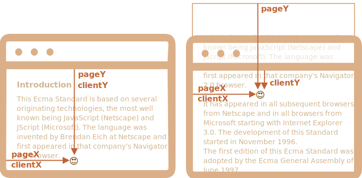
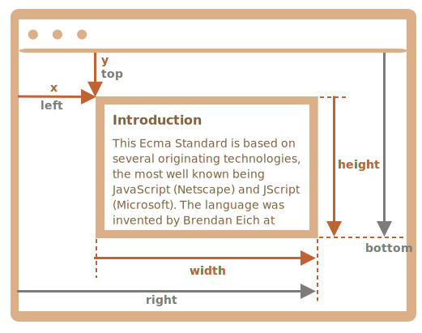
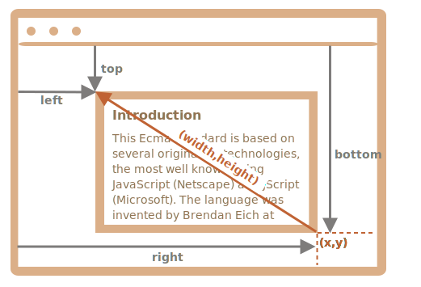

# Souřadnice

Abychom mohli přesunovat elementy, měli bychom se seznámit se souřadnicemi.

Většina metod v JavaScriptu pracuje s jednou ze dvou souřadnicových soustav:

1. **Relativní vzhledem k oknu (okenní)** -- podobné `position:fixed`, počítají se od horního/levého okraje okna.
    - tyto souřadnice budeme označovat `clientX/clientY`, důvod takového značení nám bude jasný později, až prostudujeme vlastnosti událostí.
2. **Relativní vzhledem k dokumentu (dokumentové)** -- podobné `position:absolute` v kořenovém dokumentu, počítají se od horního/levého okraje dokumentu.
    - budeme je označovat `pageX/pageY`.

Když je stránka odrolována na samotný začátek, takže levý horní roh okna se shoduje s levým horním rohem dokumentu, tyto souřadnice se navzájem rovnají. Jakmile se však dokument posune, okenní souřadnice elementů se s pohybem elementů v okně změní, ale dokumentové souřadnice zůstanou stejné.

Na následujícím obrázku si vezmeme bod v dokumentu a ukážeme si jeho souřadnice před rolováním (vlevo) a po něm (vpravo):



Po rolování dokumentu:
- `pageY` - dokumentová souřadnice zůstala stejná, počítá se od vrchu dokumentu (ten je nyní odrolován).
- `clientY` - okenní souřadnice se změnila (šipka se zkrátila), protože bod se přiblížil k vrchu okna.

## Souřadnice elementů: getBoundingClientRect

Metoda `elem.getBoundingClientRect()` vrací okenní souřadnice nejmenšího možného obdélníku, který obsahuje celý `elem`, jako objekt vestavěné třídy [DOMRect](https://www.w3.org/TR/geometry-1/#domrect).

Hlavní vlastnosti třídy `DOMRect`:

- `x/y` -- souřadnice X/Y obdélníku vzhledem k oknu,
- `width/height` -- šířka/výška obdélníku (může být záporná).

Navíc existují i odvozené vlastnosti:

- `top/bottom` -- souřadnice Y horního/dolního okraje obdélníku,
- `left/right` -- souřadnice X levého/pravého okraje obdélníku.

```online
Například kliknutím na následující tlačítko zobrazíte jeho okenní souřadnice:

<p><input id="brTest" type="button" style="max-width: 90vw;" value="Zjistit souřadnice tohoto tlačítka pomocí button.getBoundingClientRect()" onclick='zobrazObdélník(this)'/></p>

<script>
function zobrazObdélník(elem) {
  let r = elem.getBoundingClientRect();
  alert(`x:${r.x}
y:${r.y}
width:${r.width}
height:${r.height}
top:${r.top}
bottom:${r.bottom}
left:${r.left}
right:${r.right}
`);
}
</script>

Jestliže stránkou porolujete a stisknutí zopakujete, všimnete si, že když se změnila pozice tlačítka vzhledem k oknu, změnily se i jeho okenní souřadnice (`y/top/bottom`, pokud rolujete svisle).
```

Následující obrázek ukazuje výstup metody `elem.getBoundingClientRect()`:



Jak vidíte, obdélník plně popisují `x/y` a `width/height`. Odvozené vlastnosti z nich lze snadno vypočítat:

- `left = x`
- `top = y`
- `right = x + width`
- `bottom = y + height`

Prosíme všimněte si:

- Souřadnice mohou být desetinná čísla, např. `10.5`. To se běžně stává, prohlížeč vnitřně počítá s desetinnými čísly. Nemusíme je zaokrouhlovat, když nastavujeme `style.left/top`.
- Souřadnice mohou být záporné. Když je například stránka odrolována tak, že `elem` je nyní nad oknem, pak `elem.getBoundingClientRect().top` je záporná.

```smart header="K čemu jsou potřeba odvozené souřadnice? Proč existují `top/left`, když už máme `x/y`?"
Matematicky je obdélník jednoznačně definován svým počátečním bodem `(x,y)` a směrovým vektorem `(width,height)`. Další odvozené vlastnosti jsou tady pro usnadnění.

Technicky `width/height` mohou být záporné, což umožňuje „orientovaný“ obdélník, například aby reprezentoval výběr myší, který má správně označen začátek a konec.

Záporné hodnoty `width/height` znamenají, že obdélník začíná v pravém dolním rohu a pak „vyrůstá“ doleva a nahoru.

Tento obdélník má zápornou šířku `width` a výšku `height` (např. `width=-200`, `height=-100`):



Jak vidíte, `left/top` se v takovém případě nerovnají `x/y`.

V praxi však `elem.getBoundingClientRect()` vždy vrací kladnou šířku a výšku. Záporné hodnoty `width/height` zde zmiňujeme jen proto, abyste pochopili, proč tyto zdánlivě duplicitní vlastnosti ve skutečnosti duplicitní nejsou.
```

```warn header="Internet Explorer nepodporuje `x/y`"
Internet Explorer z historických důvodů nepodporuje `x/y`.

Můžeme tedy buď vytvořit polyfill (přidat gettery do `DomRect.prototype`), nebo jednoduše použít `top/left`, protože ty jsou při kladných hodnotách `width/height`, tedy ve výsledku `elem.getBoundingClientRect()`, vždy stejné jako `x/y`.
```

```warn header="Souřadnice right/bottom se liší od pozičních vlastností CSS"
Mezi okenními souřadnicemi a `position:fixed` v CSS existují zjevné podobnosti.

Ale v umisťování v CSS vlastnost `right` znamená vzdálenost od pravého okraje a vlastnost `bottom` znamená vzdálenost od dolního okraje.

Podíváme-li se na výše uvedený obrázek, vidíme, že v JavaScriptu tomu tak není. Všechny okenní souřadnice včetně těchto dvou se počítají od levého horního rohu.
```

## elementFromPoint(x, y) [#elementFromPoint]

Volání `document.elementFromPoint(x, y)` vrátí nejvnořenější element na okenních souřadnicích `(x, y)`.

Jeho syntaxe je:

```js
let elem = document.elementFromPoint(x, y);
```

Například následující kód zvýrazní a vypíše značku elementu, který je zrovna přesně uprostřed okna:

```js run
let středX = document.documentElement.clientWidth / 2;
let středY = document.documentElement.clientHeight / 2;

let elem = document.elementFromPoint(středX, středY);

elem.style.background = "red";
alert(elem.tagName);
```

Protože používá okenní souřadnice, element může být pokaždé jiný v závislosti na aktuální poloze rolování.

````warn header="Pro souřadnice mimo okno `elementFromPoint` vrací `null`"
Metoda `document.elementFromPoint(x,y)` funguje jen tehdy, jsou-li `(x,y)` uvnitř viditelné oblasti.

Jestliže je některá z těchto souřadnic záporná nebo překračuje šířku či výšku okna, pak metoda vrátí `null`.

Toto je typická chyba, která může nastat, pokud si to nezkontrolujeme:

```js
let elem = document.elementFromPoint(x, y);
// pokud se stane, že souřadnice jsou mimo okno, pak elem = null
*!*
elem.style.background = ''; // Chyba!
*/!*
```
````

## Použití pro umisťování „fixed“

Ve většině případů potřebujeme souřadnice k tomu, abychom něco někam umístili.

Abychom něco zobrazili v blízkosti nějakého elementu, můžeme pomocí `getBoundingClientRect` zjistit jeho souřadnice a pak to umístit pomocí CSS atributu `position` společně s `left/top` (nebo `right/bottom`).

Například následující funkce `vytvořZprávuPod(elem, html)` zobrazí zprávu pod elementem `elem`:

```js
let elem = document.getElementById("coords-show-mark");

function vytvořZprávuPod(elem, html) {
  // vytvoření elementu zprávy
  let zpráva = document.createElement('div');
  // zde by bylo lepší pro styl použít CSS třídu
  zpráva.style.cssText = "position:fixed; color: red";

*!*
  // přiřazení souřadnic, nezapomeňte na "px"!
  let souřadnice = elem.getBoundingClientRect();

  zpráva.style.left = souřadnice.left + "px";
  zpráva.style.top = souřadnice.bottom + "px";
*/!*

  zpráva.innerHTML = html;

  return zpráva;
}

// Použití:
// přidáme ji do dokumentu na dobu 5 sekund
let zpráva = vytvořZprávuPod(elem, 'Ahoj, světe!');
document.body.append(zpráva);
setTimeout(() => zpráva.remove(), 5000);
```

```online
Kliknutím na následující tlačítko ji spustíte:

<button id="coords-show-mark">Tlačítko s id="coords-show-mark", zpráva se objeví pod ním</button>
```

Kód můžeme upravit tak, aby zprávu zobrazil vlevo, vpravo, níže, pomocí CSS animací ji nechal „vyblednout“ a podobně. Když známe souřadnice a velikost elementu, je to snadné.

Všimněte si však důležitého detailu: když je stránka rolována, zpráva se vzdálí od tlačítka.

Důvod je zřejmý: element zprávy má `position:fixed`, takže když stránka roluje, zpráva zůstává stále na stejném místě okna.

Abychom to změnili, musíme použít dokumentové souřadnice a `position:absolute`.

## Dokumentové souřadnice [#getCoords]

Dokumentové souřadnice začínají od levého horního rohu dokumentu, ne okna.

V CSS okenní souřadnice odpovídají `position:fixed`, zatímco dokumentové souřadnice se podobají `position:absolute` na vrchu.

Pomocí `position:absolute` a `top/left` můžeme něco umístit na určité místo dokumentu tak, aby to tam při rolování stránky zůstalo. Napřed však potřebujeme správné souřadnice.

Pro získání dokumentových souřadnic elementu neexistuje žádná standardní metoda, ale je snadné ji napsat.

Obě souřadnicové soustavy jsou propojeny těmito vzorci:
- `pageY` = `clientY` + výška odrolované svislé části dokumentu.
- `pageX` = `clientX` + šířka odrolované vodorovné části dokumentu.

Funkce `vraťSouřadnice(elem)` vezme okenní souřadnice z `elem.getBoundingClientRect()` a přičte k nim aktuální délku odrolování:

```js
// získá dokumentové souřadnice elementu
function vraťSouřadnice(elem) {
  let box = elem.getBoundingClientRect();

  return {
    top: box.top + window.pageYOffset,
    right: box.right + window.pageXOffset,
    bottom: box.bottom + window.pageYOffset,
    left: box.left + window.pageXOffset
  };
}
```

Pokud ji ve výše uvedeném příkladu použijeme spolu s `position:absolute`, pak zpráva zůstane vedle elementu i při rolování.

Upravená funkce `vytvořZprávuPod`:

```js
function vytvořZprávuPod(elem, html) {
  let zpráva = document.createElement('div');
  zpráva.style.cssText = "*!*position:absolute*/!*; color: red";

  let souřadnice = *!*vraťSouřadnice(elem);*/!*

  zpráva.style.left = souřadnice.left + "px";
  zpráva.style.top = souřadnice.bottom + "px";

  zpráva.innerHTML = html;

  return zpráva;
}
```

## Shrnutí

Každý bod na stránce má souřadnice:

1. Relativní vzhledem k oknu (okenní) -- `elem.getBoundingClientRect()`.
2. Relativní vzhledem k dokumentu (dokumentové) -- `elem.getBoundingClientRect()` plus aktuální délka odrolování stránky.

Okenní souřadnice se výborně používají spolu s `position:fixed` a dokumentové souřadnice se dobře hodí k `position:absolute`.

Obě souřadnicové soustavy mají své výhody a nevýhody; někdy potřebujeme jednu, jindy zase druhou, stejně jako CSS atribut `position` `absolute` a `fixed`.
