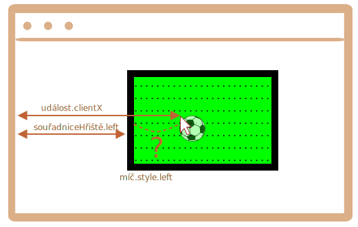

Nejprve si musíme vybrat, jakým způsobem umístíme míč.

Nemůžeme pro něj použít `position:fixed`, protože při rolování stránky by se míč přemístil ven z hřiště.

Měli bychom tedy použít `position:absolute`, a aby bylo umístění skutečně pevné, umístit i samotné `hřiště`.

Pak bude míč umístěn relativně vzhledem k hřišti:

```css
#hřiště {
  width: 200px;
  height: 150px;
  position: relative;
}

#míč {
  position: absolute;
  left: 0; /* relativně k nejbližšímu umístěnému předkovi (hřiště) */
  top: 0;
  transition: 1s all; /* CSS animace pro levý/horní roh způsobí, že míč bude létat */
}
```

Nyní musíme přiřadit správné hodnoty vlastnostem `míč.style.left/top`, které nyní obsahují souřadnice relativní vzhledem k hřišti.

Zde je obrázek:



Máme `událost.clientX/clientY` -- souřadnice kliknutí vzhledem k oknu.

Abychom získali souřadnici kliknutí `levá` vzhledem k hřišti, můžeme odečíst šířku levého okraje hřiště a ohraničení:

```js
let levá = událost.clientX - souřadniceHřiště.left - hřiště.clientLeft;
```

Normálně `míč.style.left` znamená „levý okraj elementu“ (míče). Kdybychom tedy přiřadili tuto hodnotu `levá`, pak by pod ukazatelem myši byl okraj míče, ne jeho střed.

Abychom míč vycentrovali, musíme jej přesunout o polovinu šířky doleva a polovinu výšky nahoru.

Výsledná `levá` tedy bude:

```js
let levá = událost.clientX - souřadniceHřiště.left - hřiště.clientLeft - míč.offsetWidth/2;
```

Vertikální souřadnici vypočítáme stejnou logikou.

Prosíme všimněte si, že šířka a výška míče musí být známa ve chvíli, kdy přistoupíme k `míč.offsetWidth`. Měla by být uvedena v HTML nebo CSS.
