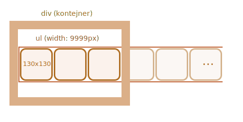
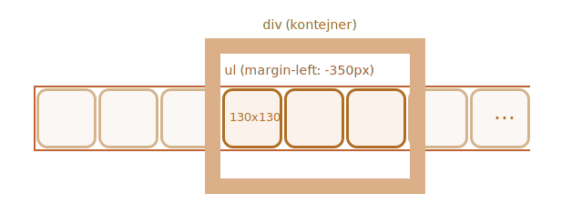

Pás obrázků můžeme reprezentovat jako seznam `ul/li` obrázků ``.

Normálně by takový pás byl široký, ale umístíme kolem něj `
` s pevnou velikostí, abychom jej „odřízli“, takže bude vidět jen část pásu:

Aby se seznam zobrazil vodorovně, musíme na `<li>` aplikovat správné CSS vlastnosti, např. `display: inline-block`.

U `` bychom také měli pozměnit `display`, neboť standardně je `inline`. Pod `inline` elementy je rezervován prostor navíc pro „ocásky pod písmeny“, takže ho můžeme odstranit pomocí `display:block`.

Abychom provedli rolování, můžeme posunout `<ul>`. To lze udělat mnoha způsoby, například změnou `margin-left` nebo (pro lepší výkon) použít `transform: translateX()`:

Vnější `
` má pevnou šířku, takže „extra“ obrázky budou odříznuty.

Celý kolotoč je samostatná „grafická komponenta“ na stránce, takže je lepší ho zabalit do jediného `
` a nastavovat styly věcí, které jsou uvnitř.
