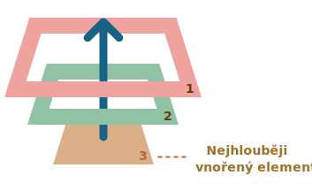
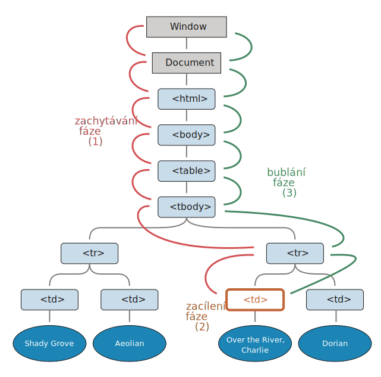

# Bublání a zachytávání

Začněme příkladem.

Tento handler je přiřazen elementu `<div>`, ale spustí se i tehdy, když kliknete na kteroukoli vnořenou značku, např. `<em>` nebo `<code>`:

```html autorun height=60
<div onclick="alert('Handler!')">
  <em>Pokud kliknete na <code>EM</code>, handler na <code>DIV</code> se spustí.</em>
</div>
```

Není to trochu divné? Proč se handler na `<div>` spustí, když ve skutečnosti bylo kliknuto na `<em>`?

## Bublání

Princip bublání je jednoduchý.

**Když se na elementu stane nějaká událost, nejprve se spustí handlery na něm, pak na jeho rodiči, pak směrem nahoru na ostatních předcích.**

Řekněme, že máme tři vnořené elementy `FORM > DIV > P` a na každém z nich je handler:

```html run autorun
<style>
  body * {
    margin: 10px;
    border: 1px solid blue;
  }
</style>

<form onclick="alert('form')">FORM
  <div onclick="alert('div')">DIV
    <p onclick="alert('p')">P</p>
  </div>
</form>
```

Kliknutí na vnitřní `<p>` nejprve spustí `onclick`:
1. Na tomto `<p>`.
2. Pak na vnějším `<div>`.
3. Pak na vnějším `<form>`.
4. A tak dále nahoru až k objektu `document`.



Když tedy klikneme na `<p>`, uvidíme 3 zprávy: `p` -> `div` -> `form`.

Tento proces se nazývá „bublání“, jelikož události „bublají“ od vnitřního elementu nahoru skrz jeho rodiče jako bublina ve vodě.

```warn header="*Téměř* všechny události bublají."
Klíčovým slovem v této větě je „téměř“.

Například událost `focus` nebublá. Jsou i jiné příklady, setkáme se s nimi. Je to však stále spíše výjimka než pravidlo, většina událostí bublá.
```

## událost.target

Handler na rodičovském elementu může vždy získat podrobnosti o tom, kde se událost doopravdy stala.

**Nejhlouběji vnořený element, který vyvolal událost, se nazývá *cílový* element a je dostupný jako `událost.target`.**

Všimněte si rozdílů oproti `this` (=`událost.currentTarget`):

- `událost.target` -- je „cílový“ element, který vyvolal událost, a během procesu bublání se nemění.
- `this` -- je „aktuální“ element, ten, na kterém je umístěn právě běžící handler.

Jestliže například máme jediný handler `form.onclick`, pak může „zachytávat“ všechna kliknutí uvnitř formuláře. Ať ke kliknutí došlo kdekoli, probublá až nahoru do `<form>` a spustí handler.

V handleru `form.onclick`:

- `this` (=`událost.currentTarget`) je element `<form>`, protože handler byl spuštěn na něm.
- `událost.target` je aktuální element uvnitř formuláře, na který bylo kliknuto.

Zkuste si to:

[codetabs height=220 src="bubble-target"]

Může se stát, že `událost.target` se rovná `this` -- to se stane tehdy, když je kliknuto přímo na element `<form>`.

## Zastavení bublání

Bublající událost stoupá od cílového elementu přímo nahoru. Běžně dojde nahoru až k `<html>`, pak k objektu `document` a některé události dosáhnou až k `window`, přičemž volají všechny handlery po cestě.

Libovolný handler však může rozhodnout, že událost již byla zcela zpracována, a bublání zastavit.

K tomu slouží metoda `událost.stopPropagation()`.

Například zde `body.onclick` nebude fungovat, když kliknete na tlačítko `<button>`:

```html run autorun height=60
<body onclick="alert(`sem se bublání nedostane`)">
  <button onclick="event.stopPropagation()">Klikni na mě</button>
</body>
```

```smart header="událost.stopImmediatePropagation()"
Jestliže element má pro jednu událost více handlerů, pak i když jeden z nich zastaví bublání, ostatní se stále spustí.

Jinými slovy, `událost.stopPropagation()` zastaví pohyb vzhůru, ale na aktuálním elementu se všechny ostatní handlery spustí.

K zastavení bublání a zabránění spuštění handlerů na aktuálním elementu slouží metoda `událost.stopImmediatePropagation()`. Po ní se už žádné další handlery nespustí.
```

```warn header="Nezastavujte bublání, pokud to není třeba!"
Bublání je užitečné. Nezastavujte je, pokud k tomu nemáte skutečný, očividný a dobře architekturálně promyšlený důvod.

Někdy `událost.stopPropagation()` vytvoří skryté chytáky, které později mohou působit problémy.

Příklad:

1. Vytvoříme vnořené menu. Každé submenu ošetřuje kliknutí na své elementy a volá `stopPropagation`, aby se vnější menu nespustilo.
2. Později se rozhodneme zachytávat klikání na celé okno, abychom sledovali chování uživatelů (kam lidé klikají). Některé analytické systémy to dělají. Kód obvykle k zachycení všech kliknutí používá `document.addEventListener('click'…)`.
3. Naše analýza však nebude fungovat v oblastech, kde jsou kliknutí zastavena metodou `stopPropagation`. Naneštěstí jsme vytvořili „mrtvou zónu“.

Obvykle není ve skutečnosti nutné bránit v bublání. Úloha, která to zdánlivě vyžaduje, může být vyřešena jinak. Jednou z možností je použít vlastní události, probereme je později. Navíc si do objektu `událost` můžeme v jednom handleru zapsat naše data a v jiném je načíst, takže do handlerů na rodičích můžeme předávat informace o zpracování v potomcích.
```


## Zachytávání

Existuje i další fáze zpracování událostí, která se nazývá „zachytávání“. Ve skutečném kódu se používá málokdy, ale občas může být užitečná.

Standard [DOM Events](https://www.w3.org/TR/DOM-Level-3-Events/) popisuje tři fáze průběhu události:

1. Fáze zachytávání (capturing) -- událost prochází dolů k elementu.
2. Fáze zacílení (target) -- událost dosáhla cílového elementu.
3. Fáze bublání (bubbling) -- událost bublá vzhůru od elementu.

Následující obrázek, převzatý ze specifikace, ukazuje fázi zachytávání `(1)`, zacílení `(2)` a bublání `(3)` události kliknutí na `<td>` v tabulce:



Tedy: při kliknutí na `<td>` událost napřed prochází řetězem předků až dolů k elementu (fáze zachytávání), pak dosáhne cíle a tam se spustí (fáze zacílení) a pak stoupá vzhůru (fáze bublání), přičemž po cestě volá handlery.

Dosud jsme hovořili jen o bublání, neboť fáze zachytávání se používá zřídkakdy.

Ve skutečnosti je pro nás fáze zachytávání neviditelná, jelikož handlery přidané pomocí vlastnosti `on<událost>`, prostřednictvím HTML atributů nebo voláním `addEventListener(událost, handler)` se dvěma argumenty o zachytávání nic nevědí, spouštějí se až ve 2. a 3. fázi.

Abychom zachytili událost ve fázi zachytávání, musíme nastavit možnost `capture` handleru na `true`:

```js
elem.addEventListener(..., {capture: true})

// nebo jen "true", což je totéž jako {capture: true}
elem.addEventListener(..., true)
```

Možnost `capture` může mít jednu ze dvou hodnot:

- Pokud je `false` (standardně), pak se handler nastaví pro fázi bublání.
- Pokud je `true`, pak se handler nastaví pro fázi zachytávání.

Všimněte si, že ačkoli formálně existují 3 fáze, druhá fáze („fáze cílování“: událost dosáhla elementu) není zpracována odděleně: v této fázi se spouštějí handlery z fáze zachytávání i z fáze bublání.

Podívejme se na zachytávání i bublání v akci:

```html run autorun height=140 edit
<style>
  body * {
    margin: 10px;
    border: 1px solid blue;
  }
</style>

<form>FORM
  <div>DIV
    <p>P</p>
  </div>
</form>

<script>
  for(let elem of document.querySelectorAll('*')) {
    elem.addEventListener("click", e => alert(`Zachytávání: ${elem.tagName}`), true);
    elem.addEventListener("click", e => alert(`Bublání: ${elem.tagName}`));
  }
</script>
```

Kód nastaví handlery kliknutí na *každém* elementu v dokumentu, abychom viděli, které z nich se spustí.

Pokud kliknete na `<p>`, pak sekvence je následující:

1. `HTML` -> `BODY` -> `FORM` -> `DIV -> P` (fáze zachytávání, první posluchač);
2. `P` -> `DIV` -> `FORM` -> `BODY` -> `HTML` (fáze bublání, druhý posluchač).

Prosíme všimněte si, že `P` se zobrazí dvakrát, protože jsme nastavili dva posluchače: pro zachytávání a pro bublání. Cíl se spustí na konci první a na začátku druhé fáze.

Existuje vlastnost `událost.eventPhase`, která nám sděluje číslo fáze, v níž byla událost zachycena. Používá se však jen málokdy, protože v handleru už obvykle fázi známe.

```smart header="Pro odstranění handleru `removeEventListener` potřebuje stejnou fázi"
Pokud nastavíme `addEventListener(..., true)`, měli bychom v `removeEventListener(..., true)` uvést stejnou fázi, abychom handler korektně odstranili.
```

````smart header="Posluchače na stejném elementu ve stejné fázi se spustí v pořadí svého nastavení"
Přiřadíme-li stejnému elementu pomocí `addEventListener` více handlerů události pro stejnou fázi, pak se tyto handlery spustí ve stejném pořadí, v jakém byly vytvořeny:

```js
elem.addEventListener("click", e => alert(1)); // zaručeně se spustí první
elem.addEventListener("click", e => alert(2));
```
````

```smart header="Metoda `událost.stopPropagation()` při zachytávání zastaví i bublání"
Metoda `událost.stopPropagation()` a její sourozenec `událost.stopImmediatePropagation()` mohou být volány i ve fázi zachytávání. Pak se zastaví nejen další zachytávání, ale i bublání.

Jinými slovy, běžně událost prochází napřed směrem dolů („zachytávání“) a pak nahoru („bublání“). Pokud je však během fáze zachytávání volána `událost.stopPropagation()`, pak se průběh události zastaví a k bublání nedojde.
```


## Shrnutí

Když se stane událost, nejhlouběji vnořený element, na němž se stala, se nazývá „cílový element“ (`událost.target`).

- Pak se událost přesunuje směrem dolů od kořenového dokumentu k `událost.target`, přičemž po cestě volá handlery přiřazené pomocí `addEventListener(..., true)` (`true` je zkratka pro `{capture: true}`).
- Pak se volají handlery na samotném cílovém elementu.
- Pak událost bublá od `událost.target` až ke kořeni, přičemž volá handlery přiřazené pomocí `on<událost>`, HTML atributů a `addEventListener` bez třetího argumentu nebo s třetím argumentem `false/{capture:false}`.

Každý handler má přístup k vlastnostem objektu `událost`:

- `událost.target` -- nejhlouběji vnořený element, který událost spustil.
- `událost.currentTarget` (=`this`) -- aktuální element, který událost právě zpracovává (ten, kterému je přiřazen tento handler).
- `událost.eventPhase` -- aktuální fáze (zachytávání=1, zacílení=2, bublání=3).

Kterýkoli handler může událost zastavit voláním `událost.stopPropagation()`, ale to se nedoporučuje, protože si nemůžeme být zcela jisti, zda událost nebudeme potřebovat výše, třeba i kvůli něčemu úplně jinému.

Fáze zachytávání se používá velmi zřídka, obvykle události zpracováváme při bublání. A má to logické vysvětlení.

Když se ve skutečném světě stane nehoda, jako první na ni reagují místní úřady. Ty totiž nejlépe znají místo, kde se stala. Pak reagují úřady na vyšší úrovni, pokud je to zapotřebí.

Pro handlery událostí platí totéž. Kód, který nastavil handler na určitém elementu, má maximální množství podrobností o tomto elementu a o tom, co dělá. Handler na určitém `<td>` může být vyladěn přesně pro tento `<td>`, ví o něm všechno, a tak by měl dostat šanci jako první. Jeho bezprostřední rodič také zná kontext, ale o něco méně, a tak dále až k nejvyššímu elementu, který zpracovává obecné koncepty a spustí se jako poslední.

Bublání a zachytávání představují základy pro „delegování událostí“ -- extrémně silný vzorec zpracování událostí, který prostudujeme v následující kapitole.
