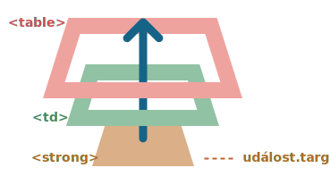

# Delegování událostí

Zachytávání a bublání nám umožňuje implementovat jeden z nejsilnějších vzorců zpracování událostí, nazývaný *delegování událostí*.

Myšlenkou je, že když máme spoustu elementů, které se zpracovávají podobným způsobem, pak místo abychom přiřadili handler každému z nich, umístíme jediný handler na jejich společného předka.

V tomto handleru po načtení `událost.target` uvidíme, kde se událost opravdu stala, a zpracujeme ji.

Podívejme se na příklad -- diagram [Osmi trigramů (Pa-kua)](https://cs.wikipedia.org/wiki/Osm_trigram%C5%AF), který zobrazuje starověkou čínskou filozofii.

Je zde:

[iframe height=350 src="bagua" edit link]

Jeho HTML kód je následující:

```html
<table>
  <tr>
    <th colspan="3">Tabulka <em>Pa-kua</em>: směr, element, barva, význam</th>
  </tr>
  <tr>
    <td class="nw"><strong>Severozápad</strong><br>Kov<br>Stříbrná<br>Stáří</td>
    <td class="n">...</td>
    <td class="ne">...</td>
  </tr>
  <tr>...2 další řádky stejného druhu...</tr>
  <tr>...2 další řádky stejného druhu...</tr>
</table>
```

Tabulka má 9 buněk, ale může jich být třeba 99 nebo 9999, na tom nezáleží.

**Naším úkolem je zvýraznit buňku `<td>` po kliknutí.**

Místo přiřazování handleru `onclick` ke každé `<td>` (kterých může být mnoho) nastavíme „všezachytávající“ handler na elementu `<table>`.

Ke zjištění elementu, na který bylo kliknuto, a jeho zvýraznění bude používat `událost.target`.

Kód:

```js
let zvolenáTd;

*!*
tabulka.onclick = function(událost) {
  let cíl = událost.target; // kam bylo kliknuto?

  if (cíl.tagName != 'TD') return; // ne na TD? Pak nás to nezajímá

  zvýrazni(cíl); // zvýrazni to
};
*/!*

function zvýrazni(td) {
  if (zvolenáTd) { // odstraníme existující třídu zvýraznění, pokud tam je
    zvolenáTd.classList.remove('zvýraznění');
  }
  zvolenáTd = td;
  zvolenáTd.classList.add('zvýraznění'); // zvýrazní novou td
}
```

Takový kód se nestará o to, kolik buněk je v tabulce. Kdykoli můžeme dynamicky přidávat i odstraňovat `<td>` a zvýraznění bude stále fungovat.

Pořád to však má nevýhodu.

Ke kliknutí může dojít nikoli na `<td>`, ale uvnitř ní.

Když se v našem případě podíváme do HTML kódu, uvidíme uvnitř `<td>` vnořené značky, např. `<strong>`:

```html
<td>
*!*
  <strong>Severozápad</strong>
*/!*
  ...
</td>
```

Pochopitelně, když uživatel klikne na tento `<strong>`, pak se hodnotou `událost.target` stane on.



V handleru `table.onclick` bychom měli takový `událost.target` vzít a zjistit, zda ke kliknutí došlo uvnitř `<td>` nebo ne.

Vylepšený kód:

```js
tabulka.onclick = function(událost) {
  let td = událost.target.closest('td'); // (1)

  if (!td) return; // (2)

  if (!tabulka.contains(td)) return; // (3)

  zvýrazni(td); // (4)
};
```

Vysvětlení:
1. Metoda `elem.closest(selektor)` vrátí nejbližšího předka, který odpovídá selektoru. V našem případě hledáme `<td>` cestou nahoru od zdrojového elementu.
2. Jestliže `událost.target` není uvnitř žádné `<td>`, volání se okamžitě vrátí, protože není co dělat.
3. V případě vnořených tabulek `událost.target` může být `<td>`, ale ležící mimo aktuální tabulku. Ověříme tedy, zda je to skutečně `<td>` *z naší tabulky*.
4. Pokud je tomu tak, zvýrazníme ji.

Výsledkem je, že máme rychlý a efektivní kód pro zvýrazňování, který se nezajímá o celkový počet `<td>` v tabulce.

## Příklad delegování: akce v menu

Delegování událostí má i jiná využití.

Dejme tomu, že chceme vytvořit menu s tlačítky „Uložit“, „Načíst“, „Hledat“ a podobně. A máme objekt s metodami `ulož`, `načti`, `hledej`... Jak je propojit?

První myšlenkou může být přiřadit každému tlačítku oddělený handler. Existuje však elegantnější řešení. Můžeme přidat k celému menu handler a k tlačítkům atribut `data-akce`, který bude obsahovat metodu, která se má volat:

```html
<button *!*data-akce="ulož"*/!*>Kliknutím uložíte</button>
```

Handler načte atribut a spustí metodu. Podívejte se na funkční příklad:

```html autorun height=60 run untrusted
<div id="menu">
  <button data-akce="ulož">Uložit</button>
  <button data-akce="načti">Načíst</button>
  <button data-akce="hledej">Hledat</button>
</div>

<script>
  class Menu {
    constructor(elem) {
      this._elem = elem;
      elem.onclick = this.onClick.bind(this); // (*)
    }

    ulož() {
      alert('ukládám');
    }

    načti() {
      alert('načítám');
    }

    hledej() {
      alert('hledám');
    }

    onClick(událost) {
*!*
      let akce = událost.target.dataset.akce;
      if (akce) {
        this[akce]();
      }
*/!*
    };
  }

  new Menu(menu);
</script>
```

Prosíme všimněte si, že `this.onClick` je v `(*)` navázáno na `this`. To je důležité, protože jinak by `this` uvnitř něj odkazovalo na DOM element (`elem`), ne na objekt `Menu`, a `this[akce]` by nedělala to, co potřebujeme.

Jaké výhody nám tedy zde delegování poskytuje?

```compare
+ Nemusíme psát ke každému tlačítku kód, který mu přiřadí handler. Jen vytvoříme metodu a vložíme ji do elementu.
+ HTML struktura je flexibilní, můžeme kdykoli přidávat nebo odstraňovat tlačítka.
```

Mohli bychom použít i třídy `.akce-ulož`, `.akce-načti`, ale atribut `data-akce` je sémanticky lepší. A můžeme jej použít i v CSS pravidlech.

## Vzorec „chování“

Delegování událostí můžeme použít také k přidávání „chování“ do elementů *deklarativně*, se speciálními atributy a třídami.

Tento vzorec má dvě části:
1. Přidáme do elementu vlastní atribut, který bude popisovat jeho chování.
2. Handler na úrovni dokumentu bude sledovat události, a jestliže událost nastane na elementu s tímto atributem, provede akci.

### Chování: Čítač

Například zde atribut `data-čítač` přidá chování „po kliknutí zvýšit hodnotu“ tlačítkům:

```html run autorun height=60
Čítač: <input type="button" value="1" data-čítač>
Další čítač: <input type="button" value="2" data-čítač>

<script>
  document.addEventListener('click', function(událost) {

    if (událost.target.dataset.čítač != undefined) { // pokud atribut existuje...
      událost.target.value++;
    }

  });
</script>
```

Jestliže klikneme na tlačítko, jeho hodnota se zvýší. Důležitá tady nejsou tlačítka, ale obecný přístup.

Atributů `data-čítač` můžeme mít tolik, kolik chceme. Můžeme kdykoli přidat do HTML kódu nový. Pomocí delegování událostí jsme „rozšířili“ HTML přidáním atributu, který popisuje nové chování.

```warn header="Pro handlery na úrovni dokumentu vždy používejte `addEventListener`"
Když přiřazujeme handler události objektu `document`, měli bychom vždy používat `addEventListener`, ne `document.on<událost>`, protože to způsobuje konflikty: nové handlery přepíší staré.

U skutečných projektů je běžné, že `document` obsahuje mnoho handlerů, které byly nastaveny v různých částech kódu.
```

### Chování: přepínač

Ještě jeden příklad chování. Kliknutí na element s atributem `data-přepni-id` zobrazí nebo skryje element se zadaným `id`:

```html autorun run height=60
<button *!*data-přepni-id="registrační-mail"*/!*>
  Zobraz formulář pro registraci
</button>

<form id="registrační-mail" hidden>
  Váš e-mail: <input type="email">
</form>

<script>
*!*
  document.addEventListener('click', function(událost) {
    let id = událost.target.dataset.přepniId;
    if (!id) return;

    let elem = document.getElementById(id);

    elem.hidden = !elem.hidden;
  });
*/!*
</script>
```

Všimněte si ještě jednou, co jsme udělali. Když nyní chceme přidat elementu funkcionalitu přepínání, nemusíme znát JavaScript -- stačí použít atribut `data-přepni-id`.

To se může opravdu hodit -- není nutné psát JavaScriptový kód ke každému takovému elementu. Stačí použít toto chování. Handler na úrovni dokumentu způsobí, že bude fungovat na každém elementu této stránky.

Můžeme i zkombinovat více chování na jednom elementu.

Vzorec „chování“ může být alternativou k minifragmentům JavaScriptu.

## Shrnutí

Delegování událostí je opravdu vynikající! Je to jeden z nejužitečnějších vzorců pro DOM události.

Často se používá k přidání stejného zpracování pro mnoho podobných elementů, ale nejenom k tomu.

Algoritmus:

1. Umístíme jeden handler na kontejner.
2. V tomto handleru ověříme zdrojový element `událost.target`.
3. Pokud se událost stala uvnitř elementu, který nás zajímá, pak ji zpracujeme.

Výhody:

```compare
+ Zjednodušuje inicializaci a šetří paměť: nemusíme přidávat množství handlerů.
+ Méně kódu: když přidáváme nebo odstraňujeme elementy, nemusíme přidávat nebo odstraňovat handlery.
+ Úpravy DOMu: můžeme masově přidávat nebo odstraňovat elementy s `innerHTML` a podobně.
```

Delegování má ovšem i svá omezení:

```compare
- Za prvé, událost musí bublat, což některé události nedělají. Navíc handlery na nižší úrovni by neměly používat `událost.stopPropagation()`.
- Za druhé, delegování může zvýšit zátěž CPU, jelikož handler na úrovni kontejneru reaguje na události na všech místech kontejneru bez ohledu na to, zda nás zajímají nebo ne. Zátěž je však obvykle zanedbatelná, takže ji nemusíme brát v úvahu.
```
