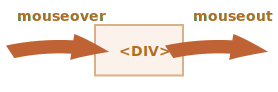
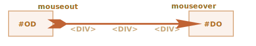
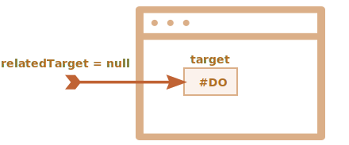
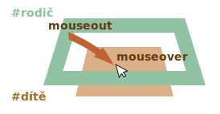
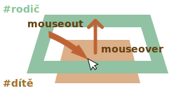

# Pohyb myší: mouseover/out, mouseenter/leave

Ponořme se nyní do dalších detailů událostí, které nastávají, když se ukazatel myši pohybuje mezi elementy.

## Události mouseover/mouseout, relatedTarget

Událost `mouseover` nastává, když ukazatel myši vstoupí na element, a `mouseout` nastane, když jej opustí.



Tyto události jsou speciální v tom, že mají vlastnost `relatedTarget`, která doplňuje vlastnost `target`. Když se ukazatel přesune z jednoho elementu na druhý, jeden z nich se stane hodnotou `target` a druhý hodnotou `relatedTarget`.

Pro `mouseover`:

- `událost.target` -- je element, na který ukazatel vstoupil.
- `event.relatedTarget` -- je element, ze kterého ukazatel přišel (`relatedTarget` -> `target`).

Pro `mouseout` je to obráceně:

- `event.target` -- je element, který ukazatel opustil.
- `event.relatedTarget` -- je nový element pod ukazatelem, na který ukazatel vstoupil (`target` -> `relatedTarget`).

```online
V následujícím příkladu jsou každá tvář i její jednotlivé prvky samostatné elementy. Když budete pohybovat myší, uvidíte v textové oblasti události myši.

Každá událost obsahuje informaci o `target` i o `relatedTarget`:

[codetabs src="mouseoverout" height=280]
```

```warn header="`relatedTarget` může být `null`"
Vlastnost `relatedTarget` může být `null`.

To se běžně stává a znamená to jen to, že ukazatel nepřišel z jiného elementu, ale zvnějšku okna, nebo že okno opustil.

Na tuto možnost bychom měli pamatovat, když používáme `událost.relatedTarget` v našem kódu. Přistoupíme-li k `událost.relatedTarget.tagName`, nastane chyba.
```

## Přeskakování elementů

Událost `mousemove` se spustí, když je ukazatel přesunut. To však neznamená, že tuto událost spustí každý pixel, přes který se ukazatel přesune.

Prohlížeč si jednou za čas zkontroluje pozici myši, a pokud zjistí, že se změnila, vyvolá události.

To znamená, že když návštěvník pohybuje myší příliš rychle, může některé DOM elementy přeskočit:



Jestliže se myš pohybuje velmi rychle z elementu `#OD` do elementu `#DO`, jak je zobrazeno výše, může přeskočit mezilehlé elementy `<div>` (nebo některé z nich). Může se spustit událost `mouseout` na `#OD` a hned poté `mouseover` na `#DO`.

To zlepšuje výkon, jelikož mezilehlých elementů může být mnoho. Opravdu nechceme zpracovávat vstup na a výstup z každého z nich.

Na druhou stranu bychom měli mít na paměti, že ukazatel myši „nenavštíví“ všechny elementy po cestě a může přes ně „skákat“.

Konkrétně je možné, že ukazatel skočí zvnějšku okna přímo doprostřed stránky. V takovém případě `relatedTarget` je `null`, protože přichází „odnikud“:



```online

Můžete si to vyzkoušet „naživo“ na testovacím příkladu níže.

Jeho HTML kód obsahuje dva vnořené elementy: `<div id="dítě">` se nachází uvnitř `<div id="rodič">`. Pokud nad nimi budete rychle pohybovat myší, možná vyvolá události jen dětský `div`, možná jen rodičovský a možná vůbec žádné události nenastanou.

Zkuste také přesunout ukazatel na dětský `div` a pak jej přesunout rychle dolů přes rodičovský. Bude-li pohyb dostatečně rychlý, bude rodičovský element ignorován. Ukazatel ho přeskočí bez povšimnutí.

[codetabs height=360 src="mouseoverout-fast"]
```

```smart header="Když se spustila `mouseover`, musí být i `mouseout`"
Při rychlém pohybu myší mohou být mezilehlé elementy ignorovány, ale jedno víme jistě: jestliže ukazatel „oficiálně“ vstoupil na element (byla generována událost `mouseover`), pak při jeho opuštění vždy obdržíme `mouseout`.
```

## Událost mouseout při opuštění dítěte

Důležitou vlastností události `mouseout` je, že se spustí, když se ukazatel přemístí z elementu na jeho potomka, např. v následujícím HTML kódu z `#rodič` na `#dítě`:

```html
<div id="rodič">
  <div id="dítě">...</div>
</div>
```

Pokud jsme na `#rodič` a přesuneme ukazatel hlouběji na `#dítě`, pak dostaneme `mouseout` na `#rodič`!



Může to vypadat divně, ale má to jednoduché vysvětlení.

**Podle logiky prohlížeče může být ukazatel myši pouze na *jediném* elementu současně -- na tom nejvnořenějším a podle z-indexu vrchním.**

Když se tedy přesune na jiný element (třeba i na potomka), opustí předcházející.

Prosíme všimněte si dalšího důležitého detailu zpracování událostí.

Událost `mouseover` na potomku bublá. Jestliže tedy `#rodič` má handler `mouseover`, spustí se:



```online
Na následujícím příkladu to vidíte velmi dobře: `<div id="dítě">` je uvnitř `<div id="rodič">`. Na elementu `#rodič` jsou handlery `mouseover/out`, které vypisují detaily událostí.

Když přesunete myš z `#rodič` na `#dítě`, uvidíte na `#rodič` dvě události:
1. `mouseout [target: rodič]` (opuštění rodiče), pak
2. `mouseover [target: dítě]` (příchod na dítě, probublala).

[codetabs height=360 src="mouseoverout-child"]
```

Jak je vidět, když se ukazatel přemístí z elementu `#rodič` na element `#dítě`, spustí se na rodičovském elementu dvě události: `mouseout` a `mouseover`:

```js
rodič.onmouseout = function(událost) {
  /* událost.target: rodičovský element */
};
rodič.onmouseover = function(událost) {
  /* událost.target: dětský element (probublala) */
};
```

**Pokud v handlerech neprozkoumáme `událost.target`, může to vypadat tak, že ukazatel myši opustil element `#rodič` a hned pak se na něj vrátil.**

To však není tento případ! Ukazatel je neustále na rodiči, jen se přemístil hlouběji na dětský element.

Pokud se při opuštění rodičovského elementu mají provést nějaké akce, např. v `rodič.onmouseout` se má spustit animace, pak je zpravidla nechceme, když se ukazatel jen přemístí hlouběji dovnitř `#rodič`.

Abychom se tomu vyhnuli, můžeme v handleru prověřovat `relatedTarget`, a pokud je myš stále uvnitř elementu, budeme takovou událost ignorovat.

Alternativně můžeme použít jiné události: `mouseenter` a `mouseleave`, které nyní probereme. Ty tento problém nemají.

## Události mouseenter a mouseleave

Události `mouseenter/mouseleave` se podobají `mouseover/mouseout`. Spustí se, když ukazatel myši vstoupí na/opustí element.

Jsou mezi nimi však dva důležité rozdíly:

1. Přesuny uvnitř elementu, na potomky a z nich, se nepočítají.
2. Události `mouseenter/mouseleave` nebublají.

Tyto události jsou extrémně jednoduché.

Když ukazatel vstoupí na element, spustí se `mouseenter`. Na přesné poloze ukazatele uvnitř elementu nebo jeho potomků nezáleží.

Když ukazatel opustí element, spustí se `mouseleave`.

```online
Následující příklad se podobá výše uvedenému, ale vrchní element nyní obsahuje `mouseenter/mouseleave` místo `mouseover/mouseout`.

Jak vidíte, vygenerují se jedině události, které se vztahují k přesunu ukazatele na vrchní element a z něj. Když se ukazatel přemístí na jeho dítě a zpět, nic se nestane. Přesuny mezi potomky jsou ignorovány.

[codetabs height=340 src="mouseleave"]
```

## Delegování událostí

Události `mouseenter/leave` jsou velice jednoduché a snadno se používají, ale nebublají. Nemůžeme tedy na ně použít delegování událostí.

Představme si, že chceme zpracovávat vstup myši na buňky tabulky a jejich opuštění. A těch jsou stovky.

Přirozené řešení by bylo nastavit handler na `<table>` a zpracovávat události v něm. Jenže `mouseenter/leave` nebublají. Když se tedy taková událost stane na `<td>`, dokáže ji zachytit jedině handler na tomto `<td>`.

Handlery pro `mouseenter/leave` na `<table>` se spustí jen tehdy, když ukazatel vstoupí na celou tabulku nebo ji opustí. O přesunech uvnitř ní nemůžeme získat žádné informace.

Použijeme tedy `mouseover/mouseout`.

Začněme s jednoduchými handlery, které zvýrazňují element pod ukazatelem:

```js
// zvýrazníme element pod ukazatelem
table.onmouseover = function(událost) {
  let cíl = událost.target;
  cíl.style.background = 'pink';
};

table.onmouseout = function(událost) {
  let cíl = událost.target;
  cíl.style.background = '';
};
```

```online
Zde je vidíte v akci. Když se myš přesunuje po elementech této tabulky, aktuální element se zvýrazní:

[codetabs height=480 src="mouseenter-mouseleave-delegation"]
```

V našem případě bychom chtěli zpracovávat přesuny mezi buňkami tabulky `<td>`: vstup na buňku a její opuštění. Jiné přesuny, například uvnitř jedné buňky nebo mimo buňky, nás nezajímají. Odfiltrujme je.

Můžeme dělat následující:

- Zapamatujeme si aktuálně zvýrazněnou `<td>` v proměnné, nazveme ji `aktuálníElem`.
- Při `mouseover` budeme tuto událost ignorovat, jestliže jsme stále uvnitř aktuální `<td>`.
- Při `mouseout` ji budeme ignorovat, jestliže neopustíme aktuální `<td>`.

Následuje příklad kódu, který počítá se všemi možnými situacemi:

[js src="mouseenter-mouseleave-delegation-2/script.js"]

Opakujeme, že jeho důležité prvky jsou:
1. Pro zpracování vstupu na/opuštění jakékoli `<td>` v tabulce používá delegování událostí. Je tedy založen na `mouseover/out`, ne na `mouseenter/leave`, která nebublá, a tedy neumožňuje delegování.
2. Další události, například přesun mezi potomky `<td>`, jsou odfiltrovány, takže funkce `přiPříchodu/přiOdchodu` se spustí jen tehdy, když ukazatel vstoupí na celou `<td>` nebo ji opustí.

```online
Zde je celý příklad se všemi detaily:

[codetabs height=460 src="mouseenter-mouseleave-delegation-2"]

Zkuste si přesunovat ukazatel dovnitř a ven z buněk tabulky a uvnitř nich. Rychle nebo pomalu, na tom nezáleží. Zvýrazní se jen `<td>` jako celek, na rozdíl od výše uvedeného příkladu.
```

## Shrnutí

Probrali jsme události `mouseover`, `mouseout`, `mousemove`, `mouseenter` a `mouseleave`.

Je dobré si zapamatovat následující:

- Při rychlém pohybu myší mohou být přeskočeny mezilehlé elementy.
- Události `mouseover/out` a `mouseenter/leave` mají další vlastnost: `relatedTarget`. To je element, ze kterého přicházíme / na který odcházíme, doplněk k `target`.

Události `mouseover/out` se spustí i tehdy, když se přesuneme z rodičovského elementu na dětský. Prohlížeč předpokládá, že ukazatel může být pouze na jednom elementu současně -- na tom nejhlubším.

Události `mouseenter/leave` se v tomto ohledu liší: spustí se jen tehdy, když myš vstoupí na celý element nebo jej opustí. Kromě toho nebublají.
