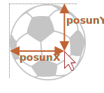

# Přetahování pomocí událostí myši

Přetahování (Drag'n'Drop) je vynikající řešení uživatelského rozhraní. Uchopit něco, přetáhnout to a položit jinam je jasný a jednoduchý způsob, jak provést ledacos, od kopírování a přesunu dokumentů (např. ve správcích souborů) až po objednávání (vkládání předmětů do nákupního košíku).

Moderní standard HTML obsahuje [kapitolu věnovanou přetahování](https://html.spec.whatwg.org/multipage/interaction.html#dnd) se speciálními událostmi, např. `dragstart`, `dragend` a podobně.

Tyto události nám umožňují podporovat speciální druhy přetahování, například přetažení souboru ze správce souborů v operačním systému a jeho položení do okna prohlížeče. Pak může JavaScript přistupovat k obsahu tohoto souboru.

Nativní přetahovací události však mají i svá omezení. Nemůžeme například zakázat přetahování z určité oblasti, nebo nemůžeme povolit přetahovat jen „vodorovně“ nebo „svisle“. A existuje i mnoho dalších úloh týkajících se přetahování, které s jejich pomocí nelze vyřešit. Rovněž podpora těchto událostí v mobilních zařízeních je velmi slabá.

Zde tedy uvidíme, jak implementovat přetahování pomocí událostí myši.

## Algoritmus přetahování

Základní algoritmus přetahování vypadá následovně:

1. Při `mousedown` připravíme element k přesunu, je-li to nutné (třeba vytvoříme jeho klon, přidáme mu třídu a podobně).
2. Pak jej při `mousemove` posuneme změnou `left/top` s `position:absolute`.
3. Při `mouseup` provedeme všechny akce související s ukončením přetahování.

To jsou základy. Později uvidíme, jak přidat další prvky, například zvýraznění aktuálních elementů pod ukazatelem, když přes ně přetahujeme.

Následuje implementace přetahování míče:

```js
míč.onmousedown = function(událost) {
  // (1) příprava přesunu: nastavíme absolutní polohu elementu a pomocí z-indexu ho umístíme nahoru
  míč.style.position = 'absolute';
  míč.style.zIndex = 1000;

  // přesuneme ho z jeho aktuálních rodičů přímo do těla
  // aby jeho pozice byla relativní vzhledem k tělu
  document.body.append(míč);

  // vycentrujeme míč na souřadnicích (stránkaX, stránkaY)
  function přesuňNa(stránkaX, stránkaY) {
    míč.style.left = stránkaX - míč.offsetWidth / 2 + 'px';
    míč.style.top = stránkaY - míč.offsetHeight / 2 + 'px';
  }

  // přesuneme míč s absolutní pozicí pod ukazatel
  přesuňNa(událost.pageX, událost.pageY);

  function onMouseMove(událost) {
    přesuňNa(událost.pageX, událost.pageY);
  }

  // (2) přesuneme míč při události mousemove
  document.addEventListener('mousemove', onMouseMove);

  // (3) položíme míč, odstraníme nepotřebné handlery
  míč.onmouseup = function() {
    document.removeEventListener('mousemove', onMouseMove);
    míč.onmouseup = null;
  };

};
```

Když si tento kód spustíme, můžeme si všimnout něčeho zvláštního. Na začátku přetahování se míč „zdvojí“: začneme přetahovat jeho „klon“.

```online
Příklad v akci:

[iframe src="ball" height=230]

Zkuste přetahovat myší a uvidíte zmíněné chování.
```

Je to tím, že prohlížeč má svou vlastní podporu přetahování obrázků a některých dalších elementů. Ta se automaticky spustí a koliduje s naším kódem.

Potlačíme ji následovně:

```js
míč.ondragstart = function() {
  return false;
};
```

Nyní bude všechno v pořádku.

```online
V akci:

[iframe src="ball2" height=230]
```

Dalším důležitým aspektem je, že `mousemove` sledujeme na `document`, ne na `míč`. Na první pohled se může zdát, že ukazatel je pořád na míči a my můžeme umístit `mousemove` na něj.

Jenže jak si pamatujeme, `mousemove` se spouští často, ale ne na každém pixelu. Po rychlém přesunu tedy ukazatel může skočit z míče někam doprostřed dokumentu (nebo dokonce mimo okno).

Abychom tedy tuto událost zachytili, měli bychom jí naslouchat na `document`.

## Správné umisťování

V uvedených příkladech se míč vždy přemístí tak, aby jeho střed byl pod ukazatelem:

```js
míč.style.left = stránkaX - míč.offsetWidth / 2 + 'px';
míč.style.top = stránkaY - míč.offsetHeight / 2 + 'px';
```

To není špatné, ale má to vedlejší efekt. Abychom zahájili přetahování, můžeme vyvolat `mousedown` kdekoli na míči. Pokud ho však „uchopíme“ na kraji, míč náhle „poskočí“, aby jeho střed byl pod ukazatelem myši.

Bylo by lepší, kdybychom zachovávali počáteční polohu elementu vzhledem k ukazateli.

Pokud například začneme přetahovat na okraji míče, pak by ukazatel měl během přetahování zůstat na okraji.



Vylepšíme náš algoritmus:

1. Když návštěvník stiskne tlačítko (`mousedown`), zapamatujeme si vzdálenost ukazatele od levého horního rohu míče v proměnných `posunX/posunY`. Tuto vzdálenost budeme při přetahování zachovávat.

    Tyto posuny můžeme zjistit odečtením souřadnic:
    
    ```js
    // onmousedown
    let posunX = událost.clientX - míč.getBoundingClientRect().left;
    let posunY = událost.clientY - míč.getBoundingClientRect().top;
    ```

2. Pak při přetahování umístíme míč do stejné vzdálenosti od ukazatele, například:

    ```js
    // onmousemove
    // míč má position:absolute
    míč.style.left = událost.pageX - *!*posunX*/!* + 'px';
    míč.style.top = událost.pageY - *!*posunY*/!* + 'px';
    ```

Výsledný kód s vylepšeným umisťováním:

```js
míč.onmousedown = function(událost) {

*!*
  let posunX = událost.clientX - míč.getBoundingClientRect().left;
  let posunY = událost.clientY - míč.getBoundingClientRect().top;
*/!*

  míč.style.position = 'absolute';
  míč.style.zIndex = 1000;
  document.body.append(míč);

  přesuňNa(událost.pageX, událost.pageY);

  // přesune míč na souřadnice (pageX, pageY)
  // vezme v úvahu počáteční posun
  function přesuňNa(stránkaX, stránkaY) {
    míč.style.left = stránkaX - *!*posunX*/!* + 'px';
    míč.style.top = stránkaY - *!*posunY*/!* + 'px';
  }

  function onMouseMove(událost) {
    přesuňNa(událost.pageX, událost.pageY);
  }

  // přesuneme míč při mousemove
  document.addEventListener('mousemove', onMouseMove);

  // položíme míč, odstraníme nepotřebné handlery
  míč.onmouseup = function() {
    document.removeEventListener('mousemove', onMouseMove);
    míč.onmouseup = null;
  };

};

míč.ondragstart = function() {
  return false;
};
```

```online
V akci (uvnitř `<iframe>`):

[iframe src="ball3" height=230]
```

Rozdíl je obzvláště viditelný, když uchopíme míč v jeho pravém dolním rohu. V předchozím příkladu míč „skočil“ pod ukazatel, ale nyní plynule následuje ukazatel ze své aktuální pozice.

## Možné cíle položení (droppables)

V předchozích příkladech jsme mohli míč položit „kamkoli“ a on tam zůstal stát. Ve skutečném životě obvykle vezmeme jeden element a položíme ho na jiný, například „soubor“ na „složku“ nebo něco jiného.

Když hovoříme abstraktně, vezmeme „přetahovatelný“ (draggable) element a umístíme jej na „cílový“ (droppable) element.

Musíme vědět:
- kam byl element na konci přetahování položen, abychom mohli vykonat odpovídající akci,
- a pokud možno znát element, na který pokládáme, abychom jej mohli zvýraznit.

Řešení je poměrně zajímavé a trochu komplikované, takže je zde proberme.

Jaký může být první nápad? Třeba nastavit handlery `mouseover/mouseup` na potenciálních cílích?

To však nebude fungovat.

Problém spočívá v tom, že při přetahování je přetahovaný element vždy nad ostatními elementy. A události myši se odehrávají vždy jen nad vrchním elementem, ne nad elementy pod ním.

Například zde jsou dva elementy `<div>`, červený na modrém (ten je úplně zakryt). Neexistuje žádný způsob, jak zachytit událost na modrém, protože červený je na vrchu:

```html run autorun height=60
<style>
  div {
    width: 50px;
    height: 50px;
    position: absolute;
    top: 0;
  }
</style>
<div style="background:blue" onmouseover="alert('nespustí se')"></div>
<div style="background:red" onmouseover="alert('nad červeným!')"></div>
```

Pro přetahovaný element platí totéž. Míč je vždy na vrchu ostatních elementů, takže události se odehrávají na něm. Ať nastavíme na nižších elementech jakékoli handlery, nespustí se.

Z tohoto důvodu tedy původní nápad umístit handlery na potenciální cíle nebude v praxi fungovat. Tyto handlery se nespustí.

Co tedy můžeme dělat?

Existuje metoda nazvaná `document.elementFromPoint(clientX, clientY)`, která vrátí nejvnořenější element na zadaných souřadnicích relativních vzhledem k oknu (nebo `null`, pokud jsou zadané souřadnice mimo okno). Jestliže se na stejných souřadnicích nachází více navzájem se překrývajících elementů, metoda vrátí ten, který je na vrchu.

Můžeme ji použít v kterémkoli našem handleru událostí myši, abychom zjistili cílový element pod ukazatelem, například:

```js
// v handleru události myši
míč.hidden = true; // (*) schováme element, který přetahujeme

let elemPod = document.elementFromPoint(událost.clientX, událost.clientY);
// elemPod je element pod míčem, může být cílem

míč.hidden = false;
```

Prosíme všimněte si, že před voláním `(*)` musíme míč skrýt. Jinak bychom na těchto souřadnicích zpravidla měli míč, jelikož je vrchním elementem pod ukazatelem: `elemPod=míč`. Proto ho schováme a okamžitě znovu zobrazíme.

Pomocí tohoto kódu můžeme kdykoli ověřit, na kterém elementu se právě nacházíme, a když dojde k položení, zpracovat je.

Rozšířený kód `onMouseMove`, který bude hledat možné cílové elementy:

```js
// potenciální cíl, nad kterým se právě pohybujeme
let aktuálníCíl = null;

function onMouseMove(událost) {
  přesuňNa(událost.pageX, událost.pageY);

  míč.hidden = true;
  let elemPod = document.elementFromPoint(událost.clientX, událost.clientY);
  míč.hidden = false;

  // události mousemove se mohou spustit mimo okno (když je míč přetažen mimo obrazovku)
  // jsou-li clientX/clientY mimo okno, pak elementFromPoint vrátí null
  if (!elemPod) return;

  // potenciální cíle jsou označeny třídou "droppable" (může tu být i jiná logika)
  let cílPod = elemPod.closest('.droppable');

  if (aktuálníCíl != cílPod) {
    // směřujeme dovnitř nebo ven...
    // poznámka: obě hodnoty mohou být null
    //   aktuálníCíl=null, pokud jsme před touto událostí nebyli na možném cílovém elementu (např. v prázdném prostoru)
    //   cílPod=null, pokud nyní během této události nejsme na možném cílovém elementu

    if (aktuálníCíl) {
      // logika zpracování „odtažení“ z cílového elementu (odstraníme zvýraznění)
      opusťCíl(aktuálníCíl);
    }
    aktuálníCíl = cílPod;
    if (aktuálníCíl) {
      // logika zpracování „přetažení“ na cílový element
      vstupNaCíl(aktuálníCíl);
    }
  }
}
```

Když v následujícím příkladu přetáhnete míč na fotbalovou branku, branka se zvýrazní.

[codetabs height=250 src="ball4"]

Nyní máme během celého procesu v proměnné `aktuálníCíl` aktuální „cíl položení“, nad který jsme se přesunuli, a s její pomocí můžeme zvýrazňovat nebo provádět cokoli jiného.

## Shrnutí

Probrali jsme základní algoritmus přetahování.

Klíčové komponenty jsou:

1. Tok událostí: `míč.mousedown` -> `document.mousemove` -> `míč.mouseup` (nezapomeňte zrušit nativní `ondragstart`).
2. Při začátku přetahování si zapamatujeme počáteční posun ukazatele vzhledem k elementu: `posunX/posunY` a během přetahování jej budeme zachovávat.
3. Cílové elementy pod ukazatelem detekujeme pomocí `document.elementFromPoint`.

Na těchto základech můžeme postavit mnohé.

- Při `mouseup` můžeme intelektuálně dokončit položení: změnit data, přesunout elementy.
- Můžeme zvýrazňovat elementy, nad nimiž přetahujeme.
- Můžeme omezit přetahování na určitou oblast nebo směr.
- Můžeme pro `mousedown/up` použít delegování událostí. Handler události pro velkou oblast, který prověřuje `událost.target`, může zvládnout přetahování pro stovky elementů.
- A podobně.

Existují rámce, které na tom budují architekturu: `DragZone`, `Droppable`, `Draggable` a jiné třídy. Většina z nich provádí věci podobné těm, které jsme popsali, takže nyní by mělo být snadné jim porozumět. Anebo si vytvořte vlastní -- vidíte, že je to docela jednoduché, někdy lehčí než adaptovat řešení třetí strany.
