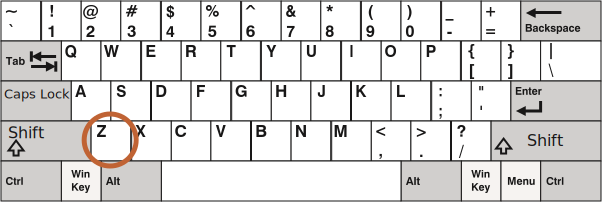
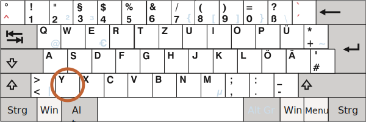

# Klávesnice: keydown a keyup

Než přejdeme ke klávesnici, prosíme všimněte si, že na moderních zařízeních jsou i jiné způsoby, jak „něco zadat“. Lidé například používají rozpoznávání řeči (zvláště na mobilních zařízeních) nebo kopírování/vložení pomocí myši.

Chceme-li tedy sledovat veškerý vstup do pole `<input>`, události klávesnice nám nestačí. Existuje jiná událost nazvaná `input`, která sleduje změny v poli `<input>` provedené jakýmkoli způsobem. Pro takovou úlohu může být vhodnější. Probereme ji později v kapitole <info:events-change-input>.

Události klávesnice bychom měli používat, když chceme zpracovávat akce klávesnice (počítá se i virtuální klávesnice), například reagovat na šipkové klávesy `key:Up` a `key:Down` nebo na horké klávesy (včetně kombinací kláves).


## Zkušební příklad [#keyboard-test-stand]

```offline
K lepšímu porozumění událostem klávesnice můžete použít [zkušební příklad](sandbox:keyboard-dump).
```

```online
K lepšímu porozumění událostem klávesnice můžete použít následující zkušební příklad.

Vyzkoušejte si v textovém poli různé kombinace kláves.

[codetabs src="keyboard-dump" height=480]
```


## Keydown a keyup

Událost `keydown` nastává, když je klávesa stisknuta, a `keyup` pak nastává, když je uvolněna.

### událost.code a událost.key

Vlastnost `key` objektu události nám umožňuje získat znak, zatímco vlastnost `code` tohoto objektu nám umožňuje získat „fyzický kód klávesy“.

Například tutéž klávesu `key:Z` můžeme stisknout s klávesou `key:Shift` nebo bez ní. Získáme tak dva různé znaky: malé `z` a velké `Z`.

Vlastnost `událost.key` obsahuje právě tento znak, který může být odlišný. Ale `událost.code` je stejná:

| Klávesa         | `událost.key` | `událost.code` |
|--------------|-------------|--------------|
| `key:Z`      |`z` (malé)         |`KeyZ`        |
| `key:Shift+Z`|`Z` (velké)          |`KeyZ`        |


Jestliže uživatel pracuje s různými jazyky, pak přepnutí do jiného jazyka může vyprodukovat úplně jiný znak než `"Z"`. Ten se stane hodnotou vlastnosti `událost.key`, zatímco `událost.code` bude pořád stejná: `"KeyZ"`.

```smart header="\"KeyZ\" a jiné kódy kláves"
Každá klávesa má svůj kód, který závisí na jejím umístění na klávesnici. Kódy kláves jsou uvedeny ve [specifikaci kódů událostí UI](https://www.w3.org/TR/uievents-code/).

Příklady:
- Klávesy s písmeny mají kódy `"Key<písmeno>"`: `"KeyA"`, `"KeyB"` atd.
- Klávesy s číslicemi mají kódy `"Digit<číslice>"`: `"Digit0"`, `"Digit1"` atd.
- Speciální klávesy mají kódy podle svých názvů: `"Enter"`, `"Backspace"`, `"Tab"` atd.

Na světě je rozšířeno několik rozložení klávesnic a specifikace uvádí kódy kláves pro každé z nich.

Pro další kódy si přečtěte [alfanumerickou část specifikace](https://www.w3.org/TR/uievents-code/#key-alphanumeric-section) nebo jen stiskněte klávesu ve výše uvedeném [zkušebním příkladu](#keyboard-test-stand).
```

```warn header="Rozlišují se malá a velká písmena: `\"KeyZ\"`, ne `\"keyZ\"`"
Vypadá to samozřejmě, ale lidé v tom stále dělají chyby.

Prosíme vyhněte se překlepům: je to `KeyZ`, ne `keyZ`. Podmínka jako `event.code=="keyZ"` nebude fungovat: první písmeno `"Key"` musí být velké.
```

Co když klávesa nevydává žádný znak, například `key:Shift`, `key:F1` nebo jiné? U těchto kláves je `událost.key` přibližně totéž jako `událost.code`:

| Klávesa          | `událost.key` | `událost.code` |
|--------------|-------------|--------------|
| `key:F1`      |`F1`          |`F1`        |
| `key:Backspace`      |`Backspace`          |`Backspace`        |
| `key:Shift`|`Shift`          |`ShiftRight` nebo `ShiftLeft`        |

Prosíme všimněte si, že `událost.code` přesně specifikuje klávesu, která byla stisknuta. Například většina klávesnic má dvě klávesy `key:Shift`: na levé a na pravé straně. Vlastnost `událost.code` nám přesně říká, která z nich byla stisknuta, zatímco `událost.key` zodpovídá za její význam: jaká klávesa to je („Shift“).

Řekněme, že chceme zpracovat horkou klávesu: `key:Ctrl+Z` (nebo `key:Cmd+Z` na Macu). Většina textových editorů k ní váže akci „Zpět“. Můžeme nastavit posluchače na `keydown` a prověřovat, která klávesa byla stisknuta.

Máme tady dilema: měli bychom v takovém posluchači ověřovat hodnotu `událost.key`, nebo `událost.code`?

Na jednu stranu hodnota `událost.key` je znak, který se mění v závislosti na jazyku. Jestliže návštěvník má v operačním systému několik jazyků a přepíná mezi nimi, stejná klávesa vydá různé znaky. Dává tedy smysl ověřovat `událost.code`, která je vždy stejná.

Příklad:

```js run
document.addEventListener('keydown', function(událost) {
  if (událost.code == 'KeyZ' && (událost.ctrlKey || událost.metaKey)) {
    alert('Zpět!')
  }
});
```

Na druhou stranu je s `událost.code` problém. Na různých rozloženích klávesnice může stejná klávesa obsahovat různé znaky.

Například zde vidíme americké rozložení („QWERTY“) a pod ním německé rozložení („QWERTZ“) (převzato z Wikipedie):





Na stejné klávese má americké rozložení „Z“, zatímco německé „Y“ (tato písmena jsou prohozena).

Doslova tedy `událost.code` bude pro osoby s německou klávesnicí rovna `KeyZ`, když stisknou `key:Y`.

Jestliže budeme v našem kódu prověřovat `událost.code == 'KeyZ'`, pak lidé s německým rozložením takovým testem projdou, když stisknou `key:Y`.

Zní to opravdu divně, ale je to tak. [Specifikace](https://www.w3.org/TR/uievents-code/#table-key-code-alphanumeric-writing-system) se o takovém chování výslovně zmiňuje.

`událost.code` tedy může na neočekávaném rozložení odpovídat nesprávnému znaku. Stejná písmena se na různých rozloženích mohou mapovat na různé fyzické klávesy, což vede k různým kódům. Naštěstí se to stává jen s několika kódy, např. `keyA`, `keyQ`, `keyZ` (jak jsme viděli), a nedochází k tomu u speciálních kláves jako `Shift`. Seznam najdete ve [specifikaci](https://www.w3.org/TR/uievents-code/#table-key-code-alphanumeric-writing-system).

Chceme-li spolehlivě sledovat znaky závislé na jazyku, může být lepším způsobem `událost.key`.

Na druhou stranu `událost.code` má tu výhodu, že zůstává vždy stejná, vázaná na fyzické umístění klávesy. Horké klávesy, které se na ni spoléhají, budou tedy správně fungovat i po změně jazyka.

Chceme zpracovávat klávesy závislé na rozložení? Pak je správnou cestou `událost.key`.

Nebo chceme horkou klávesu, která bude fungovat i po změně jazyka? Pak může být lepší `událost.code`.

## Automatické opakování

Jestliže je klávesa stisknuta dostatečně dlouho, začne se „automaticky opakovat“: `keydown` se spouští znovu a znovu, a teprve až bude klávesa uvolněna, dostaneme `keyup`. Je tedy zcela normální, že se vyvolá několikrát `keydown` a jednou `keyup`.

U událostí vyvolaných automatickým opakováním má objekt události vlastnost `událost.repeat` nastavenou na `true`.


## Standardní akce

Standardní akce se různí, jelikož akcí, které mohou být vyvolány klávesnicí, je mnoho.

Příklady:

- Na obrazovce se objeví znak (nejčastější výstup).
- Znak je smazán (klávesa `key:Delete`).
- Stránka roluje (klávesa `key:PageDown`).
- Prohlížeč otevře dialog „Uložit stránku“ (`key:Ctrl+S`).
-  ...a podobně.

Zákaz standardních akcí v události `keydown` dokáže zrušit většinu z nich. Výjimkou jsou speciální klávesy založené na operačním systému, například `key:Alt+F4` ve Windows zavře aktuální okno prohlížeče. A v JavaScriptu není žádný způsob, jak tomu zabránit zákazem standardních akcí.

Například následující `<input>` očekává telefonní číslo, takže nepřijímá jiné klávesy než číslice, `+`, `()` a `-`:

```html autorun height=60 run
<script>
function ověřKlávesuTelČísla(klávesa) {
  return (klávesa >= '0' && klávesa <= '9') || ['+','(',')','-'].includes(klávesa);
}
</script>
<input *!*onkeydown="return ověřKlávesuTelČísla(event.key)"*/!* placeholder="Telefon, prosím" type="tel">
```

Handler `onkeydown` zde používá funkci `ověřKlávesuTelČísla` k prověření stisknuté klávesy. Pokud je platná (v rozsahu `0..9` nebo jedna z `+-()`), pak vrátí `true`, jinak vrátí `false`.

Jak víme, hodnota `false` vrácená z handleru události přiřazeného pomocí DOM vlastnosti nebo atributu, tak jako výše uvedený handler, zakáže standardní akci, takže se v `<input>` neobjeví nic po stisknutí kláves, které tímto testem neprojdou. (Návratová hodnota `true` nic neovlivní, význam má pouze vracení `false`.)

Prosíme všimněte si, že ve vstupu nefungují speciální klávesy, např. `key:Backspace`, `key:Left`, `key:Right`. To je vedlejším efektem striktního filtru `ověřKlávesuTelČísla`. Tyto klávesy způsobí, že filtr vrátí `false`.

Trochu tento filtr zjemníme povolením šipkových kláves `key:Left`, `key:Right` a `key:Delete`, `key:Backspace`:

```html autorun height=60 run
<script>
function ověřKlávesuTelČísla(klávesa) {
  return (klávesa >= '0' && klávesa <= '9') ||
    ['+','(',')','-',*!*'ArrowLeft','ArrowRight','Delete','Backspace'*/!*].includes(klávesa);
}
</script>
<input onkeydown="return ověřKlávesuTelČísla(event.key)" placeholder="Telefon, prosím" type="tel">
```

Teď šipky a mazání fungují správně.

I když máme filtr na klávesy, uživatel stále může zadat cokoli pomocí pravého tlačítka myši a funkce Vložit. Mobilní zařízení poskytují jiné způsoby, jak vkládat hodnoty. Filtr tedy není spolehlivý na 100%.

Alternativním přístupem je sledovat událost `oninput` -- ta se spouští *po* každé modifikaci. Pak můžeme prověřovat novou hodnotu `input.value`, a bude-li neplatná, upravit ji nebo zvýraznit `<input>`. Nebo můžeme použít oba handlery společně.

## Minulost

V minulosti existovala událost `keypress` a také vlastnosti objektu události `keyCode`, `charCode`, `which`.

Při práci s nimi se objevilo tolik nekompatibilit mezi prohlížeči, že vývojáři specifikace neměli jinou možnost, než je všechny prohlásit za zastaralé a vytvořit nové, moderní události (ty, které jsme popsali v této kapitole). Starý kód stále funguje, jelikož je prohlížeče neustále podporují, ale v dnešní době není žádný důvod je používat.

## Mobilní klávesnice

Když používáme virtuální nebo mobilní klávesnici, formálně známou jako IME (Input-Method Editor), W3C standard uvádí, že vlastnost `e.keyCode` objektu KeyboardEvent [by měla být `229`](https://www.w3.org/TR/uievents/#determine-keydown-keyup-keyCode) a [`e.key` by měla být `"Unidentified"`](https://www.w3.org/TR/uievents-key/#key-attr-values).

Ačkoli některé tyto klávesnice mohou stále používat správné hodnoty `e.key`, `e.code`, `e.keyCode`..., když stiskneme některé klávesy, například šipky nebo Backspace, není to zaručeno. Vaše logika ovládání klávesnice tedy nemusí na mobilních zařízeních vždy fungovat.

## Shrnutí

Stisknutí klávesy vždy vygeneruje událost klávesnice, ať je to klávesa symbolu nebo speciální klávesa typu `key:Shift` nebo `key:Ctrl` a podobně. Jedinou výjimkou je klávesa `key:Fn`, která se někdy vyskytuje na klávesnicích laptopů. Pro tuto klávesu se nevyvolá událost klávesnice, jelikož její ovládání je často implementováno na nižší úrovni než v operačním systému.

Události klávesnice:

- `keydown` -- při stisku klávesy (je-li klávesa stisknuta dlouho, automaticky se opakuje),
- `keyup` -- při uvolnění klávesy.

Hlavní vlastnosti událostí klávesnice:

- `code` -- „kód klávesy“ (`"KeyA"`, `"ArrowLeft"` a podobně), specifický pro fyzické umístění klávesy na klávesnici.
- `key` -- znak (`"A"`, `"a"` a podobně), u neznakových kláves, např. `key:Esc`, má zpravidla stejnou hodnotu jako `code`.

V minulosti se události klávesnice někdy používaly ke sledování uživatelského vstupu do formulářových polí. To není spolehlivé, jelikož vstup může pocházet z různých zdrojů. Ke zpracování jakéhokoli vstupu máme události `input` a `change` (budou vysvětleny později v kapitole <info:events-change-input>), které se spustí při vstupu jakéhokoli druhu, včetně kopírování a vložení nebo rozpoznávání řeči.

Události klávesnice bychom měli používat tehdy, když klávesnici skutečně požadujeme, například pro reakci na horké nebo speciální klávesy.
